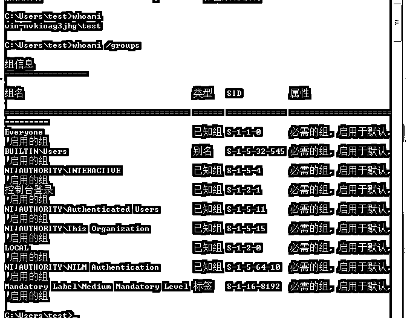
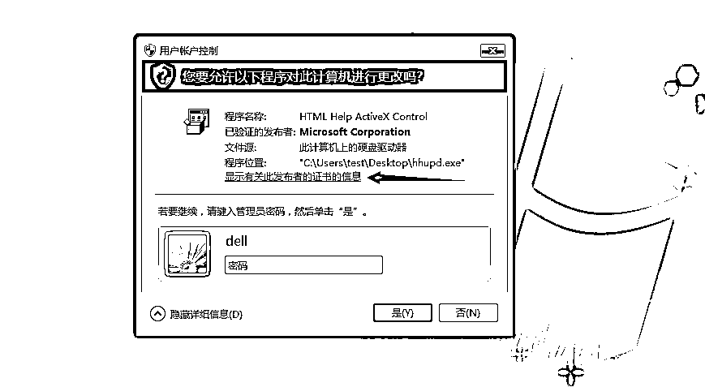
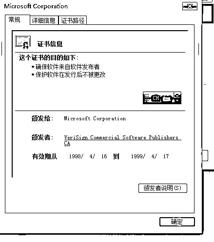
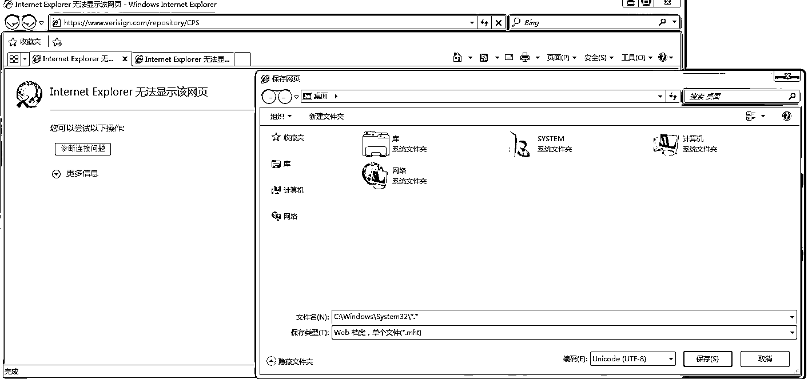
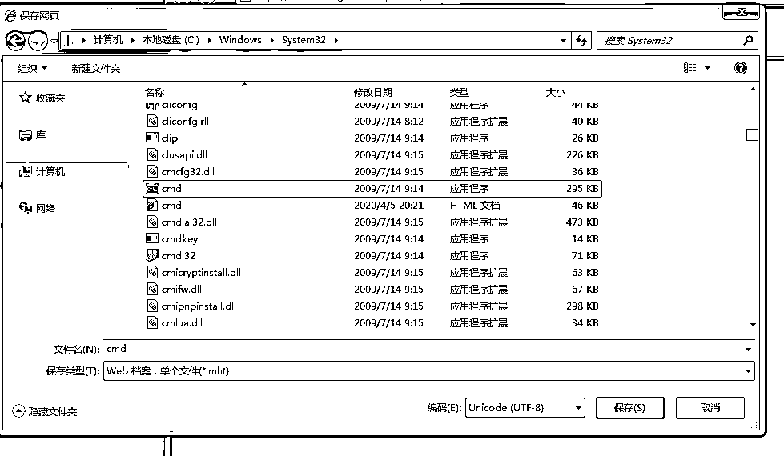

# CVE-2019-1388：Windows UAC 本地提权复现 - yunying - 博客园

> 原文：[`www.cnblogs.com/BOHB-yunying/p/12638016.html`](https://www.cnblogs.com/BOHB-yunying/p/12638016.html)

# **0x01 简介**

用户帐户控制（User Account Control，简写作 UAC)是微软公司在其 Windows Vista 及更高版本操作系统中采用的一种控制机制。其原理是通知用户是否对应用程序使用硬盘驱动器和系统文件授权，以达到帮助阻止恶意程序（有时也称为“恶意软件”）损坏系统的效果。

# ****0x02 漏洞概述****

该漏洞位于 Windows 的 UAC（User Account Control，用户帐户控制）机制中
默认情况下，Windows 会在一个单独的桌面上显示所有的 UAC 提示 Secure Desktop
这些提示是由名为 consent.exe 的可执行文件产生的，该可执行文件以 NT AUTHORITY\SYSTEM 权限运行，完整性级别为 System
因为用户可以与该 UI 交互，因此对 UI 来说紧限制是必须的，否则，低权限的用户可能可以通过 UI 操作的循环路由以 SYSTEM 权限执行操作，即使隔离状态的看似无害的 UI 特征都可能会成为引发任意控制的动作链的第一步。
事实上，UAC 会话中含有尽可能少的点击操作选项，利用该漏洞很容易就可以提升权限到 SYSTEM。

# **0x03 影响版本**

```
cpe：/ o：microsoft：windows_10：- cpe：/ o：microsoft：windows_10：1607 cpe：/ o：microsoft：windows_10：1709 cpe：/ o：microsoft：windows_10：1803 cpe：/ o：microsoft：windows_10：1809 cpe：/ o：microsoft：windows_10：1903 cpe：/ o：microsoft：windows_7：-：sp1
cpe：/ o：microsoft：windows_8.1：- cpe：/ o：microsoft：windows_rt_8.1：- cpe：/ o：microsoft：windows_server_2008：-：sp2
cpe：/ o：microsoft：windows_server_2008：r2：sp1：~~~~ itanium〜
cpe：/ o：microsoft：windows_server_2008：r2：sp1：~~~~ x64〜
cpe：/ o：microsoft：windows_server_2012：- cpe：/ o：microsoft：windows_server_2012：r2
cpe：/ o：microsoft：windows_server_2016：- cpe：/ o：microsoft：windows_server_2016：1803 cpe：/ o：microsoft：windows_server_2016：1903 cpe：/ o：microsoft：windows_server_2019：-
```

# **0x04 环境搭建**

Windows 7 sp1

# **0x05 漏洞复现**

**exp 地址:****[`github.com/mai-lang-chai/System-Vulnerability/tree/master/Windows/CVE-2019-1388`](https://github.com/mai-lang-chai/System-Vulnerability/tree/master/Windows/CVE-2019-1388)**

我们新建一个用户 test，默认再 users 组



右键以管理员运行 hhupd.exe


显示详细信息



显示有关次发布者的证书信息



点击颁发者链接然后关闭窗口

页面另存为



输入 System32 路径并且进入文件夹中

```
C:\Windows\System32\*.*
```



下翻找到 cmd，右键打开 cmd


输入 system 的路径只是为了快速进入目录，不是别的，也可以自己慢慢点进目录中，然后启动 cmd

**文字简述内容学习自:Timeline Sec**

```
漏洞简介

该漏洞位于 Windows 的 UAC（User Account Control，用户帐户控制）机制中

默认情况下，Windows 会在一个单独的桌面上显示所有的 UAC 提示 Secure Desktop

这些提示是由名为 consent.exe 的可执行文件产生的，该可执行文件以 NT AUTHORITY\SYSTEM 权限运行，完整性级别为 System

因为用户可以与该 UI 交互，因此对 UI 来说紧限制是必须的，否则，低权限的用户可能可以通过 UI 操作的循环路由以 SYSTEM 权限执行操作，即使隔离状态的看似无害的 UI 特征都可能会成为引发任意控制的动作链的第一步。

事实上，UAC 会话中含有尽可能少的点击操作选项，利用该漏洞很容易就可以提升权限到 SYSTEM。
影响范围 
```