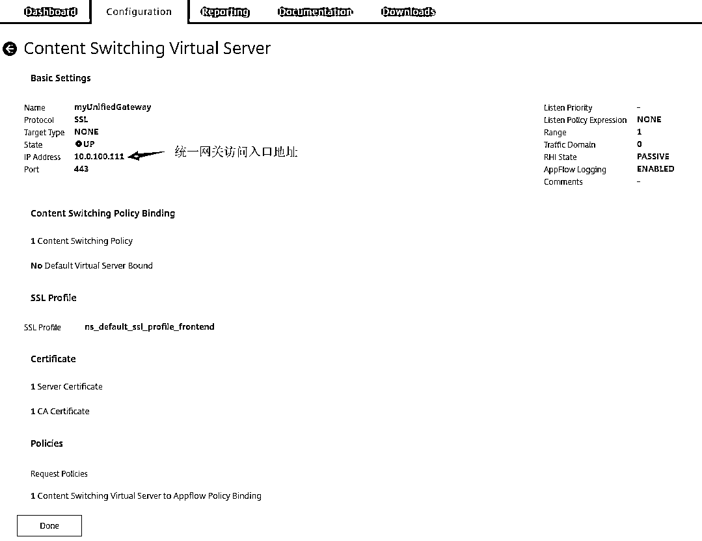
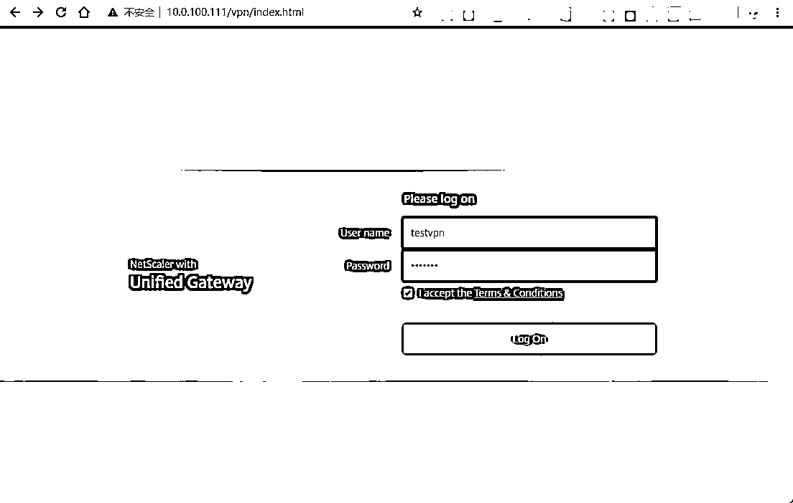
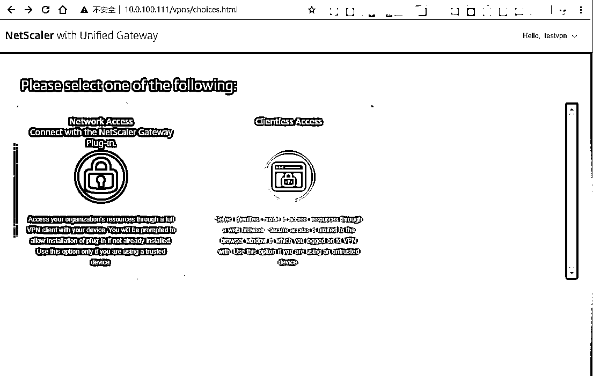
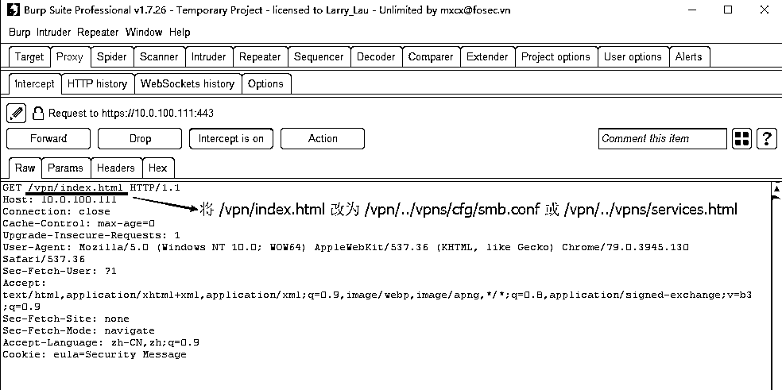
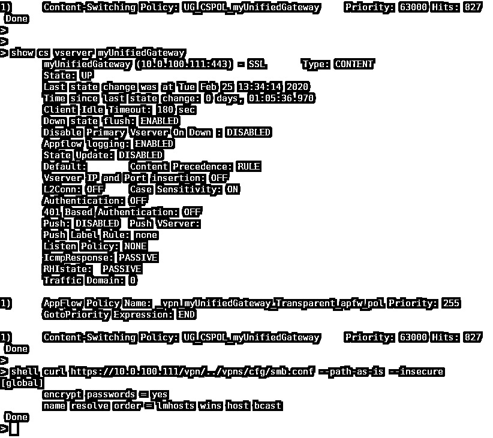
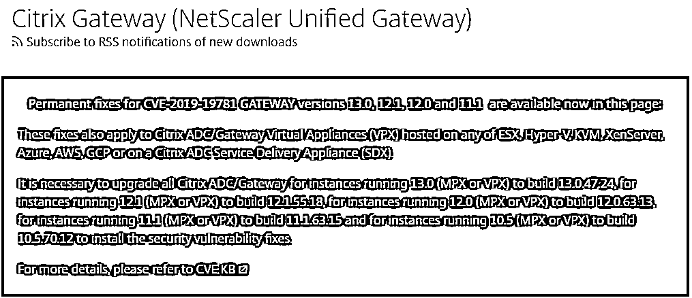
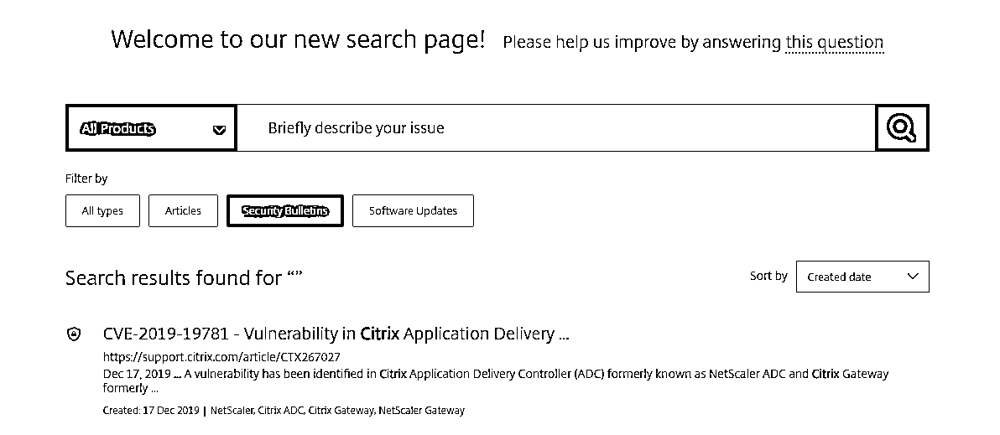

# CVE-2019-19781 - lsgxeva - 博客园

> 原文：[`www.cnblogs.com/lsgxeva/p/12116150.html`](https://www.cnblogs.com/lsgxeva/p/12116150.html)

# CVE-2019-19781

CVE-2019-19781 漏洞可能导致在 NetScaler ADC 或 NetScaler Gateway 上任意代码执行。
Citrix 在 2019 年 12 月 17 日发布了安全公告 CTX267027 ( https://support.citrix.com/article/CTX267027 )
CVE-2019-19781 的缓解步骤 CTX267679 ( https://support.citrix.com/article/CTX267679 )
缓解策略是阻止通过任何 IP（VIP，例如 vpn vserver 或启用管理的 nsip / snips）进行访问。nsapimgr 命令确保全局绑定的响应者策略（可通过任何 VIP 保护所有 Web 请求）也将适用于管理 ip。目前，建议是保护所有入口点。







漏洞扫描和利用工具脚本 [`github.com/trustedsec/cve-2019-19781`](https://github.com/trustedsec/cve-2019-19781)


通过修改用户访问统一网关的起始页面的链接的 URL, 可以通过 /vpn/../vpns 等方式, 非法访问 vpns 下的内容。

在用户未登录的情况下，使用 burpsuite 等类型的软件，将请求的 URL 从 [`10.0.100.111/vpn/index.html`](https://10.0.100.111/vpn/index.html) 修改为  [`10.0.100.111/vpn/../vpns/cfg/smb.conf`](http://10.0.100.111/vpns/cfg/smb.conf) 或 [`10.0.100.111/vpn/../vpns/services.html`](http://10.0.100.111/vpns/services.html) 等 URL，非法获取用户配置信息。



 


--------------------------

手动验证是否存在 CVE-2019-19781 漏洞：

操作命令:  curl https://10.0.100.111/vpn/../vpns/cfg/smb.conf --path-as-is --insecure 



--------------------------

可以更新系统版本到最新版本：



--------------------------

[`support.citrix.com/search/#/All%20Products?ct=Security%20Bulletins&searchText=&sortBy=Created%20date&pageIndex=1`](https://support.citrix.com/search/#/All%20Products?ct=Security%20Bulletins&searchText=&sortBy=Created%20date&pageIndex=1)



[`support.citrix.com/article/CTX267027`](https://support.citrix.com/article/CTX267027)

# CVE-2019-19781 - Vulnerability in Citrix Application Delivery Controller and Citrix Gateway

Security Bulletin | Critical | 40 found this helpful 

## Applicable Products

*   NetScaler
*   NetScaler Gateway
*   Citrix ADC
*   Citrix Gateway

## Description of Problem

A vulnerability  has been identified in Citrix Application Delivery Controller (ADC) formerly known as NetScaler ADC and Citrix Gateway formerly known as NetScaler Gateway that, if exploited, could allow an unauthenticated attacker to perform arbitrary code execution.

The vulnerability has been assigned the following CVE number:

• CVE-2019-19781 : Vulnerability in Citrix Application Delivery Controller and Citrix Gateway leading to arbitrary code execution

The vulnerability affects all supported product versions and all supported platforms:

• Citrix ADC and Citrix Gateway version 13.0 all supported builds

• Citrix ADC and NetScaler Gateway version 12.1 all supported builds

• Citrix ADC and NetScaler Gateway version 12.0 all supported builds

• Citrix ADC and NetScaler Gateway version 11.1 all supported builds

• Citrix NetScaler ADC and NetScaler Gateway version 10.5 all supported builds

* * *

## What Customers Should Do

Citrix strongly urges affected customers to immediately apply the provided mitigation. Customers should then upgrade all of their vulnerable appliances to a fixed version of the appliance firmware when released. Subscribe to bulletin alerts at [`support.citrix.com/user/alerts`](https://support.citrix.com/user/alerts)  to be notified when the new firmware is available.

The following knowledge base article contains the steps to deploy a responder policy to mitigate the issue in the interim until a permanent fix is available: [CTX267679 - Mitigation steps for CVE-2019-19781](https://support.citrix.com/article/CTX267679)

* * *

## Acknowledgements

Citrix thanks Mikhail Klyuchnikov of Positive Technologies, and Gianlorenzo Cipparrone and Miguel Gonzalez of Paddy Power Betfair plc for working with us to protect Citrix customers.

* * *

## What Citrix Is Doing

Citrix is notifying customers and channel partners about this potential security issue. This article is also available from the Citrix Knowledge Center at  [`support.citrix.com/`](http://support.citrix.com/).

* * *

## Obtaining Support on This Issue

If you require technical assistance with this issue, please contact Citrix Technical Support. Contact details for Citrix Technical Support are available at  [`www.citrix.com/support/open-a-support-case.html`](https://www.citrix.com/support/open-a-support-case.html). 

* * *

## Reporting Security Vulnerabilities

Citrix welcomes input regarding the security of its products and considers any and all potential vulnerabilities seriously. For guidance on how to report security-related issues to Citrix, please see the following document: CTX081743 – [Reporting Security Issues to Citrix](http://support.citrix.com/article/CTX081743)

* * *

## Changelog

| Date  | Change |
| 17th December 2019 | Initial Publication |

[`support.citrix.com/article/CTX267679`](https://support.citrix.com/article/CTX267679)

# Mitigation Steps for CVE-2019-19781

Article | ConfigurationSecurity Vulnerability | 58 found this helpful | Created: 16 Dec 2019 | Modified: 17 Dec 2019

## Applicable Products

*   Citrix ADC

## Symptoms or Error

On December 17 2019 Citrix released security bulletin [CTX267027](https://support.citrix.com/article/CTX267027): A vulnerability in Citrix Application Delivery Controller (ADC), formerly known as NetScaler ADC, and Citrix Gateway, formerly known as NetScaler Gateway, that could lead to arbitrary code execution.

* * *

## Solution

The following configuration changes serve as a mitigation to the aforementioned vulnerability.

### Standalone System

Run the following commands from the command line interface of the appliance to create a responder action and policy:

```
enable ns feature responder
add responder action respondwith403 respondwith "\"HTTP/1.1 403 Forbidden\r\n\r\n\""
add responder policy ctx267027 "HTTP.REQ.URL.DECODE_USING_TEXT_MODE.CONTAINS(\"/vpns/\") && (!CLIENT.SSLVPN.IS_SSLVPN || HTTP.REQ.URL.DECODE_USING_TEXT_MODE.CONTAINS(\"/../\"))" respondwith403
bind responder global ctx267027 1 END -type REQ_OVERRIDE
save config 

```

Ensure that the changes apply to the management interfaces as well. From the command line interface, please run the following commands.

```
shell nsapimgr_wr.sh -ys skip_systemaccess_policyeval=0
shell "echo 'nsapimgr_wr.sh -ys skip_systemaccess_policyeval=0' >> /nsconfig/rc.netscaler"
reboot
```

### HA Pair

### On primary:

```
enable ns feature responder
add responder action respondwith403 respondwith "\"HTTP/1.1 403 Forbidden\r\n\r\n\""
add responder policy ctx267027 "HTTP.REQ.URL.DECODE_USING_TEXT_MODE.CONTAINS(\"/vpns/\") && (!CLIENT.SSLVPN.IS_SSLVPN || HTTP.REQ.URL.DECODE_USING_TEXT_MODE.CONTAINS(\"/../\"))" respondwith403
bind responder global ctx267027 1 END -type REQ_OVERRIDE
save config 
shell nsapimgr_wr.sh -ys skip_systemaccess_policyeval=0
shell "echo 'nsapimgr_wr.sh -ys skip_systemaccess_policyeval=0' >> /nsconfig/rc.netscaler"
reboot
```

###  On secondary after primary comes up:

```
shell nsapimgr_wr.sh -ys skip_systemaccess_policyeval=0
shell "echo 'nsapimgr_wr.sh -ys skip_systemaccess_policyeval=0' >> /nsconfig/rc.netscaler"
reboot
```

### Cluster

### On CLIP:

```
enable ns feature responder
add responder action respondwith403 respondwith "\"HTTP/1.1 403 Forbidden\r\n\r\n\""
add responder policy ctx267027 "HTTP.REQ.URL.DECODE_USING_TEXT_MODE.CONTAINS(\"/vpns/\") && (!CLIENT.SSLVPN.IS_SSLVPN || HTTP.REQ.URL.DECODE_USING_TEXT_MODE.CONTAINS(\"/../\"))" respondwith403
bind responder global ctx267027 1 END -type REQ_OVERRIDE
save config 
shell nsapimgr_wr.sh -ys skip_systemaccess_policyeval=0
shell "echo 'nsapimgr_wr.sh -ys skip_systemaccess_policyeval=0' >> /nsconfig/rc.netscaler"
reboot
```

### Each cluster node:

```
shell nsapimgr_wr.sh -ys skip_systemaccess_policyeval=0
shell "echo 'nsapimgr_wr.sh -ys skip_systemaccess_policyeval=0' >> /nsconfig/rc.netscaler"
reboot
```

### Admin partition

```
switch ns partition default
enable ns feature responder
add responder action respondwith403 respondwith "\"HTTP/1.1 403 Forbidden\r\n\r\n\""
add responder policy ctx267027 "HTTP.REQ.URL.DECODE_USING_TEXT_MODE.CONTAINS(\"/vpns/\") && (!CLIENT.SSLVPN.IS_SSLVPN || HTTP.REQ.URL.DECODE_USING_TEXT_MODE.CONTAINS(\"/../\"))" respondwith403
bind responder global ctx267027 1 END -type REQ_OVERRIDE
save config
shell nsapimgr_wr.sh -ys skip_systemaccess_policyeval=0
shell "echo 'nsapimgr_wr.sh -ys skip_systemaccess_policyeval=0' >> /nsconfig/rc.netscaler"
reboot

```

### Procedure to revert the changes (Standalone,CLIP, HA Primary)

```
unbind responder global ctx267027
rm responder policy ctx267027
rm responder action respondwith403
save config
```

Remove nsapi command from rc.netscaler. (Below command will search rc.netscaler file for the below pattern and remove the line that was originally added)

```
shell nsapimgr_wr.sh -ys skip_systemaccess_policyeval=1
shell "sed -i '' '/skip_systemaccess_policyeval=0/d' /nsconfig/rc.netscaler"
reboot

```

The reboot, in each of the scenarios above, is not necessary to apply the policy but it is a precautionary step to ensure that if there are any open sessions,obtained via the vulnerability prior to policy application, are cleared.

## Additional Information

### Priority conflict

The priority given to the responder policy is 1\. If there are any other responder policies bound with the same priority, the policy binding might fail. Customers are advised to adjust the priorities of other policies appropriately while making sure that the policy given here gets priority 1

### 
The ‘skip_systemaccess_policyeval’ Flag

This flag ensures that the responder policies are evaluated on the admin portal traffic.
If the admin portal IP is in a secured environment, this knob is not needed. 
Enabling this might cause some obstruction to some admin pages. In such a case, the customer can toggle the flag during their maintenance window and set it back to the value ‘1’.

### Nodes that are removed from a cluster are vulnerable

When a cluster node is removed, its config is cleared. The above responder policies and hence the protection that comes with them are also cleared. Therefore, the node would lose the protections provided by these mitigation steps.

### Plugin download link from Admin UI

The current admin UI has a link to download the plugins (/vpns/scripts/vista/*.exe). This link has "vpns" in it and thus will not be accessible after this fix.

### /vpns/ in the backend url

If there is any backend webserver resource which has /vpns/ in its path, that resource will be blocked.

================ End