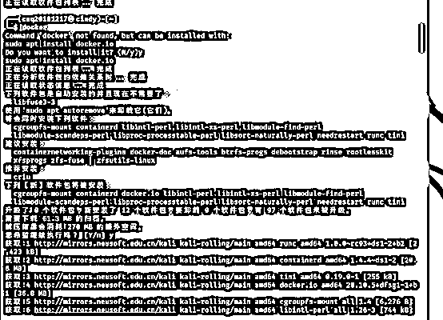
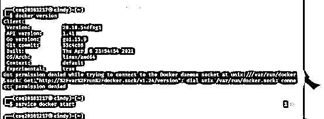
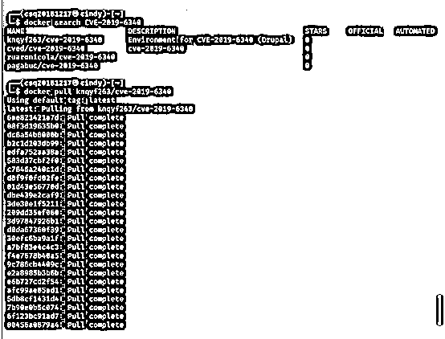
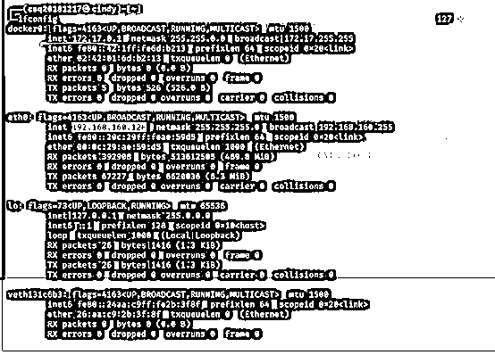
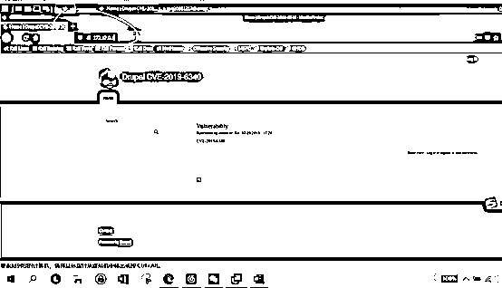
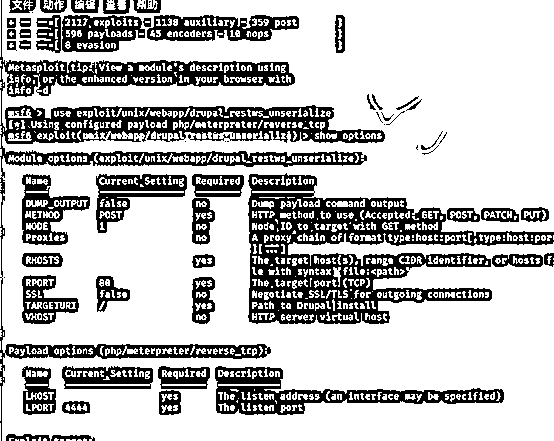
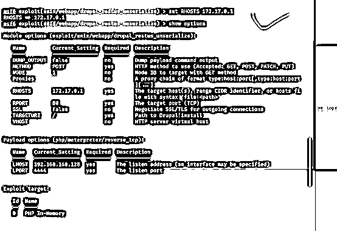
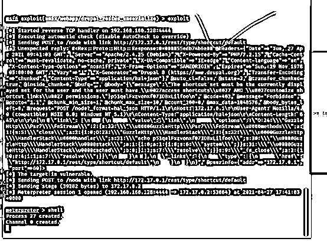
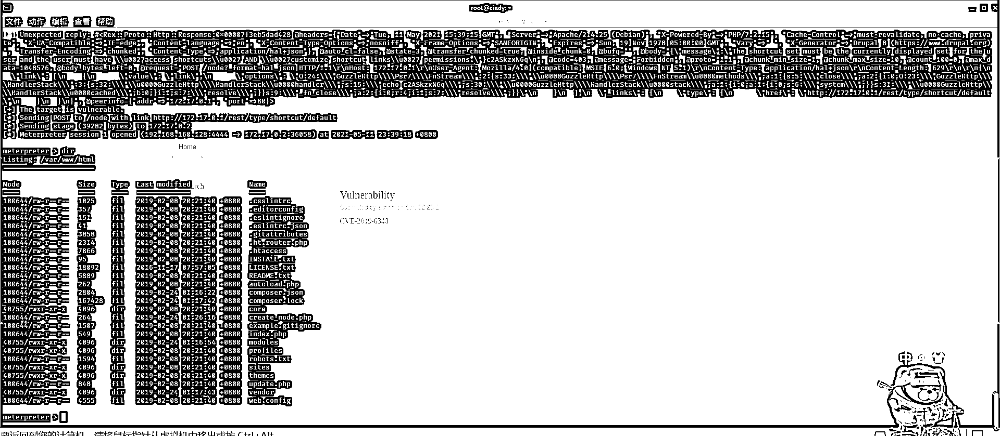

# CVE-2019-6340 Drupal8's REST RCE 漏洞复现 - 20181217Cindy - 博客园

> 原文：[`www.cnblogs.com/cindy123456/p/14710447.html`](https://www.cnblogs.com/cindy123456/p/14710447.html)

**0X1 漏洞概述**

Drupal 官方之前更新了一个非常关键的安全补丁，修复了因为接受的反序列化数据过滤不够严格，在开启 REST 的 Web 服务拓展模块的情况下，可能导致 PHP 代码执行的严重安全。

根据官方公告和自身实践，8.6.x 或（<8.6.10）两种情况可能导致问题出现：

*   RESTful Web Services 拓展开启，并且启用了 REST 资源（默认配置即可），不需要区分 GET，POST 等方法即可完成攻击。
*   JSON：API 服务模块开启，此服务尚未分析。

漏洞影响版本：

```
Drupal < 8.6.10Drupal < 8.5.12 
```

**docker 安装：**

****

 

 查看 docker 版本



设置每次开机自动开启 docker

 

 首先新建一个 docker 组，然后把当前用户加入 docker 组，重启 docker，切换当前会话到新 group，最后测试下效果`docker version。`

****

**0X2 环境搭建**

使用 search‍‍命令进行查找，然后拉取第一个镜像，使用 pull 命令 docker pull knqyf263/cve-2019-6340

 

 最后等到拉取完成。

然后启动镜像，运行环境 docker run -d -p 80:80 --name Drupal8 knqyf263/cve-2019-6340


 

Ipconfig 查看：本机 ip 和 dockerip。



 访问网站首页



在 github 上可以找到关于此 CVE 漏洞编号的很多脚本，但是用法不一，因此，我们使用 rapid 官方给出的脚本进行测试。在 kali 下将 metasploit 更新到最新，使用模块：

 use exploit/unix/webapp/drupal_restws_unserialize，然后 show options 查看一下：



设置 RHOSTS 参数和 LHOST 参数


 

Exploit 攻击成功！可以查看 shell~~



 或者查看一下网页目录~

