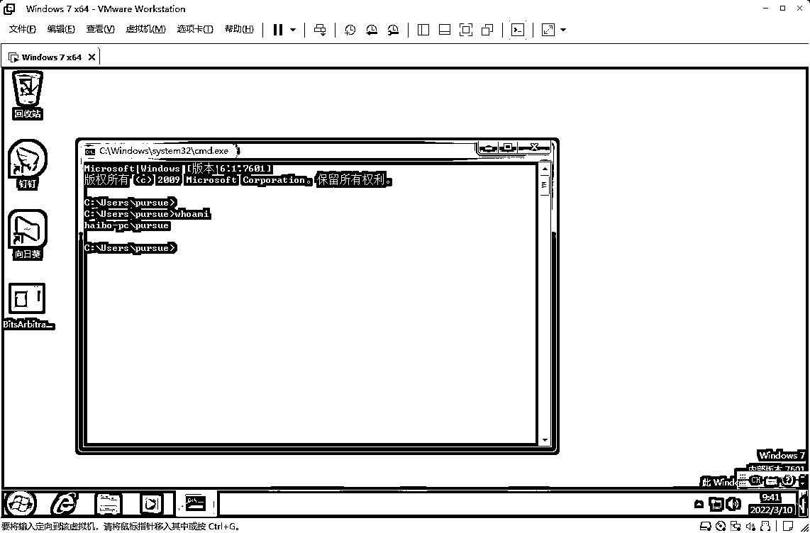
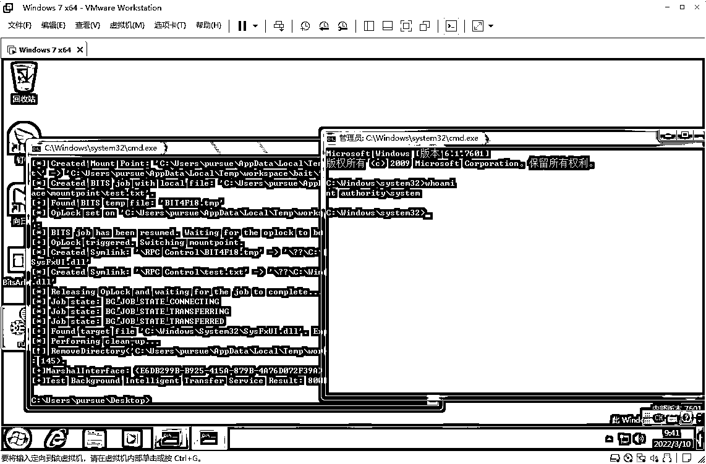

# CVE-2020-0787 复现 - 学安全的小白 - 博客园

> 原文：[`www.cnblogs.com/pursue-security/p/15988132.html`](https://www.cnblogs.com/pursue-security/p/15988132.html)

## 一、漏洞概述

2020 年 3 月 10 日，微软官方公布了一个本地提权漏洞 CVE-2020-0787，根据微软的漏洞描述声称，攻击者在使用低权限用户登录系统后，可以利用该漏洞构造恶意程序直接提权到 administrator 或者 system 权限。system 是 windows 所有操作系统中权限最大的账户。

## 二、影响范围

windows 全版本

## 三、漏洞利用

EXP 地址：[`github.com/cbwang505/CVE-2020-0787-EXP-ALL-WINDOWS-VERSION/releases/tag/1`](https://github.com/cbwang505/CVE-2020-0787-EXP-ALL-WINDOWS-VERSION/releases/tag/1)

在 windows7 的虚拟机中复现该漏洞。将下载好的 EXP 移动到 windows7 中。

在 cmd 中运行 EXP。运行结束后会弹出一个拥有 system 权限的 cmd 窗口。该漏洞适用于 windows 本地提权。

