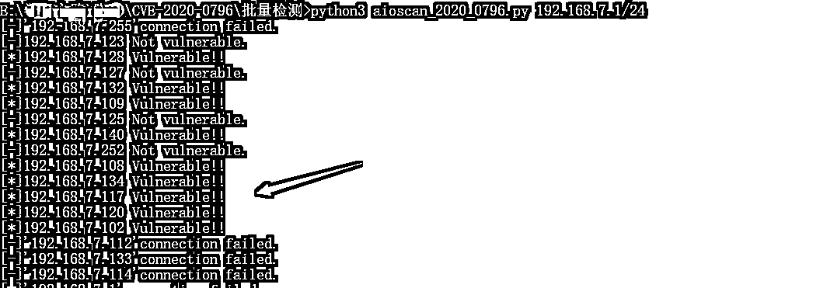

# CVE-2020-0796 提权操作 - ctrl_TT 豆 - 博客园

> 原文：[`www.cnblogs.com/-chenxs/p/12618678.html`](https://www.cnblogs.com/-chenxs/p/12618678.html)

### 简介

最新的 windows10 中使用了 SMBv3 协议，SMBv3 协议在压缩消息时，未对头部数据做任何检查，导致恶意攻击者可以直接使用，从而导致内存破坏漏洞。

该漏洞可远程进行攻击目标系统，但目前只做到能是远程目标蓝屏，静等后面 RCE 的 exp 出现；

该漏洞也可进行本地提权操作，提权成功会弹出一个 system 权限的终端窗口，因此最好远程桌面对目标进行提权操作。

### 0x01 影响版本

漏洞不影响 win7，漏洞影响 Windows 10 1903 之后的各个 32 位、64 位版 Windows，包括家用版、专业版、企业版、教育版，具体版本号如下：

```
Windows 10 Version 1903 for 32-bit Systems
Windows 10 Version 1903 for ARM64-based Systems
Windows 10 Version 1903 for x64-based Systems
Windows 10 Version 1909 for 32-bit Systems
Windows 10 Version 1909 for ARM64-based Systems
Windows 10 Version 1909 for x64-based Systems
Windows Server, version 1903 (Server Core installation)
Windows Server, version 1909 (Server Core installation)
```

在本地上可使用命令 ver 对本机进行版本查询：


 该漏洞利用需要目标机开启 445 端口。

### 0x02 POC&&EXP

1.单个目标检测：https://github.com/ollypwn/SMBGhost

```
python3 scanner.py ip
```


2.批量检测：https://github.com/GuoKerS/aioScan_CVE-2020-0796 

```
python3 aioscan_2020_0796.py 192.168.1.1/24
```



3.公开 exp：[`github.com/danigargu/CVE-2020-0796`](https://github.com/danigargu/CVE-2020-0796)

直接终端运行，然后输入目标 ip，提权 ip 为本地 127.0.0.1.

4.python3 安装 netaddr 失败：

下载 github 上第三方包，然后将 netaddr 放入 python 安装目录下面的/lib/site-packages 下面。

[`github.com/netaddr/netaddr`](https://github.com/netaddr/netaddr)

###  0x03 提权操作

本机提权，先关闭防火墙。

然后直接运行 cve-2020-0796-local.exe，目标 ip 为本地 ip127.0.0.1


 弹出新终端就提权成功了。