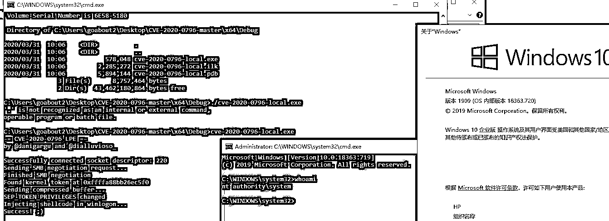
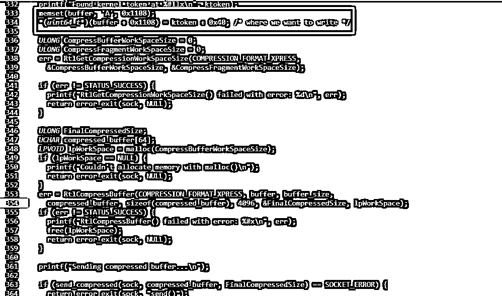
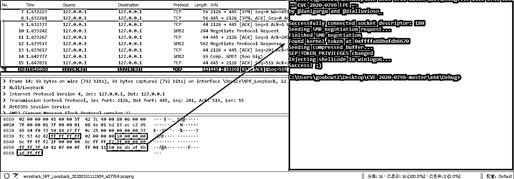
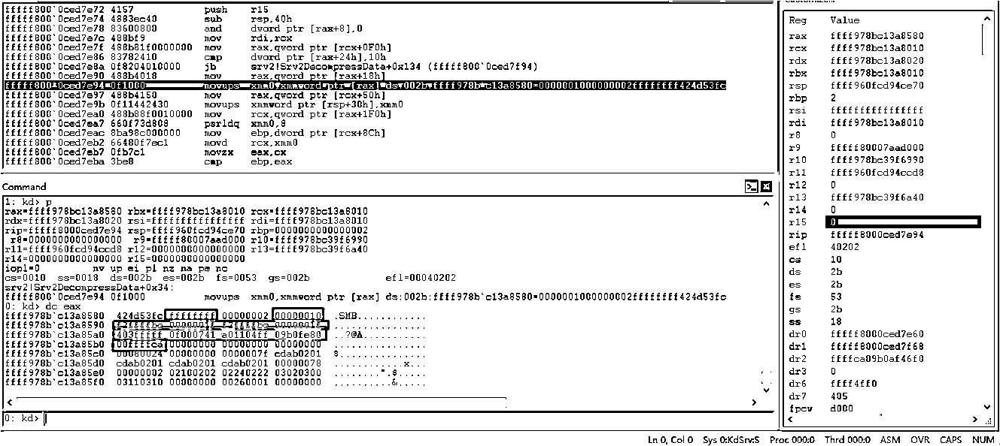
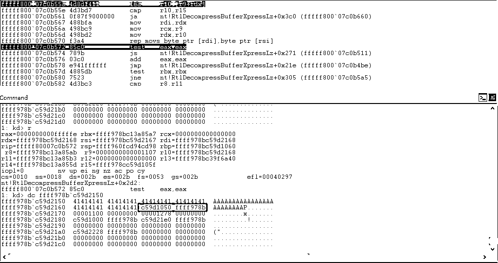
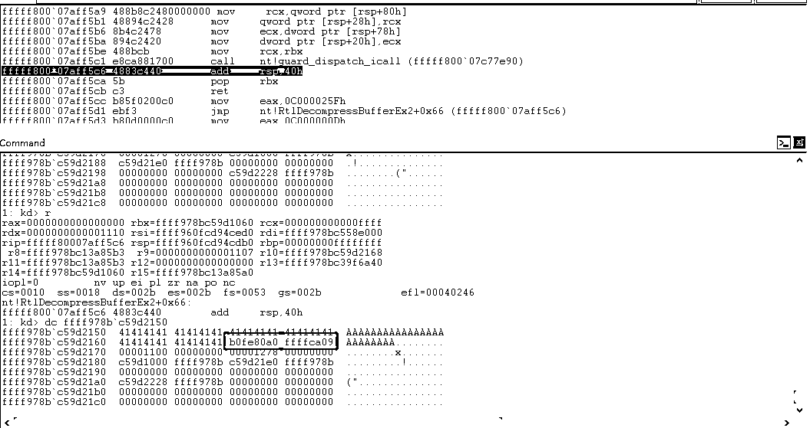
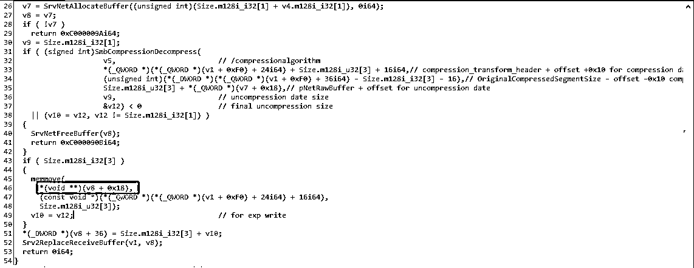
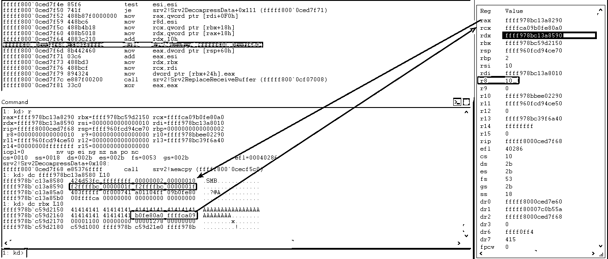
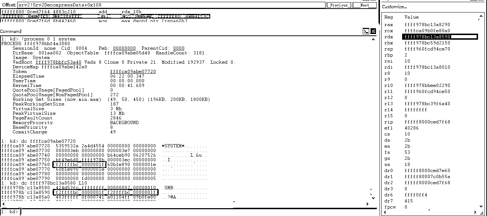

# CVE-2020-0796 本地利用简析 - goabout2 - 博客园

> 原文：[`www.cnblogs.com/goabout2/p/12609810.html`](https://www.cnblogs.com/goabout2/p/12609810.html)

3 月 30 日名为 danigargu 的研究员在 github 上分享的该 CVE-2020-0796 漏洞本地提权相关的利用[`github.com/danigargu/CVE-2020-0796`](https://github.com/danigargu/CVE-2020-0796)

如下所示，经过测试在 1909 的设备上可以实现提权，分析发现这个利用还是比较巧妙的，之前分析漏洞的时候遗漏了其中的一些细节。

可以看到整个发包过程其实和 poc 基本一致，压缩数据包的主要内容是 0x1108*A+（ktoken+0x40）。

 

如下所示为对应的数据包，由于 1108 个 A 的字符进行了压缩所以在流量上是没有这么多 A 的，这里可以看到下图所示需要修改的 token 中 _TOKEN_PRIVILEGES 的地址，也就是说这一个数据包就能实现当前进程内核 token _TOKEN_PRIVILEGES 域的修改。

如下所示是整个漏洞利用的数据包，前 0x10 个字节是压缩头，偏移 0x4 的 CompressedSegmentSize 和 0xc 的 offset 两个变量相加决定之后解压缩 buffer 的大小，但是可以容易的知道这里是一个整数溢出，从而在之后拷贝解压缩数据的时候导致越界写，0x20 开始的 0x14 个字节为对应的压缩数据，其中蓝色水印即为当前 token 的 _TOKEN_PRIVILEGES 的偏移，中间蓝色框的部分为 system token _TOKEN_PRIVILEGES 的值，即通过这个包可以实现将当前 token _TOKEN_PRIVILEGES 修改位 system 的 _TOKEN_PRIVILEGES。

这里之所以能利用就和 Srv2DecompressData 的解压缩过程有一定关系了，当溢出分配了较小的解压缩 buffer v7 之后（这里 v7 是一个 buffer 对象，对应的 buffer 指针在 buffer+0x18 处），调用函数 SmbCompressionDecompress 对 0x20 偏移的压缩数据解压，并将其拷贝到 buffer 对象的 buffer 指针中，这里拷贝的时候是从指针偏移 0x10 的位置开始拷贝，即会预留开始的 0x10 个字节，之后调用 memove，将上图中蓝色框中的 0x10 个字节填充到 buffer 的开始预留的 0x10 长度的内存中。

如下所示为对应的 buffer 对象，偏移 0x18 处为实际的 buffer 指针，这里可以看到 buffer 指针指向的位置实际是在 buffer 对象的低地址处，也就是说通过解压缩中拷贝溢出 buffer，最终是可以修改对应的 buffer 对象的 buffer 指针的，又由于之后的 memove 会将压缩数据包 0x10-0x20 处的数据（蓝色框中攻击者可控的 0x10 字节内容）复制到 buffer 指针开始至 buffer+0x10 处，这就给了攻击者一次任意地址写任意数据的能力，通过这个能力直接修改当前进程内核 token 的 _TOKEN_PRIVILEGES 来实现提权。

可以看到拷贝的起始地址为 buffer+0x10，目标为 buffer+0x11，长度为 1107， 1107 个 A 拷贝之后，正好后面就是 buffer 指针。

而我们的压缩数据实际上还没有拷贝完毕，还差之后的 ktoken+0x40

此时 buffer 指针在拷贝完之后正好被修改为当前进程 token _TOKEN_PRIVILEGES 的地址

之后调用 memove 进行拷贝，目标地址为 buffer 指针指向的地址，源地址为压缩数据包中压缩头之后到压缩数据 0x20 之间 0x10 长度的内容。这段内容实际也是攻击者数据包构造时完全可控的 system _TOKEN_PRIVILEGES 的值，由于此时 buffer 指针指向的地址被修改为当前进程的 _TOKEN_PRIVILEGES 的地址，从而实现了向当前 _TOKEN_PRIVILEGES 写入指定 system 的 _TOKEN_PRIVILEGES 的操作

如下所示，最终写入 f2ffffbc0000001f

如下所示为对应的 system 进程的 _TOKEN_PRIVILEGES，可以看到其值固定为 f2ffffbc 0000001f，这也就是我们需要将其修改为 f2ffffbc 0000001f 的原因。

最终修改当前进程的 token _TOKEN_PRIVILEGES，实现提权。

这里也可以看到如果在处理解压缩数据的时候，先直接将头部之后到压缩数据之前的蓝框部分拷贝的解压缩 buffer 中，再拷贝解压缩数据，就不会出现这一个利用点了。

转载请注明出处

参考链接

[`github.com/danigargu/CVE-2020-0796`](https://github.com/danigargu/CVE-2020-0796)