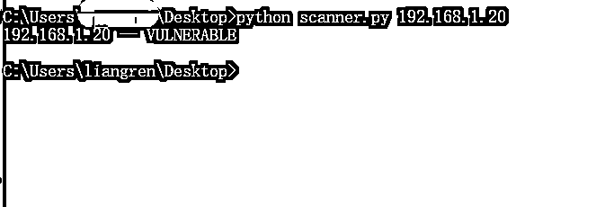

# CVE-2020-0796 漏洞复现 - 终落 - 博客园

> 原文：[`www.cnblogs.com/twlr/p/12552592.html`](https://www.cnblogs.com/twlr/p/12552592.html)

## 0x00 前提简介

　　Microsoft Windows 和 Microsoft Windows Server 都是美国微软（Microsoft）公司的产品，Microsoft Windows 是一套个人设备使用的操作系统，Microsoft Windows Server 是一套服务器操作系统，Server Message Block 是其中的一个服务器信息传输协议。

微软公布了在 Server Message Block 3.0（SMBv3）中发现的“蠕虫型”预授权远程代码执行漏洞。

## 0x01 漏洞概述

　1、　该漏洞是由于 SMBv3 协议在处理恶意的压缩数据包时出错所造成的，它可让远程且未经身份验证的攻击者在目标系统上执行任意代码。

　2、影响范围：

　　　　适用于 32 位系统的 Windows 10 版本 1903

　　　　Windows 10 1903 版（用于基于 x64 的系统）

　　　　Windows 10 1903 版（用于基于 ARM64 的系统）

　　　　Windows Server 1903 版（服务器核心安装）

　　　　适用于 32 位系统的 Windows 10 版本 1909

　　　　Windows 10 版本 1909（用于基于 x64 的系统）

　　　　Windows 10 1909 版（用于基于 ARM64 的系统）

　　　　Windows Server 版本 1909（服务器核心安装）

## 0x02 漏洞复现

　1、环境搭建

　　靶机：win10 虚拟机，IP：192.168.1.20 （关闭防火墙）

　2、漏洞检测

　　检测工具：[`github.com/ollypwn/SMBGhost`](https://github.com/ollypwn/SMBGhost)

 　　即为存在漏洞。

　3、发起 poc 攻击

　　攻击成功，靶机蓝屏重启！

　　+1：想要 poc 可私聊获取

## 0x03 漏洞修复

　　厂商目前发布漏洞修复补丁：[`portal.msrc.microsoft.com/zh-cn/security-guidance/advisory/CVE-2020-0796`](https://portal.msrc.microsoft.com/zh-cn/security-guidance/advisory/CVE-2020-0796)

参考链接：https://www.cnblogs.com/L0ading/p/12519325.html