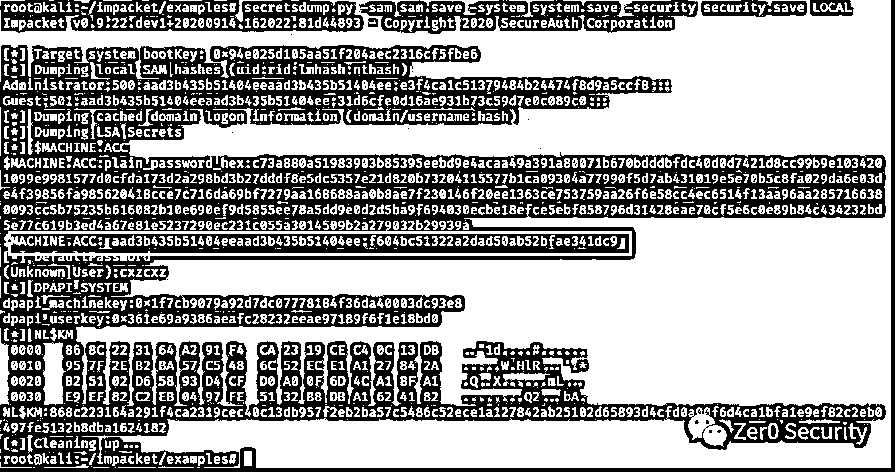

# CVE-2020-1472 域内提权完整利用 - 我要变超人 - 博客园

> 原文：[`www.cnblogs.com/sup3rman/p/13680262.html`](https://www.cnblogs.com/sup3rman/p/13680262.html)

摘自公众号 [Zer0 Security](https://mp.weixin.qq.com/)

目前网上公开的方法仅到重置密码为空，但是后续没有恢复密码操作，对于域控制器来说，当计算机 hash 更改时会直接影响与其他域控制器的通信和该域控上的功能（例如：DNS 服务等）， 本文仅做个记录实现完整的利用。利用流程如下：

1.重置密码，获取域内所有的用户 hash，利用 exp：[`github.com/dirkjanm/CVE-2020-1472`](https://github.com/dirkjanm/CVE-2020-1472)

2.Dump 域控制上的 hash

3.利用获取到的管理员 hash 远程连接导出 sam 数据库中原来的计算机 hash

4.恢复 ntds.dit 中的计算机 hash 并验证：https://github.com/risksense/zerologon 需要注意的是最后的 hash 使用的是上图的标红的、”:”后面的部分-> f604.....1dc9 这个，不是全部的，下图错了

5.最后验证密码已经更改回去

