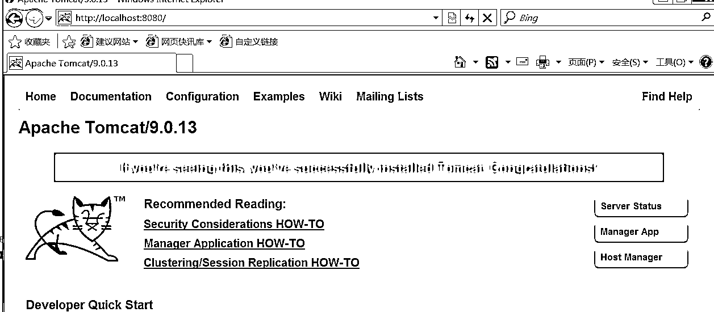
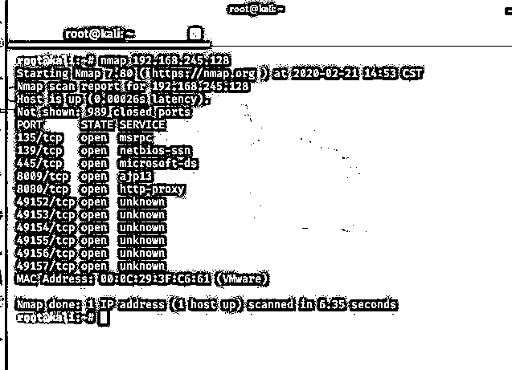
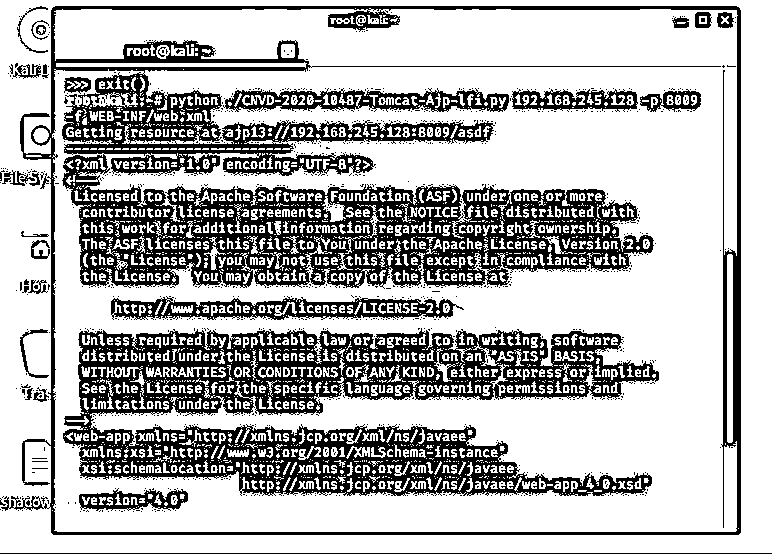

# CVE-2020-1938 Apache-Tomcat-Ajp 漏洞复现 - 终落 - 博客园

> 原文：[`www.cnblogs.com/twlr/p/12341569.html`](https://www.cnblogs.com/twlr/p/12341569.html)

## 0x00 漏洞简介

　　漏洞编号：cve-2020-1938

　　cve-2020-1938 是一个出现在 Apache-Tomcat-Ajp 的文件包含漏洞，攻击者可以利用该漏洞读取包含 Tomcat 上所有的 webapp 目录下的任意文件，入：webapp 配置文件或源代码。

　　由于 Tomcat 默认开启的 AJP 服务（8009 端口）存在一处文件包含缺陷，攻击者可构造恶意的请求包进行文件包含操作，进而读取受影响 Tomcat 服务器上的 Web 目录文件。

## 0x01 漏洞影响范围

　　Apache Tomcat 6

　　Apache Tomcat 7 < 7.0.100

　　Apache Tomcat 8 < 8.5.51

　　Apache Tomcat 9 < 9.0.31

## 0x02 漏洞复现

　　本文章漏洞环境利用的是 cve-2019-0232 环境，再次就不细说搭建环境过程，详情请看：https://www.cnblogs.com/twlr/p/12303052.html。

　　启动 Tomcat 服务后，访问 http://localhost:8080 可以看的如下界面：

 　　对 Tomcat 服务扫描端口：

　　发现开启了 8080 和 8009 端口，证明存在漏洞。

　　下载漏洞利用 poc：[`github.com/0nise/CVE-2020-1938`](https://github.com/0nise/CVE-2020-1938)

 　　poc 为 python2 环境，在 cmd 命令行执行命令：

　　 python ./ CNVD-2020-10487-Tomcat-Ajp-lfi.py 本地 ip –p 8009 –f WEB-INF/web.xml  可以成功访问文件。

##  0x03 修复建议

　　1、禁用 AIP 协议端口，在 conf/server.xml 配置文件中注释掉<Connector port="8009" protocol="AJP/1.3"redirectPort="8443" />

　　2、升级官方最新版本。