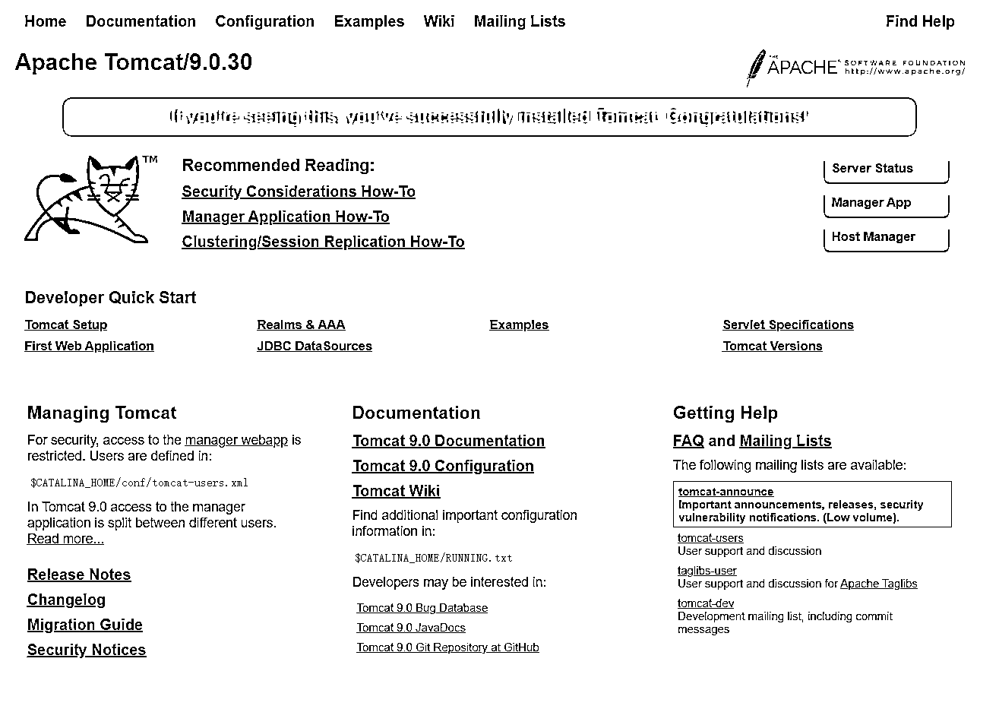
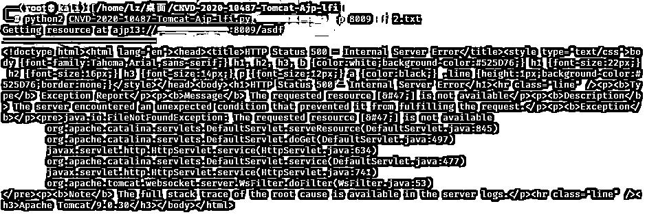
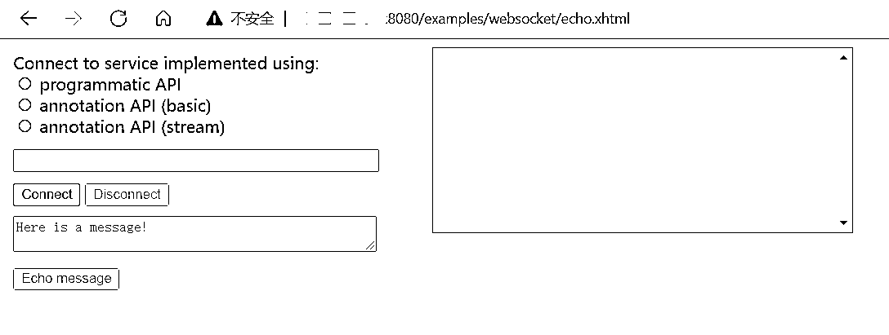

# CVE-2020-1938 与 CVE-2020-13935 漏洞复现 - ling-lz - 博客园

> 原文：[`www.cnblogs.com/ling-lz/p/15517721.html`](https://www.cnblogs.com/ling-lz/p/15517721.html)

## 前言

最近在腾讯云上买了个服务器，准备用来学习。在安装了 7.0.76 的 tomcat 后，腾讯云提醒我存在两个漏洞，分别是 CVE-2020-1938 和 CVE-2020-13935，在修复完漏洞后，准备复现一下这两个漏洞，于是就有了这篇随笔。

# CVE-2020-1938

## 漏洞简介

2020 年，长亭科技安全研究人员全球首次发现了一个存在于流行服务器 Tomcat 中的文件读取/包含漏洞，并第一时间提交厂商修复。

2 月 14 日，Apache Tomcat 官方发布安全更新版本，修复漏洞。2 月 20 日，国家信息安全漏洞共享平台（CNVD）发布安全公告，该漏洞综合评级为高危，漏洞编号为 CNVD-2020-10487，CVE 编号 CVE-2020-1938。

cve-2020-1938 是一个出现在 Apache-Tomcat-Ajp 的文件包含漏洞，攻击者可以利用该漏洞读取包含 Tomcat 上所有的 webapp 目录下的任意文件，如：webapp 配置文件或源代码。由于 Tomcat 默认开启的 AJP 服务（8009 端口）存在一处文件包含缺陷，攻击者可构造恶意的请求包进行文件包含操作，进而读取受影响 Tomcat 服务器上的 Web 目录文件。同时，若该服务器存在文件上传功能，攻击者还可以进一步实现远程代码执行。

## 影响版本

Apache Tomcat 6

Apache Tomcat 7 < 7.0.100

Apache Tomcat 8 < 8.5.51

Apache Tomcat 9 < 9.0.31

## 环境搭建

在这里推荐一款一键搭建漏洞的工具——[Vulhub](https://vulhub.org/)，非常好用。

我们进入到 tomcat 的 CVE-2020-1938 的目录下使用 docker-compose up -d 启动环境

 在主机访问搭建成功

## 漏洞复现

 然后进入 kali 进行攻击，使用 POC

[sv3nbeast/CVE-2020-1938-Tomact-file_include-file_read: Tomcat 的文件包含及文件读取漏洞利用 POC (github.com)](https://github.com/sv3nbeast/CVE-2020-1938-Tomact-file_include-file_read)

 被打马赛克的地方是 ip 地址，最后成功读取到 web.xml，攻击成功。

 我们在 ROOT 目录下写入一个 1.txt 再测试一下

 

 也能成功读取

但在 webapps 目录下写入一个 2.txt 却不能读取，因为它默认读取的是 ROOT 目录下的文件

 

# CVE-2020-13935

## 漏洞简介

Apache Tomcat 是美国阿帕奇（Apache）基金会的一款轻量级 Web 应用服务器。该程序实现了对 Servlet 和 JavaServer Page（JSP）的支持。 Apache Tomcat 中的 WebSocket 存在安全漏洞，该漏洞源于程序没有正确验证 payload 的长度。攻击者可利用该漏洞造成拒绝服务（无限循环）。

## 影响版本

Apache Tomcat 10.0.0-M1-10.0.0-M6

Apache Tomcat 9.0.0.M1-9.0.36

Apache Tomcat 8.5.0-8.5.56

Apache Tomcat 7.0.27-7.0.104

## 漏洞复现

此漏洞依旧使用上述环境

打开浏览器，在地址栏输入 http://IPaddress:8080/examples/websocket/echo.xhtml 查看是否可以访问，如果不可以访问，则说明该文件被删掉了，那就无法进行漏洞利用。

在服务器上使用 top -bn 1 -i -c 命令，可以看到 CPU 占有率为 0.0

 在 kali 上使用 EXP 攻击

[RedTeamPentesting/CVE-2020-13935: Exploit for WebSocket Vulnerability in Apache Tomcat (github.com)](https://github.com/RedTeamPentesting/CVE-2020-13935)

使用此 EXP 前需要先编译再攻击

go env -w GOPROXY=https://goproxy.cn //修改 proxy 地址

go build //编译 go 程序，输出 tcdos.exe

 

 可以看到此时 cpu 占有率为 100，攻击成功

# 参考

[CVE-2020-1938 Tomcat 文件读取/包含漏洞复现 - 云+社区 - 腾讯云 (tencent.com)](https://cloud.tencent.com/developer/article/1590029)

[CVE-2020-13935 漏洞复现 - XY_181312 - 博客园 (cnblogs.com)](https://www.cnblogs.com/blingblingXY/p/14756470.html)