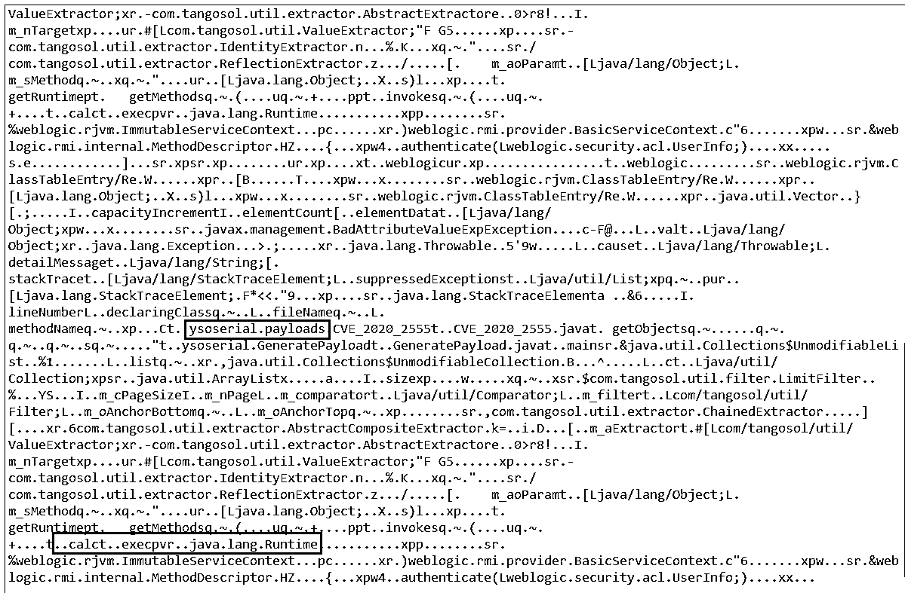
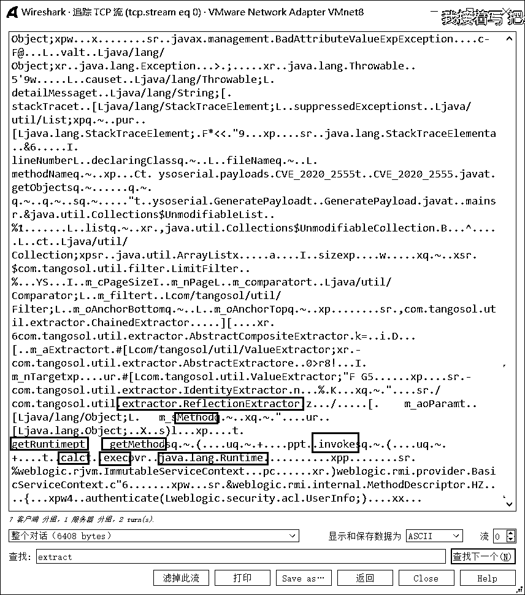
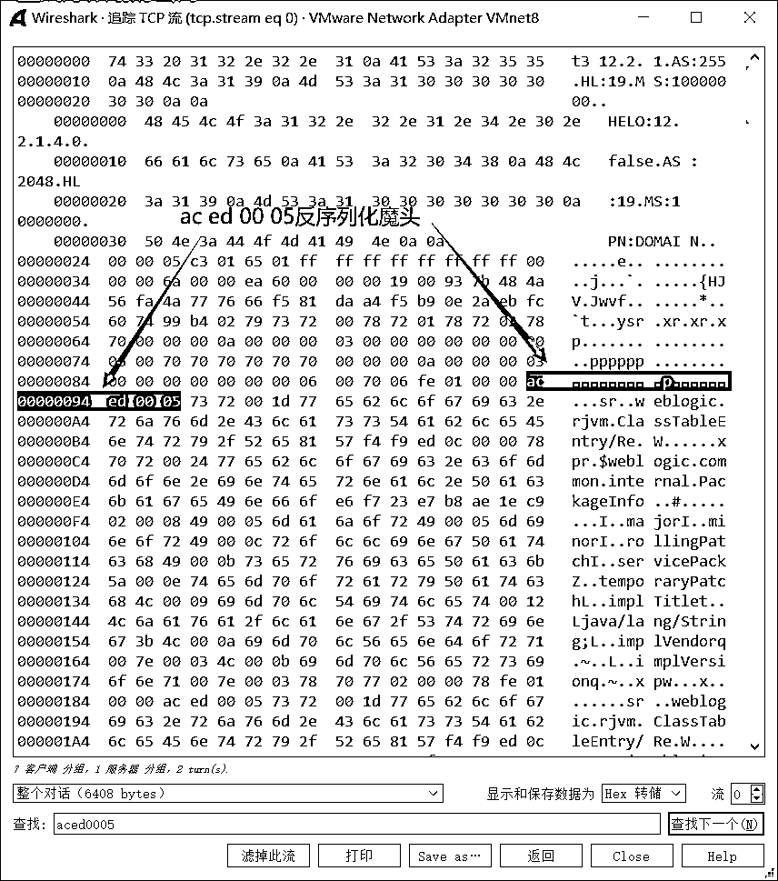

# CVE-2020-2555 漏洞复现&&流量分析 - Zh1z3ven - 博客园

> 原文：[`www.cnblogs.com/CoLo/p/13664130.html`](https://www.cnblogs.com/CoLo/p/13664130.html)

# CVE-2020-2555 漏洞复现&&流量分析

## 一、准备环境

windows7: weblogic 12.2.1.4.0 JDK 版本为 jdk-8u261

关于 weblogic 搭建可以看我上一篇文章

[`www.cnblogs.com/Zh1z3ven/p/13663714.html`](https://www.cnblogs.com/Zh1z3ven/p/13663714.html)

攻击机：物理机

poc：[`github.com/zhzyker/exphub/blob/master/weblogic/cve-2020-2555_cmd.py`](https://github.com/zhzyker/exphub/blob/master/weblogic/cve-2020-2555_cmd.py)

## 二、测试漏洞

该反序列化的 gadget 存在与 coherence 包中，因为网上（github）的 poc 主要是测试 poc，只能验证漏洞存在不存在 ，也没有命令回显。

### 0x01 执行 poc


### 0x02 抓包观察

T3 协议握手包


看着像 payload 的东西，可以看到很多熟悉的字段



也可以看到部分调用链



ac ed 00 05 反序列化魔头



## 三、关于 T3 协议

`weblogic t3`协议指的是`weblogic`的`rmi`使用的`t3`协议，在`java rmi`中，默认`rmi`使用的是`jrmp`协议，`weblogic`包含了高度优化的`RMI`实现

T3 协议的握手包（如下图）第一行为`t3`加`weblogic`客户端的版本号,weblogic 服务器的返回数据的第一行为`HELO:`加`weblogic`服务器的版本号。`weblogic`客户端与服务器发送的数据均以`\n\n`结尾。


大致利用流程为

```
T3 协议头数据包 --> 发送恶意序列化数据 
```

## 四、参考文章：

[`cert.360.cn/report/detail?id=0de94a3cd4c71debe397e2c1a036436f`](https://cert.360.cn/report/detail?id=0de94a3cd4c71debe397e2c1a036436f)

[`cert.360.cn/report/detail?id=15b04e663cc63500a05abde22266b2ee`](https://cert.360.cn/report/detail?id=15b04e663cc63500a05abde22266b2ee)

[`blog.csdn.net/Amdy_amdy/article/details/105510490`](https://blog.csdn.net/Amdy_amdy/article/details/105510490)

[`www.r4v3zn.com/posts/975312a1/`](https://www.r4v3zn.com/posts/975312a1/)