# CVE-2021-1732 LPE 漏洞分析 - Bl0od - 博客园

> 原文：[`www.cnblogs.com/zUotTe0/p/15591015.html`](https://www.cnblogs.com/zUotTe0/p/15591015.html)

## 概述

　　CVE-2021-1732 是一个发生在 windows 内核 win32kfull 模块的 LPE 漏洞，并且由于创建窗口时调用 win32kfull!xxxCreateWindowEx 过程中会进行用户模式回调（KeUserModeCallback），从而给了用户态进程利用的机会。

　　该漏洞由安恒信息在 2020 年 12 月在野外攻击样本中发现，在 2021 年 2 月份公开披露。相关样本在 2020 年 APT 组织蔓灵花针对国内的一次攻击中作为提权组件被发现。

## 分析

　　Windows 中创建窗口时，会调用 API CreateWindowEx，最终在内核会调用至 win32kfull!xxxCreateWindowEx。在 win10 1909 上调试时调用堆栈回溯如下：

　　... ...     win32kfull!xxxCreateWindowEx+0x1259

　　... ...     win32kfull!NtUserCreateWindowEx+0x6a0

　　... ...     nt!KiSystemServiceCopyEnd+0x25

　　... ...     win32u!NtUserCreateWindowEx+0x14

　　... ...     USER32!VerNtUserCreateWindowEx+0x211

　　... ...     USER32!CreateWindowInternal+0x1b4

　　... ...     USER32!CreateWindowExW+0x82

　　win32kfull 模块的 xxxCreateWindowEx 函数为最终负责窗口对象创建的过程。CVE-2021-1732 主要是在 win32kfull!xxxCreateWindowEx 调用 win32kfull! xxxClientAllocWindowClassExtraBytes 进行窗口扩展内存时触发。xxxClientAllocWindowClassExtraBytes 函数中会调用 KeUserModeCallback 进行用户模式回调，以在用户模式执行回调。该函数中指定的回调 ApiNumber 为 0x7B，即为 user32! _xxxClientAllocWindowClassExtraBytes。相关回调函数表可在 PEB->KernelCallBackTable 中查看。

　　查看 user32! _xxxClientAllocWindowClassExtraBytes，只是在用户模式当前进程堆中分配了指定大小的空间，并将分配的堆地址通过 NtCallbackReturn 传回内核。

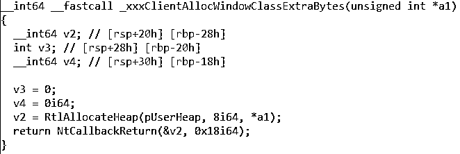

　　由于用户模式回调函数的执行是在用户态进行，因此用户可以直接从进程中对该函数进行 Hook，改变执行流程。

　　分析时使用 POC 为 https://github.com/KaLendsi/CVE-2021-1732-Exploit，经过和原始样本的比对，可以发现该 POC 是对原始样本的完全还原，仅是在部分变量名含义上不正确。

　　漏洞首先对 user32! _xxxClientAllocWindowClassExtraBytes 进行 Hook，在之后进程每次调用 CreateWindowExW 创建窗口时将会走到 Hook 函数处。替换后的 KernelCallBackTable 如下所示：

　　接着创建多个普通窗口，后续都会经过 Hook 函数。对于普通窗口，Hook 函数仍旧按照旧流程，为其调用 user32! _xxxClientAllocWindowClassExtraBytes。判断依据是传入的参数值，即 tagWnd. cbwndExtra，相关细节在创建利用窗口时再说。

　　不过虽然普通窗口的创建仍是走的正常流程，但是会记录每个创建窗口的对象地址。窗口对象地址利用 HMValidateHandle 进行泄露。该函数未导出，不过可以通过调用了该函数的其他 API 进行搜寻，比如 IsMenu。

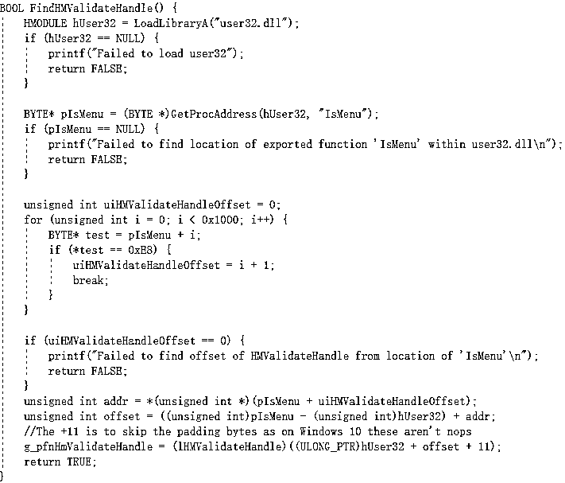

　　调用方式为***HMValidateHandle***(HANDLE h, int type)，传入窗口句柄和 type 值，如果句柄类型和参数 type 一致，返回句柄对应的对象在用户态内存的地址，值得注意的是，该调用成功返回值实际为**poi(tagWnd+0x28)**。窗口传入 type 为 1。

　　1：TYPE_WINDOW

　　如此连续创建多个窗口，查询（VirtualQuery）每个窗口对象所在内存块的基址，记录其中最小的基址。接着除了窗口 0 和 1，调用 DestroyWindow 销毁其余窗口。保留下的窗口 0 和 1 将结合后续将创建的 magicWnd 进行漏洞利用，而记录的最小基址将用于搜寻 magicWnd。

　　对比窗口 0 和 1 分别相对于桌面堆的偏移，较小者和较大者分别记为 WndMin、WndMax。偏移值位于窗口对象 tagWnd 对象偏移 0x08 处。

　　tagWnd 对象结构部分偏移如下：

***　　+0x00         Handle***

***　　+0x08         cLockObj***

***　　+0x10         unk***

***　　　　++0x00    ETHREAD***

***　　　　　　... ...***

***　　　　　　+++0x220    EPROCESS***

***　　　　　　　　... ...***

***　　　　　　　　++++0x2e8    UniqueProcessId***

***　　　　　　　　++++0x2f0    ActiveProcessLinks***

***　　　　　　　　++++0x360    Token***

***　　　　　　　　++++0x3e8    InheritedFromUniqueProcessId***

***　　　　　　　　... ...***

***　　　　　　... ...***

***　　+0x18***

***　　　　++0x80    桌面堆基址***

***　　... ...***

***　　+0x20         pSelf***

***　　+0x28***

***　　　　++0x00    Handle***

***　　　　++0x08    *(tagWnd+0x28)相对于桌面堆基址的偏移***

***　　　　++0x18    exStyle***

***　　　　++0x1c    dwStyle***

***　　　　++0x98    spMenu***

***　　　　　　... ...***

***　　　　　　+++0x50    tagWnd***

***　　　　　　... ...***

***　　　　++0xc8    cbwndExtra，指定 Extrabytes 字节数***

***　　　　++0xe8    不明 flag，flag|=0x800 可指定 pExtrabytes 属性为偏移***

***　　　　++0x128   pExtrabytes，指向分配的 Extrabytes 内存***

***　　... ...***

***　　+0xa8    spMenu***

***　　　　... ...***

***　　　　++0x50    tagWnd***

***　　　　... ...***

　　窗口销毁后调用 NtUserConsoleControl，指定参数 ConsoleControl 为 6，ConsoleCtrlInfoLength 为 0x10，将窗口 WndMin 对象 pExtrabytes（0x128）字段属性设置为偏移，设置成功后 pExtrabytes 字段值为相对于桌面堆的偏移值，而 0xe8 处的 flag 将***|=0x800***。重新申请后的 Extrabytes 内存大小由**poi(poi(tagWnd+0x28)+0xc8)**指定。

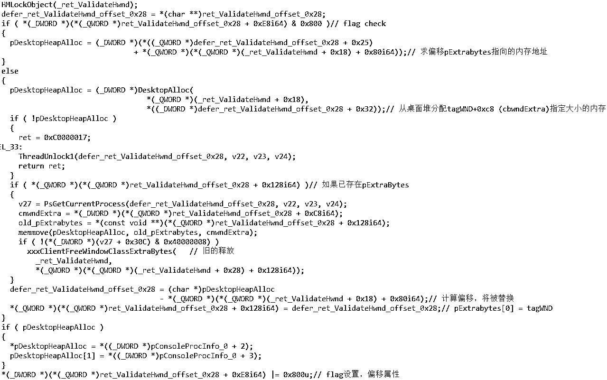

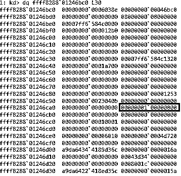

（由于中间反复调试过几次，截图之间的数据可能有些对不上）

　　然后创建一个 magic 窗口 WndMagic，同之前一样，会执行到 xxxClientAllocWindowClassExtraBytes 的 Hook 函数处。此时将进入另一分支，触发 Hook 函数真正作用流程。判断方式是传入的参数值，之前创建的普通窗口和现在的 magic 窗口指定的**cbWndExtra**值是不同的，普通窗口固定为 32 字节，magic 窗口为一个随机值。

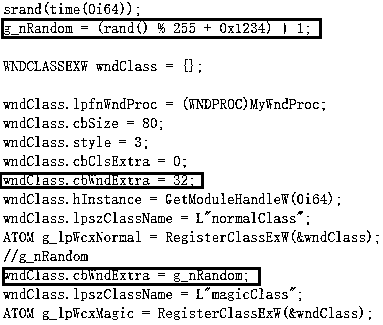

　　而 wndClass.cbWndExtra 值将被赋值到窗口对象**poi(tagWnd+0x28)+0xc8**处，并作为 ExtraBytes 内存分配时的大小指定值，然后进行用户模式回调。用户态回调函数执行结束后返回内存地址到内核，赋值到**poi(tagWnd+0x28)+0x128**处。而 Hook 函数的目的就是为了返回一个虚假偏移，指向其他地址，实现可任意地址写的功能。

　　窗口创建过程中，执行到 Hook 函数中，通过比对传入的参数值和随机值，可确定此次创建是 WndMagic。不过此时 win32kfull! xxxCreateWindowEx 尚未执行完毕，所以 HWND 句柄值还未返回，尚不可知。然而在进行额外内存进行创建时，窗口对象部分属性已经完成初始化，比如句柄值、窗口属性、扩展属性等。

　　所以通过匹配 cbWndExtra 值，再比对窗口扩展属性值 exStyle（此次利用中所有窗口属性值都设置为了 WS_EX_NOACTIVATE [0x8000000]），一致的情况下可以大概率确认 WndMagic 位置，自然可通过偏移获取到相应属性值。

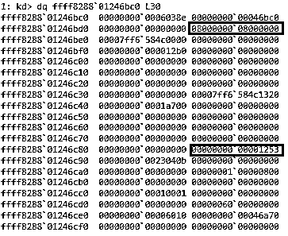

　　获取 WndMagic 窗口句柄后，调用 NtUserConsoleControl 设置 magic 窗口 pExtrabytes 属性为相对于桌面堆的偏移。接着再借助 NtCallbackReturn 将普通窗口 WndMin 对象**poi(tagWnd+0x28)+0x08**处的值传回内核，从而结束回调。而 poi(tagWnd+0x28)+0x08 的值为 poi(tagWnd+0x28)基于桌面堆基址的内存偏移，因此这里将导致 WndMagic 对象 pExtrabytes 值实际是指向 WndMin 窗口对象的偏移。

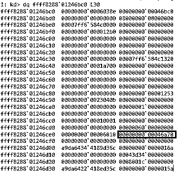

　　之后调用 SetWindowLongW，指定参数为（WndMagic 句柄、Index=0x128、WndMin 对象在内存中的偏移），返回数据应为原偏移处的旧数据，所以此处返回值为 Hook 函数中返回的 WndMin 虚假偏移。

*　　　　LONG SetWindowLongW(*

*  　　　　　　[in] HWND hWnd,*

* 　　　　 　　[in] int  nIndex,*

*  　　　　　　[in] LONG dwNewLong*

*　　　　);*

　　调用 API SetWindowLongW 最终执行到 win32kfull! xxxSetWindowLong。Index 大于等于 0 的情况下会执行到下图所示的位置。而此次利用中 wndClass.cbClsExtra 指定为 0 ，poi(tagWnd+0x28)+0xfc 也持续为 0，可以忽略。因为 poi(tagWnd+0x28)+0xe8 已被设置 0x800 属性，所以 poi(poi(tagWnd+0x28)+0x128)+DesktopHeapBaseAddr+Index=tagWnd_WndMin+0x128。也就是说虽是对 WndMagic 进行的操作，实际上实对 WndMin 对象 pExtrabytes 字段的写入，值为自身 WndMin 在桌面堆中的偏移。

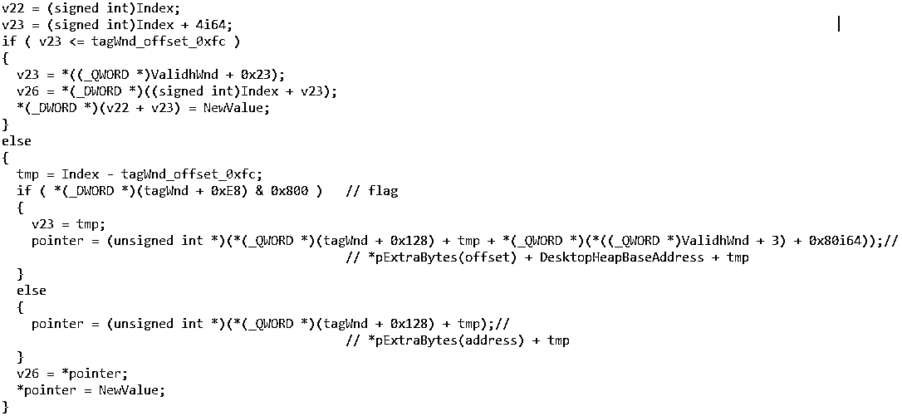

　　然后执行 SetWindowLongW(hWndMagic, offset_0xc8, 0xFFFFFFF)，设置 WndMin 对象 poi(tagWnd+0x28)+0xc8 处 cbwndExtra 值设为 0xFFFFFFF，扩大可以写入的范围，在 xxxSetWindowLong 和 xxxSetWindowLongPtr 中都存在对该值和 Index 的大小比较判定。

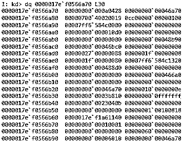

　　现在 WndMagic 可控制 WndMin，而 WndMax 对象偏移已知，因此也可控制，可以实现任意位置写。接着就是对任意位置数据读，这里采用的的是 API GetMenuBarInfo，对 Menu Bat 信息的获取，这种利用一次可以读取 8 字节内容。

*　　BOOL GetMenuBarInfo(*

*  　　　　[in]      HWND         hwnd,*

* 　　　　 [in]      LONG         idObject,*

* 　　　　 [in]      LONG         idItem,*

* 　　　　 [in, out] PMENUBARINFO pmbi*

*　　);*

　　利用中构造了一个 fakeMenu，将复制给 WndMax，SetWindowLongPtr 指定 Index 为-12，且窗口 dwStyle 为 WS_CHILDWINDOW（0x40000000L），那么窗口 spMenu 字段可以被设置为指定的值。spMenu 字段有两处位置，**poi(tagWnd+0x28)+0x98**和**tagWnd+0xa8**。而 SetWindowLongPtr 成功调用后返回的值为窗口的原 spMenu，记录该值。

　　但是此时窗口并不是子窗口类型，所以在这之前需要对该字段手动进行设置。调用 SetWindowLongPtrA，参数为（hWndMin, offset_0x18+WndMax_offset-WndMin_offset, poi(poi(tagWnd+0x28)+0x18)⁰x4000000000000000），可以将 WndMax 窗口类型添加上 WS_CHILDWINDOW 属性，从而通过检测。

　　为 WndMax 设置 WS_CHILDWINDOW 属性，并添加 spMenu 后，再次调用 SetWindowLongPtrA 恢复其 dwStyle，去除 WS_CHILDWINDOW 属性，原因是后续在使用 GetMenuBarInfo 读取指定地址数据时，窗口不能为子窗口类型。

　　WndMax 的 fake spMenu 设置完成，且已获取了旧 spMenu，记为 old_spMenu。而在 spMenu 结构的 0x50 偏移处是 spMenu 所属窗口对象地址，即 poi(spMenu+0x50)==tagWnd。

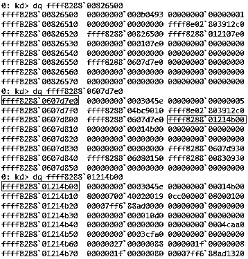

　　了解以上信息后，需要对指定地址进行读，该漏洞利用对 GetMenuBarInfo 进行了封装，传入地址，封装函数返回该地址下的内容。

　　对 GetMenuBarInfo 的利用核心主要是指定 idObject 为-3，idItem 为 1，pmbi 接收数据。API 最终会走到 win32kfull! xxxGetMenuBarInfo 函数，传参数据同 GetMenuBarInfo。对该函数分析，可以看到需要对一些特殊的位置进行伪造，从而进入目的代码处。其中 poi(tagWnd+0x28)+0x58 和 poi(tagWnd+0x28)+0x5C 处的值常为 0，忽略。

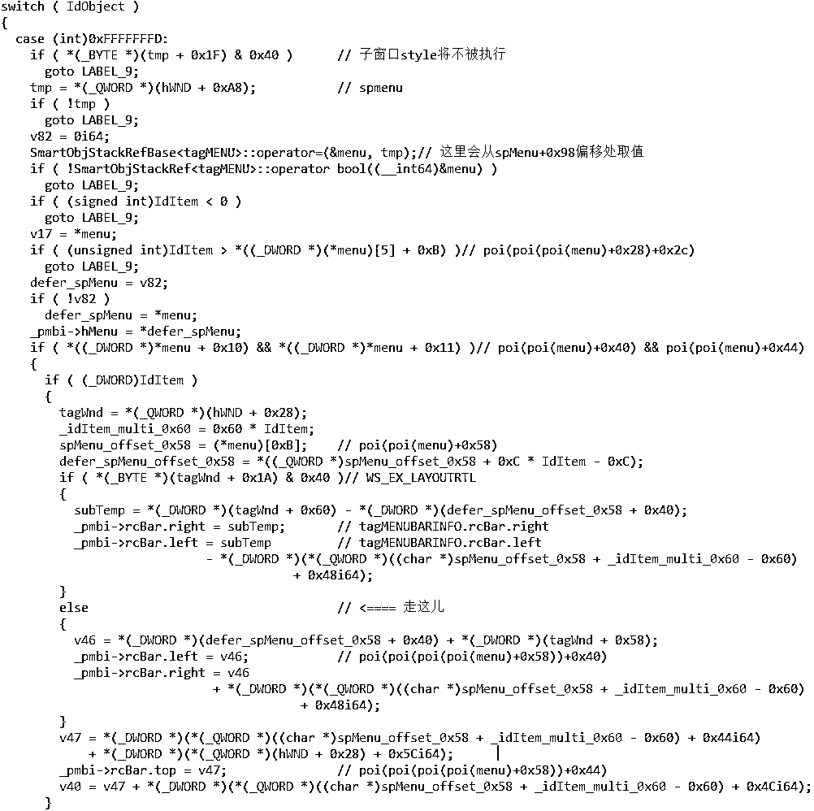

　　最终读取时，可以看到 pmbi->left 读取值为**poi(poi(poi(poi(menu)+0x58))+0x40)**，pmbi->top 为**poi(poi(poi(poi(menu)+0x58))+0x44)**，其中 poi(poi(poi(menu)+0x58))值可由用户进行控制，令其为 X，也就意味着我们通过控制 X 值，可以读取 X+0x40 处的 8 字节内容，即 pmbi.rcBar.left+(pmbi.rcBar.top<<32)。那么只需要控制 X 为欲要读取的目的地址减去 0x40，即可获取相应数据。

　　回到漏洞利用时封装的读取函数中，函数中首先向 X 指向的内存中每 4 个字节填写一个相对于 X 基址的偏移值，这样 GetMenuBarInfo 读取回的 pmbi.rcBar.left 即为目标读取地址应减去的差值。这么做的目的可能是为了防止系统版本的不同导致的差值不同，比如此次调试时 win10 1909 就为 0x40。

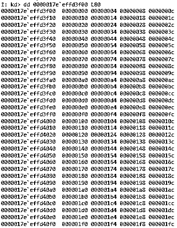

　　然后第二次调用 GetMenuBarInfo，传入（目的读取地址- pmbi.rcBar.left），即可获取目的地址 8 字节内容。

　　这么一步步通过读取，可以获取到 EPROCESS，然后通过 ActiveProcessLinks，遍历找到当前进程和 system 进程 EPROCESS 位置。

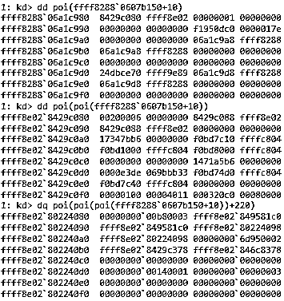

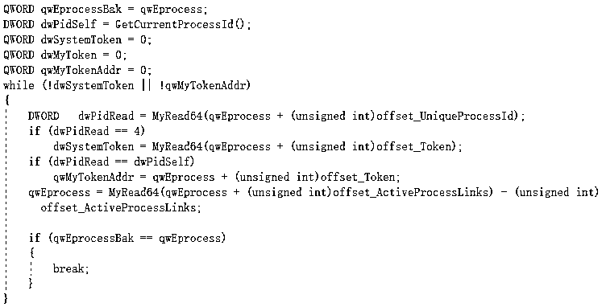

　　再次两次调用 SetWindowLongPtrA，替换当前进程 Token 为 system 进程，获取 system 权限。第一次将当前进程 Token 地址写入 WndMax 对象 pExtrabytes 处，第二次将 system 进程 Token 写入当前进程 Token 中。完成提权。

## 参考

[`ti.dbappsecurity.com.cn/blog/articles/2021/02/10/windows-kernel-zero-day-exploit-is-used-by-bitter-apt-in-targeted-attack-cn/`](https://ti.dbappsecurity.com.cn/blog/articles/2021/02/10/windows-kernel-zero-day-exploit-is-used-by-bitter-apt-in-targeted-attack-cn/)

[`www.freebuf.com/vuls/271177.html`](https://www.freebuf.com/vuls/271177.html)

[`github.com/KaLendsi/CVE-2021-1732-Exploit`](https://github.com/KaLendsi/CVE-2021-1732-Exploit)

[`xiaodaozhi.com/exploit/29.html`](https://xiaodaozhi.com/exploit/29.html)

[`theevilbit.github.io/posts/a_simple_protection_against_hmvalidatehandle_technique/`](https://theevilbit.github.io/posts/a_simple_protection_against_hmvalidatehandle_technique/)