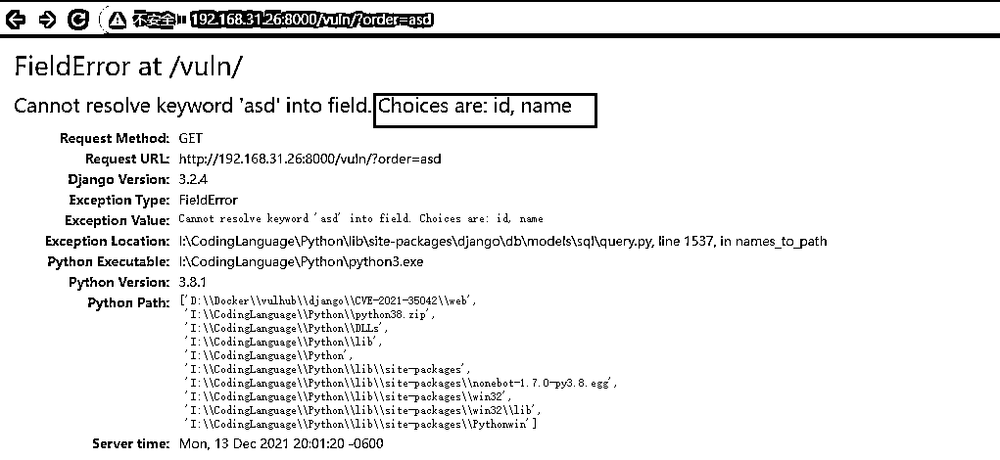
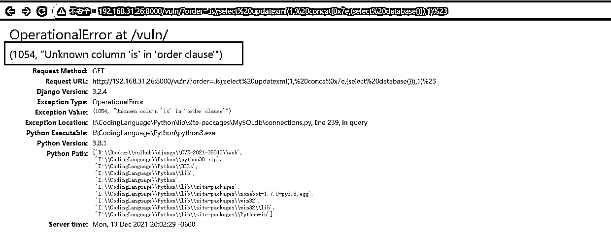
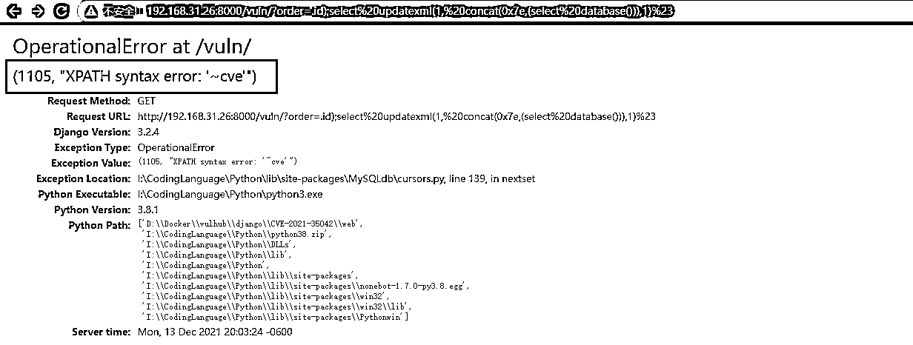
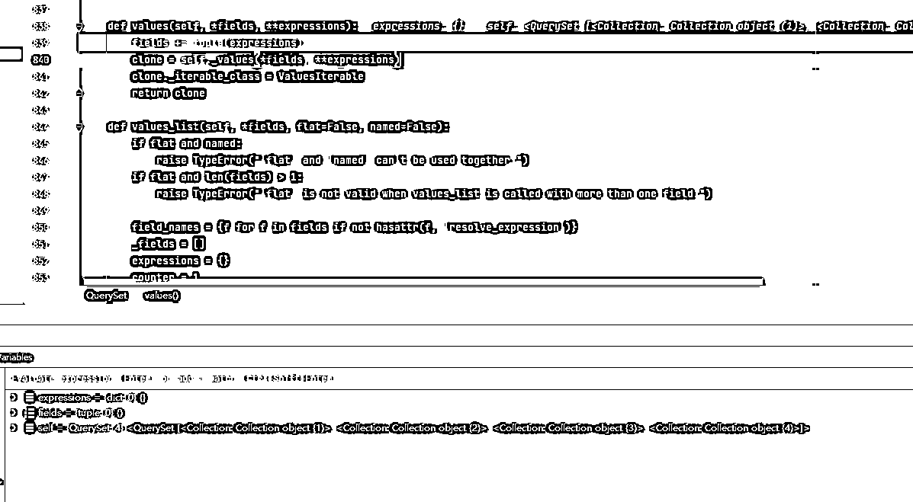

# CVE-2021-35042 Django order_by SQL 注入 漏洞复现和分析 - R3col - 博客园

> 原文：[`www.cnblogs.com/R3col/p/16094132.html`](https://www.cnblogs.com/R3col/p/16094132.html)

目录

*   0 简介
*   1 漏洞复现
*   2 漏洞分析
*   3 参考

## 0 简介

在特定限制条件下，Django 的 order_by 方法会导致 SQL 注入

*   影响版本：`3.1.x < 3.1.13, 3.2.x < 3.2.5`

*   条件：

    *   `Debug=True`
    *   接口使用`order_by`方法
*   复现/分析环境：

    *   `python 3.8.1`
    *   `Django 3.2.4`
    *   `MySQL 5.7.26`

## 1 漏洞复现

当`order_by`的传入参数中包含`.`时，可进行 SQL 注入，但需要正确的列名，可以通过猜测`id, _id`或输入错误的列名，从报错信息中得到列名



如果传入错误的列名，会因为列明不存在而产生`Exception`退出，进入不到执行 SQL 注入语句的部分



利用`updatexml`，`.id);select%20updatexml(1,%20concat(0x7e,(select%20database())),1)%23`即可进行报错注入



## 2 漏洞分析

Demo

```
# views.py 省略 import
def vul(request):
    query = request.GET.get('order', default='id')
    q = Collection.objects.order_by(query)
	return HttpResponse(q.values())

# models.py view.py 中调用的 Collection 定义
from django.db import models

class Collection(models.Model):
    name = models.CharField(max_length=128) 
```

传入 poc，打断点调试：

*   先经过初始化，创建了`QuerySet`实例，（`db`：数据库，`model`：模型，`ordered`：是否已排序，`query`：sql 语句）
*   进入`django.db.models.query line 1143 QuerySet.order_by`方法，`obj`是`self`复制得到的对象


*   跟进`line 1149 add_ordering(poc)`->`line 1960 add_ordering()`

*   传入的 poc 为字符串，且其中包含`.`，所以直接`continue`跳出 for 循环（传入的`order_by`参数只有一个，for 循环只有一次），没有进入到`names_to_path`方法，之后执行`self.order_by += ordering`

    参数 ordering 是我们传入的 poc

    此时的 SQL 语句是`SELECT` vuln_collection`.`id`,` vuln_collection`.`name`FROM`vuln_collection `ORDER BY (``.id);select updatexml(1, concat(0x7e,(select database())),1)#) ASC`，因为这里的`QuerySet._query`是`sql.Query`实例化对象，会根据参数自动更新 SQL 语句

```
 def add_ordering(self, *ordering):
        errors = []
        for item in ordering:
            if isinstance(item, str):
                if '.' in item:
                    warnings.warn(
                        'Passing column raw column aliases to order_by() is '
                        'deprecated. Wrap %r in a RawSQL expression before '
                        'passing it to order_by().' % item,
                        category=RemovedInDjango40Warning,
                        stacklevel=3,
                    )
                    continue
                if item == '?':
                    continue
                if item.startswith('-'):
                    item = item[1:]
                if item in self.annotations:
                    continue
                if self.extra and item in self.extra:
                    continue
                # names_to_path() validates the lookup. A descriptive
                # FieldError will be raise if it's not.
                self.names_to_path(item.split(LOOKUP_SEP), self.model._meta)
            elif not hasattr(item, 'resolve_expression'):
                errors.append(item)
            if getattr(item, 'contains_aggregate', False):
                raise FieldError(
                    'Using an aggregate in order_by() without also including '
                    'it in annotate() is not allowed: %s' % item
                )
        if errors:
            raise FieldError('Invalid order_by arguments: %s' % errors)
        if ordering:
            self.order_by += ordering
        else:
            self.default_ordering = False 
```

**漏洞成因就是上面代码第 13 行的`continue`**，修复方法也很简单，去掉`continue`，确保每一个参数进入到`names_to_path`即可

`names_to_path`为参数合理性检验的方法，对`order_by`传入的列名进行检验，以下为部分代码

*   对于`order_by`传入的每一个参数，通过`model`模型获取对应字段，如果字段不存在，且不是注释字段，不是`_filtered_relations`（可用于 join 连接），则会报错，并返回可选字段

```
 def names_to_path(self, names, opts, allow_many=True, fail_on_missing=False):
        path, names_with_path = [], []
        for pos, name in enumerate(names):
            cur_names_with_path = (name, [])
            if name == 'pk':
                name = opts.pk.name

            field = None
            filtered_relation = None
            try:
                field = opts.get_field(name)
            except FieldDoesNotExist:
                if name in self.annotation_select:
                    field = self.annotation_select[name].output_field
                elif name in self._filtered_relations and pos == 0:
                    filtered_relation = self._filtered_relations[name]
                    if LOOKUP_SEP in filtered_relation.relation_name:
                        parts = filtered_relation.relation_name.split(LOOKUP_SEP)
                        filtered_relation_path, field, _, _ = self.names_to_path(
                            parts, opts, allow_many, fail_on_missing,
                        )
                        path.extend(filtered_relation_path[:-1])
                    else:
                        field = opts.get_field(filtered_relation.relation_name)
            if field is not None:
                if field.is_relation and not field.related_model:
                    raise FieldError(
                        "Field %r does not generate an automatic reverse "
                        "relation and therefore cannot be used for reverse "
                        "querying. If it is a GenericForeignKey, consider "
                        "adding a GenericRelation." % name
                    )
                try:
                    model = field.model._meta.concrete_model
                except AttributeError:
                    model = None
            else:
                pos -= 1
                if pos == -1 or fail_on_missing:
                    available = sorted([
                        *get_field_names_from_opts(opts),
                        *self.annotation_select,
                        *self._filtered_relations,
                    ])
                    raise FieldError("Cannot resolve keyword '%s' into field. "
                                     "Choices are: %s" % (name, ", ".join(available)))
                break 
```


以下部分为后续代码执行过程，与漏洞成因无关

*   返回到`order_by`方法，完成 obj 对象的封装并返回 （上层还有`manager_method()`方法，通过反射来调用对应函数，直接略过了）


*   执行完`q = Collection.objects.order_by(query)`即完成了`QuerySet`对象的封装，之后的`q.values()`才会执行 SQL 语句
*   继续跟进`django.db.models.query valuese()方法` ，可以看到`fields`和`expressions`都为空
    *   `self_values(*fields, **expressions)`又是一次对象拷贝



*   跟进`clone._iterable_class = ValuesIterable`

    *   该语句执行后，return clone，返回的是可迭代对象，本身并没有值，而且也并没有执行 SQL 语句，当获取可迭代对象的值时，才会执行

        > 所以调试时，需要进入到 HttpResponse 的`self.content = content`时才会触发 SQL 注入

    *   一直到`yield`语句，SQL 语句执行


## 3 参考

*   [`github.com/vulhub/vulhub/tree/master/django/CVE-2021-35042`](https://github.com/vulhub/vulhub/tree/master/django/CVE-2021-35042)
*   [`xz.aliyun.com/t/9834`](https://xz.aliyun.com/t/9834)
*   [`www.djangoproject.com/weblog/2021/jul/01/security-releases/`](https://www.djangoproject.com/weblog/2021/jul/01/security-releases/)
*   [`www.freebuf.com/vuls/283262.html`](https://www.freebuf.com/vuls/283262.html)
*   [`www.venustech.com.cn/new_type/aqtg/20210706/22850.html`](https://www.venustech.com.cn/new_type/aqtg/20210706/22850.html)
*   [`www.bugxss.com/vulnerability-report/3095.html`](https://www.bugxss.com/vulnerability-report/3095.html)
*   [`nvd.nist.gov/vuln/detail/CVE-2021-35042`](https://nvd.nist.gov/vuln/detail/CVE-2021-35042)