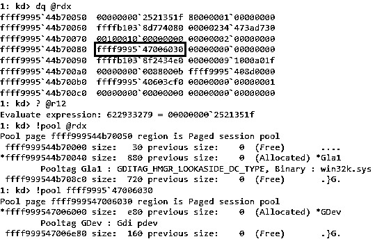
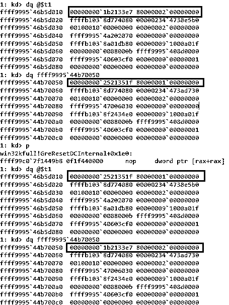
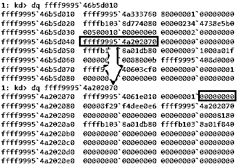
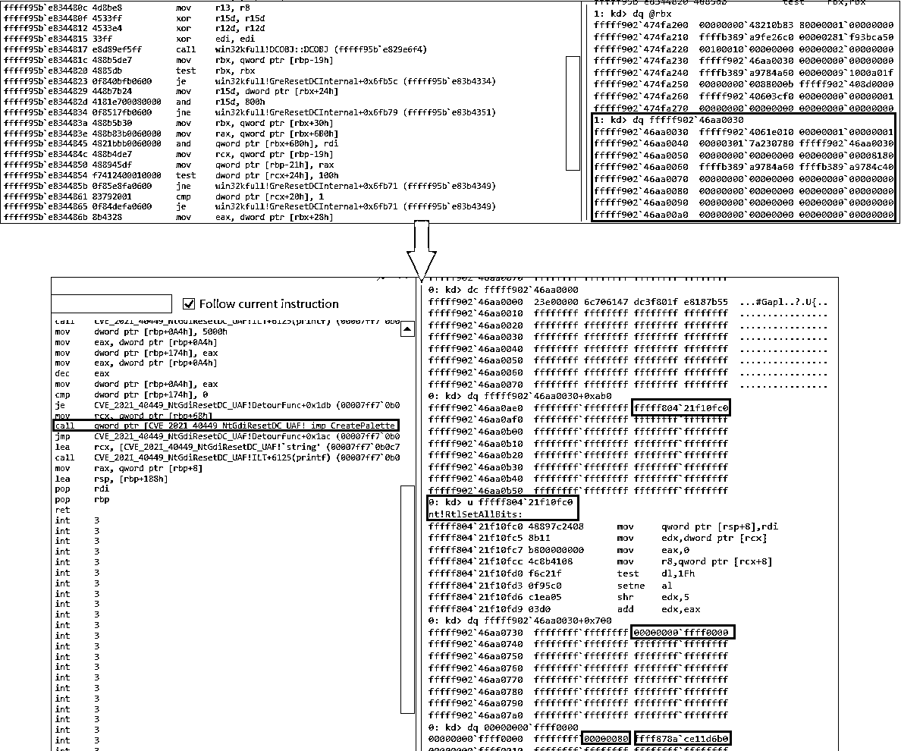
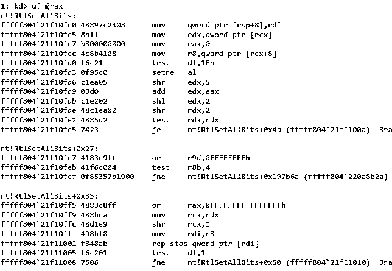
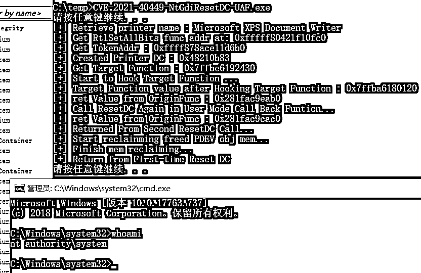

# CVE-2021-40449 NtGdiResetDC UAF - Bl0od - 博客园

> 原文：[`www.cnblogs.com/zUotTe0/p/15948062.html`](https://www.cnblogs.com/zUotTe0/p/15948062.html)

## 背景

  CVE-2021-40449 是一个存在于 Win32k 内核驱动中的 UAF 漏洞。该漏洞在 2021 年八月下旬九月上旬被 Kaspersky 发现用于野外攻击活动中。通过 Hook win32k 驱动执行 NtGdiResetDC 过程中发生的用户模式回调，完成对目标对象的释放和占用，最终实现指定内核函数的调用，以进行内核内存的读写操作，修改利用对象的 Token 权限，实现 EOP。

## 分析

  此次分析是在 Windows 10 1809 中进行。
  首先在用户模式调用 CreateDC 时，会执行至 win32k 内核调用 win32kfull!NtGdiResetDC ，再执行至 win32kbase!hdcOpenDCW ，调用堆栈如下：

> ......  win32kbase!PDEVOBJ::PDEVOBJ
> ......  win32kbase!hdcOpenDCW+0x240
> ......  win32kfull!GreResetDCInternal+0x11a
> ......  win32kfull!NtGdiResetDC+0xd6
> ......  nt!KiSystemServiceCopyEnd+0x25
> ......  win32u!NtGdiResetDC+0x14
> ......  gdi32full!ResetDCWInternal+0x16b
> ......  GDI32!ResetDCW+0x31
> ......  CVE_2021_40449!main

  执行的用户回调主要发生在 win32kbase!PDEVOBJ::PDEVOBJ 中，该函数应是一个 PDEV 对象的初始化函数，和 win32kfull!NtGdiResetDC 传入参数中的 HDC 有关联。初始化函数中有两个用户回调： PDEVOBJ::EnablePDEV 、 PDEVOBJ::CompletePDEV 。这两个用户回调主要是对 HDC 中的 PDEV 对象进行操作， PDEV 对象通过 PDEV::Allocate 分配内存。

  执行完初始化函数，回到 hdcOpenDCW ，继续执行至 GreCreateDisplayDC ，该函数初始化一个 PDC 对象，并将上面初始化的 PDEV 对象的内存地址放到 PDC 偏移 +0x30 处。

  然后返回 PDC 0 偏移处的 DC 句柄值 HDC ，该值也作为 win32kbase!hdcOpenDCW 的返回值，返回值 win32kfull!GreResetDCInternal 。
   hdcOpenDCW 返回的 HDC 传入 DCOBJ::DCOBJ ，返回 hdcOpenDCW 初始化的 PDC 对象的内存地址。

  接着读取 PDEV 对象 0xAB8 偏移处的函数指针并执行，注意此处的 PDEV 并不是在上一步的 hdcOpenDCW 中初始化的，而是在用户态调用 ResetDC 前，调用 CreateDC 生成的。为进行区分，本文中将其称为 HDC_user 。
   GreResetDCInternal 的函数参数 HDC_user ，同样通过 DCOBJ::DCOBJ 返回 PDC_user 对象，该对象偏移 0x30 处为 PDEV_user 对象的内存地址。
  取 PDEV_user 偏移 0xAB8 处函数指针，执行 UMPDDrvResetPDEV ，传入参数分别为 PDEV_user 和 PDEV_kernel 偏移 0x708 处的指针，指向各自的 DEVMODE 结构，这里同样会发生一次用户态函数回调，不过该回调不进行考虑，因为此漏洞利用范围内，被利用的主要是该指针。

  完成 UMPDDrvResetPDEV 回调后，执行 win32kbase!HmgSwapLockedHandleContents ，该函数会将 PDC_user 和 PDC_kernel 首部的 HDC 值和 PDC 的 引用计数值 进行了互换，从而完成 devmode 修改的功能。

  后面则是将两个 PDC 对象的引用计数值分别减 1 ，并调用 win32kbase!bDeleteDCInternal 将 HDC_kernel 索引到的 PDC 对象偏移 0x30 处指针指向的 PDEV 对象引用计数值减 1 ，值变为 0 。而又因为之前的 HmgSwap 操作，这里的 PDC 和 PDEV 实际都是用户传入的 HDC 原本指向的对象。
  根据[MSDN](https://docs.microsoft.com/en-us/windows-hardware/drivers/kernel/life-cycle-of-an-object)所说，**“当该计数器降至零，该对象就会被释放”**、**“一旦句柄计数减为零，对象的名称就会从对象管理器的命名空间中删除”**。意味着该对象可以被占用，而 hdcOpenDCW 中又存在用户回调，在用户回调中再对相同的 HDC 执行一次 ResetDC ，那么该 HDC 对应 PDEV 对象引用值将减为 0 ，占用该 PDEV 对象后结束回调，回到内核。
  至于漏洞的触发点，在原本的 UMPDDrvResetPDEV 调用处，该调用发生在 hdcOpenDCW 之后，调用函数的地址从 PDEV_user 中获取，通过占用，可以获取到修改器调用目标为一个内核读写函数。

## 利用

  该 UAF 漏洞的利用主要为以下几个步骤：

1.  使用 NtQuerySystemInformation 获取利用进程 Token.Privileges 在内核中的位置；
2.  泄露出一个可以用于内核写的内核函数，这里比较通用是 nt!RtlSetAllBits ；
3.  构造一个 Fake_RTL_BITMAP ，作为 nt!RtlSetAllBits 函数参数，大多使用 ThreadName 的方式进行构造，不过同样也可以手动申请一片用户态内存进行构造；
4.  HOOK 用户回调 DrvEnablePDEV （Hook DrvCompletePDEV 虽然可以成功占用，但执行不到漏洞触发点），在 Hook 函数中对相同 HDC 再执行一次 ResetDC ，返回后使用构造的 Fake Palette 去占用被释放的 PDEV 对象，然后结束当前回调；
5.  漏洞触发，当前进程权限位全部被启用，完成提权。

  在 Hook 函数中完成占用后的内存布局前后对比如下所示：

  PDEV 对象占用成功后，完成回调，返回 GreResetDCInternal ，可以看到成功地调用到 nt!RtlSetAllBits 。

   nt!RtlSetAllBits 中仅将 rcx 作为参数，而漏洞触发处的第一个参数 rcx 同样可以通过占用指定。
   nt!RtlSetAllBits 中取 rcx 地址 0x08 偏移处的 QWORD 作为写入的目标地址，而 rcx 偏移 0 处的 DWORD 值整除 0x40 后作为计数值，每次向目标地址写入 rax 寄存器的值， rax 固定为 0xffffffffffffffff 。

  [POC 代码](https://github.com/BL0odz/CVE-2021-40449-NtGdiResetDC-UAF)。

## 总结

  这次我分析这个漏洞时尝试尽量不看网上公开的 POC，仅根据 Kaspersky 的文章寻找漏洞位置，结果花了很多时间，遇到挺多问题的。比如寻找漏洞点时，不会出现 BSOD ，并且 !pool 不能马上看到对象内存状态变成 free ，还是去瞄了一些公开的 POC，确认自己方向没问题。
  emmm 最后好歹自己完成了 POC，虽然耗时长且代码拉胯，相比那些优秀的 POC 通用性低，但是收获也很多，起码漏洞前后附近的代码各个角落都翻了一遍，而且一些坑下次可以避免。

## 参考

[1] [MysterySnail attacks with Windows zero-day](https://securelist.com/mysterysnail-attacks-with-windows-zero-day/104509/)
[2] [CVE-2021-40449 Exploitation](https://kristal-g.github.io/2021/11/05/CVE-2021-40449_POC.html)