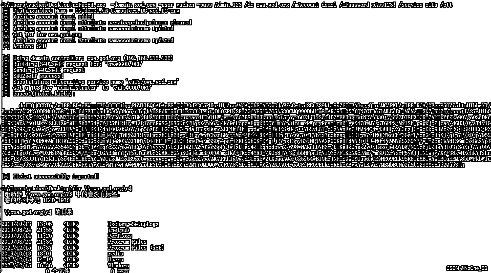

# CVE-2021-42287(Windows 域服务权限提升漏洞) - noone52 - 博客园

> 原文：[`www.cnblogs.com/MoZiYa/p/16690213.html`](https://www.cnblogs.com/MoZiYa/p/16690213.html)

**PAC**

```
PAC(Privilege Attribute Certificate)，特权属性证书 需要提供 User 的 SID 和所在组 Group 的 SID 
```

只看上述的就简单解释并不能很清晰的了解，那么想要知道 PAC 这个概念，我们首先理一下 kerberos 的流程

网上很多 kerberos 如下：

```
1：用户向 KDC 发起 AS_REQ,请求凭据是用户 hash 加密的时间戳，KDC 使用用户 hash 进行解密，如果结果正确返回用 krbtgt hash 加密的 TGT 票据

2：用户凭借 TGT 票据向 KDC 发起针对特定服务的 TGS_REQ 请求，KDC 使用 krbtgt hash 进行解密，如果结果正确，就返回用服务 hash 加密的 TGS 票据

3：用户拿着 TGS 票据去请求服务，服务使用自己的 hash 解密 TGS 票据。如果解密正确，就允许用户访问。 
```

上面这个流程看起来没错，却忽略一个最重要的因素，那就是用户有没有权限访问该服务，在上面的流程里面，只要用户的 hash 正确，那么就可以拿到 TGT，有了 TGT，就可以拿到 TGS，有了 TGS，就可以访问服务，任何一个用户都可以访问任何服务。

为了解决上面的这个问题，微软引进了 PAC，引进 PAC 之后的 kerberos 流程变成

```
1：用户向 KDC 发起 AS_REQ,请求凭据是用户 hash 加密的时间戳，KDC 使用用户 hash 进行解密，如果结果正确返回用 krbtgt hash 加密的 TGT 票据，TGT 里面包含 PAC,PAC 包含用户的 sid，用户所在的组。

2：用户凭借 TGT 票据向 KDC 发起针对特定服务的 TGS_REQ 请求，KDC 使用 krbtgt hash 进行解密，如果结果正确，就返回用服务 hash 加密的 TGS 票据(这一步不管用户有没有访问服务的权限，只要 TGT 正确，就返回 TGS 票据，这也是 kerberoating 能利用的原因，任何一个用户，只要 hash 正确，可以请求域内任何一个服务的 TGS 票据。

3：用户拿着 TGS 票据去请求服务，服务使用自己的 hash 解密 TGS 票据。如果解密正确，就拿着 PAC 去 KDC 那边询问用户有没有访问权限，域控解密 PAC。获取用户的 sid，以及所在的组，再判断用户是否有访问服务的权限，有访问权限(有些服务并没有验证 PAC 这一步，这也是白银票据能成功的前提，因为就算拥有用户 hash，可以制作 TGS，也不能制作 PAC，PAC 当然也验证不成功，但是有些服务不去验证 PAC，这是白银票据成功的前提）就允许用户访问。

特别说明的是，PAC 对于用户和服务全程都是透明的。只有 KDC 能制作和查看 PAC。 
```

上述那么一大段，边界骇客总结如下，建议还是先细细的看一遍然后再来看总结：

```
TGT 票据中带 PAC，PAC 根据 AS_REQ 和 AS_REP 的相关请求和结果生成
票据交换的时候不校验 PAC 内用户是否有权限访问服务
服务请求的时候才会去校验票据服务是否有权限
任何一个用户，只要 hash 正确，可以请求域内任何一个服务的 TGS 票据 
```

```
漏洞原理
原理:在 AD 认证的过程中，如果存在一个机器账户，此账户的名称和 AD 机器名（下面
为 test$）去掉$后相同，当我们请求了 TGT 以后删除此账户，如果利用此 TGT
进行正常请求，由于没有这个用户，所以域控无法正确来解密此票据。但是域控有
一个机制，当数据库中未检索到这个账户，会寻找 samaccountname 为此账户的用
户，此时就可以利用 S4U2self 去请求 DC 秘钥加密的 TS 票据。 
```

这里 S4U2self 这个概念是：
在 TGSREQ & TGSREP 阶段，用户通过 AS_REP 拿到的 TGT 票据，去向 KDC 申请特定服务的访问权限，KDC 校验 TGT 票据，如果校验通过的话，会向用户发送一个 TGS 票据，之后用户再拿着 TGS 去访问特定的服务。这一阶段，微软引进了两个扩展 S4U2SELF 和 S4U2PROXY。
S4U2self 使得`服务可以代表用户获得针对服务自身的 kerberos 服务票据`。这使得服务可以获得用户的授权( 可转发 的用户 TGS 票据)，然后将其用于后期的认证(主要是后期的 s4u2proxy)，这是为了在用户以不使用 Kerberos 的方式对服务进行身份验证的情况下使用。这里面很重要的一点是服务代表用户获得针对服务自身的 kerberos 票据这个过程，服务是不需要用户的凭据的

```
工具：https://github.com/cube0x0/noPac
noPac64.exe scan -domain god.org -user yuchen-pass Admin_123
noPac64.exe -domain god.org -user yuchen-pass Admin_123 /dc owa.god.org /mAccount demol /mPassword pAss123! /service cifs /ptt 
```



**MS14068 成因：**
补丁编号是 KB3011780，域里面最严重的漏洞之一，它允许任意用户提升到域管权限。下面简要分析下该漏洞。
该漏洞最本质的地方在于 Microsoft Windows Kerberos KDC 无法正确检查 Kerberos 票证请求随附的特权属性证书（PAC）中的有效签名，这里面的签名就是上面提到的服务检验和以及 KDC 校验和。导致用户可以自己构造一张 PAC。 签名原本的设计是要用到 HMAC 系列的 checksum 算法，也就是必须要有 key 的参与，我们没有 krbtgt 的 hash 以及服务的 hash，就没有办法生成有效的签名，但是问题就出在，实现的时候允许所有的 checksum 算法都可以，包括 MD5。那我们只需要把 PAC 进行 md5，就生成新的校验和。这也就意味着我们可以随意更改 PAC 的内容，完了之后再用 md5 给他生成一个服务检验和以及 KDC 校验和。在 MS14-068 修补程序之后，Microsoft 添加了一个附加的验证步骤，以确保校验和类型为 KRBCHECKSUMHMAC_MD5。

PAC：由于 MS14068 只验证么用户是谁，没有验证用户能做什么引入的一个安全机制。
是用户申请 TGT 的时候由 KDC 回复的包含用户 SID，用户组等的信息。此时和传统的
kerber 认证相比，当服务端解密了用户的 TGS 会获取到用户的 PAC 拿去和 KDC 对比查
看用户具有权限（PAC 不可伪造），但是有些服务不验证 KDC 所以能利用白银票价，
而所有正常的用户都能申请 TGS，所以 kerberosting 能够利用成功。

```
此文重在自我理解，然后个人记录，没有连贯性，请谅解 
```

```
参考：
https://www.anquanke.com/post/id/190261
https://www.anquanke.com/post/id/190625
https://www.anquanke.com/post/id/192810
https://mp.weixin.qq.com/s/OI9XiUGe4-1exmFOkV9ZVQ
https://www.geekby.site/2021/12/samaccountname-spoofing/ 
```